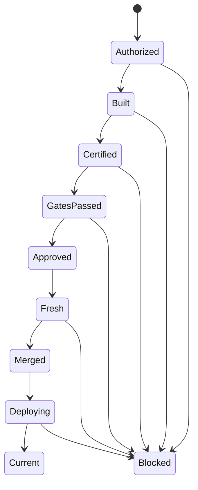

# تقرير تحسين مسار حوكمة ترقية `Production` إلى Autopilot محكوم

التاريخ: 17 أغسطس 2026
المستودع: `mad4bdigital-ai/multi-business-multi-role-growth-intelligence-os`

## الملخص التنفيذي

مسار الترقية الحالي آمن في جوهره: يثبت `main` و`Production` ومرشح الإصدار بـSHA دقيق، يمنع force-push، يبني مرشحًا حتميًا مطابق الشجرة لقطع الإصدار، ويفصل الدمج عن النشر. وقد نجحت الترقية الحالية إلى `Production` عبر PR محكوم، وصار رأس الفرع:

`97d99ba12413aa9146ef7ca06240a929db1fce65`

لكن الجولة كشفت أن المسار ليس Autopilot بعد لثلاثة أسباب رئيسية:

1. التصديق يعتمد على وصول حدث `pull_request_target` من PR أنشأته automation؛ هذا الحدث لم يصل، فانتظر الـlauncher ثم فشل رغم صحة المرشح.
2. تعريف «الدليل السلطوي» غير واضح في واجهة PR؛ فحوص عامة غير مسجلة في بوابات الترقية ظهرت كإخفاقات بجوار دليل الإصدار الناجح.
3. readback بعد الدمج لا يبدأ تلقائيًا من `push` إلى `Production`، بل يحتاج تعليقًا يدويًا لتشغيل `R7`.

الهدف المقترح هو Autopilot محكوم لا يلغي الموافقة البشرية، بل يحول موافقة المالك على قطع إصدار محدد إلى تفويض محدود المدى، ثم ينفذ البناء والتصديق والدمج وقراءة runtime آليًا تحت CAS وfail-closed.

## ما حدث في الجولة الحالية

| المرحلة | النتيجة |
|---|---|
| قطع `main` المعتمد | `85a120218007b4a6f207c0ac53356b11de2cc544` |
| `Production` قبل الترقية | `acbfb1351fdf2fb4932d85fc1a034917d06c574c` |
| طلب التفويض | PR #7379، شجرة مطابقة لـ`main` |
| المرشح الحتمي | `55b7fbec4502c187d36b4cf66d4dffca41819777` |
| محاولة launcher الأولى | فشلت لأنها لم تكتشف run التصديق |
| سبب الاستئناف اليدوي | PR التصديق المنشأ آليًا لم يولد حدث `pull_request_target` |
| آلية الاستئناف | Draft ثم Ready؛ بلا close/reopen وبلا تغيير SHA |
| التصديق المباشر | نجاح كامل: Syntax وUnit/Integration وExecution Resolver وArchitecture Drift |
| البوابات الداعمة | 6/6 ناجحة على SHA المرشح نفسه |
| Source-Pin | ناجحة على PR #7382 |
| مراجعة المالك | `APPROVED` ومثبتة على SHA المرشح |
| Single Owner Review Gate | ناجحة |
| الدمج | PR #7382، merge commit `97d99ba…` |
| شجرة `Production` بعد الدمج | مطابقة لقطع `main`؛ `behind=0` |
| CI بعد push إلى `Production` | ناجحة على `97d99ba…` |
| أول R7 بعد الدمج | run `31972922933`: `503` للمسارات الأربعة؛ `runtime_activation_pending_or_sha_mismatch` |
| R7 بعد نجاح CI | run `31973159626`: بقيت المسارات الأربعة `503`؛ التصنيف نفسه |

قراءتا R7 حافظتا على كل حدود الأمان (`provider_mutation=false` و`deployment=false` و`restart=false`). وبما أن القراءة الثانية جرت بعد نجاح CI على رأس `Production` الجديد وبقيت جميع المسارات `503`، فالحالة الدقيقة هي: ترقية Git مكتملة، لكن تفعيل runtime غير مثبت ويحتاج دليل build/deploy موثوقًا أو reconciler محدود المهلة. لا يصح إعلان `Production Current`، ولا يفيد تكرار readback يدويًا بلا دليل جديد من طبقة النشر.

## الحالة التشغيلية عند إغلاق التقرير

- رأس `Production` وCI: ناجحان على `97d99ba12413aa9146ef7ca06240a929db1fce65`.
- مطابقة شجرة الإصدار: مثبتة، وقطع `main` ليس أمام `Production` (`behind=0`).
- runtime العام: غير مثبت؛ `/health` و`/version` و`/deployment-info` و`/connector-agent-version` أعادت `503` في قراءتين رسميتين.
- التصنيف الحاكم: `runtime_activation_pending_or_sha_mismatch`.
- الإجراء التالي الآمن: ربط دليل build/deploy ديناميكي بالـSHA المتوقع، ثم إعادة R7 تلقائيًا؛ بلا restart أو provider mutation أو rollback إلا بعقد مستقل.

## المشكلات الجذرية

### 1. اعتماد orchestration على حدث غير مضمون

الـlauncher ينشئ PR تصديق ثم يبحث عن run ناتج من `pull_request_target`. إنشاء PR من automation لا يضمن دائمًا تشغيل workflow لاحقة بالطريقة المتوقعة. النتيجة كانت نافذة اكتشاف تعتمد على التوقيت، ثم فشل مغلق رغم أن المرشح صحيح.

هذا ليس فشل CI، بل فشل في نقل الحالة بين مكونات orchestration.

### 2. خلط الأدلة السلطوية بالفحوص العرضية

العقد السلطوي للترقية الحالية هو:

- Certified direct CI على المرشح الدقيق.
- البوابات الست المسجلة في `production-promotion-supporting-gates.v1.json`.
- دليل convergence النهائي.
- Source-Pin حديث.
- مراجعة وموافقة المالك.
- ثبات `Production` حتى لحظة الدمج.

لكن إعادة `ready_for_review` شغلت workflows عامة إضافية. فشل `Repository Tool Lifecycle Governance` بسبب 87 finding من مقارنة 631 ملفًا تاريخيًا بين `Production` القديم والمرشح. التقرير الكانوني الخاص بدورة أدوات المستودع نفسها كان `ok=true` وبلا findings؛ الإخفاق كان من Platform Configuration Entry Guard على backlog تاريخي، وليس من البوابات الست المعتمدة للترقية.

ينبغي ألا تُعرض هذه النتيجة كأنها مساوية لدليل الترقية، لكن ينبغي أيضًا ألا تُخفى: هي دين حوكمة مستقل يحتاج baseline أو backfill صريح، وليس تجاوزًا صامتًا.

### 3. الفصل بين الدمج وruntime readback غير مؤتمت

السياسة تتطلب بعد الدمج:

- Hostinger auto-deploy build.
- manifest يطابق SHA الحالي لـ`Production`.
- `/health`.
- `/version`.
- `/deployment-info`.

المسار `Hostinger Production Runtime Readback R7` يحقق القراءة الآمنة GET-only، لكنه يبدأ بتعليق يدوي بدل أن يتصل تلقائيًا بحدث `push` المحمي.

### 4. تكرار الأسطح ومحاولات الاستئناف

تكرار trigger بعد فشل launcher أنشأ PR إصدار وPR تصديق جديدين. المرشح بقي حتميًا بالـSHA نفسه، وهذا جيد، لكن lifecycle الجلسة موزع بين PRs وruns وتعليقات. يحتاج المسار إلى هوية جلسة واحدة وidempotency واضحة.

## التصميم المستهدف

### آلة حالات واحدة

كل انتقال يكتب receipt كانونيا واحدًا، ولا يعتمد على نص logs أو ترتيب وصول event.

### هوية جلسة حتمية

ينبغي اشتقاق:

`promotion_session_id = sha256(repository + release_cut_sha + pinned_production_sha)`

وتثبيته في:

- أسماء الفروع.
- PR الإصدار والتصديق.
- `run-name` لكل workflow.
- artifact الدليل.
- check-run السلطوي النهائي.

أي trigger مكرر للجلسة نفسها يجب أن يستأنفها، لا أن ينشئ جلسة جديدة.

### فصل السلطات

| المكون | الصلاحيات | الممنوع |
|---|---|---|
| Request Bridge | قراءة PR وتشغيل launcher | كتابة protected refs |
| Candidate Builder | fast-forward لفروع غير محمية وإنشاء PRs | دمج أو force-push |
| Certifier | قراءة المرشح وتشغيل CI | أي repository/provider mutation |
| Gate Orchestrator | تشغيل بوابات read-only وجمع receipts | تفسير logs كسلطة |
| Trusted Merger | دمج PR واحد بـexpected head SHA | تعديل المرشح أو bypass |
| Runtime Reconciler | GET-only polling | deploy/restart/provider mutation |

## التغييرات المقترحة

### P0 — إزالة فجوة event bootstrap

1. تحويل `production-certified-release-cut-validation.yml` إلى reusable workflow يدعم `workflow_call` مع مدخلات:
   - `validation_pr`
   - `candidate_sha`
   - `release_cut_sha`
   - `expected_production_sha`
   - `promotion_session_id`
2. يستدعيه الـlauncher مباشرة من trusted `main` بدل انتظار `pull_request_target`.
3. يبقى PR التصديق سطح مراجعة وشفافية، لكنه لا يعود ناقلًا وحيدًا للتنفيذ.
4. إلغاء منطق `earliest timestamp + polling discovery` للتصديق.

معيار القبول: إنشاء PR من `GITHUB_TOKEN` أو GitHub App لا يغير قدرة المسار على الوصول إلى `Certified`.

### P0 — check سلطوي واحد للترقية

إنشاء `Governed Production Promotion / Ready` كـcheck نهائي على SHA المرشح. لا يصبح `success` إلا إذا تحقق آليًا من:

- artifact convergence الصحيح ومطابقة digest.
- نجاح certified CI على SHA المرشح.
- نجاح كل gate مسجلة، مع run IDs دقيقة.
- Source-Pin حديث.
- مراجعة المالك على SHA نفسه.
- `Production` ما زالت عند SHA المثبتة.
- release cut ما زال ancestor لـ`main`.

يجب أن يكون هذا check مطلوبًا في حماية `Production`. أما checks غير المسجلة فتظل مرئية، لكن لا تخلط بقرار الترقية.

### P0 — merger موثوق منفصل

إضافة workflow موجودة مسبقًا على `main`، لا تشغّل كود المرشح، وتعمل فقط بعد نجاح check السلطوي. تتحقق مجددًا من:

- PR واحد غير draft يستهدف `Production`.
- exact head SHA.
- exact base SHA.
- approval مربوط بالـcommit.
- لا review changes requested.
- لا حركة في `Production`.

ثم تستخدم merge API مع `expected_head_sha` وطريقة `merge`. يمنع admin bypass وforce-push. إذا تحرك أي ref تصبح الحالة `Blocked` ويطلب تفويضًا جديدًا.

### P0 — post-merge runtime reconciler تلقائي

تشغيل `R7` تلقائيًا من `push` إلى `Production` أو من `workflow_run` لنجاح merger. ينفذ GET-only polling بمهلة محدودة، مثل 20 دقيقة، ويثبت:

- build بعد وقت الدمج ويحمل SHA الجديد.
- manifest بالفرع `Production` وبـSHA الدقيق.
- HTTP 200 لـ`/health` و`/version` و`/deployment-info`.
- SHA في `/version` و`/deployment-info` يطابق رأس `Production`.

النتيجة النهائية تكون `Current` أو `Blocked: runtime_activation_pending`. لا rollback آليًا من دون عقد مستقل.

### P1 — idempotent resume بدل إعادة الإطلاق

- يحفظ controller آخر حالة ناجحة وreceipts في artifact `governed-production-session.v1`.
- trigger مكرر يقرأ الجلسة ويكمل من أول مرحلة ناقصة.
- يعاد استخدام المرشح إذا طابق parents والشجرة والـSHA.
- لا تنشأ PRs مكررة للجلسة نفسها.
- cleanup للأسطح القديمة يحدث فقط بعد وجود artifact نهائي صالح.

### P1 — معالجة Platform Configuration backlog

قرار منفصل مطلوب للـ87 finding التاريخية:

1. إنشاء baseline adoption ثابت عند SHA معلوم، أو
2. backfill للسجلات المتخصصة الخاصة بالسياسات والأسرار وmetadata runtime settings.

غير مقبول:

- إضافة prefixes عامة إلى ignore لإسكات الفحص.
- تسجيل secrets في Config Catalog.
- اعتبار كل finding false positive جماعيًا.

بعد إغلاق baseline/backfill، يجب أن يعمل guard على delta منذ آخر release cut ناجح، لا على كل الفرق التاريخي من `Production` القديم إذا كانت تلك التغييرات قد مرت بالفعل عبر حوكمة `main`.

### P1 — registry للبوابات مع correlation مباشر

كل gate تستقبل `promotion_session_id` و`candidate_sha` وتضعهما في `run-name` وartifact. يختار الـlauncher run بالجلسة والـSHA، لا بالتوقيت. الأفضل تحويل البوابات إلى `workflow_call` حيث أمكن لتجنب dispatch discovery بالكامل.

### P2 — observability وتشغيل ذاتي

لوحة حالة واحدة تعرض:

- session ID.
- release cut / current main / pinned Production / candidate / merged SHA.
- الحالة الحالية والسبب الأول للمنع.
- run IDs السلطوية فقط.
- مدة كل مرحلة وعدد retries.
- deployment lag حتى `Current`.

التعليقات تبقى واجهة بشرية فقط، وليست مصدر الحقيقة.

## قواعد الأمان غير القابلة للتخفيف

- رفض `main` و`Production` كفروع كتابة لأي builder.
- exact 40-character SHA لكل انتقال.
- CAS قبل كل mutation.
- لا force-push.
- لا تعديل يدوي للـgenerated artifacts.
- لا تشغيل كود PR بصلاحية كتابة.
- لا قراءة credential payloads في evidence.
- لا provider mutation في readback.
- لا إعادة استخدام التفويض إذا تحركت `Production`.
- تقدم `main` مسموح فقط إذا ظل release cut ancestor.

## اختبارات القبول المطلوبة

1. PR أنشأه bot ولا يولد أحداثًا لاحقة: المسار يكتمل عبر `workflow_call`.
2. trigger مكرر: لا PR أو candidate جديد للجلسة نفسها.
3. تقدم `main` بdescendant: الجلسة تبقى صالحة.
4. تحرك `Production`: منع فوري وتفويض جديد.
5. تغير head PR: CAS يفشل بلا mutation.
6. artifact ناقص أو digest مختلف: منع.
7. gate غير مسجلة أو run على SHA مختلف: منع.
8. فشل check غير سلطوي: يظهر كتحذير ولا يغير check القرار؛ وإذا صنفته السياسة required يصبح مانعًا صريحًا.
9. تأخر Hostinger: polling محدود ثم `activation_pending` من دون restart أو rollback.
10. تكرار post-merge readback: idempotent ولا ينشئ deployment.

## خطة تنفيذ تدريجية

### المرحلة 1: موثوقية بلا auto-merge

- `workflow_call` للتصديق.
- session ID وreceipt موحد.
- check سلطوي نهائي.
- R7 تلقائي بعد push.

### المرحلة 2: auto-merge بتفويض صريح

- المالك يوافق مرة على exact release cut وpinned Production.
- Trusted Merger يدمج تلقائيًا عند اكتمال الشروط.
- أي drift يبطل التفويض.

### المرحلة 3: تشغيل دوري اختياري

- إنشاء طلب ترقية تلقائيًا عند شروط مثل: `main` أخضر، لا migration pending، وعدم وجود جلسة نشطة.
- يبقى الانتقال من `Authorized` إلى التنفيذ مرتبطًا بسياسة موافقة قابلة للتدقيق.

## مؤشرات النجاح

- صفر تدخلات Draft/Ready أو close/reopen.
- صفر فشل بسبب run discovery.
- جلسة واحدة وPR إصدار واحد لكل زوج release cut/Production.
- 100% من الدمجات تستخدم expected-head CAS.
- 100% من الترقيات تنتهي بحالة runtime `Current` أو سبب منع محدد.
- زمن median من التفويض إلى الدمج أقل من 15 دقيقة، ومن الدمج إلى readback أقل من 10 دقائق.
- لا force-push ولا protected-ref direct write ولا provider mutation في evidence.

## الملفات المرشحة للتعديل

- `.github/workflows/governed-production-promotion-request-launcher.yml`
- `.github/workflows/production-certified-release-cut-validation.yml`
- `.github/workflows/governed-production-release-source-pin-gate.yml`
- `.github/workflows/hostinger-production-runtime-readback-r7.yml`
- `.github/contracts/production-promotion-supporting-gates.v1.json`
- `.github/scripts/production-promotion-release-cut-evidence.mjs`
- `.github/scripts/production-promotion-run-selector.mjs`
- `.github/workflows/repository-tool-lifecycle-governance.yml`
- `docs/governance/platform-configuration-entry-registry.json`

## القرار المقترح

ابدأ بـP0: إزالة event bootstrap، check سلطوي واحد، merger موثوق، وreadback تلقائي. بعد ذلك عالج backlog إعدادات المنصة كمسار مستقل. هذا يعطي Autopilot حقيقيًا مع الحفاظ على الحدود التي أثبتت فعاليتها في الجولة الحالية: exact SHA، CAS، ancestry، fail-closed، وعدم منح كود المرشح سلطة الكتابة.
