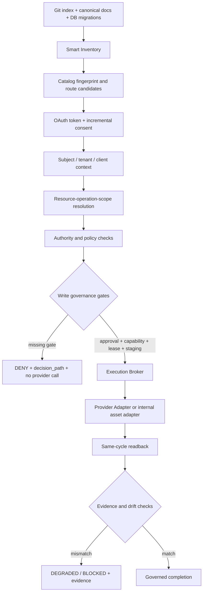

<!-- GOVERNED ARCHITECTURE ARTIFACT. Update with the runtime contracts. -->
# المعمارية المرجعية لـ Remote MCP وWrite Governance

## 1. الغرض والحالة

تحدد هذه الوثيقة المعمارية المرجعية التي يجب أن تحكم أي توسعة لاحقة لـRemote MCP، وخصوصًا write scopes المرتبطة بـAssets وApprovals وGitHub وCloudflare وHostinger. الهدف هو فصل **الاكتشاف** عن **القرار**، وفصل **التفويض** عن **تنفيذ provider mutation**، ثم جعل كل كتابة قابلة للتفسير والقراءة اللاحقة والتحقق من drift.

الحالة الحالية لهذه المعمارية هي **Shadow/Staging Design**. الكتالوج يحتوي على qualified write scopes، لكن لا توجد أدوات كتابة مفعّلة في `tools/list`، ولا يسمح runtime بأي provider mutation أو migration application أو Production activation. هذا الفصل مقصود وليس نقصًا مؤقتًا.

> **قاعدة أمان مركزية:** وجود scope أو route أو migration لا يمنح سلطة تنفيذ. التنفيذ لا يصبح ممكنًا إلا عندما تنجح كل طبقات القرار، وتُحفظ أدلة القرار، ويُنفّذ readback في نفس دورة الطلب.

## 2. المبادئ التصميمية

المبدأ الأول هو **مصدر حقيقة واحد قابل لإعادة التوليد**. يصف Remote MCP catalog الـscopes والـresource-operation bindings والـtool bindings وقواعد route discovery. ويكمل الجرد الذكي هذا الكتالوج بقراءة Git index ومسارات التطبيق وملفات migration وDB registry evidence.

المبدأ الثاني هو **الفصل بين candidate وactive authority**. كل write scope جديد يبدأ في `shadow`. في هذه الحالة يمكن للجرد أن يكتشف المسار ويقيس التغطية ويصدر readiness، لكنه لا يسمح بتصدير الأداة أو استدعاء provider أو تطبيق migration.

المبدأ الثالث هو **fail-closed مع قابلية التفسير**. عند غياب binding أو authority أو approval أو capability أو lease أو fingerprint match، يكون القرار `denied` مع `decision_path` واضح، وليس نجاحًا جزئيًا أو fallback صامتًا.

المبدأ الرابع هو **provider isolation**. لا يعرف قرار التفويض تفاصيل GitHub أو Cloudflare أو Hostinger الداخلية. يقوم القرار بإصدار `authorized operation intent` فقط، ثم يمررها إلى adapter محكوم خاص بالمزود، مع منع تمرير secrets إلى MCP metadata أو readback العام.

المبدأ الخامس هو **same-cycle readback**. لا تعتبر الكتابة ناجحة بمجرد أن يعيد provider استجابة HTTP ناجحة. يجب أن يثبت readback أن المورد المقصود تغيّر في البيئة الصحيحة، وبـresource identity الصحيحة، وبـidempotency key الصحيحة، وأن fingerprint أو evidence يتوافق مع القرار.

## 3. الطبقات المرجعية

| الطبقة | المسؤولية | مصدر الحقيقة | مخرجاتها | حدودها الحالية |
|---|---|---|---|---|
| L0 Inventory and Canonical Sources | اكتشاف الملفات والمسارات والـmigrations والـregistries والـcatalog | Git index، inventory artifacts، canonical docs | inventory fingerprint، route candidates، DB evidence | Read-only؛ لا تطبق تغييرات |
| L1 Transport and OAuth | MCP transport، OAuth 2.1، PKCE، token scopes، incremental consent | OAuth client/grant tables وscope catalog | verified subject وgranted scopes | لا تمنح write scope وحدها |
| L2 Resource-Operation Catalog | تعريف المورد والعملية والـeffect والبيئة وربطها بالscope | generated catalog وDB registry | normalized operation intent | shadow bindings لا تصدر كأدوات |
| L3 Subject and Tenant Context | user، tenant، membership، client، resource audience | access token وmembership/authority rows | subject context | يرفض inactive أو ambiguous context |
| L4 Authority and Policy | resource authority، operation eligibility، tenant/admin limits، capability class | `platform_resource_authority_bindings` وpolicy registries | authority verdict | لا ينفذ provider call |
| L5 Governance Gates | approval، capability envelope، lease، environment، idempotency | approval holds، capability/lease stores، runtime env | typed authorization decision | كل gate مطلوب للكتابة |
| L6 Execution Broker | تحويل intent إلى adapter call محكوم | decision object وprovider policy | dry-run أو provider result | في الوضع الحالي provider mutation محجوب |
| L7 Provider Adapters | GitHub/Cloudflare/Hostinger/Assets adapters، secrets isolation | connector policy وprovider response | provider evidence | لا تقرر authority أو scope |
| L8 Readback and Evidence | التحقق بعد التنفيذ وحفظ audit/evidence | provider readback، DB evidence sinks | readback verdict وevidence refs | لا يرفع status دون evidence |
| L9 Readiness and Drift | مقارنة fingerprints وschema وinventory وmigration state | generated artifacts وDB revisions | operational/readiness status | mismatch يحجب activation |

## 4. تدفق القرار المرجعي

### 4.1 عقد الطلب

يجب أن يحتوي `operation intent` على `request_id` و`client_id` و`subject` و`tenant_id` و`resource_key` و`operation_key` و`scope_key` و`environment` و`idempotency_key` و`catalog_revision` و`catalog_fingerprint`. لا يحتوي العقد على access token خام أو provider secret.

### 4.2 عقد القرار

يجب أن يعيد القرار `ok` و`code` و`scope_key` و`effect_class` و`decision_path` و`governance` و`provider_mutation_allowed` و`production_allowed` و`readback_required` و`secrets_included`. كل عنصر في `decision_path` يمثل gate قابلًا للاختبار، مثل `inventory` و`resource_authority` و`approval` و`capability` و`lease` و`environment`.

### 4.3 عقد readback

يجب أن يثبت readback `request_id` و`operation_id` و`provider` و`environment` و`resource_identity` و`observed_state` و`observed_fingerprint` و`expected_fingerprint` و`idempotency_key` و`evidence_refs` و`secrets_included:false`. أي readback لا يثبت المورد والبيئة والعملية يعامل كـ`readback_insufficient`.

## 5. نموذج قاعدة البيانات

تتوزع الحقيقة التشغيلية على طبقات DB بدل جدول صلاحيات عام:

| المجال | الجداول المرجعية | الاستخدام |
|---|---|---|
| Scope catalog | `platform_oauth_scope_registry`, `platform_scope_catalog_revisions` | تعريف scope وrevision وfingerprint وحالة shadow/active |
| Resource-operation | `platform_resource_scope_bindings` | ربط المورد والعملية بالscope والـeffect والبيئة والـapproval |
| Tool projection | `platform_tool_scope_bindings` | السماح بتصدير MCP tool فقط عند وجود binding active |
| Scope implications | `platform_scope_implications` | اشتقاق scopes اللازمة دون دورات أو implication غير معروف |
| Resource authority | `platform_resource_authority_bindings` | إثبات أن subject أو tenant يملك المورد المطلوب |
| Approval | `approval_holds` أو سجل الموافقات المقابل | قرار بشري traceable مع reviewer وtimestamp |
| Capability | capability envelope / grant registries | تقييد نوع العملية ومدتها ومجالها |
| Lease | lease أو execution reservation records | منع replay والتداخل وانتهاء الصلاحية |
| Evidence | execution/readback/audit sinks | حفظ النتيجة والسبب والـfingerprint والـrollback metadata |

يجب أن تكون migration الخاصة بالكتالوج **additive وidempotent**، وأن تزرع write bindings بحالة `shadow` فقط. لا يجوز أن تؤدي migration بحد ذاتها إلى تفعيل provider adapter أو منح client scope جديد.

## 6. حالات lifecycle

| الحالة | tools/list | tools/call | provider mutation | الانتقال التالي |
|---|---|---|---|---|
| `shadow` | لا يصدّر write tools | يرفض بـ`MCP_WRITE_AUTHORIZATION_DENIED` | محجوب | readiness evidence |
| `staging_ready` | يمكن عرض projection تجريبية غير تنفيذية | dry-run أو approval challenge فقط | محجوب | independent approval |
| `staging_active` | يصدّر الأدوات المحددة فقط | يسمح بعد كل gates | staging adapter فقط | readback certification |
| `active` | يتطلب promotion منفصل | يسمح وفق policy | ليس افتراضيًا | production change-control |
| `blocked` | لا يصدّر | يرفض مع سبب | محجوب | إصلاح drift أو policy |

في الدفعة الحالية، يجب أن تبقى كل write scopes في `shadow`، وأن تظل `production_allowed:false` و`provider_mutation_allowed:false` حتى لو ضُبطت متغيرات البيئة بالخطأ.

## 7. توزيع المسؤوليات

يستقبل `remoteMcpConnectorRuntime` الطلب ويستدعي verifier وauthorization decision، لكنه لا يكتب إلى GitHub أو Cloudflare أو Hostinger. يقوم `remoteMcpWriteScopeGovernance` بتجميع inventory readiness وscope registration وauthority وapproval وcapability وlease وenvironment، ويعيد القرار المفسر.

يولد `scripts/remote-mcp-write-scope-inventory.mjs` artifact من Git index والـroutes والـmigrations والـregistry references والـcatalog. هذا المولد هو أداة اكتشاف وتحذير، وليس منفذًا للتغييرات. أما provider adapters المستقبلية فتلتزم بعقد واحد: `prepare` ثم `execute` ثم `readback` ثم `evidence`، مع عدم امتلاكها صلاحية تغيير القرار.

## 8. قواعد provider adapters

| Adapter | scope shadow | العملية المستهدفة | شرط البيئة | readback المتوقع |
|---|---|---|---|---|
| Internal Assets | `assets.create/update` | إنشاء أو تحديث asset داخل tenant | staging | asset identity وcontent/version fingerprint |
| Approval Service | `approvals.request` | فتح approval hold فقط | staging | hold id وpending state |
| GitHub | `github.write` | patch/branch/issue operation محكومة | staging branch/repository allow-list | commit/ref/PR state |
| Cloudflare | `cloudflare.write` | DNS/Worker/config mutation محكومة | staging zone/account allow-list | object id وetag/config fingerprint |
| Hostinger | `hostinger.deploy` | staging deployment | staging target allow-list | deployment id وhealth/readback |

لا توجد في هذه المرحلة adapter mutation مفعّلة. هذه الجدول يحدد التصميم المستقبلي وحدود التفعيل، وليس تصريحًا بالتنفيذ.

## 9. مسار drift

ينبغي تنفيذ فحص drift في أربع نقاط: عند توليد catalog، عند startup/readiness، قبل إصدار incremental consent، وقبل provider execution. يقارن الفحص `catalog_fingerprint` مع `platform_scope_catalog_revisions.catalog_fingerprint`، ويتحقق من وجود migration evidence، ومن عدم تغير route candidates بلا تحديث catalog.

عند mismatch، يجب أن تكون النتيجة `catalog_ready:false` و`drift_detected:true`، وأن يتوقف أي انتقال إلى `staging_active`. لا يكفي تسجيل warning في log؛ لأن drift في scope أو resource binding قد يحول operation آمنة إلى operation مختلفة.

## 10. خطة التطوير المرحلية

| الدفعة | النطاق | معيار النجاح | ما يبقى محجوبًا |
|---|---|---|---|
| A | architecture artifacts وinventory | fingerprints وroute/DB evidence متطابقة | كل provider mutation |
| B | Assets وApprovals shadow | dry-run وapproval/readback contracts | actual write |
| C | GitHub staging adapter | allow-list وbranch readback وrollback | merge وProduction |
| D | Cloudflare staging adapter | zone/account allow-list وetag readback | DNS/Worker Production |
| E | Hostinger staging adapter | target allow-list وhealth evidence | deployment إلى Production |
| F | independent promotion | مراجعة منفصلة وتوقيع change-control | غير المصرح به |

## 11. معايير القبول المعمارية

تُعتبر المعمارية قابلة للتنفيذ عندما تنجح الاختبارات التالية: كل write scope qualified له catalog entry وDB evidence؛ لا يوجد default write scope؛ route candidate غير المرتبط لا يصبح MCP tool؛ fingerprint mismatch يحجب readiness؛ غياب approval أو capability أو lease ينتج قرار deny؛ provider adapter لا يستطيع تجاوز decision object؛ readback ناقص لا يرفع الحالة إلى completed؛ وevaluation loop يعيد تشغيل inventory checks تلقائيًا.

## 12. مراجع المستودع الداخلية

ترتبط هذه الوثيقة بالمصادر التالية داخل المستودع: [`runtime_boundary_map.md`](../runtime_boundary_map.md)، [`governed_mutation_playbook.md`](../governed_mutation_playbook.md)، [`http-generic-api/remoteMcpScopeCatalog.js`](../http-generic-api/remoteMcpScopeCatalog.js)، [`http-generic-api/remoteMcpWriteScopeGovernance.js`](../http-generic-api/remoteMcpWriteScopeGovernance.js)، [`scripts/remote-mcp-write-scope-inventory.mjs`](../scripts/remote-mcp-write-scope-inventory.mjs)، وmigration [`20260813_remote_mcp_dynamic_permission_tree_v1.sql`](../http-generic-api/migrations/20260813_remote_mcp_dynamic_permission_tree_v1.sql).
