# Activation and Authorized Access Map

> Generated text documentation. Do not edit this file manually.
> Source hash: `110bdf5fa7485134b40f58d6ab15a25d029445c74d47472bc5e2a9ea0f8d4c6f`
> Source count: **69**
> Sources: `http-generic-api/activation-surfaces/agent_bindings_catalog.json`, `http-generic-api/activation-surfaces/agent_catalog.json`, `http-generic-api/activation-surfaces/agent_skill_catalog.json`, `http-generic-api/activation-surfaces/agent_skill_grant_requests.json`, `http-generic-api/activation-surfaces/agent_skill_grants.json`, `http-generic-api/activation-surfaces/agent_surface_catalog.json`, `http-generic-api/activation-surfaces/agent_tool_catalog.json`, `http-generic-api/activation-surfaces/app_action_grants.json`, `http-generic-api/activation-surfaces/app_binding_catalog.json`, `http-generic-api/activation-surfaces/app_integration_catalog.json`, `http-generic-api/activation-surfaces/authority_scope_registry.json`, `http-generic-api/activation-surfaces/authority_scope_shadow_evidence.json`, _... +57 more_
> Rendering: Mermaid code blocks plus Markdown tables; no image assets are generated.

```mermaid
flowchart TD
  Session[Activation session context] --> Authorization[Dynamic authorization envelope]
  Authorization --> Registry[Activation surface registry]
  n_agent_bindings_catalog["agent_bindings_catalog<br/>admin + tenant"]
  n_agent_catalog["agent_catalog<br/>admin + tenant"]
  n_agent_skill_catalog["agent_skill_catalog<br/>admin + tenant"]
  n_agent_skill_grant_requests["agent_skill_grant_requests<br/>admin + tenant"]
  n_agent_skill_grants["agent_skill_grants<br/>admin + tenant"]
  n_agent_surface_catalog["agent_surface_catalog<br/>admin"]
  n_agent_tool_catalog["agent_tool_catalog<br/>admin + tenant"]
  n_app_action_grants["app_action_grants<br/>admin + tenant"]
  n_app_binding_catalog["app_binding_catalog<br/>admin + tenant"]
  n_app_integration_catalog["app_integration_catalog<br/>admin + tenant"]
  n_authority_scope_registry["authority_scope_registry<br/>admin + tenant"]
  n_authority_scope_shadow_evidence["authority_scope_shadow_evidence<br/>admin + tenant"]
  n_canonical_identifier_column_binding_registry["canonical_identifier_column_binding_registry<br/>admin"]
  n_canonical_identifier_contract_registry["canonical_identifier_contract_registry<br/>admin"]
  n_capability_aliases["capability_aliases<br/>admin"]
  n_capability_assurance_bindings["capability_assurance_bindings<br/>admin"]
  n_capability_assurance_capabilities["capability_assurance_capabilities<br/>admin"]
  n_capability_assurance_certifications["capability_assurance_certifications<br/>admin"]
  n_capability_assurance_debt["capability_assurance_debt<br/>admin"]
  n_capability_assurance_envelope_binding_links["capability_assurance_envelope_binding_links<br/>admin"]
  n_capability_assurance_envelope_evidence_links["capability_assurance_envelope_evidence_links<br/>admin"]
  n_capability_assurance_exports["capability_assurance_exports<br/>admin"]
  n_capability_assurance_plugins["capability_assurance_plugins<br/>admin"]
  n_capability_assurance_source_links["capability_assurance_source_links<br/>admin"]
  n_capability_enablement_operational_attention["capability_enablement_operational_attention<br/>admin + tenant"]
  n_capability_enablement_operational_dashboard["capability_enablement_operational_dashboard<br/>admin + tenant"]
  n_capability_enablement_requests["capability_enablement_requests<br/>admin + tenant"]
  n_capability_enablement_steps["capability_enablement_steps<br/>admin"]
  n_capability_envelope_templates["capability_envelope_templates<br/>admin"]
  n_capability_governance_compilation_runs["capability_governance_compilation_runs<br/>admin"]
  n_capability_invocations["capability_invocations<br/>admin"]
  n_capability_readback_contracts["capability_readback_contracts<br/>admin"]
  n_capability_retrieval_candidates["capability_retrieval_candidates<br/>admin"]
  n_capability_retrieval_events["capability_retrieval_events<br/>admin"]
  n_connected_app_connections["connected_app_connections<br/>admin + tenant"]
  n_connected_systems["connected_systems<br/>admin + tenant"]
  n_installations["installations<br/>admin + tenant"]
  n_local_gateway_tool_catalog["local_gateway_tool_catalog<br/>admin + tenant"]
  n_logic_pack_catalog["logic_pack_catalog<br/>admin + tenant"]
  n_pending_tasks["pending_tasks<br/>admin + tenant"]
  n_permission_grants["permission_grants<br/>admin + tenant"]
  n_platform_capability_provider_bindings["platform_capability_provider_bindings<br/>admin"]
  n_platform_plugin_catalog["platform_plugin_catalog<br/>admin + tenant"]
  n_platform_resource_coverage_findings["platform_resource_coverage_findings<br/>admin"]
  n_platform_resource_coverage_runs["platform_resource_coverage_runs<br/>admin"]
  n_platform_resource_operation_registry["platform_resource_operation_registry<br/>admin"]
  n_platform_resource_surface_policy_registry["platform_resource_surface_policy_registry<br/>admin"]
  n_platform_resource_type_registry["platform_resource_type_registry<br/>admin"]
  n_platform_tool_dispatch_bindings["platform_tool_dispatch_bindings<br/>admin"]
  n_plugin_contributions["plugin_contributions<br/>admin + tenant"]
  n_release_advisor_runs["release_advisor_runs<br/>admin"]
  n_repository_authority_bindings["repository_authority_bindings<br/>admin + tenant"]
  n_repository_capability_bindings["repository_capability_bindings<br/>admin"]
  n_repository_capability_policy_layers["repository_capability_policy_layers<br/>admin"]
  n_repository_main_moved_trigger_events["repository_main_moved_trigger_events<br/>admin"]
  n_repository_mutation_plans_v6["repository_mutation_plans_v6<br/>admin + tenant"]
  n_repository_mutation_runs_v6["repository_mutation_runs_v6<br/>admin + tenant"]
  n_skill_manifest_catalog["skill_manifest_catalog<br/>admin + tenant"]
  n_skill_package_catalog["skill_package_catalog<br/>admin + tenant"]
  n_task_route_catalog["task_route_catalog<br/>admin + tenant"]
  n_tenant_agent_surface_deployments["tenant_agent_surface_deployments<br/>admin + tenant"]
  n_tenant_brand_links["tenant_brand_links<br/>admin + tenant"]
  n_tenant_capability_shadow_decisions["tenant_capability_shadow_decisions<br/>admin + tenant"]
  n_tenant_integration_policies["tenant_integration_policies<br/>admin + tenant"]
  n_tenant_tools["tenant_tools<br/>admin + tenant"]
  n_user_agent_surface_preferences["user_agent_surface_preferences<br/>admin + tenant"]
  n_workflow_catalog["workflow_catalog<br/>admin + tenant"]
  n_workflow_runtime_bindings["workflow_runtime_bindings<br/>admin + tenant"]
  n_workspace_registry["workspace_registry<br/>admin + tenant"]
  Registry --> n_agent_bindings_catalog
  Registry --> n_agent_catalog
  Registry --> n_agent_skill_catalog
  Registry --> n_agent_skill_grant_requests
  Registry --> n_agent_skill_grants
  Registry --> n_agent_surface_catalog
  Registry --> n_agent_tool_catalog
  Registry --> n_app_action_grants
  Registry --> n_app_binding_catalog
  Registry --> n_app_integration_catalog
  Registry --> n_authority_scope_registry
  Registry --> n_authority_scope_shadow_evidence
  Registry --> n_canonical_identifier_column_binding_registry
  Registry --> n_canonical_identifier_contract_registry
  Registry --> n_capability_aliases
  Registry --> n_capability_assurance_bindings
  Registry --> n_capability_assurance_capabilities
  Registry --> n_capability_assurance_certifications
  Registry --> n_capability_assurance_debt
  Registry --> n_capability_assurance_envelope_binding_links
  Registry --> n_capability_assurance_envelope_evidence_links
  Registry --> n_capability_assurance_exports
  Registry --> n_capability_assurance_plugins
  Registry --> n_capability_assurance_source_links
  Registry --> n_capability_enablement_operational_attention
  Registry --> n_capability_enablement_operational_dashboard
  Registry --> n_capability_enablement_requests
  Registry --> n_capability_enablement_steps
  Registry --> n_capability_envelope_templates
  Registry --> n_capability_governance_compilation_runs
  Registry --> n_capability_invocations
  Registry --> n_capability_readback_contracts
  Registry --> n_capability_retrieval_candidates
  Registry --> n_capability_retrieval_events
  Registry --> n_connected_app_connections
  Registry --> n_connected_systems
  Registry --> n_installations
  Registry --> n_local_gateway_tool_catalog
  Registry --> n_logic_pack_catalog
  Registry --> n_pending_tasks
  Registry --> n_permission_grants
  Registry --> n_platform_capability_provider_bindings
  Registry --> n_platform_plugin_catalog
  Registry --> n_platform_resource_coverage_findings
  Registry --> n_platform_resource_coverage_runs
  Registry --> n_platform_resource_operation_registry
  Registry --> n_platform_resource_surface_policy_registry
  Registry --> n_platform_resource_type_registry
  Registry --> n_platform_tool_dispatch_bindings
  Registry --> n_plugin_contributions
  Registry --> n_release_advisor_runs
  Registry --> n_repository_authority_bindings
  Registry --> n_repository_capability_bindings
  Registry --> n_repository_capability_policy_layers
  Registry --> n_repository_main_moved_trigger_events
  Registry --> n_repository_mutation_plans_v6
  Registry --> n_repository_mutation_runs_v6
  Registry --> n_skill_manifest_catalog
  Registry --> n_skill_package_catalog
  Registry --> n_task_route_catalog
  Registry --> n_tenant_agent_surface_deployments
  Registry --> n_tenant_brand_links
  Registry --> n_tenant_capability_shadow_decisions
  Registry --> n_tenant_integration_policies
  Registry --> n_tenant_tools
  Registry --> n_user_agent_surface_preferences
  Registry --> n_workflow_catalog
  Registry --> n_workflow_runtime_bindings
  Registry --> n_workspace_registry
  Registry --> SafeFilter[Sensitive-field filter]
  SafeFilter --> Admin[Admin authorized access]
  SafeFilter --> Tenant[Tenant-scoped authorized access]
```

## Registered surfaces

| Surface | Source table/view | Admin | Tenant | Status | Result columns |
|---|---|---:|---:|---|---:|
| `agent_bindings_catalog` | `v_activation_agent_bindings_catalog` | yes | yes | active | 7 |
| `agent_catalog` | `v_activation_agent_catalog` | yes | yes | active | 13 |
| `agent_skill_catalog` | `v_activation_agent_skill_catalog` | yes | yes | active | 9 |
| `agent_skill_grant_requests` | `v_activation_agent_skill_grant_requests` | yes | yes | active | 18 |
| `agent_skill_grants` | `v_activation_agent_skill_grants` | yes | yes | active | 15 |
| `agent_surface_catalog` | `agent_surface_catalog` | yes | no | active | 12 |
| `agent_tool_catalog` | `v_activation_agent_tool_catalog` | yes | yes | active | 10 |
| `app_action_grants` | `v_activation_app_action_grants` | yes | yes | active | 12 |
| `app_binding_catalog` | `v_activation_app_binding_catalog` | yes | yes | active | 10 |
| `app_integration_catalog` | `v_activation_app_integration_catalog` | yes | yes | active | 7 |
| `authority_scope_registry` | `authority_scope_registry` | yes | yes | active | 7 |
| `authority_scope_shadow_evidence` | `authority_scope_shadow_evidence` | yes | yes | active | 14 |
| `canonical_identifier_column_binding_registry` | `canonical_identifier_column_binding_registry` | yes | no | active | 8 |
| `canonical_identifier_contract_registry` | `canonical_identifier_contract_registry` | yes | no | active | 12 |
| `capability_aliases` | `capability_aliases` | yes | no | active | 10 |
| `capability_assurance_bindings` | `platform_plugin_bindings` | yes | no | active | 10 |
| `capability_assurance_capabilities` | `platform_plugin_capabilities` | yes | no | active | 19 |
| `capability_assurance_certifications` | `platform_capability_certifications` | yes | no | active | 13 |
| `capability_assurance_debt` | `platform_capability_debt` | yes | no | active | 11 |
| `capability_assurance_envelope_binding_links` | `platform_capability_envelope_binding_links` | yes | no | active | 5 |
| `capability_assurance_envelope_evidence_links` | `platform_capability_envelope_evidence_links` | yes | no | active | 5 |
| `capability_assurance_exports` | `platform_plugin_capability_exports` | yes | no | active | 10 |
| `capability_assurance_plugins` | `platform_plugins` | yes | no | active | 11 |
| `capability_assurance_source_links` | `platform_capability_source_links` | yes | no | active | 7 |
| `capability_enablement_operational_attention` | `v_capability_enablement_operational_attention` | yes | yes | active | 15 |
| `capability_enablement_operational_dashboard` | `v_capability_enablement_operational_dashboard` | yes | yes | active | 16 |
| `capability_enablement_requests` | `capability_enablement_requests` | yes | yes | active | 13 |
| `capability_enablement_steps` | `capability_enablement_steps` | yes | no | active | 8 |
| `capability_envelope_templates` | `capability_envelope_templates` | yes | no | active | 14 |
| `capability_governance_compilation_runs` | `platform_capability_compilation_runs` | yes | no | active | 14 |
| `capability_invocations` | `capability_invocations` | yes | no | active | 19 |
| `capability_readback_contracts` | `platform_capability_readback_contracts` | yes | no | active | 18 |
| `capability_retrieval_candidates` | `capability_retrieval_candidates` | yes | no | active | 16 |
| `capability_retrieval_events` | `capability_retrieval_events` | yes | no | active | 14 |
| `connected_app_connections` | `v_activation_connected_app_connections` | yes | yes | active | 13 |
| `connected_systems` | `connected_systems` | yes | yes | active | 9 |
| `installations` | `installations` | yes | yes | active | 6 |
| `local_gateway_tool_catalog` | `v_activation_local_gateway_tool_catalog` | yes | yes | active | 21 |
| `logic_pack_catalog` | `v_activation_logic_pack_catalog` | yes | yes | active | 9 |
| `pending_tasks` | `v_activation_pending_tasks` | yes | yes | active | 13 |
| `permission_grants` | `permission_grants` | yes | yes | active | 5 |
| `platform_capability_provider_bindings` | `platform_capability_provider_bindings` | yes | no | active | 13 |
| `platform_plugin_catalog` | `v_activation_platform_plugin_catalog` | yes | yes | active | 13 |
| `platform_resource_coverage_findings` | `platform_resource_coverage_findings` | yes | no | active | 10 |
| `platform_resource_coverage_runs` | `platform_resource_coverage_runs` | yes | no | active | 6 |
| `platform_resource_operation_registry` | `platform_resource_operation_registry` | yes | no | active | 14 |
| `platform_resource_surface_policy_registry` | `platform_resource_surface_policy_registry` | yes | no | active | 12 |
| `platform_resource_type_registry` | `platform_resource_type_registry` | yes | no | active | 8 |
| `platform_tool_dispatch_bindings` | `platform_tool_dispatch_bindings` | yes | no | active | 16 |
| `plugin_contributions` | `v_activation_plugin_contributions` | yes | yes | active | 14 |
| `release_advisor_runs` | `release_advisor_runs` | yes | no | active | 17 |
| `repository_authority_bindings` | `repository_authority_bindings` | yes | yes | active | 23 |
| `repository_capability_bindings` | `repository_capability_bindings` | yes | no | active | 16 |
| `repository_capability_policy_layers` | `repository_capability_policy_layers` | yes | no | active | 11 |
| `repository_main_moved_trigger_events` | `repository_main_moved_trigger_events` | yes | no | active | 21 |
| `repository_mutation_plans_v6` | `repository_mutation_plans_v6` | yes | yes | active | 11 |
| `repository_mutation_runs_v6` | `repository_mutation_runs_v6` | yes | yes | active | 21 |
| `skill_manifest_catalog` | `v_activation_skill_manifest_catalog` | yes | yes | active | 9 |
| `skill_package_catalog` | `v_activation_skill_package_catalog` | yes | yes | active | 11 |
| `task_route_catalog` | `v_activation_task_route_catalog` | yes | yes | active | 21 |
| `tenant_agent_surface_deployments` | `tenant_agent_surface_deployments` | yes | yes | active | 14 |
| `tenant_brand_links` | `tenant_brand_links` | yes | yes | active | 7 |
| `tenant_capability_shadow_decisions` | `tenant_capability_shadow_decisions` | yes | yes | active | 11 |
| `tenant_integration_policies` | `v_activation_tenant_integration_policies` | yes | yes | active | 9 |
| `tenant_tools` | `v_activation_tenant_tools` | yes | yes | active | 8 |
| `user_agent_surface_preferences` | `user_agent_surface_preferences` | yes | yes | active | 7 |
| `workflow_catalog` | `v_activation_workflow_catalog` | yes | yes | active | 22 |
| `workflow_runtime_bindings` | `v_activation_workflow_runtime_bindings` | yes | yes | active | 12 |
| `workspace_registry` | `workspace_registry` | yes | yes | active | 8 |

Total generated surfaces: **69**.
