# Activation and Authorized Access Map

> Generated text documentation. Do not edit this file manually.
> Source hash: `d62f27ae0ff0a35be7c5a7a621d4c9d1b910e7466266d53ab640db441909df02`
> Source count: **42**
> Sources: `http-generic-api/activation-surfaces/agent_bindings_catalog.json`, `http-generic-api/activation-surfaces/agent_catalog.json`, `http-generic-api/activation-surfaces/agent_skill_catalog.json`, `http-generic-api/activation-surfaces/agent_skill_grants.json`, `http-generic-api/activation-surfaces/agent_surface_catalog.json`, `http-generic-api/activation-surfaces/agent_tool_catalog.json`, `http-generic-api/activation-surfaces/app_action_grants.json`, `http-generic-api/activation-surfaces/app_binding_catalog.json`, `http-generic-api/activation-surfaces/app_integration_catalog.json`, `http-generic-api/activation-surfaces/capability_assurance_bindings.json`, `http-generic-api/activation-surfaces/capability_assurance_capabilities.json`, `http-generic-api/activation-surfaces/capability_assurance_certifications.json`, _... +30 more_
> Rendering: Mermaid code blocks plus Markdown tables; no image assets are generated.

```mermaid
flowchart TD
  Session[Activation session context] --> Authorization[Dynamic authorization envelope]
  Authorization --> Registry[Activation surface registry]
  n_agent_bindings_catalog["agent_bindings_catalog<br/>admin + tenant"]
  n_agent_catalog["agent_catalog<br/>admin + tenant"]
  n_agent_skill_catalog["agent_skill_catalog<br/>admin + tenant"]
  n_agent_skill_grants["agent_skill_grants<br/>admin + tenant"]
  n_agent_surface_catalog["agent_surface_catalog<br/>admin"]
  n_agent_tool_catalog["agent_tool_catalog<br/>admin + tenant"]
  n_app_action_grants["app_action_grants<br/>admin + tenant"]
  n_app_binding_catalog["app_binding_catalog<br/>admin + tenant"]
  n_app_integration_catalog["app_integration_catalog<br/>admin + tenant"]
  n_capability_assurance_bindings["capability_assurance_bindings<br/>admin"]
  n_capability_assurance_capabilities["capability_assurance_capabilities<br/>admin"]
  n_capability_assurance_certifications["capability_assurance_certifications<br/>admin"]
  n_capability_assurance_debt["capability_assurance_debt<br/>admin"]
  n_capability_assurance_envelope_binding_links["capability_assurance_envelope_binding_links<br/>admin"]
  n_capability_assurance_envelope_evidence_links["capability_assurance_envelope_evidence_links<br/>admin"]
  n_capability_assurance_exports["capability_assurance_exports<br/>admin"]
  n_capability_assurance_plugins["capability_assurance_plugins<br/>admin"]
  n_capability_assurance_source_links["capability_assurance_source_links<br/>admin"]
  n_connected_app_connections["connected_app_connections<br/>admin + tenant"]
  n_connected_systems["connected_systems<br/>admin + tenant"]
  n_installations["installations<br/>admin + tenant"]
  n_local_gateway_tool_catalog["local_gateway_tool_catalog<br/>admin + tenant"]
  n_logic_pack_catalog["logic_pack_catalog<br/>admin + tenant"]
  n_pending_tasks["pending_tasks<br/>admin + tenant"]
  n_permission_grants["permission_grants<br/>admin + tenant"]
  n_platform_capability_provider_bindings["platform_capability_provider_bindings<br/>admin"]
  n_platform_plugin_catalog["platform_plugin_catalog<br/>admin + tenant"]
  n_platform_tool_dispatch_bindings["platform_tool_dispatch_bindings<br/>admin"]
  n_plugin_contributions["plugin_contributions<br/>admin + tenant"]
  n_repository_mutation_plans_v6["repository_mutation_plans_v6<br/>admin + tenant"]
  n_repository_mutation_runs_v6["repository_mutation_runs_v6<br/>admin + tenant"]
  n_skill_manifest_catalog["skill_manifest_catalog<br/>admin + tenant"]
  n_skill_package_catalog["skill_package_catalog<br/>admin + tenant"]
  n_task_route_catalog["task_route_catalog<br/>admin + tenant"]
  n_tenant_agent_surface_deployments["tenant_agent_surface_deployments<br/>admin + tenant"]
  n_tenant_capability_shadow_decisions["tenant_capability_shadow_decisions<br/>admin + tenant"]
  n_tenant_integration_policies["tenant_integration_policies<br/>admin + tenant"]
  n_tenant_tools["tenant_tools<br/>admin + tenant"]
  n_user_agent_surface_preferences["user_agent_surface_preferences<br/>admin + tenant"]
  n_workflow_catalog["workflow_catalog<br/>admin + tenant"]
  n_workflow_runtime_bindings["workflow_runtime_bindings<br/>admin + tenant"]
  n_workspace_registry["workspace_registry<br/>admin + tenant"]
  Registry --> n_agent_bindings_catalog
  Registry --> n_agent_catalog
  Registry --> n_agent_skill_catalog
  Registry --> n_agent_skill_grants
  Registry --> n_agent_surface_catalog
  Registry --> n_agent_tool_catalog
  Registry --> n_app_action_grants
  Registry --> n_app_binding_catalog
  Registry --> n_app_integration_catalog
  Registry --> n_capability_assurance_bindings
  Registry --> n_capability_assurance_capabilities
  Registry --> n_capability_assurance_certifications
  Registry --> n_capability_assurance_debt
  Registry --> n_capability_assurance_envelope_binding_links
  Registry --> n_capability_assurance_envelope_evidence_links
  Registry --> n_capability_assurance_exports
  Registry --> n_capability_assurance_plugins
  Registry --> n_capability_assurance_source_links
  Registry --> n_connected_app_connections
  Registry --> n_connected_systems
  Registry --> n_installations
  Registry --> n_local_gateway_tool_catalog
  Registry --> n_logic_pack_catalog
  Registry --> n_pending_tasks
  Registry --> n_permission_grants
  Registry --> n_platform_capability_provider_bindings
  Registry --> n_platform_plugin_catalog
  Registry --> n_platform_tool_dispatch_bindings
  Registry --> n_plugin_contributions
  Registry --> n_repository_mutation_plans_v6
  Registry --> n_repository_mutation_runs_v6
  Registry --> n_skill_manifest_catalog
  Registry --> n_skill_package_catalog
  Registry --> n_task_route_catalog
  Registry --> n_tenant_agent_surface_deployments
  Registry --> n_tenant_capability_shadow_decisions
  Registry --> n_tenant_integration_policies
  Registry --> n_tenant_tools
  Registry --> n_user_agent_surface_preferences
  Registry --> n_workflow_catalog
  Registry --> n_workflow_runtime_bindings
  Registry --> n_workspace_registry
  Registry --> SafeFilter[Sensitive-field filter]
  SafeFilter --> Admin[Admin authorized access]
  SafeFilter --> Tenant[Tenant-scoped authorized access]
```

## Registered surfaces

| Surface | Source table/view | Admin | Tenant | Status | Result columns |
|---|---|---:|---:|---|---:|
| `agent_bindings_catalog` | `v_activation_agent_bindings_catalog` | yes | yes | active | 7 |
| `agent_catalog` | `v_activation_agent_catalog` | yes | yes | active | 13 |
| `agent_skill_catalog` | `v_activation_agent_skill_catalog` | yes | yes | active | 9 |
| `agent_skill_grants` | `v_activation_agent_skill_grants` | yes | yes | active | 15 |
| `agent_surface_catalog` | `agent_surface_catalog` | yes | no | active | 12 |
| `agent_tool_catalog` | `v_activation_agent_tool_catalog` | yes | yes | active | 10 |
| `app_action_grants` | `v_activation_app_action_grants` | yes | yes | active | 12 |
| `app_binding_catalog` | `v_activation_app_binding_catalog` | yes | yes | active | 10 |
| `app_integration_catalog` | `v_activation_app_integration_catalog` | yes | yes | active | 7 |
| `capability_assurance_bindings` | `platform_plugin_bindings` | yes | no | active | 10 |
| `capability_assurance_capabilities` | `platform_plugin_capabilities` | yes | no | active | 19 |
| `capability_assurance_certifications` | `platform_capability_certifications` | yes | no | active | 13 |
| `capability_assurance_debt` | `platform_capability_debt` | yes | no | active | 11 |
| `capability_assurance_envelope_binding_links` | `platform_capability_envelope_binding_links` | yes | no | active | 5 |
| `capability_assurance_envelope_evidence_links` | `platform_capability_envelope_evidence_links` | yes | no | active | 5 |
| `capability_assurance_exports` | `platform_plugin_capability_exports` | yes | no | active | 10 |
| `capability_assurance_plugins` | `platform_plugins` | yes | no | active | 11 |
| `capability_assurance_source_links` | `platform_capability_source_links` | yes | no | active | 7 |
| `connected_app_connections` | `v_activation_connected_app_connections` | yes | yes | active | 13 |
| `connected_systems` | `connected_systems` | yes | yes | active | 9 |
| `installations` | `installations` | yes | yes | active | 6 |
| `local_gateway_tool_catalog` | `v_activation_local_gateway_tool_catalog` | yes | yes | active | 21 |
| `logic_pack_catalog` | `v_activation_logic_pack_catalog` | yes | yes | active | 9 |
| `pending_tasks` | `v_activation_pending_tasks` | yes | yes | active | 13 |
| `permission_grants` | `permission_grants` | yes | yes | active | 5 |
| `platform_capability_provider_bindings` | `platform_capability_provider_bindings` | yes | no | active | 13 |
| `platform_plugin_catalog` | `v_activation_platform_plugin_catalog` | yes | yes | active | 13 |
| `platform_tool_dispatch_bindings` | `platform_tool_dispatch_bindings` | yes | no | active | 16 |
| `plugin_contributions` | `v_activation_plugin_contributions` | yes | yes | active | 14 |
| `repository_mutation_plans_v6` | `repository_mutation_plans_v6` | yes | yes | active | 11 |
| `repository_mutation_runs_v6` | `repository_mutation_runs_v6` | yes | yes | active | 21 |
| `skill_manifest_catalog` | `v_activation_skill_manifest_catalog` | yes | yes | active | 9 |
| `skill_package_catalog` | `v_activation_skill_package_catalog` | yes | yes | active | 11 |
| `task_route_catalog` | `v_activation_task_route_catalog` | yes | yes | active | 21 |
| `tenant_agent_surface_deployments` | `tenant_agent_surface_deployments` | yes | yes | active | 14 |
| `tenant_capability_shadow_decisions` | `tenant_capability_shadow_decisions` | yes | yes | active | 11 |
| `tenant_integration_policies` | `v_activation_tenant_integration_policies` | yes | yes | active | 9 |
| `tenant_tools` | `v_activation_tenant_tools` | yes | yes | active | 8 |
| `user_agent_surface_preferences` | `user_agent_surface_preferences` | yes | yes | active | 7 |
| `workflow_catalog` | `v_activation_workflow_catalog` | yes | yes | active | 22 |
| `workflow_runtime_bindings` | `v_activation_workflow_runtime_bindings` | yes | yes | active | 12 |
| `workspace_registry` | `workspace_registry` | yes | yes | active | 8 |

Total generated surfaces: **42**.
