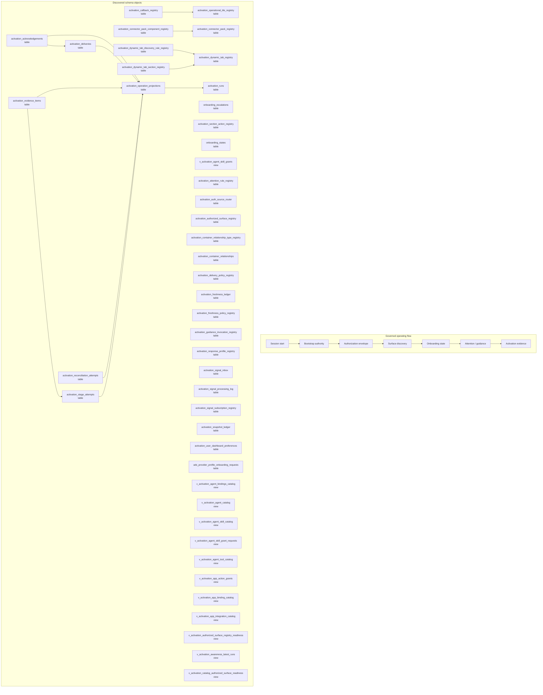

# Activation, Bootstrap, and Onboarding Map

> Generated text documentation. Do not edit this file manually.
> Source hash: `8305eb33a5a49005eac2147e8ca79fb403b4900bee6cb96fc40539dc411a4d7b`
> Source count: **15**
> Sources: `http-generic-api/migrations/008_sprint12_bootstrap.sql`, `http-generic-api/migrations/100_sprint63_onboarding_recovery_control_plane.sql`, `http-generic-api/migrations/20260611_activation_dynamic_tabs.sql`, `http-generic-api/migrations/20260611_activation_dynamic_tabs_autodiscovery.sql`, `http-generic-api/migrations/20260611_activation_operational_dashboard.sql`, `http-generic-api/migrations/20260611_activation_operational_intelligence.sql`, `http-generic-api/migrations/20260615_tenant_growth_dashboard_product.sql`, `http-generic-api/migrations/20260722_agent_skill_grant_approval_provenance.sql`, `http-generic-api/migrations/20260724_activation_operation_projection_foundation.sql`, `http-generic-api/migrations/252_sprint67_ads_provider_profile_onboarding_flow.sql`, _... +5 more_
> Rendering: Mermaid plus Markdown tables; no image assets or raw database rows are generated.

## Discovered object inventory

| Object | Type | Domain | Source migrations | Columns | References |
|---|---|---|---:|---:|---|
| `activation_acknowledgements` | table | Activation & onboarding | 1 | - | `activation_deliveries`, `activation_operation_projections` |
| `activation_attention_rule_registry` | table | Activation & onboarding | 1 | - | - |
| `activation_auth_source_router` | table | Activation & onboarding | 1 | - | - |
| `activation_authorized_surface_registry` | table | Activation & onboarding | 1 | 20 | - |
| `activation_callback_registry` | table | Activation & onboarding | 1 | - | `activation_operational_tile_registry` |
| `activation_connector_pack_component_registry` | table | Activation & onboarding | 1 | - | `activation_connector_pack_registry` |
| `activation_connector_pack_registry` | table | Activation & onboarding | 1 | - | - |
| `activation_container_relationship_type_registry` | table | Activation & onboarding | 1 | - | - |
| `activation_container_relationships` | table | Activation & onboarding | 1 | - | - |
| `activation_deliveries` | table | Activation & onboarding | 1 | - | `activation_operation_projections` |
| `activation_delivery_policy_registry` | table | Activation & onboarding | 1 | - | - |
| `activation_dynamic_tab_discovery_rule_registry` | table | Activation & onboarding | 1 | - | `activation_dynamic_tab_registry` |
| `activation_dynamic_tab_registry` | table | Activation & onboarding | 2 | - | - |
| `activation_dynamic_tab_section_registry` | table | Activation & onboarding | 3 | - | `activation_dynamic_tab_registry` |
| `activation_evidence_items` | table | Activation & onboarding | 1 | - | `activation_operation_projections`, `activation_stage_attempts` |
| `activation_freshness_ledger` | table | Activation & onboarding | 1 | - | - |
| `activation_freshness_policy_registry` | table | Activation & onboarding | 1 | - | - |
| `activation_guidance_invocation_registry` | table | Activation & onboarding | 1 | - | - |
| `activation_operation_projections` | table | Activation & onboarding | 1 | - | `activation_runs` |
| `activation_operational_tile_registry` | table | Activation & onboarding | 1 | - | - |
| `activation_reconciliation_attempts` | table | Activation & onboarding | 1 | - | `activation_operation_projections` |
| `activation_response_profile_registry` | table | Activation & onboarding | 1 | - | - |
| `activation_runs` | table | Activation & onboarding | 1 | - | - |
| `activation_section_action_registry` | table | Activation & onboarding | 2 | - | - |
| `activation_signal_inbox` | table | Activation & onboarding | 1 | - | - |
| `activation_signal_processing_log` | table | Activation & onboarding | 1 | - | - |
| `activation_signal_subscription_registry` | table | Activation & onboarding | 1 | - | - |
| `activation_snapshot_ledger` | table | Activation & onboarding | 1 | - | - |
| `activation_stage_attempts` | table | Activation & onboarding | 1 | - | `activation_operation_projections` |
| `activation_user_dashboard_preferences` | table | Activation & onboarding | 1 | - | - |
| `ads_provider_profile_onboarding_requests` | table | Activation & onboarding | 1 | - | - |
| `onboarding_escalations` | table | Activation & onboarding | 1 | 15 | `tenants`, `tickets`, `users` |
| `onboarding_states` | table | Activation & onboarding | 1 | 11 | `tenants` |
| `v_activation_agent_bindings_catalog` | view | Activation & onboarding | 1 | - | - |
| `v_activation_agent_catalog` | view | Activation & onboarding | 1 | - | - |
| `v_activation_agent_skill_catalog` | view | Activation & onboarding | 1 | - | - |
| `v_activation_agent_skill_grant_requests` | view | Activation & onboarding | 1 | - | - |
| `v_activation_agent_skill_grants` | view | Activation & onboarding | 2 | - | - |
| `v_activation_agent_tool_catalog` | view | Activation & onboarding | 1 | - | - |
| `v_activation_app_action_grants` | view | Activation & onboarding | 1 | - | - |
| `v_activation_app_binding_catalog` | view | Activation & onboarding | 1 | - | - |
| `v_activation_app_integration_catalog` | view | Activation & onboarding | 1 | - | - |
| `v_activation_authorized_surface_registry_readiness` | view | Activation & onboarding | 1 | - | - |
| `v_activation_awareness_latest_runs` | view | Activation & onboarding | 1 | - | - |
| `v_activation_catalog_authorized_surface_readiness` | view | Activation & onboarding | 1 | - | - |
| `v_activation_connected_app_connections` | view | Activation & onboarding | 1 | - | - |
| `v_activation_expanded_authorized_surface_readiness` | view | Activation & onboarding | 1 | - | - |
| `v_activation_local_gateway_tool_catalog` | view | Activation & onboarding | 1 | - | - |
| `v_activation_logic_pack_catalog` | view | Activation & onboarding | 1 | - | - |
| `v_activation_pending_tasks` | view | Activation & onboarding | 1 | - | - |
| `v_activation_platform_plugin_catalog` | view | Activation & onboarding | 1 | - | - |
| `v_activation_plugin_contributions` | view | Activation & onboarding | 1 | - | - |
| `v_activation_skill_manifest_catalog` | view | Activation & onboarding | 1 | - | - |
| `v_activation_skill_package_catalog` | view | Activation & onboarding | 1 | - | - |
| `v_activation_task_route_catalog` | view | Activation & onboarding | 1 | - | - |
| `v_activation_tenant_integration_policies` | view | Activation & onboarding | 1 | - | - |
| `v_activation_tenant_tools` | view | Activation & onboarding | 1 | - | - |
| `v_activation_workflow_catalog` | view | Activation & onboarding | 1 | - | - |
| `v_activation_workflow_runtime_bindings` | view | Activation & onboarding | 1 | - | - |

## Coverage counters

- Matching schema objects: **59**
- Diagram objects shown: **45**
- Source migrations: **15**
