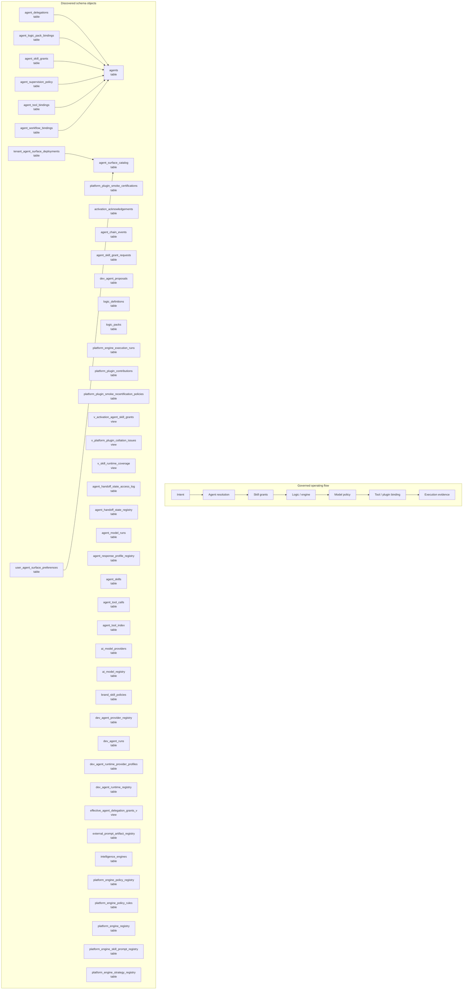

# Agent, Skill, Plugin, and Intelligence Map

> Generated text documentation. Do not edit this file manually.
> Source hash: `3729b56495ab2a1b2a1bb2f881f88b1ccb78c06ec877b013c369b4ba9fe11d85`
> Source count: **37**
> Sources: `http-generic-api/migrations/009_sprint05_logic_graph.sql`, `http-generic-api/migrations/016_sprint20_agent_registry.sql`, `http-generic-api/migrations/017_sprint21_output_sink_router.sql`, `http-generic-api/migrations/019_sprint24_workflow_seeds_and_skills.sql`, `http-generic-api/migrations/021_sprint26_dev_agent_growth_loop.sql`, `http-generic-api/migrations/1003_sprint68_supervisor_chain_runtime_guards.sql`, `http-generic-api/migrations/1005_sprint69_agent_skill_coverage_prompt_enrichment.sql`, `http-generic-api/migrations/1006_sprint69_agent_capability_evidence_coverage.sql`, `http-generic-api/migrations/1015_sprint69_operational_alerting_p0_reconciliation.sql`, `http-generic-api/migrations/1020_sprint69_multi_surface_tenant_agent_runtime.sql`, _... +27 more_
> Rendering: Mermaid plus Markdown tables; no image assets or raw database rows are generated.

## Discovered object inventory

| Object | Type | Domain | Source migrations | Columns | References |
|---|---|---|---:|---:|---|
| `activation_acknowledgements` | table | Activation & onboarding | 1 | - | `activation_deliveries`, `activation_operation_projections` |
| `agent_chain_events` | table | Agents & intelligence | 2 | 12 | `tenants` |
| `agent_delegations` | table | Agents & intelligence | 2 | 13 | `agents`, `plans`, `tenants`, `users` |
| `agent_handoff_state_access_log` | table | Agents & intelligence | 1 | - | - |
| `agent_handoff_state_registry` | table | Agents & intelligence | 1 | - | - |
| `agent_logic_pack_bindings` | table | Agents & intelligence | 1 | 5 | `agents` |
| `agent_model_runs` | table | Agents & intelligence | 1 | - | - |
| `agent_response_profile_registry` | table | Agents & intelligence | 1 | - | - |
| `agent_skill_grant_requests` | table | Agents & intelligence | 2 | - | - |
| `agent_skill_grants` | table | Agents & intelligence | 3 | 10 | `agents`, `tenants` |
| `agent_skills` | table | Agents & intelligence | 1 | 11 | - |
| `agent_supervision_policy` | table | Agents & intelligence | 1 | 6 | `agents`, `tenants` |
| `agent_surface_catalog` | table | Agents & intelligence | 1 | - | - |
| `agent_tool_bindings` | table | Agents & intelligence | 1 | 5 | `agents` |
| `agent_tool_calls` | table | Agents & intelligence | 1 | - | - |
| `agent_tool_index` | table | Agents & intelligence | 1 | - | - |
| `agent_workflow_bindings` | table | Agents & intelligence | 1 | 5 | `agents` |
| `agents` | table | Agents & intelligence | 1 | 16 | - |
| `ai_model_providers` | table | Agents & intelligence | 1 | - | - |
| `ai_model_registry` | table | Agents & intelligence | 1 | - | - |
| `brand_skill_policies` | table | Brand & business | 1 | - | - |
| `dev_agent_proposals` | table | Repository & development | 1 | 19 | `tenants` |
| `dev_agent_provider_registry` | table | Agents & intelligence | 1 | - | - |
| `dev_agent_runs` | table | Agents & intelligence | 1 | 10 | - |
| `dev_agent_runtime_provider_profiles` | table | Agents & intelligence | 1 | - | - |
| `dev_agent_runtime_registry` | table | Agents & intelligence | 1 | - | - |
| `external_prompt_artifact_registry` | table | Agents & intelligence | 1 | - | - |
| `intelligence_engines` | table | Agents & intelligence | 1 | - | - |
| `logic_definitions` | table | Agents & intelligence | 1 | 12 | `tenants` |
| `logic_packs` | table | Agents & intelligence | 1 | 11 | `tenants` |
| `platform_engine_execution_runs` | table | Agents & intelligence | 2 | - | - |
| `platform_engine_policy_registry` | table | Agents & intelligence | 1 | - | - |
| `platform_engine_policy_rules` | table | Agents & intelligence | 1 | - | - |
| `platform_engine_registry` | table | Agents & intelligence | 1 | - | - |
| `platform_engine_skill_prompt_registry` | table | Agents & intelligence | 1 | - | - |
| `platform_engine_strategy_registry` | table | Agents & intelligence | 1 | - | - |
| `platform_engine_validator_result_log` | table | Agents & intelligence | 1 | - | - |
| `platform_orchestration_plugins` | table | Agents & intelligence | 1 | 17 | - |
| `platform_plugin_bindings` | table | Agents & intelligence | 1 | 13 | - |
| `platform_plugin_capabilities` | table | Platform resources & graph | 1 | 21 | - |
| `platform_plugin_capability_exports` | table | Platform resources & graph | 1 | 12 | - |
| `platform_plugin_contributions` | table | Agents & intelligence | 2 | 22 | - |
| `platform_plugin_smoke_certifications` | table | Agents & intelligence | 2 | 26 | `tenants`, `users` |
| `platform_plugin_smoke_recertification_policies` | table | Agents & intelligence | 1 | 18 | `tenants` |
| `platform_plugins` | table | Agents & intelligence | 1 | 16 | - |
| `policy_logic_bindings` | table | Agents & intelligence | 1 | 12 | - |
| `policy_logic_mirror_classification` | table | Agents & intelligence | 1 | - | - |
| `repo_skill_candidates` | table | Repository & development | 1 | - | - |
| `skill_manifests` | table | Agents & intelligence | 1 | - | - |
| `summary_development_agent_approvals` | table | Repository & development | 1 | - | - |
| `tenant_agent_surface_deployments` | table | Tenancy & identity | 1 | - | `agent_surface_catalog` |
| `user_agent_surface_preferences` | table | Tenancy & identity | 1 | - | `agent_surface_catalog` |
| `user_brand_skill_grants` | table | Tenancy & identity | 1 | - | - |
| `effective_agent_delegation_grants_v` | view | Agents & intelligence | 1 | - | - |
| `v_activation_agent_bindings_catalog` | view | Activation & onboarding | 1 | - | - |
| `v_activation_agent_catalog` | view | Activation & onboarding | 1 | - | - |
| `v_activation_agent_skill_catalog` | view | Activation & onboarding | 1 | - | - |
| `v_activation_agent_skill_grant_requests` | view | Activation & onboarding | 1 | - | - |
| `v_activation_agent_skill_grants` | view | Activation & onboarding | 2 | - | - |
| `v_activation_agent_tool_catalog` | view | Activation & onboarding | 1 | - | - |
| `v_activation_logic_pack_catalog` | view | Activation & onboarding | 1 | - | - |
| `v_activation_platform_plugin_catalog` | view | Activation & onboarding | 1 | - | - |
| `v_activation_plugin_contributions` | view | Activation & onboarding | 1 | - | - |
| `v_activation_skill_manifest_catalog` | view | Activation & onboarding | 1 | - | - |
| `v_activation_skill_package_catalog` | view | Activation & onboarding | 1 | - | - |
| `v_agent_runtime_ledger_counts` | view | Agents & intelligence | 1 | - | - |
| `v_agent_runtime_ledger_quality` | view | Agents & intelligence | 1 | - | - |
| `v_agent_runtime_ledger_readiness` | view | Agents & intelligence | 1 | - | - |
| `v_effective_agent_skill_grants` | view | Agents & intelligence | 1 | - | - |
| `v_effective_user_brand_skill_grants` | view | Tenancy & identity | 1 | - | - |
| `v_engine_runtime_coverage` | view | Agents & intelligence | 1 | - | - |
| `v_logic_runtime_coverage` | view | Agents & intelligence | 1 | - | - |
| `v_platform_engine_validator_latest_failures` | view | Agents & intelligence | 1 | - | - |
| `v_platform_engine_validator_result_summary` | view | Agents & intelligence | 1 | - | - |
| `v_platform_plugin_collation_issues` | view | Agents & intelligence | 2 | - | - |
| `v_policy_logic_mirror_classification_detail` | view | Agents & intelligence | 1 | - | - |
| `v_policy_logic_mirror_classification_summary` | view | Agents & intelligence | 1 | - | - |
| `v_skill_runtime_coverage` | view | Agents & intelligence | 2 | - | - |

## Coverage counters

- Matching schema objects: **78**
- Diagram objects shown: **45**
- Source migrations: **37**
