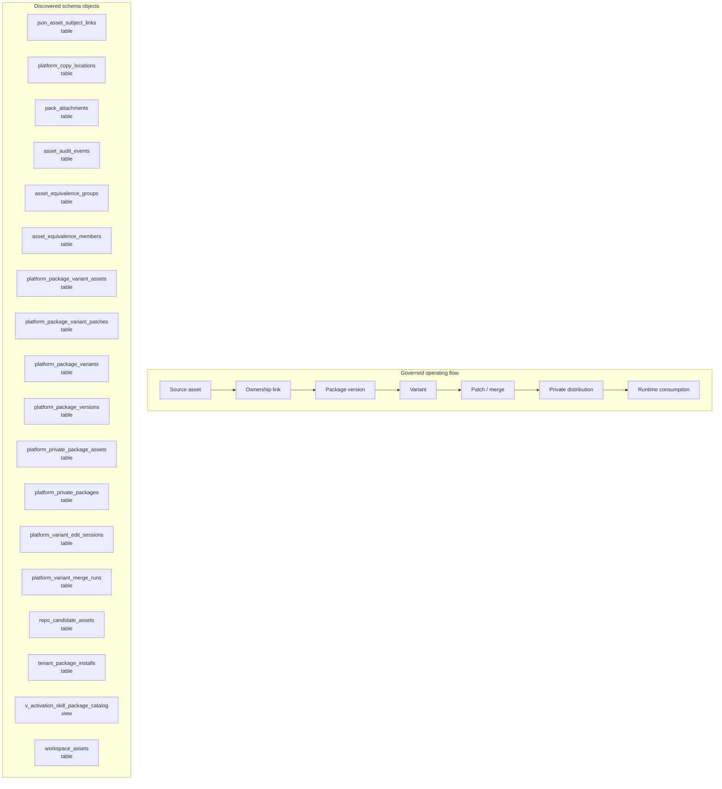

# Asset, Package, and Variant Map

> Generated text documentation. Do not edit this file manually.
> Source hash: `2adfa1120990e4e522ed0b9d749ebf9461d2026730d8fd66140dc3b37e658822`
> Source count: **10**
> Sources: `http-generic-api/migrations/009_sprint05_logic_graph.sql`, `http-generic-api/migrations/016_sprint20_agent_registry.sql`, `http-generic-api/migrations/080_sprint61_backup_copy_governance.sql`, `http-generic-api/migrations/103_sprint62n_json_asset_subject_links.sql`, `http-generic-api/migrations/104_sprint62o_json_asset_subject_links_fk.sql`, `http-generic-api/migrations/179_sprint66_dynamic_capability_audit_foundation.sql`, `http-generic-api/migrations/189_sprint66_platform_private_capability_vault.sql`, `http-generic-api/migrations/193_sprint67_workspace_resource_authority_foundation.sql`, `http-generic-api/migrations/251_sprint68_dynamic_memory_scope_types.sql`, `http-generic-api/migrations/273_sprint68_activation_catalog_authorized_surfaces.sql`
> Rendering: Mermaid plus Markdown tables; no image assets or raw database rows are generated.

## Discovered object inventory

| Object | Type | Domain | Source migrations | Columns | References |
|---|---|---|---:|---:|---|
| `asset_audit_events` | table | Assets & packages | 1 | 9 | - |
| `asset_equivalence_groups` | table | Assets & packages | 1 | - | - |
| `asset_equivalence_members` | table | Assets & packages | 1 | - | - |
| `json_asset_subject_links` | table | Assets & packages | 3 | 15 | `tenants`, `users` |
| `pack_attachments` | table | Assets & packages | 2 | 8 | - |
| `platform_copy_locations` | table | Assets & packages | 1 | 22 | `tenants`, `users` |
| `platform_package_variant_assets` | table | Assets & packages | 1 | - | - |
| `platform_package_variant_patches` | table | Assets & packages | 1 | - | - |
| `platform_package_variants` | table | Assets & packages | 1 | - | - |
| `platform_package_versions` | table | Assets & packages | 1 | - | - |
| `platform_private_package_assets` | table | Assets & packages | 1 | - | - |
| `platform_private_packages` | table | Assets & packages | 1 | - | - |
| `platform_variant_edit_sessions` | table | Assets & packages | 1 | - | - |
| `platform_variant_merge_runs` | table | Assets & packages | 1 | - | - |
| `repo_candidate_assets` | table | Assets & packages | 1 | - | - |
| `tenant_package_installs` | table | Assets & packages | 1 | - | - |
| `workspace_assets` | table | Assets & packages | 1 | - | - |
| `v_activation_skill_package_catalog` | view | Activation & onboarding | 1 | - | - |

## Coverage counters

- Matching schema objects: **18**
- Diagram objects shown: **18**
- Source migrations: **10**
