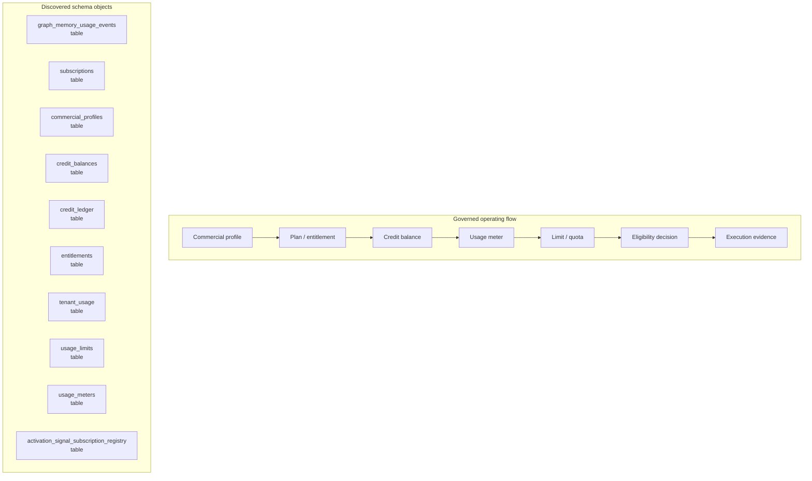

# Commercial, Credit, Entitlement, and Usage Map

> Generated text documentation. Do not edit this file manually.
> Source hash: `65a991a79cefc7ba26731a681bf7bddfce8a704f2f267dae97d73e20d661faaf`
> Source count: **5**
> Sources: `http-generic-api/migrations/002_sprint03_identity.sql`, `http-generic-api/migrations/011_sprint15_observability.sql`, `http-generic-api/migrations/029_sprint32_tenant_commercials.sql`, `http-generic-api/migrations/109_sprint62t_activation_graph_docs_telemetry.sql`, `http-generic-api/migrations/20260611_activation_operational_intelligence.sql`
> Rendering: Mermaid plus Markdown tables; no image assets or raw database rows are generated.

## Discovered object inventory

| Object | Type | Domain | Source migrations | Columns | References |
|---|---|---|---:|---:|---|
| `activation_signal_subscription_registry` | table | Activation & onboarding | 1 | - | - |
| `commercial_profiles` | table | Commercial & usage | 1 | 16 | `tenants` |
| `credit_balances` | table | Commercial & usage | 1 | 10 | `tenants` |
| `credit_ledger` | table | Commercial & usage | 1 | 11 | `tenants` |
| `entitlements` | table | Commercial & usage | 1 | 8 | `tenants` |
| `graph_memory_usage_events` | table | Commercial & usage | 1 | 18 | `tenants`, `users` |
| `subscriptions` | table | Commercial & usage | 1 | 9 | `plans`, `tenants` |
| `tenant_usage` | table | Commercial & usage | 1 | 12 | `tenants` |
| `usage_limits` | table | Commercial & usage | 1 | 11 | `tenants` |
| `usage_meters` | table | Commercial & usage | 1 | 11 | `tenants` |

## Coverage counters

- Matching schema objects: **10**
- Diagram objects shown: **10**
- Source migrations: **5**
