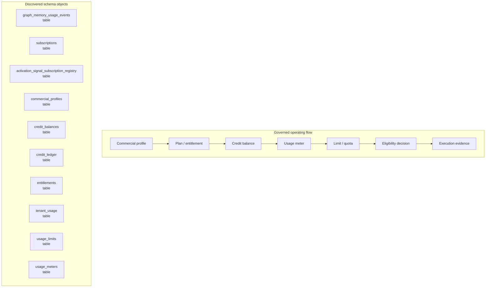

# Commercial, Credit, Entitlement, and Usage Map

> Generated text documentation. Do not edit this file manually.
> Source hash: `1ceb3f737bb836129f34442483c267588838f9496736be5ca9c12c72b4d91cb6`
> Source count: **6**
> Sources: `http-generic-api/migrations/002_sprint03_identity.sql`, `http-generic-api/migrations/011_sprint15_observability.sql`, `http-generic-api/migrations/029_sprint32_tenant_commercials.sql`, `http-generic-api/migrations/109_sprint62t_activation_graph_docs_telemetry.sql`, `http-generic-api/migrations/20260611_activation_operational_intelligence.sql`, `http-generic-api/migrations/20261003_staging_activation_registry_schema_reconciliation.sql`
> Rendering: Mermaid plus Markdown tables; no image assets or raw database rows are generated.

```mermaid
flowchart TD
  subgraph OperatingFlow["Governed operating flow"]
  c_0["Commercial profile"]
  c_1["Plan / entitlement"]
  c_2["Credit balance"]
  c_3["Usage meter"]
  c_4["Limit / quota"]
  c_5["Eligibility decision"]
  c_6["Execution evidence"]
  c_0 --> c_1
  c_1 --> c_2
  c_2 --> c_3
  c_3 --> c_4
  c_4 --> c_5
  c_5 --> c_6
  end
  subgraph DiscoveredSchema["Discovered schema objects"]
  n_graph_memory_usage_events["graph_memory_usage_events<br/>table"]
  n_subscriptions["subscriptions<br/>table"]
  n_activation_signal_subscription_registry["activation_signal_subscription_registry<br/>table"]
  n_commercial_profiles["commercial_profiles<br/>table"]
  n_credit_balances["credit_balances<br/>table"]
  n_credit_ledger["credit_ledger<br/>table"]
  n_entitlements["entitlements<br/>table"]
  n_tenant_usage["tenant_usage<br/>table"]
  n_usage_limits["usage_limits<br/>table"]
  n_usage_meters["usage_meters<br/>table"]

  end
```

## Discovered object inventory

| Object | Type | Domain | Classification | Existing map refs | Source migrations | Columns | References |
|---|---|---|---|---|---:|---:|---|
| `activation_signal_subscription_registry` | table | Activation & onboarding | generated_domain_rule | - | 2 | - | - |
| `commercial_profiles` | table | Commercial & usage | generated_domain_rule | - | 1 | 16 | `tenants` |
| `credit_balances` | table | Commercial & usage | generated_domain_rule | - | 1 | 10 | `tenants` |
| `credit_ledger` | table | Commercial & usage | generated_domain_rule | - | 1 | 11 | `tenants` |
| `entitlements` | table | Commercial & usage | generated_domain_rule | - | 1 | 8 | `tenants` |
| `graph_memory_usage_events` | table | Commercial & usage | generated_domain_rule | - | 1 | 18 | `tenants`, `users` |
| `subscriptions` | table | Commercial & usage | generated_domain_rule | - | 1 | 9 | `plans`, `tenants` |
| `tenant_usage` | table | Commercial & usage | generated_domain_rule | - | 1 | 12 | `tenants` |
| `usage_limits` | table | Commercial & usage | generated_domain_rule | - | 1 | 11 | `tenants` |
| `usage_meters` | table | Commercial & usage | generated_domain_rule | - | 1 | 11 | `tenants` |

## Coverage counters

- Matching schema objects: **10**
- Diagram objects shown: **10**
- Source migrations: **6**
