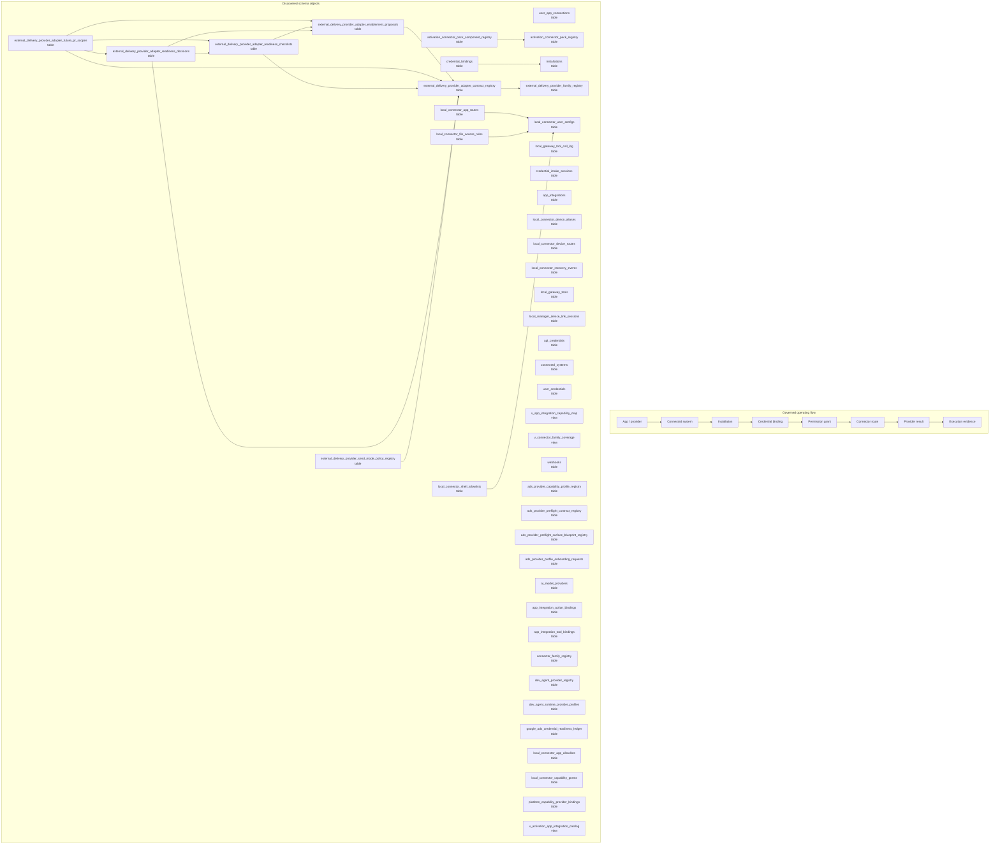

# Connector, Provider, and Connected App Map

> Generated text documentation. Do not edit this file manually.
> Source hash: `ea3b45c4fb3f801567cd713f45f29a4520013099975f77586267a66d691fedb4`
> Source count: **53**
> Sources: `http-generic-api/migrations/005_sprint07_connected_systems.sql`, `http-generic-api/migrations/013_sprint17_developer_api.sql`, `http-generic-api/migrations/015_sprint19_auth_credentials.sql`, `http-generic-api/migrations/017_sprint21_output_sink_router.sql`, `http-generic-api/migrations/020_sprint25_user_app_integrations.sql`, `http-generic-api/migrations/030_sprint33_local_connector_tables.sql`, `http-generic-api/migrations/032_sprint35_local_connector_seed.sql`, `http-generic-api/migrations/033_sprint36_tunnel_provisioning.sql`, `http-generic-api/migrations/037_sprint41_n8n_local_app_routes.sql`, `http-generic-api/migrations/057_sprint53_credential_binding_bridge.sql`, _... +43 more_
> Rendering: Mermaid plus Markdown tables; no image assets or raw database rows are generated.

## Discovered object inventory

| Object | Type | Domain | Source migrations | Columns | References |
|---|---|---|---:|---:|---|
| `activation_connector_pack_component_registry` | table | Activation & onboarding | 1 | - | `activation_connector_pack_registry` |
| `activation_connector_pack_registry` | table | Activation & onboarding | 1 | - | - |
| `ads_provider_capability_profile_registry` | table | Platform resources & graph | 1 | - | - |
| `ads_provider_preflight_contract_registry` | table | Connectors & providers | 1 | - | - |
| `ads_provider_preflight_surface_blueprint_registry` | table | Connectors & providers | 1 | - | - |
| `ads_provider_profile_onboarding_requests` | table | Activation & onboarding | 1 | - | - |
| `ai_model_providers` | table | Agents & intelligence | 1 | - | - |
| `api_credentials` | table | Connectors & providers | 1 | 12 | `tenants` |
| `app_integration_action_bindings` | table | Connectors & providers | 1 | 11 | - |
| `app_integration_tool_bindings` | table | Connectors & providers | 1 | 12 | - |
| `app_integrations` | table | Connectors & providers | 4 | 16 | - |
| `connected_systems` | table | Connectors & providers | 1 | 17 | `tenants` |
| `connector_family_registry` | table | Connectors & providers | 1 | 14 | - |
| `credential_bindings` | table | Connectors & providers | 2 | 20 | `installations`, `tenants`, `users` |
| `credential_intake_sessions` | table | Connectors & providers | 3 | 21 | `tenants`, `users` |
| `dev_agent_provider_registry` | table | Agents & intelligence | 1 | - | - |
| `dev_agent_runtime_provider_profiles` | table | Agents & intelligence | 1 | - | - |
| `external_delivery_provider_adapter_contract_registry` | table | Delivery & support | 1 | 20 | `external_delivery_provider_family_registry` |
| `external_delivery_provider_adapter_enablement_proposals` | table | Repository & development | 1 | 17 | `external_delivery_provider_adapter_contract_registry` |
| `external_delivery_provider_adapter_future_pr_scopes` | table | Delivery & support | 1 | 19 | `external_delivery_provider_adapter_contract_registry`, `external_delivery_provider_adapter_enablement_proposals`, `external_delivery_provider_adapter_readiness_checklists`, `external_delivery_provider_adapter_readiness_decisions` |
| `external_delivery_provider_adapter_readiness_checklists` | table | Delivery & support | 1 | 12 | `external_delivery_provider_adapter_contract_registry`, `external_delivery_provider_adapter_enablement_proposals` |
| `external_delivery_provider_adapter_readiness_decisions` | table | Platform resources & graph | 1 | 18 | `external_delivery_provider_adapter_contract_registry`, `external_delivery_provider_adapter_enablement_proposals`, `external_delivery_provider_adapter_readiness_checklists` |
| `external_delivery_provider_family_registry` | table | Delivery & support | 1 | 12 | - |
| `external_delivery_provider_send_mode_policy_registry` | table | Delivery & support | 1 | 14 | `external_delivery_provider_adapter_contract_registry` |
| `google_ads_credential_readiness_ledger` | table | Connectors & providers | 1 | - | - |
| `installations` | table | Connectors & providers | 1 | 10 | `tenants` |
| `local_connector_app_allowlists` | table | Connectors & providers | 1 | 15 | - |
| `local_connector_app_routes` | table | Workflow & tasks | 1 | 12 | `local_connector_user_configs` |
| `local_connector_capability_grants` | table | Platform resources & graph | 1 | 10 | - |
| `local_connector_device_aliases` | table | Connectors & providers | 1 | 10 | `tenants`, `users` |
| `local_connector_device_routes` | table | Workflow & tasks | 1 | 25 | `tenants`, `users` |
| `local_connector_file_access_rules` | table | Connectors & providers | 2 | 8 | `local_connector_user_configs` |
| `local_connector_recovery_events` | table | Migration & lifecycle | 1 | 15 | `tenants`, `users` |
| `local_connector_shell_allowlists` | table | Connectors & providers | 3 | 9 | `local_connector_user_configs` |
| `local_connector_user_configs` | table | Tenancy & identity | 7 | 10 | `tenants`, `users` |
| `local_gateway_tool_call_log` | table | Connectors & providers | 4 | 26 | `tenants`, `users` |
| `local_gateway_tools` | table | Connectors & providers | 3 | 26 | - |
| `local_manager_device_link_sessions` | table | Connectors & providers | 1 | 17 | `tenants`, `users` |
| `platform_capability_provider_bindings` | table | Platform resources & graph | 1 | 16 | - |
| `user_app_connections` | table | Tenancy & identity | 8 | 19 | `tenants`, `users` |
| `user_credentials` | table | Tenancy & identity | 1 | 6 | `users` |
| `webhook_deliveries` | table | Connectors & providers | 1 | - | - |
| `webhooks` | table | Connectors & providers | 1 | 11 | `tenants` |
| `v_activation_app_integration_catalog` | view | Activation & onboarding | 1 | - | - |
| `v_activation_local_gateway_tool_catalog` | view | Activation & onboarding | 1 | - | - |
| `v_app_integration_capability_map` | view | Platform resources & graph | 2 | - | - |
| `v_app_integration_tool_map` | view | Connectors & providers | 1 | - | - |
| `v_connector_family_coverage` | view | Connectors & providers | 2 | - | - |
| `v_database_lifecycle_credential_review` | view | Migration & lifecycle | 1 | - | - |
| `v_external_delivery_provider_adapter_future_pr_scope_summary` | view | Delivery & support | 1 | - | - |
| `v_external_delivery_provider_adapter_readiness_checklist_summary` | view | Delivery & support | 1 | - | - |
| `v_external_delivery_provider_adapter_readiness_decision_summary` | view | Platform resources & graph | 1 | - | - |
| `v_external_delivery_provider_contract_readiness` | view | Delivery & support | 1 | - | - |
| `v_external_delivery_provider_enablement_proposal_readiness` | view | Repository & development | 1 | - | - |
| `v_hostinger_apply_policy_readiness` | view | Connectors & providers | 1 | - | - |
| `v_hostinger_apply_policy_safe_field_readiness` | view | Connectors & providers | 1 | - | - |
| `v_hostinger_recovery_option_readiness` | view | Migration & lifecycle | 1 | - | - |

## Coverage counters

- Matching schema objects: **57**
- Diagram objects shown: **45**
- Source migrations: **53**
