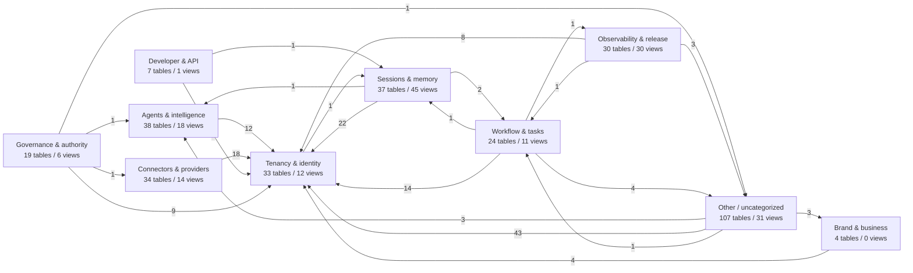

# Platform Data Model Domain Map

> Generated text documentation. Do not edit this file manually.
> Source hash: `7bcd28d8a3c3802ded987594dfbe961c5a03b181522d38abc413ed10ed8fb55f`
> Source count: **504**
> Sources: `http-generic-api/migrations/001_sprint02_tenancy.sql`, `http-generic-api/migrations/002_sprint03_identity.sql`, `http-generic-api/migrations/003_sprint06_access.sql`, `http-generic-api/migrations/004_sprint04_customer_ops.sql`, `http-generic-api/migrations/005_sprint07_connected_systems.sql`, `http-generic-api/migrations/006_sprint08_planner.sql`, `http-generic-api/migrations/007_sprint10_tracking.sql`, `http-generic-api/migrations/008_sprint12_bootstrap.sql`, `http-generic-api/migrations/009_sprint05_logic_graph.sql`, `http-generic-api/migrations/010_sprint14_workflow_orchestration.sql`, _... +494 more_
> Rendering: Mermaid code blocks plus Markdown tables; no image assets or raw database rows are generated.

## Domain summary

| Domain | Tables | Views | Sample objects |
|---|---:|---:|---|
| Agents & intelligence | 38 | 18 | `agent_chain_events`, `agent_delegations`, `agent_logic_pack_bindings`, `agent_model_runs`, `agent_skill_grants`, `agent_skills`, `agent_supervision_policy`, `agent_tool_bindings`, `agent_tool_calls`, `agent_tool_index`, `agent_workflow_bindings`, `agents`, ... |
| Brand & business | 4 | 0 | `brand_site_bindings`, `contacts`, `customer_sessions`, `customers` |
| Connectors & providers | 34 | 14 | `activation_connector_pack_component_registry`, `activation_connector_pack_registry`, `ads_provider_capability_profile_registry`, `ads_provider_preflight_contract_registry`, `ads_provider_preflight_surface_blueprint_registry`, `ads_provider_profile_onboarding_requests`, `api_credentials`, `app_integration_action_bindings`, `app_integration_tool_bindings`, `app_integrations`, `connected_systems`, `connector_family_registry`, ... |
| Developer & API | 7 | 1 | `admin_platform_endpoint_tools`, `developer_apps`, `endpoints`, `governed_tool_response_chunks`, `offsite_drive_upload_records`, `system_layer_tool_descriptor_source_registry`, `uploads`, `v_gpt_schema_db_coverage_issues` |
| Governance & authority | 19 | 6 | `activation_freshness_policy_registry`, `admin_scope_grants`, `app_action_grants`, `browser_runtime_policy`, `budget_quota_authority_registry`, `capability_apply_authorization_policy_registry`, `cms_site_access_grants`, `compliance_profiles`, `database_collation_policy_exception_registry`, `database_collation_policy_registry`, `google_ads_budget_execution_gate_audit`, `google_ads_budget_preflight_ledger`, ... |
| Observability & release | 30 | 30 | `asset_audit_events`, `audit_log`, `audit_payload_evidence`, `connected_execution_evidence_reports`, `database_lifecycle_report_snapshot_scheduler_bindings`, `database_lifecycle_report_snapshot_schedules`, `database_lifecycle_report_snapshots`, `db_change_audit_events`, `execution_log`, `incidents`, `local_app_releases`, `platform_audit_event_bus`, ... |
| Other / uncategorized | 107 | 31 | `actions`, `activation_attention_rule_registry`, `activation_authorized_surface_registry`, `activation_callback_registry`, `activation_container_relationship_type_registry`, `activation_container_relationships`, `activation_dynamic_tab_discovery_rule_registry`, `activation_dynamic_tab_registry`, `activation_dynamic_tab_section_registry`, `activation_freshness_ledger`, `activation_guidance_invocation_registry`, `activation_operational_tile_registry`, ... |
| Sessions & memory | 37 | 45 | `browser_runtime_sessions`, `connected_execution_sessions`, `gpt_session_conversation_refs`, `gpt_session_turns`, `graph_memory_usage_events`, `memory_scope_links`, `memory_scope_type_registry`, `offsite_drive_upload_sessions`, `platform_graph_memory_rank_rules`, `platform_variant_edit_sessions`, `request_envelopes`, `session_assimilation_queue`, ... |
| Tenancy & identity | 33 | 12 | `activation_signal_subscription_registry`, `activation_user_dashboard_preferences`, `actor_profiles`, `assistance_roles`, `entitlements`, `execution_plans`, `invitations`, `local_connector_user_configs`, `memberships`, `plans`, `repository_advisory_comment_plans`, `role_assignments`, ... |
| Workflow & tasks | 24 | 11 | `activation_auth_source_router`, `approval_holds`, `browser_data_extraction_jobs`, `database_lifecycle_scheduler_approval_events`, `local_connector_app_routes`, `local_connector_device_routes`, `platform_backup_approvals`, `platform_orchestration_edges`, `platform_orchestration_recommendations`, `platform_orchestration_stages`, `platform_orchestration_state_snapshots`, `platform_pending_tasks`, ... |

## Full schema inventory

| Object | Type | Domain | Source migrations | Columns discovered | References |
|---|---|---|---:|---:|---|
| `actions` | table | Other / uncategorized | 1 | - | - |
| `activation_attention_rule_registry` | table | Other / uncategorized | 1 | - | - |
| `activation_auth_source_router` | table | Workflow & tasks | 1 | - | - |
| `activation_authorized_surface_registry` | table | Other / uncategorized | 1 | 20 | - |
| `activation_callback_registry` | table | Other / uncategorized | 1 | - | `activation_operational_tile_registry` |
| `activation_connector_pack_component_registry` | table | Connectors & providers | 1 | - | `activation_connector_pack_registry` |
| `activation_connector_pack_registry` | table | Connectors & providers | 1 | - | - |
| `activation_container_relationship_type_registry` | table | Other / uncategorized | 1 | - | - |
| `activation_container_relationships` | table | Other / uncategorized | 1 | - | - |
| `activation_dynamic_tab_discovery_rule_registry` | table | Other / uncategorized | 1 | - | `activation_dynamic_tab_registry` |
| `activation_dynamic_tab_registry` | table | Other / uncategorized | 1 | - | - |
| `activation_dynamic_tab_section_registry` | table | Other / uncategorized | 1 | - | `activation_dynamic_tab_registry` |
| `activation_freshness_ledger` | table | Other / uncategorized | 1 | - | - |
| `activation_freshness_policy_registry` | table | Governance & authority | 1 | - | - |
| `activation_guidance_invocation_registry` | table | Other / uncategorized | 1 | - | - |
| `activation_operational_tile_registry` | table | Other / uncategorized | 1 | - | - |
| `activation_section_action_registry` | table | Other / uncategorized | 1 | - | - |
| `activation_signal_inbox` | table | Other / uncategorized | 1 | - | - |
| `activation_signal_processing_log` | table | Other / uncategorized | 1 | - | - |
| `activation_signal_subscription_registry` | table | Tenancy & identity | 1 | - | - |
| `activation_user_dashboard_preferences` | table | Tenancy & identity | 1 | - | - |
| `actor_profiles` | table | Tenancy & identity | 1 | 8 | `tenants`, `users` |
| `adaptation_records` | table | Other / uncategorized | 2 | 12 | `tenants` |
| `admin_platform_endpoint_tools` | table | Developer & API | 8 | 13 | - |
| `admin_scope_grants` | table | Governance & authority | 1 | 17 | `tenants`, `users` |
| `ads_provider_capability_profile_registry` | table | Connectors & providers | 1 | - | - |
| `ads_provider_preflight_contract_registry` | table | Connectors & providers | 1 | - | - |
| `ads_provider_preflight_surface_blueprint_registry` | table | Connectors & providers | 1 | - | - |
| `ads_provider_profile_onboarding_requests` | table | Connectors & providers | 1 | - | - |
| `agent_chain_events` | table | Agents & intelligence | 1 | 12 | `tenants` |
| `agent_delegations` | table | Agents & intelligence | 1 | 13 | `agents`, `plans`, `tenants`, `users` |
| `agent_logic_pack_bindings` | table | Agents & intelligence | 1 | 5 | `agents` |
| `agent_model_runs` | table | Agents & intelligence | 1 | - | - |
| `agent_skill_grants` | table | Agents & intelligence | 1 | 10 | `agents`, `tenants` |
| `agent_skills` | table | Agents & intelligence | 1 | 11 | - |
| `agent_supervision_policy` | table | Agents & intelligence | 1 | 6 | `agents`, `tenants` |
| `agent_tool_bindings` | table | Agents & intelligence | 1 | 5 | `agents` |
| `agent_tool_calls` | table | Agents & intelligence | 1 | - | - |
| `agent_tool_index` | table | Agents & intelligence | 1 | - | - |
| `agent_workflow_bindings` | table | Agents & intelligence | 1 | 5 | `agents` |
| `agents` | table | Agents & intelligence | 1 | 16 | - |
| `ai_model_providers` | table | Agents & intelligence | 1 | - | - |
| `ai_model_registry` | table | Agents & intelligence | 1 | - | - |
| `api_credentials` | table | Connectors & providers | 1 | 12 | `tenants` |
| `app_action_grants` | table | Governance & authority | 2 | 12 | `agents` |
| `app_action_requests` | table | Other / uncategorized | 2 | 15 | `agents` |
| `app_integration_action_bindings` | table | Connectors & providers | 1 | 11 | - |
| `app_integration_tool_bindings` | table | Connectors & providers | 1 | 12 | - |
| `app_integrations` | table | Connectors & providers | 4 | 16 | - |
| `approval_holds` | table | Workflow & tasks | 2 | 15 | `step_runs`, `tenants` |
| `asset_audit_events` | table | Observability & release | 1 | 9 | - |
| `asset_equivalence_groups` | table | Other / uncategorized | 1 | - | - |
| `asset_equivalence_members` | table | Other / uncategorized | 1 | - | - |
| `assistance_roles` | table | Tenancy & identity | 1 | 8 | - |
| `audit_log` | table | Observability & release | 2 | 14 | `tenants` |
| `audit_payload_evidence` | table | Observability & release | 1 | 19 | `tenants` |
| `auth_email_outbox` | table | Other / uncategorized | 1 | 14 | - |
| `auth_password_reset_tokens` | table | Other / uncategorized | 1 | 11 | `users` |
| `brand_site_bindings` | table | Brand & business | 1 | - | - |
| `browser_data_extraction_jobs` | table | Workflow & tasks | 1 | 13 | `tenants`, `users` |
| `browser_runtime_artifacts` | table | Other / uncategorized | 1 | 9 | - |
| `browser_runtime_bindings` | table | Other / uncategorized | 1 | 12 | `browser_runtime_registry`, `tenants`, `users` |
| `browser_runtime_capabilities` | table | Other / uncategorized | 1 | 9 | `browser_runtime_registry` |
| `browser_runtime_events` | table | Other / uncategorized | 1 | 12 | `tenants`, `users` |
| `browser_runtime_policy` | table | Governance & authority | 1 | 10 | `tenants` |
| `browser_runtime_registry` | table | Other / uncategorized | 1 | 13 | - |
| `browser_runtime_sessions` | table | Sessions & memory | 1 | 11 | `tenants`, `users` |
| `browser_site_inspection_runs` | table | Other / uncategorized | 1 | 12 | `tenants`, `users` |
| `budget_quota_authority_registry` | table | Governance & authority | 1 | - | - |
| `capability_apply_authorization_policy_registry` | table | Governance & authority | 1 | 21 | - |
| `capability_resolution_envelope_ledger` | table | Other / uncategorized | 1 | - | - |
| `checkpoint_auto_rollups` | table | Other / uncategorized | 1 | 9 | - |
| `cms_account_claims` | table | Other / uncategorized | 1 | - | - |
| `cms_site_access_grants` | table | Governance & authority | 3 | - | - |
| `cms_sites` | table | Other / uncategorized | 2 | - | - |
| `commercial_profiles` | table | Other / uncategorized | 1 | 16 | `tenants` |
| `compliance_profiles` | table | Governance & authority | 1 | 8 | `tenants` |
| `connected_execution_evidence_reports` | table | Observability & release | 1 | 20 | `plans`, `step_runs`, `tenants`, `users` |
| `connected_execution_resume_actions` | table | Other / uncategorized | 1 | 19 | `tenants`, `users` |
| `connected_execution_sessions` | table | Sessions & memory | 1 | 24 | `tenants`, `users` |
| `connected_systems` | table | Connectors & providers | 1 | 17 | `tenants` |
| `connector_family_registry` | table | Connectors & providers | 1 | 14 | - |
| `contacts` | table | Brand & business | 1 | 11 | `customers`, `tenants` |
| `credential_bindings` | table | Connectors & providers | 2 | 20 | `installations`, `tenants`, `users` |
| `credential_intake_sessions` | table | Connectors & providers | 3 | 21 | `tenants`, `users` |
| `credit_balances` | table | Other / uncategorized | 1 | 10 | `tenants` |
| `credit_ledger` | table | Other / uncategorized | 1 | 11 | `tenants` |
| `customer_sessions` | table | Brand & business | 5 | 22 | `tenants`, `users` |
| `customers` | table | Brand & business | 2 | 11 | `tenants` |
| `data_migration_inventory` | table | Other / uncategorized | 1 | 11 | - |
| `database_collation_policy_exception_registry` | table | Governance & authority | 1 | - | - |
| `database_collation_policy_registry` | table | Governance & authority | 1 | - | - |
| `database_lifecycle_report_snapshot_scheduler_bindings` | table | Observability & release | 1 | - | - |
| `database_lifecycle_report_snapshot_schedules` | table | Observability & release | 1 | - | - |
| `database_lifecycle_report_snapshots` | table | Observability & release | 1 | - | - |
| `database_lifecycle_scheduler_approval_events` | table | Workflow & tasks | 1 | - | - |
| `database_table_lifecycle_registry` | table | Other / uncategorized | 1 | - | - |
| `db_change_audit_events` | table | Observability & release | 1 | 9 | - |
| `decision_runs` | table | Other / uncategorized | 1 | - | - |
| `dev_agent_proposals` | table | Agents & intelligence | 1 | 19 | `tenants` |
| `dev_agent_provider_registry` | table | Agents & intelligence | 1 | - | - |
| `dev_agent_runs` | table | Agents & intelligence | 1 | 10 | - |
| `dev_agent_runtime_provider_profiles` | table | Agents & intelligence | 1 | - | - |
| `dev_agent_runtime_registry` | table | Agents & intelligence | 1 | - | - |
| `developer_apps` | table | Developer & API | 1 | 10 | `tenants` |
| `endpoints` | table | Developer & API | 1 | - | - |
| `entitlements` | table | Tenancy & identity | 1 | 8 | `tenants` |
| `execution_enablement_registry` | table | Other / uncategorized | 1 | - | - |
| `execution_enablement_requests` | table | Other / uncategorized | 1 | - | - |
| `execution_log` | table | Observability & release | 3 | - | - |
| `execution_plans` | table | Tenancy & identity | 4 | 18 | `plans`, `tenants`, `users` |
| `external_delivery_provider_adapter_contract_registry` | table | Connectors & providers | 1 | 20 | `external_delivery_provider_family_registry` |
| `external_delivery_provider_adapter_enablement_proposals` | table | Connectors & providers | 1 | 17 | `external_delivery_provider_adapter_contract_registry` |
| `external_delivery_provider_adapter_future_pr_scopes` | table | Connectors & providers | 1 | 19 | `external_delivery_provider_adapter_contract_registry`, `external_delivery_provider_adapter_enablement_proposals`, `external_delivery_provider_adapter_readiness_checklists`, `external_delivery_provider_adapter_readiness_decisions` |
| `external_delivery_provider_adapter_readiness_checklists` | table | Connectors & providers | 1 | 12 | `external_delivery_provider_adapter_contract_registry`, `external_delivery_provider_adapter_enablement_proposals` |
| `external_delivery_provider_adapter_readiness_decisions` | table | Connectors & providers | 1 | 18 | `external_delivery_provider_adapter_contract_registry`, `external_delivery_provider_adapter_enablement_proposals`, `external_delivery_provider_adapter_readiness_checklists` |
| `external_delivery_provider_family_registry` | table | Connectors & providers | 1 | 12 | - |
| `external_delivery_provider_send_mode_policy_registry` | table | Connectors & providers | 1 | 14 | `external_delivery_provider_adapter_contract_registry` |
| `external_delivery_recipient_allowlist_registry` | table | Other / uncategorized | 1 | 13 | `approval_holds`, `tenants` |
| `google_ads_budget_execution_gate_audit` | table | Governance & authority | 1 | - | - |
| `google_ads_budget_preflight_ledger` | table | Governance & authority | 1 | - | - |
| `google_ads_credential_readiness_ledger` | table | Connectors & providers | 1 | - | - |
| `governed_migration_authorization_registry` | table | Other / uncategorized | 1 | - | - |
| `governed_migration_ledger` | table | Other / uncategorized | 1 | 16 | - |
| `governed_tool_response_chunks` | table | Developer & API | 1 | - | - |
| `gpt_session_conversation_refs` | table | Sessions & memory | 2 | 19 | `tenants`, `users` |
| `gpt_session_turns` | table | Sessions & memory | 5 | 7 | - |
| `graph_memory_usage_events` | table | Sessions & memory | 1 | 18 | `tenants`, `users` |
| `incidents` | table | Observability & release | 1 | 12 | `tenants` |
| `installations` | table | Connectors & providers | 1 | 10 | `tenants` |
| `intelligence_engines` | table | Agents & intelligence | 1 | - | - |
| `intelligence_policies` | table | Other / uncategorized | 1 | - | - |
| `intelligence_policy_rules` | table | Governance & authority | 1 | - | - |
| `intent_resolutions` | table | Other / uncategorized | 3 | 13 | `tenants`, `users` |
| `invitations` | table | Tenancy & identity | 2 | 9 | `tenants` |
| `json_asset_subject_links` | table | Other / uncategorized | 3 | 15 | `tenants`, `users` |
| `local_app_releases` | table | Observability & release | 2 | 16 | - |
| `local_connector_app_allowlists` | table | Connectors & providers | 1 | 15 | - |
| `local_connector_app_routes` | table | Workflow & tasks | 1 | 12 | `local_connector_user_configs` |
| `local_connector_capability_grants` | table | Connectors & providers | 1 | 10 | - |
| `local_connector_device_aliases` | table | Connectors & providers | 1 | 10 | `tenants`, `users` |
| `local_connector_device_routes` | table | Workflow & tasks | 1 | 25 | `tenants`, `users` |
| `local_connector_file_access_rules` | table | Connectors & providers | 2 | 8 | `local_connector_user_configs` |
| `local_connector_recovery_events` | table | Connectors & providers | 1 | 15 | `tenants`, `users` |
| `local_connector_shell_allowlists` | table | Connectors & providers | 3 | 9 | `local_connector_user_configs` |
| `local_connector_user_configs` | table | Tenancy & identity | 7 | 10 | `tenants`, `users` |
| `local_gateway_tool_call_log` | table | Connectors & providers | 3 | 26 | `tenants`, `users` |
| `local_gateway_tools` | table | Connectors & providers | 3 | 26 | - |
| `local_manager_device_link_sessions` | table | Connectors & providers | 1 | 17 | `tenants`, `users` |
| `local_project_path_events` | table | Other / uncategorized | 1 | 10 | `local_project_path_registry` |
| `local_project_path_registry` | table | Other / uncategorized | 2 | 20 | `tenants`, `users` |
| `local_project_path_repair_runs` | table | Other / uncategorized | 1 | 21 | `local_project_path_registry`, `tenants`, `users` |
| `logic_definitions` | table | Agents & intelligence | 1 | 12 | `tenants` |
| `logic_packs` | table | Agents & intelligence | 1 | 11 | `tenants` |
| `memberships` | table | Tenancy & identity | 1 | 7 | `tenants`, `users` |
| `memory_scope_links` | table | Sessions & memory | 1 | 36 | `memory_scope_type_registry`, `tenants`, `users` |
| `memory_scope_type_registry` | table | Sessions & memory | 1 | 19 | - |
| `offsite_drive_upload_records` | table | Developer & API | 1 | - | `offsite_drive_upload_sessions` |
| `offsite_drive_upload_sessions` | table | Sessions & memory | 1 | - | - |
| `onboarding_escalations` | table | Other / uncategorized | 1 | 15 | `tenants`, `tickets`, `users` |
| `onboarding_states` | table | Other / uncategorized | 1 | 11 | `tenants` |
| `output_artifacts` | table | Other / uncategorized | 1 | 14 | `agents`, `tenants` |
| `pack_attachments` | table | Other / uncategorized | 2 | 8 | - |
| `permission_grants` | table | Governance & authority | 1 | 8 | `installations`, `tenants` |
| `plans` | table | Tenancy & identity | 1 | 10 | - |
| `platform_audit_event_bus` | table | Observability & release | 1 | 12 | - |
| `platform_backup_approvals` | table | Workflow & tasks | 2 | 12 | `platform_backup_policies` |
| `platform_backup_artifact_manifests` | table | Observability & release | 1 | 14 | `platform_backup_runs` |
| `platform_backup_policies` | table | Observability & release | 3 | 24 | `platform_copy_locations` |
| `platform_backup_runs` | table | Observability & release | 2 | 16 | `platform_backup_policies` |
| `platform_capability_source_resolutions` | table | Other / uncategorized | 1 | - | - |
| `platform_contract_surfaces` | table | Other / uncategorized | 1 | - | - |
| `platform_copy_locations` | table | Other / uncategorized | 1 | 22 | `tenants`, `users` |
| `platform_engine_execution_runs` | table | Agents & intelligence | 2 | - | - |
| `platform_engine_policy_registry` | table | Agents & intelligence | 1 | - | - |
| `platform_engine_policy_rules` | table | Agents & intelligence | 1 | - | - |
| `platform_engine_registry` | table | Agents & intelligence | 1 | - | - |
| `platform_engine_skill_prompt_registry` | table | Agents & intelligence | 1 | - | - |
| `platform_engine_strategy_registry` | table | Agents & intelligence | 1 | - | - |
| `platform_engine_validator_result_log` | table | Agents & intelligence | 1 | - | - |
| `platform_graph_edge_evidence` | table | Observability & release | 1 | 9 | `platform_graph_edges` |
| `platform_graph_edges` | table | Other / uncategorized | 1 | 17 | `platform_graph_nodes` |
| `platform_graph_memory_rank_rules` | table | Sessions & memory | 1 | 7 | - |
| `platform_graph_nodes` | table | Other / uncategorized | 1 | 17 | - |
| `platform_graph_projection_runs` | table | Other / uncategorized | 1 | 11 | - |
| `platform_graph_query_log` | table | Other / uncategorized | 2 | 7 | - |
| `platform_graph_taxonomy` | table | Other / uncategorized | 1 | 9 | - |
| `platform_graph_validation_runs` | table | Other / uncategorized | 1 | 11 | - |
| `platform_health_scorecard_component_registry` | table | Observability & release | 1 | - | - |
| `platform_health_scorecard_remediation_registry` | table | Observability & release | 1 | - | - |
| `platform_health_scorecard_snapshots` | table | Observability & release | 1 | - | - |
| `platform_orchestration_edges` | table | Workflow & tasks | 1 | 12 | - |
| `platform_orchestration_plugins` | table | Agents & intelligence | 1 | 17 | - |
| `platform_orchestration_recommendations` | table | Workflow & tasks | 1 | 21 | `decision_runs` |
| `platform_orchestration_stages` | table | Workflow & tasks | 1 | 17 | - |
| `platform_orchestration_state_snapshots` | table | Workflow & tasks | 1 | 22 | `decision_runs`, `tenants` |
| `platform_package_variant_assets` | table | Other / uncategorized | 1 | - | - |
| `platform_package_variant_patches` | table | Other / uncategorized | 1 | - | - |
| `platform_package_variants` | table | Other / uncategorized | 1 | - | - |
| `platform_package_versions` | table | Other / uncategorized | 1 | - | - |
| `platform_pending_tasks` | table | Workflow & tasks | 1 | - | - |
| `platform_plugin_contributions` | table | Agents & intelligence | 2 | 22 | - |
| `platform_plugin_smoke_certifications` | table | Agents & intelligence | 2 | 26 | `tenants`, `users` |
| `platform_plugin_smoke_recertification_policies` | table | Agents & intelligence | 1 | 18 | `tenants` |
| `platform_private_package_assets` | table | Other / uncategorized | 1 | - | - |
| `platform_private_packages` | table | Other / uncategorized | 1 | - | - |
| `platform_private_repo_mirrors` | table | Other / uncategorized | 1 | - | - |
| `platform_recovery_failure_taxonomy` | table | Other / uncategorized | 1 | - | - |
| `platform_resource_adapters` | table | Other / uncategorized | 1 | 16 | - |
| `platform_resource_authority_bindings` | table | Governance & authority | 1 | - | - |
| `platform_resource_authority_requirements` | table | Governance & authority | 1 | - | - |
| `platform_resource_recipe_steps` | table | Workflow & tasks | 1 | 18 | - |
| `platform_resource_recipes` | table | Other / uncategorized | 1 | 21 | - |
| `platform_resource_types` | table | Other / uncategorized | 1 | 18 | - |
| `platform_restore_tests` | table | Observability & release | 1 | 14 | `platform_backup_runs` |
| `platform_runtime_config` | table | Other / uncategorized | 1 | 6 | - |
| `platform_secrets` | table | Other / uncategorized | 1 | - | - |
| `platform_variant_edit_sessions` | table | Sessions & memory | 1 | - | - |
| `platform_variant_merge_runs` | table | Other / uncategorized | 1 | - | - |
| `policy_logic_bindings` | table | Agents & intelligence | 1 | 12 | - |
| `policy_logic_mirror_classification` | table | Agents & intelligence | 1 | - | - |
| `preflight_ledger_validator_registry` | table | Other / uncategorized | 1 | - | - |
| `proposal_discussions` | table | Other / uncategorized | 1 | 9 | `tenants`, `users` |
| `quota_rules` | table | Governance & authority | 1 | 10 | `tenants` |
| `rate_limit_rules` | table | Governance & authority | 1 | 11 | `tenants` |
| `readiness_checks` | table | Observability & release | 1 | 7 | `tenants` |
| `registry_surfaces_catalog` | table | Other / uncategorized | 2 | 20 | - |
| `release_readiness_log` | table | Observability & release | 1 | 6 | - |
| `remote_runtime_command_allowlists` | table | Other / uncategorized | 1 | - | - |
| `remote_runtime_targets` | table | Other / uncategorized | 1 | - | - |
| `repo_candidate_assets` | table | Other / uncategorized | 1 | - | - |
| `repo_capability_candidates` | table | Other / uncategorized | 1 | - | - |
| `repo_certification_runs` | table | Observability & release | 1 | - | - |
| `repo_file_audit_findings` | table | Observability & release | 1 | 9 | - |
| `repo_file_audit_runs` | table | Observability & release | 1 | 14 | - |
| `repo_ingestion_jobs` | table | Workflow & tasks | 2 | - | - |
| `repo_install_diff_items` | table | Other / uncategorized | 1 | - | - |
| `repo_install_diff_runs` | table | Other / uncategorized | 1 | - | - |
| `repo_install_requests` | table | Other / uncategorized | 1 | - | - |
| `repo_skill_candidates` | table | Agents & intelligence | 1 | - | - |
| `repo_snapshot_files` | table | Observability & release | 1 | - | - |
| `repo_snapshots` | table | Observability & release | 1 | - | - |
| `repo_source_registry` | table | Other / uncategorized | 1 | - | - |
| `reporting_views` | table | Other / uncategorized | 2 | 9 | `tenants` |
| `repository_advisory_comment_plans` | table | Tenancy & identity | 1 | - | - |
| `request_envelopes` | table | Sessions & memory | 1 | 15 | `tenants`, `users` |
| `resource_authority_route_family_registry` | table | Workflow & tasks | 1 | 16 | - |
| `role_assignments` | table | Tenancy & identity | 1 | 9 | `tenants`, `users` |
| `runtime_ci_check_classification_registry` | table | Other / uncategorized | 1 | - | - |
| `runtime_deployment_parity_status` | table | Other / uncategorized | 1 | - | - |
| `runtime_dispatch_certification_registry` | table | Observability & release | 1 | 19 | - |
| `runtime_gap_remediation_registry` | table | Other / uncategorized | 1 | - | - |
| `runtime_verification_evidence_chunks` | table | Observability & release | 1 | - | `runtime_verification_runs` |
| `runtime_verification_gaps` | table | Other / uncategorized | 1 | - | `runtime_verification_runs` |
| `runtime_verification_runs` | table | Other / uncategorized | 1 | - | - |
| `runtime_verification_steps` | table | Workflow & tasks | 1 | - | `runtime_verification_runs` |
| `runtime_verification_workflow_registry` | table | Workflow & tasks | 1 | - | - |
| `schema_import_jobs` | table | Workflow & tasks | 2 | 16 | - |
| `secret_references` | table | Other / uncategorized | 2 | 11 | `tenants` |
| `session_assimilation_queue` | table | Sessions & memory | 1 | 10 | `tenants` |
| `session_drive_artifacts` | table | Sessions & memory | 1 | 14 | - |
| `session_events` | table | Sessions & memory | 3 | 10 | `tenants` |
| `session_insight_backlog_target_items` | table | Sessions & memory | 1 | 19 | - |
| `session_insight_backlog_target_writes` | table | Sessions & memory | 1 | 33 | `session_insight_backlog_target_items`, `session_insight_capability_envelope_remaining_scope_completions` |
| `session_insight_candidates` | table | Sessions & memory | 1 | 31 | `tenants`, `users` |
| `session_insight_capability_envelope_actual_request_preflights` | table | Sessions & memory | 1 | 29 | `session_insight_capability_envelope_dispatch_dry_runs` |
| `session_insight_capability_envelope_actual_requests` | table | Sessions & memory | 1 | 34 | `session_insight_capability_envelope_actual_request_preflights`, `session_insight_capability_envelope_dispatch_dry_runs` |
| `session_insight_capability_envelope_adapter_execution_gates` | table | Sessions & memory | 1 | 29 | `session_insight_capability_envelope_dispatch_readbacks` |
| `session_insight_capability_envelope_approval_decisions` | table | Workflow & tasks | 1 | 30 | `approval_holds`, `session_insight_capability_envelope_actual_requests` |
| `session_insight_capability_envelope_dispatch_dry_runs` | table | Sessions & memory | 2 | 26 | `session_insight_capability_envelope_request_gates` |
| `session_insight_capability_envelope_dispatch_readbacks` | table | Sessions & memory | 1 | 33 | `approval_holds`, `session_insight_capability_envelope_approval_decisions` |
| `session_insight_capability_envelope_plans` | table | Tenancy & identity | 1 | 24 | `session_insight_promotion_payload_previews` |
| `session_insight_capability_envelope_remaining_scope_completions` | table | Sessions & memory | 1 | 35 | `session_insight_capability_envelope_adapter_execution_gates` |
| `session_insight_capability_envelope_request_gate_review_events` | table | Sessions & memory | 1 | 18 | `session_insight_capability_envelope_request_gates` |
| `session_insight_capability_envelope_request_gates` | table | Sessions & memory | 2 | 25 | `session_insight_capability_envelope_plans` |
| `session_insight_dispatch_dry_run_review_events` | table | Sessions & memory | 1 | 21 | `session_insight_capability_envelope_dispatch_dry_runs` |
| `session_insight_payload_preview_review_events` | table | Sessions & memory | 1 | 16 | `session_insight_promotion_payload_previews` |
| `session_insight_promotion_adapter_contracts` | table | Sessions & memory | 1 | 21 | `session_insight_promotion_target_adapters` |
| `session_insight_promotion_apply_requests` | table | Sessions & memory | 1 | 23 | `session_insight_promotion_execution_previews` |
| `session_insight_promotion_execution_previews` | table | Sessions & memory | 1 | 16 | `session_insight_promotions` |
| `session_insight_promotion_payload_previews` | table | Sessions & memory | 2 | 20 | `session_insight_promotion_apply_requests` |
| `session_insight_promotion_review_events` | table | Sessions & memory | 1 | 16 | `session_insight_promotions` |
| `session_insight_promotion_target_adapters` | table | Sessions & memory | 1 | 22 | - |
| `session_insight_promotions` | table | Sessions & memory | 1 | 38 | `session_insight_candidates`, `tenants`, `users` |
| `session_insight_target_write_readbacks` | table | Sessions & memory | 1 | 29 | `session_insight_backlog_target_writes` |
| `session_summaries` | table | Sessions & memory | 2 | 18 | `dev_agent_runs`, `tenants`, `users` |
| `session_turns` | table | Sessions & memory | 1 | 11 | `tenants` |
| `sink_dispatch_log` | table | Other / uncategorized | 2 | 10 | `agents`, `tenants` |
| `skill_manifests` | table | Agents & intelligence | 1 | - | - |
| `step_runs` | table | Workflow & tasks | 2 | 15 | `tenants` |
| `subscriptions` | table | Tenancy & identity | 1 | 9 | `plans`, `tenants` |
| `summary_comparison_runs` | table | Other / uncategorized | 2 | 24 | `tenants`, `users` |
| `summary_development_agent_approvals` | table | Agents & intelligence | 1 | - | - |
| `summary_development_automation_runs` | table | Other / uncategorized | 1 | - | - |
| `summary_development_signals` | table | Other / uncategorized | 1 | - | - |
| `system_layer_tool_descriptor_source_registry` | table | Developer & API | 1 | 10 | - |
| `telemetry_spans` | table | Observability & release | 2 | 13 | `tenants` |
| `tenant_backend_connections` | table | Tenancy & identity | 2 | 11 | `tenants` |
| `tenant_integration_policies` | table | Tenancy & identity | 1 | 13 | `tenants` |
| `tenant_package_installs` | table | Tenancy & identity | 1 | - | - |
| `tenant_platform_endpoint_tools` | table | Tenancy & identity | 2 | - | - |
| `tenant_relationships` | table | Tenancy & identity | 1 | 6 | - |
| `tenant_secrets` | table | Tenancy & identity | 1 | - | - |
| `tenant_ssh_cli_approval_requests` | table | Tenancy & identity | 1 | - | - |
| `tenant_usage` | table | Tenancy & identity | 1 | 12 | `tenants` |
| `tenants` | table | Tenancy & identity | 1 | 8 | - |
| `threads` | table | Other / uncategorized | 1 | 10 | `customers`, `tenants` |
| `ticket_lifecycle_events` | table | Other / uncategorized | 1 | 13 | `tenants`, `tickets` |
| `ticket_permission_snapshots` | table | Governance & authority | 1 | 14 | `tenants`, `tickets`, `users` |
| `ticket_resource_links` | table | Other / uncategorized | 1 | 10 | `tenants`, `tickets` |
| `ticket_workflow_links` | table | Workflow & tasks | 1 | 12 | `approval_holds`, `plans`, `tenants`, `tickets` |
| `tickets` | table | Other / uncategorized | 2 | 14 | `customers`, `tenants`, `threads` |
| `timeline_events` | table | Other / uncategorized | 1 | 12 | `customers`, `tenants`, `threads`, `tickets` |
| `tracked_events` | table | Other / uncategorized | 1 | 14 | `tenants` |
| `tracking_workspaces` | table | Tenancy & identity | 1 | 12 | `tenants` |
| `uploads` | table | Developer & API | 2 | 21 | `tenants` |
| `usage_limits` | table | Other / uncategorized | 1 | 11 | `tenants` |
| `usage_meters` | table | Other / uncategorized | 1 | 11 | `tenants` |
| `user_app_connections` | table | Tenancy & identity | 8 | 19 | `tenants`, `users` |
| `user_credentials` | table | Tenancy & identity | 1 | 6 | `users` |
| `users` | table | Tenancy & identity | 1 | 7 | - |
| `validation_repair` | table | Other / uncategorized | 2 | 14 | - |
| `webhook_deliveries` | table | Connectors & providers | 1 | - | - |
| `webhooks` | table | Connectors & providers | 1 | 11 | `tenants` |
| `workflow_runs` | table | Workflow & tasks | 3 | 16 | `plans`, `tenants`, `users` |
| `workflow_runtime_bindings` | table | Workflow & tasks | 1 | 20 | `tenants` |
| `workflows` | table | Workflow & tasks | 1 | - | - |
| `workspace_access_requests` | table | Tenancy & identity | 3 | - | - |
| `workspace_app_links` | table | Tenancy & identity | 3 | 10 | `tenants` |
| `workspace_assets` | table | Tenancy & identity | 1 | - | - |
| `workspace_registry` | table | Tenancy & identity | 2 | 12 | `tenants` |
| `workspace_resource_grants` | table | Tenancy & identity | 2 | - | - |
| `workspace_vaults` | table | Tenancy & identity | 1 | - | - |
| `connected_execution_latest_checkpoint` | view | Other / uncategorized | 1 | - | - |
| `v_activation_agent_bindings_catalog` | view | Agents & intelligence | 1 | - | - |
| `v_activation_agent_catalog` | view | Agents & intelligence | 1 | - | - |
| `v_activation_agent_skill_catalog` | view | Agents & intelligence | 1 | - | - |
| `v_activation_agent_skill_grants` | view | Agents & intelligence | 1 | - | - |
| `v_activation_agent_tool_catalog` | view | Agents & intelligence | 1 | - | - |
| `v_activation_app_action_grants` | view | Governance & authority | 1 | - | - |
| `v_activation_app_binding_catalog` | view | Other / uncategorized | 1 | - | - |
| `v_activation_app_integration_catalog` | view | Connectors & providers | 1 | - | - |
| `v_activation_authorized_surface_registry_readiness` | view | Observability & release | 1 | - | - |
| `v_activation_catalog_authorized_surface_readiness` | view | Observability & release | 1 | - | - |
| `v_activation_connected_app_connections` | view | Other / uncategorized | 1 | - | - |
| `v_activation_expanded_authorized_surface_readiness` | view | Observability & release | 1 | - | - |
| `v_activation_local_gateway_tool_catalog` | view | Connectors & providers | 1 | - | - |
| `v_activation_logic_pack_catalog` | view | Agents & intelligence | 1 | - | - |
| `v_activation_pending_tasks` | view | Workflow & tasks | 1 | - | - |
| `v_activation_platform_plugin_catalog` | view | Agents & intelligence | 1 | - | - |
| `v_activation_plugin_contributions` | view | Agents & intelligence | 1 | - | - |
| `v_activation_skill_manifest_catalog` | view | Agents & intelligence | 1 | - | - |
| `v_activation_skill_package_catalog` | view | Agents & intelligence | 1 | - | - |
| `v_activation_task_route_catalog` | view | Workflow & tasks | 1 | - | - |
| `v_activation_tenant_integration_policies` | view | Tenancy & identity | 1 | - | - |
| `v_activation_tenant_tools` | view | Tenancy & identity | 1 | - | - |
| `v_activation_workflow_catalog` | view | Workflow & tasks | 1 | - | - |
| `v_activation_workflow_runtime_bindings` | view | Workflow & tasks | 1 | - | - |
| `v_active_memberships_missing_workspace_grants` | view | Tenancy & identity | 1 | - | - |
| `v_agent_runtime_ledger_counts` | view | Agents & intelligence | 1 | - | - |
| `v_agent_runtime_ledger_quality` | view | Agents & intelligence | 1 | - | - |
| `v_agent_runtime_ledger_readiness` | view | Agents & intelligence | 1 | - | - |
| `v_app_integration_capability_map` | view | Connectors & providers | 2 | - | - |
| `v_app_integration_tool_map` | view | Connectors & providers | 1 | - | - |
| `v_approval_hold_parent_resolution` | view | Workflow & tasks | 1 | - | - |
| `v_cms_active_grant_duplicate_groups` | view | Governance & authority | 1 | - | - |
| `v_cms_grants_without_workspace_membership` | view | Tenancy & identity | 1 | - | - |
| `v_cms_publish_grants_missing_resource_grants` | view | Governance & authority | 1 | - | - |
| `v_connections_without_workspace_membership` | view | Tenancy & identity | 1 | - | - |
| `v_connector_family_coverage` | view | Connectors & providers | 2 | - | - |
| `v_core_runtime_context_dimension_coverage` | view | Other / uncategorized | 1 | - | - |
| `v_database_collation_policy_status` | view | Governance & authority | 1 | - | - |
| `v_database_collation_policy_violations` | view | Governance & authority | 1 | - | - |
| `v_database_lifecycle_backup_snapshot_review` | view | Observability & release | 1 | - | - |
| `v_database_lifecycle_credential_review` | view | Connectors & providers | 1 | - | - |
| `v_database_lifecycle_growth_hotspots` | view | Other / uncategorized | 1 | - | - |
| `v_database_lifecycle_high_risk_review` | view | Other / uncategorized | 1 | - | - |
| `v_database_lifecycle_owner_coverage` | view | Other / uncategorized | 1 | - | - |
| `v_database_lifecycle_placeholder_review` | view | Other / uncategorized | 1 | - | - |
| `v_database_lifecycle_report_snapshot_schedule_readiness` | view | Observability & release | 1 | - | - |
| `v_database_lifecycle_report_snapshot_summary` | view | Observability & release | 1 | - | - |
| `v_database_lifecycle_scheduler_binding_readiness` | view | Observability & release | 1 | - | - |
| `v_database_lifecycle_status_summary` | view | Other / uncategorized | 1 | - | - |
| `v_dynamic_audit_pipeline_counts` | view | Observability & release | 1 | - | - |
| `v_dynamic_audit_pipeline_quality` | view | Observability & release | 1 | - | - |
| `v_dynamic_audit_pipeline_readiness` | view | Observability & release | 1 | - | - |
| `v_execution_association_monitoring_summary` | view | Observability & release | 1 | - | - |
| `v_execution_log_full_context_evidence_readiness` | view | Observability & release | 1 | - | - |
| `v_execution_log_full_context_evidence_recent` | view | Observability & release | 1 | - | - |
| `v_execution_log_runtime_evidence_readiness` | view | Observability & release | 1 | - | - |
| `v_execution_log_runtime_evidence_recent` | view | Observability & release | 1 | - | - |
| `v_external_delivery_admin_overview` | view | Other / uncategorized | 1 | - | - |
| `v_external_delivery_gmail_connections` | view | Other / uncategorized | 1 | - | - |
| `v_external_delivery_provider_adapter_future_pr_scope_summary` | view | Connectors & providers | 1 | - | - |
| `v_external_delivery_provider_adapter_readiness_checklist_summary` | view | Connectors & providers | 1 | - | - |
| `v_external_delivery_provider_adapter_readiness_decision_summary` | view | Connectors & providers | 1 | - | - |
| `v_external_delivery_provider_contract_readiness` | view | Connectors & providers | 1 | - | - |
| `v_external_delivery_provider_enablement_proposal_readiness` | view | Connectors & providers | 1 | - | - |
| `v_external_delivery_recent_send_events` | view | Other / uncategorized | 1 | - | - |
| `v_external_delivery_recipient_allowlist_readiness` | view | Observability & release | 2 | - | - |
| `v_f5_f6_positive_smoke_certification_readback` | view | Observability & release | 1 | - | - |
| `v_github_file_operation_readiness_compact` | view | Observability & release | 1 | - | - |
| `v_github_file_patch_plan_runtime_readiness` | view | Tenancy & identity | 1 | - | - |
| `v_gpt_schema_db_coverage_issues` | view | Developer & API | 2 | - | - |
| `v_gpt_session_archive_monitoring` | view | Sessions & memory | 1 | - | - |
| `v_gpt_session_archive_monitoring_issues` | view | Sessions & memory | 5 | - | - |
| `v_gpt_session_archive_monitoring_summary` | view | Sessions & memory | 1 | - | - |
| `v_hostinger_apply_policy_readiness` | view | Connectors & providers | 1 | - | - |
| `v_hostinger_apply_policy_safe_field_readiness` | view | Connectors & providers | 1 | - | - |
| `v_hostinger_recovery_option_readiness` | view | Connectors & providers | 1 | - | - |
| `v_memory_scope_link_registry_issues` | view | Sessions & memory | 1 | - | - |
| `v_migration_status_compact` | view | Other / uncategorized | 1 | - | - |
| `v_platform_bindings_current` | view | Other / uncategorized | 1 | - | - |
| `v_platform_capabilities_current` | view | Other / uncategorized | 1 | - | - |
| `v_platform_capability_gaps` | view | Other / uncategorized | 1 | - | - |
| `v_platform_capability_maturity` | view | Other / uncategorized | 1 | - | - |
| `v_platform_engine_validator_latest_failures` | view | Agents & intelligence | 1 | - | - |
| `v_platform_engine_validator_result_summary` | view | Agents & intelligence | 1 | - | - |
| `v_platform_exports_current` | view | Other / uncategorized | 2 | - | - |
| `v_platform_exports_current_v2` | view | Other / uncategorized | 1 | - | - |
| `v_platform_health_scorecard` | view | Observability & release | 1 | - | - |
| `v_platform_health_scorecard_component_registry_readback` | view | Observability & release | 1 | - | - |
| `v_platform_health_scorecard_components` | view | Observability & release | 2 | - | - |
| `v_platform_health_scorecard_history` | view | Observability & release | 1 | - | - |
| `v_platform_health_scorecard_ledger_hygiene` | view | Observability & release | 1 | - | - |
| `v_platform_health_scorecard_remediation_plan` | view | Tenancy & identity | 1 | - | - |
| `v_platform_health_scorecard_tenant_rollout_readiness` | view | Tenancy & identity | 1 | - | - |
| `v_platform_orchestration_ads_governance_readiness` | view | Workflow & tasks | 1 | - | - |
| `v_platform_orchestration_external_delivery_readiness` | view | Workflow & tasks | 1 | - | - |
| `v_platform_orchestration_graph_readiness` | view | Workflow & tasks | 3 | - | - |
| `v_platform_orchestration_support_ticket_lifecycle_readiness` | view | Workflow & tasks | 1 | - | - |
| `v_platform_plugin_collation_issues` | view | Agents & intelligence | 2 | - | - |
| `v_platform_relationship_integrity_issues` | view | Other / uncategorized | 2 | - | - |
| `v_platform_relationship_integrity_score` | view | Other / uncategorized | 2 | - | - |
| `v_platform_relationship_integrity_summary` | view | Other / uncategorized | 2 | - | - |
| `v_platform_resource_capability_baseline` | view | Other / uncategorized | 1 | - | - |
| `v_platform_secret_promotion_monitoring` | view | Observability & release | 1 | - | - |
| `v_platform_secret_promotion_monitoring_issues` | view | Observability & release | 1 | - | - |
| `v_platform_secret_promotion_monitoring_summary` | view | Observability & release | 1 | - | - |
| `v_policy_logic_mirror_classification_detail` | view | Agents & intelligence | 1 | - | - |
| `v_policy_logic_mirror_classification_summary` | view | Agents & intelligence | 1 | - | - |
| `v_release_readiness_compact` | view | Observability & release | 1 | - | - |
| `v_remaining_resource_capability_completion_readiness` | view | Observability & release | 1 | - | - |
| `v_remote_runtime_target_coverage_issues` | view | Other / uncategorized | 1 | - | - |
| `v_repo_branch_hygiene_compact` | view | Other / uncategorized | 1 | - | - |
| `v_resource_recipe_certification_compact` | view | Observability & release | 1 | - | - |
| `v_resource_recipe_registry_compact` | view | Other / uncategorized | 1 | - | - |
| `v_runtime_ci_check_gate` | view | Other / uncategorized | 1 | - | - |
| `v_runtime_context_dimension_enrichment_fillable` | view | Other / uncategorized | 1 | - | - |
| `v_runtime_policy_resolver_rule_coverage` | view | Governance & authority | 1 | - | - |
| `v_runtime_production_parity` | view | Other / uncategorized | 1 | - | - |
| `v_runtime_verification_evidence_manifest` | view | Observability & release | 1 | - | - |
| `v_runtime_verification_latest` | view | Other / uncategorized | 1 | - | - |
| `v_session_insight_actual_preflight_issues` | view | Sessions & memory | 1 | - | - |
| `v_session_insight_actual_preflight_readiness` | view | Sessions & memory | 1 | - | - |
| `v_session_insight_actual_request_readiness` | view | Sessions & memory | 1 | - | - |
| `v_session_insight_adapter_apply_readiness` | view | Sessions & memory | 1 | - | - |
| `v_session_insight_adapter_apply_readiness_gate` | view | Sessions & memory | 1 | - | - |
| `v_session_insight_adapter_apply_readiness_gate_issues` | view | Sessions & memory | 1 | - | - |
| `v_session_insight_adapter_contract_issues` | view | Sessions & memory | 1 | - | - |
| `v_session_insight_adapter_execution_readiness` | view | Sessions & memory | 1 | - | - |
| `v_session_insight_adapter_gate_issues` | view | Sessions & memory | 1 | - | - |
| `v_session_insight_apply_request_adapter_readiness` | view | Sessions & memory | 1 | - | - |
| `v_session_insight_apply_request_contract_readiness` | view | Sessions & memory | 1 | - | - |
| `v_session_insight_backlog_target_write_issues` | view | Sessions & memory | 1 | - | - |
| `v_session_insight_backlog_target_write_readiness` | view | Sessions & memory | 1 | - | - |
| `v_session_insight_candidate_issues` | view | Sessions & memory | 1 | - | - |
| `v_session_insight_capability_envelope_actual_request_issues` | view | Sessions & memory | 1 | - | - |
| `v_session_insight_capability_envelope_approval_decision_issues` | view | Workflow & tasks | 1 | - | - |
| `v_session_insight_capability_envelope_approval_readiness` | view | Workflow & tasks | 1 | - | - |
| `v_session_insight_capability_envelope_dispatch_dry_run_issues` | view | Sessions & memory | 1 | - | - |
| `v_session_insight_capability_envelope_dispatch_dry_run_readiness` | view | Sessions & memory | 1 | - | - |
| `v_session_insight_capability_envelope_dispatch_readback_issues` | view | Sessions & memory | 1 | - | - |
| `v_session_insight_capability_envelope_plan_issues` | view | Tenancy & identity | 1 | - | - |
| `v_session_insight_capability_envelope_plan_readiness` | view | Tenancy & identity | 1 | - | - |
| `v_session_insight_capability_envelope_request_dispatch_readiness` | view | Sessions & memory | 1 | - | - |
| `v_session_insight_capability_envelope_request_gate_issues` | view | Sessions & memory | 1 | - | - |
| `v_session_insight_capability_envelope_request_gate_readiness` | view | Sessions & memory | 1 | - | - |
| `v_session_insight_capability_envelope_request_review_issues` | view | Sessions & memory | 1 | - | - |
| `v_session_insight_capability_envelope_request_review_queue` | view | Sessions & memory | 1 | - | - |
| `v_session_insight_dispatch_dry_run_review_issues` | view | Sessions & memory | 1 | - | - |
| `v_session_insight_dispatch_dry_run_review_queue` | view | Sessions & memory | 1 | - | - |
| `v_session_insight_dispatch_readback_readiness` | view | Sessions & memory | 1 | - | - |
| `v_session_insight_payload_preview_issues` | view | Sessions & memory | 1 | - | - |
| `v_session_insight_payload_preview_readiness` | view | Sessions & memory | 1 | - | - |
| `v_session_insight_payload_preview_review_issues` | view | Sessions & memory | 1 | - | - |
| `v_session_insight_payload_preview_review_queue` | view | Sessions & memory | 1 | - | - |
| `v_session_insight_promotion_apply_request_issues` | view | Sessions & memory | 1 | - | - |
| `v_session_insight_promotion_execution_preview_issues` | view | Sessions & memory | 1 | - | - |
| `v_session_insight_promotion_issues` | view | Sessions & memory | 1 | - | - |
| `v_session_insight_promotion_review_queue` | view | Sessions & memory | 1 | - | - |
| `v_session_insight_remaining_scope_completion_issues` | view | Sessions & memory | 1 | - | - |
| `v_session_insight_remaining_scope_completion_readiness` | view | Sessions & memory | 1 | - | - |
| `v_session_insight_scope_link_issues` | view | Sessions & memory | 1 | - | - |
| `v_session_insight_target_adapter_issues` | view | Sessions & memory | 1 | - | - |
| `v_session_insight_target_write_readback_issues` | view | Sessions & memory | 1 | - | - |
| `v_session_insight_target_write_readback_readiness` | view | Sessions & memory | 1 | - | - |
| `v_session_summary_graph_attachments` | view | Sessions & memory | 1 | - | - |
| `v_smoke_branch_cleanup_gate_readback` | view | Other / uncategorized | 1 | - | - |
| `v_workspace_authority_reconciliation_summary` | view | Tenancy & identity | 1 | - | - |
| `v_workspace_resource_grant_effective` | view | Tenancy & identity | 1 | - | - |

## Coverage counters

- Migration files scanned: **504**
- Tables discovered: **333**
- Views discovered: **168**
- Policy keys discovered: **160**
- Uncategorized objects: **138**
