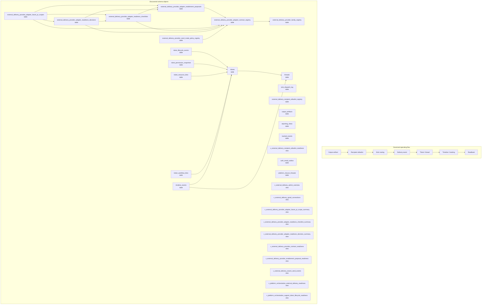

# Output Delivery, Support, and Communication Map

> Generated text documentation. Do not edit this file manually.
> Source hash: `e72098408bd27edba52ef120a33b90aa8752ca6fa4ee4e1773511d8eebc25345`
> Source count: **18**
> Sources: `http-generic-api/migrations/004_sprint04_customer_ops.sql`, `http-generic-api/migrations/007_sprint10_tracking.sql`, `http-generic-api/migrations/017_sprint21_output_sink_router.sql`, `http-generic-api/migrations/1013_sprint69_approval_hold_identity_collation_alignment.sql`, `http-generic-api/migrations/101_sprint62l_auth_password_reset_tokens.sql`, `http-generic-api/migrations/204_sprint67_core_runtime_context_dimensions.sql`, `http-generic-api/migrations/233_sprint68_ticket_lifecycle_authority_foundation.sql`, `http-generic-api/migrations/265_sprint68_ticket_external_provider_adapter_contracts.sql`, `http-generic-api/migrations/266_sprint68_ticket_external_provider_enablement_proposal.sql`, `http-generic-api/migrations/267_sprint68_ticket_external_adapter_readiness_checklist.sql`, _... +8 more_
> Rendering: Mermaid plus Markdown tables; no image assets or raw database rows are generated.

## Discovered object inventory

| Object | Type | Domain | Source migrations | Columns | References |
|---|---|---|---:|---:|---|
| `auth_email_outbox` | table | Delivery & support | 1 | 14 | - |
| `external_delivery_provider_adapter_contract_registry` | table | Delivery & support | 1 | 20 | `external_delivery_provider_family_registry` |
| `external_delivery_provider_adapter_enablement_proposals` | table | Repository & development | 1 | 17 | `external_delivery_provider_adapter_contract_registry` |
| `external_delivery_provider_adapter_future_pr_scopes` | table | Delivery & support | 1 | 19 | `external_delivery_provider_adapter_contract_registry`, `external_delivery_provider_adapter_enablement_proposals`, `external_delivery_provider_adapter_readiness_checklists`, `external_delivery_provider_adapter_readiness_decisions` |
| `external_delivery_provider_adapter_readiness_checklists` | table | Delivery & support | 1 | 12 | `external_delivery_provider_adapter_contract_registry`, `external_delivery_provider_adapter_enablement_proposals` |
| `external_delivery_provider_adapter_readiness_decisions` | table | Platform resources & graph | 1 | 18 | `external_delivery_provider_adapter_contract_registry`, `external_delivery_provider_adapter_enablement_proposals`, `external_delivery_provider_adapter_readiness_checklists` |
| `external_delivery_provider_family_registry` | table | Delivery & support | 1 | 12 | - |
| `external_delivery_provider_send_mode_policy_registry` | table | Delivery & support | 1 | 14 | `external_delivery_provider_adapter_contract_registry` |
| `external_delivery_recipient_allowlist_registry` | table | Delivery & support | 1 | 13 | `approval_holds`, `tenants` |
| `output_artifacts` | table | Delivery & support | 1 | 14 | `agents`, `tenants` |
| `platform_closure_threads` | table | Delivery & support | 1 | 11 | - |
| `reporting_views` | table | Delivery & support | 2 | 9 | `tenants` |
| `sink_dispatch_log` | table | Delivery & support | 2 | 10 | `agents`, `tenants` |
| `threads` | table | Delivery & support | 1 | 10 | `customers`, `tenants` |
| `ticket_lifecycle_events` | table | Delivery & support | 1 | 13 | `tenants`, `tickets` |
| `ticket_permission_snapshots` | table | Delivery & support | 1 | 14 | `tenants`, `tickets`, `users` |
| `ticket_resource_links` | table | Delivery & support | 1 | 10 | `tenants`, `tickets` |
| `ticket_workflow_links` | table | Delivery & support | 2 | 12 | `approval_holds`, `plans`, `tenants`, `tickets` |
| `tickets` | table | Delivery & support | 2 | 14 | `customers`, `tenants`, `threads` |
| `timeline_events` | table | Delivery & support | 1 | 12 | `customers`, `tenants`, `threads`, `tickets` |
| `tracked_events` | table | Delivery & support | 1 | 14 | `tenants` |
| `v_external_delivery_admin_overview` | view | Delivery & support | 1 | - | - |
| `v_external_delivery_gmail_connections` | view | Delivery & support | 1 | - | - |
| `v_external_delivery_provider_adapter_future_pr_scope_summary` | view | Delivery & support | 1 | - | - |
| `v_external_delivery_provider_adapter_readiness_checklist_summary` | view | Delivery & support | 1 | - | - |
| `v_external_delivery_provider_adapter_readiness_decision_summary` | view | Platform resources & graph | 1 | - | - |
| `v_external_delivery_provider_contract_readiness` | view | Delivery & support | 1 | - | - |
| `v_external_delivery_provider_enablement_proposal_readiness` | view | Repository & development | 1 | - | - |
| `v_external_delivery_recent_send_events` | view | Delivery & support | 1 | - | - |
| `v_external_delivery_recipient_allowlist_readiness` | view | Delivery & support | 2 | - | - |
| `v_platform_orchestration_external_delivery_readiness` | view | Delivery & support | 1 | - | - |
| `v_platform_orchestration_support_ticket_lifecycle_readiness` | view | Delivery & support | 1 | - | - |

## Coverage counters

- Matching schema objects: **32**
- Diagram objects shown: **32**
- Source migrations: **18**
