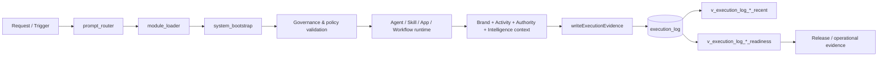

# Execution Log Evidence Map

> Generated text documentation. Do not edit this file manually.
> Source hash: `4c3866015ef3a6dbaa2c598ae21b06afe94645d1d4db1d4ed2a523607f78fe80`
> Source count: **24**
> Sources: `http-generic-api/executionEvidenceLogger.js`, `http-generic-api/migrations/047_sprint47b_gpt_tool_registry.sql`, `http-generic-api/migrations/049_sprint47d_tool_registry_recovery.sql`, `http-generic-api/migrations/050_sprint47e_fix_schema_drift.sql`, `http-generic-api/migrations/055_sprint51_sql_primary_data_source.sql`, `http-generic-api/migrations/068_sprint58_cloudflare_readonly_runtime.sql`, `http-generic-api/migrations/118_sprint63c_register_session_summary_health_tool.sql`, `http-generic-api/migrations/151_sprint65_platform_plugin_smoke_certifications.sql`, `http-generic-api/migrations/152_sprint65_platform_plugin_smoke_certification_tools.sql`, `http-generic-api/migrations/154_sprint65_smoke_certification_lifecycle_tools.sql`, `http-generic-api/migrations/157_sprint65_wordpress_blog_publish_orchestrator.sql`, `http-generic-api/migrations/158_sprint65_smoke_recertification_policy_audit_tool_schema.sql`, _... +12 more_
> Rendering: Mermaid code blocks plus Markdown tables; no image assets are generated.

## Discovered logger inputs

| Context group | Inputs |
|---|---|
| Brand & business context | `activityId`, `activityKey`, `activityType`, `brandCoreAssetKeys`, `brandCoreStatus`, `brandEvidence`, `brandId`, `brandKey`, `brandName`, `businessActivityEvidence`, `businessActivityTypeKey`, `businessTypeEvidence`, `businessTypeKey`, `knowledgeProfileKey` |
| Connection & authority | `budgetAuthorityEvidence`, `budgetAuthorityId`, `connectedSystemEvidence`, `connectedSystemId`, `connectorFamily`, `installationId`, `permissionEvidence`, `permissionGrantId`, `permissionKey`, `providerFamily`, `resourceAuthorityBindingId`, `resourceAuthorityEvidence` |
| Evidence envelopes | `authorizationEvidence`, `knowledgeEvidence`, `runtimeEvidence` |
| Execution surfaces | `actionKey`, `agentEvidence`, `agentId`, `agentKey`, `appConnectionId`, `appEvidence`, `appKey`, `endpointKey`, `parentActionKey`, `pluginKey`, `skillEvidence`, `skillId`, `skillKey`, `toolKey`, `workflowBindingKey`, `workflowEvidence`, `workflowId`, `workflowKey` |
| Identity & authorization | `actorId`, `actorType`, `policyEvidence`, `policyKeys`, `roleEvidence`, `roleKeys`, `tenantId`, `tenantKey`, `userId`, `userInput`, `workspaceId`, `workspaceKey` |
| Intelligence runtime | `engineAssociationStatus`, `engineEvidence`, `engineKey`, `enginePolicyKey`, `engineResolutionStatus`, `logicAssociationStatus`, `logicEvidence`, `logicKey`, `logicPackKey`, `modelEvidence`, `modelKey`, `modelProviderKey`, `modelRunId` |
| Trace & delivery | `artifactJsonAssetId`, `contextSources`, `conversationId`, `correlationId`, `createdAt`, `credentialRefId`, `decisionTrigger`, `durationSeconds`, `endedAt`, `entryType`, `environment`, `executionClass`, `executionContext`, `executionEvidenceStatus`, `executionMode`, `executionReadyStatus`, `executionStatus`, `failureReason`, `idempotencyKey`, `intakeValidationStatus`, `logSource`, `outputSummary`, `pool`, `recoveryNotes`, `recoveryStatus`, `requestId`, `resolvedLogicMode`, `resourceId`, `resourceType`, `routeKeys`, `routeSource`, `routeStatus`, `selectedWorkflows`, `sessionId`, `skipSurfaceAuthority`, `sourceLayer`, `targetId`, `targetModuleWriteback`, `targetType`, `targetWorkflowWriteback`, `traceId`, `usedEngineNames`, `usedEngineRegistryRefs`, `usedLogicId`, `usedLogicName` |

## Discovered evidence columns

| Column | Purpose |
|---|---|
| `agent_evidence_json` | JSON evidence envelope |
| `app_evidence_json` | JSON evidence envelope |
| `authorization_evidence_json` | JSON evidence envelope |
| `brand_evidence_json` | JSON evidence envelope |
| `budget_authority_evidence_json` | JSON evidence envelope |
| `business_activity_evidence_json` | JSON evidence envelope |
| `business_type_evidence_json` | JSON evidence envelope |
| `connected_system_evidence_json` | JSON evidence envelope |
| `engine_evidence_json` | JSON evidence envelope |
| `knowledge_evidence_json` | JSON evidence envelope |
| `logic_evidence_json` | JSON evidence envelope |
| `model_evidence_json` | JSON evidence envelope |
| `permission_evidence_json` | JSON evidence envelope |
| `policy_evidence_json` | JSON evidence envelope |
| `resource_authority_evidence_json` | JSON evidence envelope |
| `role_evidence_json` | JSON evidence envelope |
| `runtime_evidence_json` | JSON evidence envelope |
| `skill_evidence_json` | JSON evidence envelope |
| `workflow_evidence_json` | JSON evidence envelope |

## Readback surfaces

| View | Role |
|---|---|
| `v_execution_log_full_context_evidence_readiness` | Readback/readiness |
| `v_execution_log_full_context_evidence_recent` | Readback/readiness |
| `v_execution_log_runtime_evidence_readiness` | Readback/readiness |
| `v_execution_log_runtime_evidence_recent` | Readback/readiness |

## Governing policies

- `execution_log_full_context_evidence_policy_v1`
- `execution_log_runtime_evidence_policy_v1`

## Coverage counters

- Logger inputs discovered: **117**
- Execution-log columns discovered from migrations: **54**
- Evidence JSON columns: **19**
- Readback views: **4**
