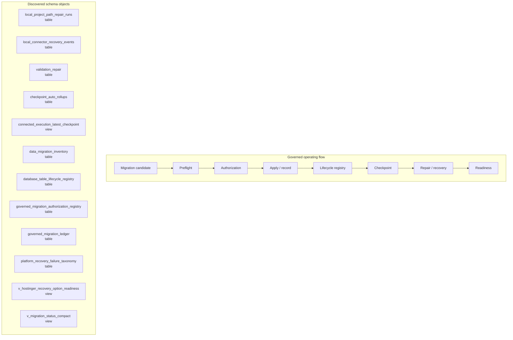

# Migration, Data Lifecycle, and Recovery Map

> Generated text documentation. Do not edit this file manually.
> Source hash: `931f18cb6472a217918bba425872815ffe71a59e8f687cb26517cf8b1d3e2a2d`
> Source count: **13**
> Sources: `http-generic-api/migrations/014_sprint18_data_hardening.sql`, `http-generic-api/migrations/039_sprint43_data_integrity_and_missing_tables.sql`, `http-generic-api/migrations/040_sprint44_expand_surfaces_and_repair_schema.sql`, `http-generic-api/migrations/078_sprint61_local_project_path_registry.sql`, `http-generic-api/migrations/094_sprint62e_local_connector_auto_reconnect.sql`, `http-generic-api/migrations/168_sprint65_database_table_lifecycle_governance.sql`, `http-generic-api/migrations/174_sprint65_recovery_capability_taxonomy_foundation.sql`, `http-generic-api/migrations/176_sprint66_governed_migration_ledger.sql`, `http-generic-api/migrations/179_sprint66_dynamic_capability_audit_foundation.sql`, `http-generic-api/migrations/181_sprint66_connected_execution_continuity_foundation.sql`, _... +3 more_
> Rendering: Mermaid code blocks plus Markdown tables; no image assets or raw database rows are generated.

## Runtime invariants

- Migration apply requires preflight, confirmation, and ledger evidence.
- Record-only entries are used only when same-cycle evidence proves the schema state already exists.
- Lifecycle ownership and recovery paths remain explicit.
- No destructive migration is inferred from documentation generation.

## Discovered object inventory

| Object | Type | Domain | Source migrations | Columns discovered | References |
|---|---|---|---:|---:|---|
| `checkpoint_auto_rollups` | table | Migration & lifecycle | 1 | 9 | - |
| `data_migration_inventory` | table | Migration & lifecycle | 1 | 11 | - |
| `database_table_lifecycle_registry` | table | Migration & lifecycle | 1 | - | - |
| `governed_migration_authorization_registry` | table | Migration & lifecycle | 1 | - | - |
| `governed_migration_ledger` | table | Migration & lifecycle | 1 | 16 | - |
| `local_connector_recovery_events` | table | Migration & lifecycle | 1 | 15 | `tenants`, `users` |
| `local_project_path_repair_runs` | table | Migration & lifecycle | 1 | 21 | `local_project_path_registry`, `tenants`, `users` |
| `platform_recovery_failure_taxonomy` | table | Migration & lifecycle | 1 | - | - |
| `validation_repair` | table | Migration & lifecycle | 2 | 14 | - |
| `connected_execution_latest_checkpoint` | view | Migration & lifecycle | 1 | - | - |
| `v_hostinger_recovery_option_readiness` | view | Migration & lifecycle | 1 | - | - |
| `v_migration_status_compact` | view | Migration & lifecycle | 1 | - | - |

## Coverage counters

- Matching schema objects: **12**
- Diagram objects shown: **12**
- Diagram truncation applied: **no**
- Source migrations: **13**
