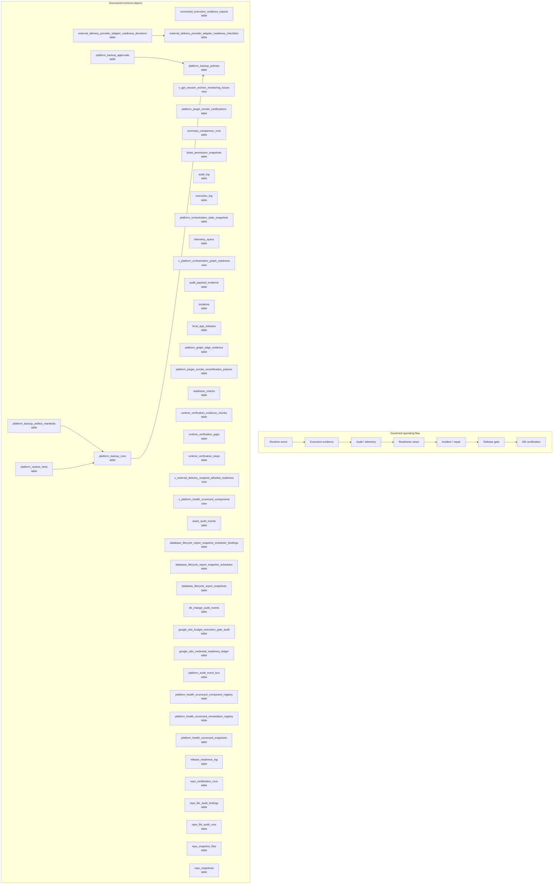

# Observability, Audit, and Release Map

> Generated text documentation. Do not edit this file manually.
> Source hash: `1dbe217850a3f61ce89cb6cd49ec474e9e0fbb8867feb4a2dc3b2fa460e87fe6`
> Source count: **84**
> Sources: `http-generic-api/migrations/008_sprint12_bootstrap.sql`, `http-generic-api/migrations/011_sprint15_observability.sql`, `http-generic-api/migrations/012_sprint16_security.sql`, `http-generic-api/migrations/014_sprint18_data_hardening.sql`, `http-generic-api/migrations/080_sprint61_backup_copy_governance.sql`, `http-generic-api/migrations/083_sprint61_backup_approval_restore_gates.sql`, `http-generic-api/migrations/085_sprint61_backup_preflight_manifest_contract.sql`, `http-generic-api/migrations/086_sprint61_backup_approval_workflow_contract.sql`, `http-generic-api/migrations/100_sprint62k_local_app_releases.sql`, `http-generic-api/migrations/102_sprint62m_local_manager_windows_0_1_2_release.sql`, _... +74 more_
> Rendering: Mermaid code blocks plus Markdown tables; no image assets or raw database rows are generated.

## Runtime invariants

- Operational claims require readback evidence, not narrative status.
- Release readiness aggregates schema, policy, migration, runtime, and DR evidence.
- Diagnostics are read-only unless an explicit governed recovery action is approved.
- Generated documentation contains no raw runtime rows.

## Discovered object inventory

| Object | Type | Domain | Source migrations | Columns discovered | References |
|---|---|---|---:|---:|---|
| `asset_audit_events` | table | Assets & packages | 1 | 9 | - |
| `audit_log` | table | Observability & release | 2 | 14 | `tenants` |
| `audit_payload_evidence` | table | Observability & release | 1 | 19 | `tenants` |
| `connected_execution_evidence_reports` | table | Observability & release | 1 | 20 | `plans`, `step_runs`, `tenants`, `users` |
| `database_lifecycle_report_snapshot_scheduler_bindings` | table | Migration & lifecycle | 1 | - | - |
| `database_lifecycle_report_snapshot_schedules` | table | Migration & lifecycle | 1 | - | - |
| `database_lifecycle_report_snapshots` | table | Migration & lifecycle | 1 | - | - |
| `db_change_audit_events` | table | Observability & release | 1 | 9 | - |
| `execution_log` | table | Observability & release | 3 | - | - |
| `external_delivery_provider_adapter_readiness_checklists` | table | Delivery & support | 1 | 12 | `external_delivery_provider_adapter_contract_registry`, `external_delivery_provider_adapter_enablement_proposals` |
| `external_delivery_provider_adapter_readiness_decisions` | table | Platform resources & graph | 1 | 18 | `external_delivery_provider_adapter_contract_registry`, `external_delivery_provider_adapter_enablement_proposals`, `external_delivery_provider_adapter_readiness_checklists` |
| `google_ads_budget_execution_gate_audit` | table | Governance & authority | 1 | - | - |
| `google_ads_credential_readiness_ledger` | table | Connectors & providers | 1 | - | - |
| `incidents` | table | Observability & release | 1 | 12 | `tenants` |
| `local_app_releases` | table | Observability & release | 2 | 16 | - |
| `platform_audit_event_bus` | table | Observability & release | 1 | 12 | - |
| `platform_backup_approvals` | table | Workflow & tasks | 2 | 12 | `platform_backup_policies` |
| `platform_backup_artifact_manifests` | table | Observability & release | 1 | 14 | `platform_backup_runs` |
| `platform_backup_policies` | table | Observability & release | 3 | 24 | `platform_copy_locations` |
| `platform_backup_runs` | table | Observability & release | 2 | 16 | `platform_backup_policies` |
| `platform_graph_edge_evidence` | table | Platform resources & graph | 1 | 9 | `platform_graph_edges` |
| `platform_health_scorecard_component_registry` | table | Observability & release | 1 | - | - |
| `platform_health_scorecard_remediation_registry` | table | Observability & release | 1 | - | - |
| `platform_health_scorecard_snapshots` | table | Observability & release | 1 | - | - |
| `platform_orchestration_state_snapshots` | table | Workflow & tasks | 1 | 22 | `decision_runs`, `tenants` |
| `platform_plugin_smoke_certifications` | table | Agents & intelligence | 2 | 26 | `tenants`, `users` |
| `platform_plugin_smoke_recertification_policies` | table | Agents & intelligence | 1 | 18 | `tenants` |
| `platform_restore_tests` | table | Observability & release | 1 | 14 | `platform_backup_runs` |
| `readiness_checks` | table | Observability & release | 1 | 7 | `tenants` |
| `release_readiness_log` | table | Observability & release | 1 | 6 | - |
| `repo_certification_runs` | table | Repository & development | 1 | - | - |
| `repo_file_audit_findings` | table | Repository & development | 1 | 9 | - |
| `repo_file_audit_runs` | table | Repository & development | 1 | 14 | - |
| `repo_snapshot_files` | table | Repository & development | 1 | - | - |
| `repo_snapshots` | table | Repository & development | 1 | - | - |
| `runtime_dispatch_certification_registry` | table | Observability & release | 1 | 19 | - |
| `runtime_gap_remediation_registry` | table | Observability & release | 1 | - | - |
| `runtime_verification_evidence_chunks` | table | Observability & release | 1 | - | `runtime_verification_runs` |
| `runtime_verification_gaps` | table | Observability & release | 1 | - | `runtime_verification_runs` |
| `runtime_verification_runs` | table | Observability & release | 1 | - | - |
| `runtime_verification_steps` | table | Workflow & tasks | 1 | - | `runtime_verification_runs` |
| `runtime_verification_workflow_registry` | table | Workflow & tasks | 1 | - | - |
| `summary_comparison_runs` | table | Observability & release | 2 | 24 | `tenants`, `users` |
| `telemetry_spans` | table | Observability & release | 2 | 13 | `tenants` |
| `ticket_permission_snapshots` | table | Delivery & support | 1 | 14 | `tenants`, `tickets`, `users` |
| `v_activation_authorized_surface_registry_readiness` | view | Activation & onboarding | 1 | - | - |
| `v_activation_catalog_authorized_surface_readiness` | view | Activation & onboarding | 1 | - | - |
| `v_activation_expanded_authorized_surface_readiness` | view | Activation & onboarding | 1 | - | - |
| `v_agent_runtime_ledger_readiness` | view | Agents & intelligence | 1 | - | - |
| `v_core_runtime_context_dimension_coverage` | view | Observability & release | 1 | - | - |
| `v_database_lifecycle_backup_snapshot_review` | view | Migration & lifecycle | 1 | - | - |
| `v_database_lifecycle_report_snapshot_schedule_readiness` | view | Migration & lifecycle | 1 | - | - |
| `v_database_lifecycle_report_snapshot_summary` | view | Migration & lifecycle | 1 | - | - |
| `v_database_lifecycle_scheduler_binding_readiness` | view | Migration & lifecycle | 1 | - | - |
| `v_dynamic_audit_pipeline_counts` | view | Observability & release | 1 | - | - |
| `v_dynamic_audit_pipeline_quality` | view | Observability & release | 1 | - | - |
| `v_dynamic_audit_pipeline_readiness` | view | Observability & release | 1 | - | - |
| `v_execution_association_monitoring_summary` | view | Observability & release | 1 | - | - |
| `v_execution_log_full_context_evidence_readiness` | view | Observability & release | 1 | - | - |
| `v_execution_log_full_context_evidence_recent` | view | Observability & release | 1 | - | - |
| `v_execution_log_runtime_evidence_readiness` | view | Observability & release | 1 | - | - |
| `v_execution_log_runtime_evidence_recent` | view | Observability & release | 1 | - | - |
| `v_external_delivery_provider_adapter_readiness_checklist_summary` | view | Delivery & support | 1 | - | - |
| `v_external_delivery_provider_adapter_readiness_decision_summary` | view | Platform resources & graph | 1 | - | - |
| `v_external_delivery_provider_contract_readiness` | view | Delivery & support | 1 | - | - |
| `v_external_delivery_provider_enablement_proposal_readiness` | view | Repository & development | 1 | - | - |
| `v_external_delivery_recipient_allowlist_readiness` | view | Delivery & support | 2 | - | - |
| `v_f5_f6_positive_smoke_certification_readback` | view | Observability & release | 1 | - | - |
| `v_github_file_operation_readiness_compact` | view | Repository & development | 1 | - | - |
| `v_github_file_patch_plan_runtime_readiness` | view | Repository & development | 1 | - | - |
| `v_gpt_session_archive_monitoring` | view | Sessions & memory | 1 | - | - |
| `v_gpt_session_archive_monitoring_issues` | view | Sessions & memory | 5 | - | - |
| `v_gpt_session_archive_monitoring_summary` | view | Sessions & memory | 1 | - | - |
| `v_hostinger_apply_policy_readiness` | view | Connectors & providers | 1 | - | - |
| `v_hostinger_apply_policy_safe_field_readiness` | view | Connectors & providers | 1 | - | - |
| `v_hostinger_recovery_option_readiness` | view | Migration & lifecycle | 1 | - | - |
| `v_platform_health_scorecard` | view | Observability & release | 1 | - | - |
| `v_platform_health_scorecard_component_registry_readback` | view | Observability & release | 1 | - | - |
| `v_platform_health_scorecard_components` | view | Observability & release | 2 | - | - |
| `v_platform_health_scorecard_history` | view | Observability & release | 1 | - | - |
| `v_platform_health_scorecard_ledger_hygiene` | view | Observability & release | 1 | - | - |
| `v_platform_health_scorecard_remediation_plan` | view | Tenancy & identity | 1 | - | - |
| `v_platform_health_scorecard_tenant_rollout_readiness` | view | Tenancy & identity | 1 | - | - |
| `v_platform_orchestration_ads_governance_readiness` | view | Workflow & tasks | 1 | - | - |
| `v_platform_orchestration_external_delivery_readiness` | view | Delivery & support | 1 | - | - |
| `v_platform_orchestration_graph_readiness` | view | Workflow & tasks | 3 | - | - |
| `v_platform_orchestration_support_ticket_lifecycle_readiness` | view | Delivery & support | 1 | - | - |
| `v_platform_secret_promotion_monitoring` | view | Observability & release | 1 | - | - |
| `v_platform_secret_promotion_monitoring_issues` | view | Observability & release | 1 | - | - |
| `v_platform_secret_promotion_monitoring_summary` | view | Observability & release | 1 | - | - |
| `v_release_readiness_compact` | view | Observability & release | 1 | - | - |
| `v_remaining_resource_capability_completion_readiness` | view | Platform resources & graph | 1 | - | - |
| `v_resource_recipe_certification_compact` | view | Platform resources & graph | 1 | - | - |
| `v_runtime_context_dimension_enrichment_fillable` | view | Observability & release | 1 | - | - |
| `v_runtime_production_parity` | view | Observability & release | 1 | - | - |
| `v_runtime_verification_evidence_manifest` | view | Observability & release | 1 | - | - |
| `v_runtime_verification_latest` | view | Observability & release | 1 | - | - |
| `v_session_insight_actual_preflight_readiness` | view | Governance & authority | 1 | - | - |
| `v_session_insight_actual_request_readiness` | view | Sessions & memory | 1 | - | - |
| `v_session_insight_adapter_apply_readiness` | view | Sessions & memory | 1 | - | - |
| `v_session_insight_adapter_apply_readiness_gate` | view | Sessions & memory | 1 | - | - |
| `v_session_insight_adapter_apply_readiness_gate_issues` | view | Sessions & memory | 1 | - | - |
| `v_session_insight_adapter_execution_readiness` | view | Sessions & memory | 1 | - | - |
| `v_session_insight_apply_request_adapter_readiness` | view | Sessions & memory | 1 | - | - |
| `v_session_insight_apply_request_contract_readiness` | view | Sessions & memory | 1 | - | - |
| `v_session_insight_backlog_target_write_readiness` | view | Sessions & memory | 1 | - | - |
| `v_session_insight_capability_envelope_approval_readiness` | view | Platform resources & graph | 1 | - | - |
| `v_session_insight_capability_envelope_dispatch_dry_run_readiness` | view | Platform resources & graph | 1 | - | - |
| `v_session_insight_capability_envelope_plan_readiness` | view | Platform resources & graph | 1 | - | - |
| `v_session_insight_capability_envelope_request_dispatch_readiness` | view | Platform resources & graph | 1 | - | - |
| `v_session_insight_capability_envelope_request_gate_readiness` | view | Platform resources & graph | 1 | - | - |
| `v_session_insight_dispatch_readback_readiness` | view | Sessions & memory | 1 | - | - |
| `v_session_insight_payload_preview_readiness` | view | Sessions & memory | 1 | - | - |
| `v_session_insight_remaining_scope_completion_readiness` | view | Sessions & memory | 1 | - | - |
| `v_session_insight_target_write_readback_readiness` | view | Sessions & memory | 1 | - | - |

## Coverage counters

- Matching schema objects: **115**
- Diagram objects shown: **45**
- Diagram truncation applied: **yes**
- Source migrations: **84**
