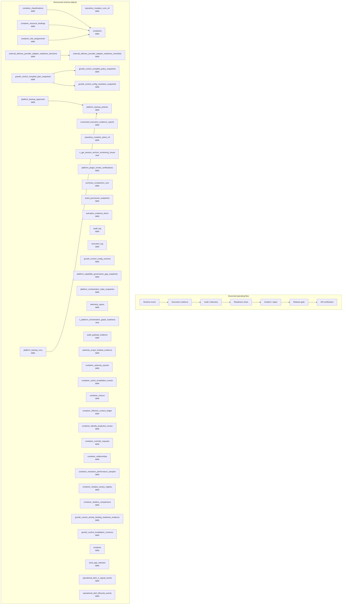

# Observability, Audit, and Release Map

> Generated text documentation. Do not edit this file manually.
> Source hash: `9abaff8bd91e032c7e90779e1acb350d203664d561cb818d2c00f2cd47242e73`
> Source count: **131**
> Sources: `http-generic-api/migrations/008_sprint12_bootstrap.sql`, `http-generic-api/migrations/011_sprint15_observability.sql`, `http-generic-api/migrations/012_sprint16_security.sql`, `http-generic-api/migrations/014_sprint18_data_hardening.sql`, `http-generic-api/migrations/080_sprint61_backup_copy_governance.sql`, `http-generic-api/migrations/083_sprint61_backup_approval_restore_gates.sql`, `http-generic-api/migrations/085_sprint61_backup_preflight_manifest_contract.sql`, `http-generic-api/migrations/086_sprint61_backup_approval_workflow_contract.sql`, `http-generic-api/migrations/100_sprint62k_local_app_releases.sql`, `http-generic-api/migrations/1011_sprint69_governed_repository_engine_v6.sql`, _... +121 more_
> Rendering: Mermaid plus Markdown tables; no image assets or raw database rows are generated.

## Discovered object inventory

| Object | Type | Domain | Classification | Existing map refs | Source migrations | Columns | References |
|---|---|---|---|---|---:|---:|---|
| `activation_evidence_items` | table | Activation & onboarding | generated_domain_rule | - | 1 | - | `activation_operation_projections`, `activation_stage_attempts` |
| `activation_snapshot_ledger` | table | Activation & onboarding | generated_domain_rule | - | 1 | - | - |
| `asset_audit_events` | table | Assets & packages | generated_domain_rule | - | 1 | 9 | - |
| `audit_log` | table | Observability & release | generated_domain_rule | - | 2 | 14 | `tenants` |
| `audit_payload_evidence` | table | Observability & release | generated_domain_rule | - | 1 | 19 | `tenants` |
| `authority_scope_shadow_evidence` | table | Governance & authority | generated_domain_rule | - | 1 | 23 | `tenants` |
| `connected_execution_evidence_reports` | table | Observability & release | generated_domain_rule | - | 1 | 20 | `plans`, `step_runs`, `tenants`, `users` |
| `container_authority_epochs` | table | Platform resources & graph | registry:dynamic_container_authority | `data-model-domain-map`, `observability-release-map`, `platform-resource-graph-map`, `policy-authority-map` | 1 | 5 | `tenants` |
| `container_authority_idempotency` | table | Platform resources & graph | registry:dynamic_container_authority | `data-model-domain-map`, `observability-release-map`, `platform-resource-graph-map`, `policy-authority-map` | 1 | 8 | - |
| `container_cache_invalidation_events` | table | Platform resources & graph | registry:dynamic_container_authority | `data-model-domain-map`, `observability-release-map`, `platform-resource-graph-map`, `policy-authority-map` | 1 | 8 | `tenants` |
| `container_canary_observations` | table | Platform resources & graph | registry:dynamic_container_authority | `data-model-domain-map`, `observability-release-map`, `platform-resource-graph-map`, `policy-authority-map` | 1 | 16 | - |
| `container_classification_type_registry` | table | Platform resources & graph | registry:dynamic_container_authority | `data-model-domain-map`, `observability-release-map`, `platform-resource-graph-map`, `policy-authority-map` | 1 | 15 | - |
| `container_classifications` | table | Platform resources & graph | registry:dynamic_container_authority | `data-model-domain-map`, `observability-release-map`, `platform-resource-graph-map`, `policy-authority-map` | 1 | 17 | `containers`, `tenants` |
| `container_closure` | table | Platform resources & graph | registry:dynamic_container_authority | `data-model-domain-map`, `observability-release-map`, `platform-resource-graph-map`, `policy-authority-map` | 1 | 9 | `tenants` |
| `container_effective_context_ledger` | table | Platform resources & graph | registry:dynamic_container_authority | `data-model-domain-map`, `observability-release-map`, `platform-resource-graph-map`, `policy-authority-map` | 1 | 29 | `tenants` |
| `container_identity_projection_issues` | table | Platform resources & graph | registry:dynamic_container_authority | `data-model-domain-map`, `observability-release-map`, `platform-resource-graph-map`, `policy-authority-map` | 1 | 13 | `tenants` |
| `container_override_approvals` | table | Platform resources & graph | registry:dynamic_container_authority | `data-model-domain-map`, `observability-release-map`, `platform-resource-graph-map`, `policy-authority-map` | 1 | 8 | - |
| `container_override_consumptions` | table | Platform resources & graph | registry:dynamic_container_authority | `data-model-domain-map`, `observability-release-map`, `platform-resource-graph-map`, `policy-authority-map` | 1 | 13 | - |
| `container_override_policy_registry` | table | Platform resources & graph | registry:dynamic_container_authority | `data-model-domain-map`, `observability-release-map`, `platform-resource-graph-map`, `policy-authority-map` | 1 | 9 | - |
| `container_override_requests` | table | Platform resources & graph | registry:dynamic_container_authority | `data-model-domain-map`, `observability-release-map`, `platform-resource-graph-map`, `policy-authority-map` | 1 | 27 | `tenants` |
| `container_projection_runs` | table | Platform resources & graph | registry:dynamic_container_authority | `data-model-domain-map`, `observability-release-map`, `platform-resource-graph-map`, `policy-authority-map` | 1 | 12 | - |
| `container_relationship_type_registry` | table | Platform resources & graph | registry:dynamic_container_authority | `data-model-domain-map`, `observability-release-map`, `platform-resource-graph-map`, `policy-authority-map` | 1 | 14 | - |
| `container_relationships` | table | Platform resources & graph | registry:dynamic_container_authority | `data-model-domain-map`, `observability-release-map`, `platform-resource-graph-map`, `policy-authority-map` | 1 | 16 | `tenants` |
| `container_resolution_performance_samples` | table | Platform resources & graph | registry:dynamic_container_authority | `data-model-domain-map`, `observability-release-map`, `platform-resource-graph-map`, `policy-authority-map` | 1 | 12 | `tenants` |
| `container_resource_bindings` | table | Platform resources & graph | registry:dynamic_container_authority | `data-model-domain-map`, `observability-release-map`, `platform-resource-graph-map`, `policy-authority-map` | 1 | 28 | `containers`, `tenants` |
| `container_resource_dimension_registry` | table | Platform resources & graph | registry:dynamic_container_authority | `data-model-domain-map`, `observability-release-map`, `platform-resource-graph-map`, `policy-authority-map` | 1 | 17 | - |
| `container_role_assignments` | table | Platform resources & graph | registry:dynamic_container_authority | `data-model-domain-map`, `observability-release-map`, `platform-resource-graph-map`, `policy-authority-map` | 1 | 17 | `containers`, `tenants` |
| `container_role_template_permissions` | table | Platform resources & graph | registry:dynamic_container_authority | `data-model-domain-map`, `observability-release-map`, `platform-resource-graph-map`, `policy-authority-map` | 1 | 10 | - |
| `container_role_template_registry` | table | Platform resources & graph | registry:dynamic_container_authority | `data-model-domain-map`, `observability-release-map`, `platform-resource-graph-map`, `policy-authority-map` | 1 | 12 | - |
| `container_rollout_policy_registry` | table | Platform resources & graph | registry:dynamic_container_authority | `data-model-domain-map`, `observability-release-map`, `platform-resource-graph-map`, `policy-authority-map` | 1 | 13 | - |
| `container_shadow_canary_registry` | table | Platform resources & graph | registry:dynamic_container_authority | `data-model-domain-map`, `observability-release-map`, `platform-resource-graph-map`, `policy-authority-map` | 1 | 10 | `tenants` |
| `container_shadow_comparisons` | table | Platform resources & graph | registry:dynamic_container_authority | `data-model-domain-map`, `observability-release-map`, `platform-resource-graph-map`, `policy-authority-map` | 1 | 13 | `tenants` |
| `container_type_registry` | table | Platform resources & graph | registry:dynamic_container_authority | `data-model-domain-map`, `observability-release-map`, `platform-resource-graph-map`, `policy-authority-map` | 1 | 14 | - |
| `containers` | table | Platform resources & graph | registry:dynamic_container_authority | `data-model-domain-map`, `observability-release-map`, `platform-resource-graph-map`, `policy-authority-map` | 1 | 14 | `tenants` |
| `database_lifecycle_report_snapshot_scheduler_bindings` | table | Migration & lifecycle | generated_domain_rule | - | 1 | - | - |
| `database_lifecycle_report_snapshot_schedules` | table | Migration & lifecycle | generated_domain_rule | - | 1 | - | - |
| `database_lifecycle_report_snapshots` | table | Migration & lifecycle | generated_domain_rule | - | 1 | - | - |
| `db_change_audit_events` | table | Observability & release | generated_domain_rule | - | 1 | 9 | - |
| `dynamic_audit_scheduler_runs` | table | Observability & release | generated_domain_rule | - | 1 | 10 | - |
| `execution_log` | table | Observability & release | generated_domain_rule | - | 3 | - | - |
| `external_delivery_provider_adapter_readiness_checklists` | table | Delivery & support | generated_domain_rule | - | 1 | 12 | `external_delivery_provider_adapter_contract_registry`, `external_delivery_provider_adapter_enablement_proposals` |
| `external_delivery_provider_adapter_readiness_decisions` | table | Platform resources & graph | generated_domain_rule | - | 1 | 18 | `external_delivery_provider_adapter_contract_registry`, `external_delivery_provider_adapter_enablement_proposals`, `external_delivery_provider_adapter_readiness_checklists` |
| `google_ads_budget_execution_gate_audit` | table | Governance & authority | generated_domain_rule | - | 1 | - | - |
| `google_ads_credential_readiness_ledger` | table | Connectors & providers | generated_domain_rule | - | 1 | - | - |
| `growth_control_activity_binding_readiness_evidence` | table | Observability & release | registry:growth_control_evidence_objects | `data-model-domain-map`, `observability-release-map`, `policy-authority-map`, `workflow-task-orchestration-map` | 1 | - | `growth_control_brand_activity_bindings` |
| `growth_control_compiled_plan_snapshots` | table | Governance & authority | registry:growth_control_compiled_snapshot_objects | `data-model-domain-map`, `observability-release-map`, `policy-authority-map`, `workflow-task-orchestration-map` | 1 | 26 | `growth_control_brand_activity_bindings`, `growth_control_compiled_policy_snapshots`, `growth_control_config_resolution_snapshots`, `tenants` |
| `growth_control_compiled_policy_snapshots` | table | Governance & authority | registry:growth_control_compiled_snapshot_objects | `data-model-domain-map`, `observability-release-map`, `policy-authority-map`, `workflow-task-orchestration-map` | 1 | 19 | `growth_control_brand_activity_bindings`, `tenants` |
| `growth_control_config_definitions` | table | Governance & authority | registry:growth_control_configuration_objects | `data-model-domain-map`, `observability-release-map`, `platform-resource-graph-map`, `policy-authority-map` | 1 | 14 | - |
| `growth_control_config_resolution_snapshots` | table | Governance & authority | registry:growth_control_configuration_objects | `data-model-domain-map`, `observability-release-map`, `platform-resource-graph-map`, `policy-authority-map` | 1 | 19 | `plans`, `tenants` |
| `growth_control_config_versions` | table | Governance & authority | registry:growth_control_configuration_objects | `data-model-domain-map`, `observability-release-map`, `platform-resource-graph-map`, `policy-authority-map` | 1 | 29 | `plans`, `tenants` |
| `growth_control_invalidation_revisions` | table | Governance & authority | registry:growth_control_configuration_objects | `data-model-domain-map`, `observability-release-map`, `platform-resource-graph-map`, `policy-authority-map` | 1 | 16 | `tenants` |
| `growth_control_shadow_parity_evidence` | table | Observability & release | registry:growth_control_evidence_objects | `data-model-domain-map`, `observability-release-map`, `policy-authority-map`, `workflow-task-orchestration-map` | 1 | - | - |
| `growth_control_shadow_parity_mappings` | table | Observability & release | registry:growth_control_evidence_objects | `data-model-domain-map`, `observability-release-map`, `policy-authority-map`, `workflow-task-orchestration-map` | 1 | - | - |
| `growth_intelligence_readiness_assessments` | table | Agents & intelligence | generated_domain_rule | - | 1 | - | - |
| `incidents` | table | Observability & release | generated_domain_rule | - | 1 | 12 | `tenants` |
| `local_app_releases` | table | Observability & release | generated_domain_rule | - | 2 | 16 | - |
| `operational_alert_ci_signal_events` | table | Observability & release | registry:operational_alert_lifecycle | `data-model-domain-map`, `delivery-support-map`, `observability-release-map`, `workflow-task-orchestration-map` | 1 | - | `operational_alerts` |
| `operational_alert_lifecycle_events` | table | Observability & release | registry:operational_alert_lifecycle | `data-model-domain-map`, `delivery-support-map`, `observability-release-map`, `workflow-task-orchestration-map` | 1 | - | `operational_alerts` |
| `operational_alert_notification_outbox` | table | Observability & release | registry:operational_alert_lifecycle | `data-model-domain-map`, `delivery-support-map`, `observability-release-map`, `workflow-task-orchestration-map` | 1 | - | `operational_alerts` |
| `operational_alert_rule_registry` | table | Observability & release | registry:operational_alert_lifecycle | `data-model-domain-map`, `delivery-support-map`, `observability-release-map`, `workflow-task-orchestration-map` | 1 | - | - |
| `operational_alert_sync_runs` | table | Observability & release | registry:operational_alert_lifecycle | `data-model-domain-map`, `delivery-support-map`, `observability-release-map`, `workflow-task-orchestration-map` | 1 | - | - |
| `operational_alerts` | table | Observability & release | registry:operational_alert_lifecycle | `data-model-domain-map`, `delivery-support-map`, `observability-release-map`, `workflow-task-orchestration-map` | 2 | - | - |
| `platform_audit_event_bus` | table | Observability & release | generated_domain_rule | - | 1 | 12 | - |
| `platform_backup_approvals` | table | Workflow & tasks | generated_domain_rule | - | 2 | 12 | `platform_backup_policies` |
| `platform_backup_artifact_manifests` | table | Observability & release | generated_domain_rule | - | 1 | 14 | `platform_backup_runs` |
| `platform_backup_policies` | table | Observability & release | generated_domain_rule | - | 3 | 24 | `platform_copy_locations` |
| `platform_backup_runs` | table | Observability & release | generated_domain_rule | - | 2 | 16 | `platform_backup_policies` |
| `platform_capability_certifications` | table | Platform resources & graph | generated_domain_rule | - | 1 | 17 | - |
| `platform_capability_envelope_evidence_links` | table | Platform resources & graph | generated_domain_rule | - | 1 | 5 | - |
| `platform_capability_governance_gap_snapshots` | table | Platform resources & graph | generated_domain_rule | - | 1 | 13 | `platform_capability_compilation_runs`, `platform_capability_compiled_manifests` |
| `platform_evidence_events` | table | Observability & release | generated_domain_rule | - | 1 | 22 | - |
| `platform_graph_edge_evidence` | table | Platform resources & graph | generated_domain_rule | - | 1 | 9 | `platform_graph_edges` |
| `platform_health_scorecard_component_registry` | table | Observability & release | generated_domain_rule | - | 1 | - | - |
| `platform_health_scorecard_remediation_registry` | table | Observability & release | generated_domain_rule | - | 1 | - | - |
| `platform_health_scorecard_snapshots` | table | Observability & release | generated_domain_rule | - | 1 | - | - |
| `platform_orchestration_state_snapshots` | table | Workflow & tasks | generated_domain_rule | - | 1 | 22 | `decision_runs`, `tenants` |
| `platform_outbox_consumers` | table | Delivery & support | registry:platform_outbox_delivery | `data-model-domain-map`, `delivery-support-map`, `observability-release-map`, `workflow-task-orchestration-map` | 1 | - | - |
| `platform_outbox_deliveries` | table | Delivery & support | registry:platform_outbox_delivery | `data-model-domain-map`, `delivery-support-map`, `observability-release-map`, `workflow-task-orchestration-map` | 1 | - | - |
| `platform_outbox_event_types` | table | Delivery & support | registry:platform_outbox_delivery | `data-model-domain-map`, `delivery-support-map`, `observability-release-map`, `workflow-task-orchestration-map` | 1 | - | - |
| `platform_outbox_events` | table | Delivery & support | registry:platform_outbox_delivery | `data-model-domain-map`, `delivery-support-map`, `observability-release-map`, `workflow-task-orchestration-map` | 1 | - | - |
| `platform_outbox_mask_policies` | table | Delivery & support | registry:platform_outbox_delivery | `data-model-domain-map`, `delivery-support-map`, `observability-release-map`, `workflow-task-orchestration-map` | 1 | - | - |
| `platform_plugin_smoke_certifications` | table | Agents & intelligence | generated_domain_rule | - | 2 | 26 | `tenants`, `users` |
| `platform_plugin_smoke_recertification_policies` | table | Agents & intelligence | generated_domain_rule | - | 1 | 18 | `tenants` |
| `platform_restore_tests` | table | Observability & release | generated_domain_rule | - | 1 | 14 | `platform_backup_runs` |
| `platform_secret_movement_ledger` | table | Governance & authority | registry:platform_secret_movement | `data-model-domain-map`, `observability-release-map`, `policy-authority-map` | 1 | 15 | - |
| `readiness_checks` | table | Observability & release | generated_domain_rule | - | 1 | 7 | `tenants` |
| `release_advisor_recommendations` | table | Observability & release | generated_domain_rule | - | 1 | - | - |
| `release_advisor_runs` | table | Observability & release | generated_domain_rule | - | 1 | - | - |
| `release_async_deployments` | table | Observability & release | generated_domain_rule | - | 1 | - | - |
| `release_gate_adapters` | table | Observability & release | generated_domain_rule | - | 1 | - | - |
| `release_gate_events` | table | Observability & release | generated_domain_rule | - | 1 | - | - |
| `release_gates` | table | Observability & release | generated_domain_rule | - | 1 | - | - |
| `release_operation_evidence` | table | Observability & release | generated_domain_rule | - | 1 | - | - |
| `release_operation_steps` | table | Workflow & tasks | generated_domain_rule | - | 1 | - | - |
| `release_operations` | table | Observability & release | generated_domain_rule | - | 1 | - | - |
| `release_readiness_log` | table | Observability & release | generated_domain_rule | - | 1 | 6 | - |
| `repo_certification_runs` | table | Repository & development | generated_domain_rule | - | 1 | - | - |
| `repo_file_audit_findings` | table | Repository & development | generated_domain_rule | - | 1 | 9 | - |
| `repo_file_audit_runs` | table | Repository & development | generated_domain_rule | - | 1 | 14 | - |
| `repo_snapshot_files` | table | Repository & development | generated_domain_rule | - | 1 | - | - |
| `repo_snapshots` | table | Repository & development | generated_domain_rule | - | 1 | - | - |
| `repository_advisory_comment_plans` | table | Repository & development | registry:repository_automation_control_plane | `data-model-domain-map`, `observability-release-map`, `repository-automation-map`, `repository-development-map` | 2 | - | - |
| `repository_authority_aliases` | table | Repository & development | registry:repository_automation_control_plane | `data-model-domain-map`, `observability-release-map`, `repository-automation-map`, `repository-development-map` | 1 | - | - |
| `repository_authority_bindings` | table | Repository & development | registry:repository_automation_control_plane | `data-model-domain-map`, `observability-release-map`, `repository-automation-map`, `repository-development-map` | 1 | - | - |
| `repository_automation_receipts` | table | Repository & development | registry:repository_automation_control_plane | `data-model-domain-map`, `observability-release-map`, `repository-automation-map`, `repository-development-map` | 1 | 15 | - |
| `repository_automation_runs` | table | Repository & development | registry:repository_automation_control_plane | `data-model-domain-map`, `observability-release-map`, `repository-automation-map`, `repository-development-map` | 1 | 24 | - |
| `repository_automation_step_runs` | table | Repository & development | registry:repository_automation_control_plane | `data-model-domain-map`, `observability-release-map`, `repository-automation-map`, `repository-development-map` | 1 | 18 | `step_runs` |
| `repository_capability_bindings` | table | Repository & development | registry:repository_automation_control_plane | `data-model-domain-map`, `observability-release-map`, `repository-automation-map`, `repository-development-map` | 1 | - | - |
| `repository_capability_policy_layers` | table | Repository & development | registry:repository_automation_control_plane | `data-model-domain-map`, `observability-release-map`, `repository-automation-map`, `repository-development-map` | 1 | - | - |
| `repository_main_moved_trigger_events` | table | Repository & development | registry:repository_automation_control_plane | `data-model-domain-map`, `observability-release-map`, `repository-automation-map`, `repository-development-map` | 2 | - | - |
| `repository_mutation_plans_v6` | table | Repository & development | registry:repository_automation_control_plane | `data-model-domain-map`, `observability-release-map`, `repository-automation-map`, `repository-development-map` | 1 | 15 | `approval_holds`, `plans`, `tenants`, `users` |
| `repository_mutation_runs_v6` | table | Repository & development | registry:repository_automation_control_plane | `data-model-domain-map`, `observability-release-map`, `repository-automation-map`, `repository-development-map` | 2 | 26 | `approval_holds`, `plans`, `tenants`, `users` |
| `repository_operation_leases` | table | Repository & development | registry:repository_automation_control_plane | `data-model-domain-map`, `observability-release-map`, `repository-automation-map`, `repository-development-map` | 2 | 25 | - |
| `research_source_execution_log` | table | Observability & release | generated_domain_rule | - | 1 | - | - |
| `runtime_dispatch_certification_registry` | table | Observability & release | generated_domain_rule | - | 1 | 19 | - |
| `runtime_gap_remediation_registry` | table | Observability & release | generated_domain_rule | - | 1 | - | - |
| `runtime_verification_evidence_chunks` | table | Observability & release | generated_domain_rule | - | 1 | - | `runtime_verification_runs` |
| `runtime_verification_gaps` | table | Observability & release | generated_domain_rule | - | 1 | - | `runtime_verification_runs` |
| `runtime_verification_runs` | table | Observability & release | generated_domain_rule | - | 1 | - | - |
| `runtime_verification_steps` | table | Workflow & tasks | generated_domain_rule | - | 1 | - | `runtime_verification_runs` |
| `runtime_verification_workflow_registry` | table | Workflow & tasks | generated_domain_rule | - | 1 | - | - |
| `sql_cache_runtime_policies` | table | Governance & authority | registry:sql_cache_runtime_policy | `data-model-domain-map`, `observability-release-map`, `policy-authority-map` | 1 | 7 | - |
| `summary_comparison_runs` | table | Observability & release | generated_domain_rule | - | 2 | 24 | `tenants`, `users` |
| `telemetry_spans` | table | Observability & release | generated_domain_rule | - | 2 | 13 | `tenants` |
| `ticket_permission_snapshots` | table | Delivery & support | generated_domain_rule | - | 1 | 14 | `tenants`, `tickets`, `users` |
| `v_activation_authorized_surface_registry_readiness` | view | Activation & onboarding | generated_domain_rule | - | 1 | - | - |
| `v_activation_catalog_authorized_surface_readiness` | view | Activation & onboarding | generated_domain_rule | - | 1 | - | - |
| `v_activation_expanded_authorized_surface_readiness` | view | Activation & onboarding | generated_domain_rule | - | 1 | - | - |
| `v_agent_runtime_ledger_readiness` | view | Agents & intelligence | generated_domain_rule | - | 1 | - | - |
| `v_approval_hold_identity_collation_readiness` | view | Workflow & tasks | generated_domain_rule | - | 1 | - | - |
| `v_cloudflare_mutation_policy_readiness` | view | Connectors & providers | generated_domain_rule | - | 1 | - | - |
| `v_container_active_hierarchy` | view | Platform resources & graph | registry:dynamic_container_authority | `data-model-domain-map`, `observability-release-map`, `platform-resource-graph-map`, `policy-authority-map` | 1 | - | - |
| `v_container_audit_coverage` | view | Platform resources & graph | registry:dynamic_container_authority | `data-model-domain-map`, `observability-release-map`, `platform-resource-graph-map`, `policy-authority-map` | 1 | - | - |
| `v_container_authority_foundation_summary` | view | Platform resources & graph | registry:dynamic_container_authority | `data-model-domain-map`, `observability-release-map`, `platform-resource-graph-map`, `policy-authority-map` | 1 | - | - |
| `v_container_canary_monitoring_summary` | view | Platform resources & graph | registry:dynamic_container_authority | `data-model-domain-map`, `observability-release-map`, `platform-resource-graph-map`, `policy-authority-map` | 1 | - | - |
| `v_container_latest_shadow_audit_coverage` | view | Platform resources & graph | registry:dynamic_container_authority | `data-model-domain-map`, `observability-release-map`, `platform-resource-graph-map`, `policy-authority-map` | 1 | - | - |
| `v_container_latest_shadow_performance_summary` | view | Platform resources & graph | registry:dynamic_container_authority | `data-model-domain-map`, `observability-release-map`, `platform-resource-graph-map`, `policy-authority-map` | 1 | - | - |
| `v_container_latest_shadow_run_summary` | view | Platform resources & graph | registry:dynamic_container_authority | `data-model-domain-map`, `observability-release-map`, `platform-resource-graph-map`, `policy-authority-map` | 1 | - | - |
| `v_container_override_readiness` | view | Platform resources & graph | registry:dynamic_container_authority | `data-model-domain-map`, `observability-release-map`, `platform-resource-graph-map`, `policy-authority-map` | 1 | - | - |
| `v_container_relationship_issues` | view | Platform resources & graph | registry:dynamic_container_authority | `data-model-domain-map`, `observability-release-map`, `platform-resource-graph-map`, `policy-authority-map` | 1 | - | - |
| `v_container_resolution_performance_summary` | view | Platform resources & graph | registry:dynamic_container_authority | `data-model-domain-map`, `observability-release-map`, `platform-resource-graph-map`, `policy-authority-map` | 1 | - | - |
| `v_container_rollout_readiness` | view | Platform resources & graph | registry:dynamic_container_authority | `data-model-domain-map`, `observability-release-map`, `platform-resource-graph-map`, `policy-authority-map` | 2 | - | - |
| `v_container_rollout_readiness_v2` | view | Platform resources & graph | registry:dynamic_container_authority | `data-model-domain-map`, `observability-release-map`, `platform-resource-graph-map`, `policy-authority-map` | 1 | - | - |
| `v_container_shadow_mismatch_summary` | view | Platform resources & graph | registry:dynamic_container_authority | `data-model-domain-map`, `observability-release-map`, `platform-resource-graph-map`, `policy-authority-map` | 1 | - | - |
| `v_core_runtime_context_dimension_coverage` | view | Observability & release | generated_domain_rule | - | 1 | - | - |
| `v_database_lifecycle_backup_snapshot_review` | view | Migration & lifecycle | generated_domain_rule | - | 1 | - | - |
| `v_database_lifecycle_report_snapshot_schedule_readiness` | view | Migration & lifecycle | generated_domain_rule | - | 1 | - | - |
| `v_database_lifecycle_report_snapshot_summary` | view | Migration & lifecycle | generated_domain_rule | - | 1 | - | - |
| `v_database_lifecycle_scheduler_binding_readiness` | view | Migration & lifecycle | generated_domain_rule | - | 1 | - | - |
| `v_dynamic_audit_pipeline_counts` | view | Observability & release | generated_domain_rule | - | 2 | - | - |
| `v_dynamic_audit_pipeline_quality` | view | Observability & release | generated_domain_rule | - | 2 | - | - |
| `v_dynamic_audit_pipeline_readiness` | view | Observability & release | generated_domain_rule | - | 2 | - | - |
| `v_execution_association_monitoring_summary` | view | Observability & release | generated_domain_rule | - | 1 | - | - |
| `v_execution_log_full_context_evidence_readiness` | view | Observability & release | generated_domain_rule | - | 1 | - | - |
| `v_execution_log_full_context_evidence_recent` | view | Observability & release | generated_domain_rule | - | 1 | - | - |
| `v_execution_log_runtime_evidence_readiness` | view | Observability & release | generated_domain_rule | - | 1 | - | - |
| `v_execution_log_runtime_evidence_recent` | view | Observability & release | generated_domain_rule | - | 1 | - | - |
| `v_external_delivery_provider_adapter_readiness_checklist_summary` | view | Delivery & support | generated_domain_rule | - | 1 | - | - |
| `v_external_delivery_provider_adapter_readiness_decision_summary` | view | Platform resources & graph | generated_domain_rule | - | 1 | - | - |
| `v_external_delivery_provider_contract_readiness` | view | Delivery & support | generated_domain_rule | - | 1 | - | - |
| `v_external_delivery_provider_enablement_proposal_readiness` | view | Repository & development | generated_domain_rule | - | 1 | - | - |
| `v_external_delivery_recipient_allowlist_readiness` | view | Delivery & support | generated_domain_rule | - | 2 | - | - |
| `v_f5_f6_positive_smoke_certification_readback` | view | Observability & release | generated_domain_rule | - | 1 | - | - |
| `v_github_file_operation_readiness_compact` | view | Repository & development | generated_domain_rule | - | 1 | - | - |
| `v_github_file_patch_plan_runtime_readiness` | view | Repository & development | generated_domain_rule | - | 1 | - | - |
| `v_governed_response_chunk_ownership_readiness` | view | Observability & release | generated_domain_rule | - | 1 | - | - |
| `v_governed_response_chunk_schema_readiness` | view | Observability & release | generated_domain_rule | - | 1 | - | - |
| `v_gpt_session_archive_monitoring` | view | Sessions & memory | generated_domain_rule | - | 1 | - | - |
| `v_gpt_session_archive_monitoring_issues` | view | Sessions & memory | generated_domain_rule | - | 5 | - | - |
| `v_gpt_session_archive_monitoring_summary` | view | Sessions & memory | generated_domain_rule | - | 2 | - | - |
| `v_growth_control_shadow_parity_summary` | view | Observability & release | registry:growth_control_evidence_objects | `data-model-domain-map`, `observability-release-map`, `policy-authority-map`, `workflow-task-orchestration-map` | 1 | - | - |
| `v_hostinger_apply_policy_readiness` | view | Connectors & providers | generated_domain_rule | - | 1 | - | - |
| `v_hostinger_apply_policy_safe_field_readiness` | view | Connectors & providers | generated_domain_rule | - | 1 | - | - |
| `v_hostinger_recovery_option_readiness` | view | Migration & lifecycle | generated_domain_rule | - | 1 | - | - |
| `v_n8n_instance_mode_ownership_policy_readiness` | view | Connectors & providers | generated_domain_rule | - | 1 | - | - |
| `v_operational_alerts_open` | view | Observability & release | registry:operational_alert_lifecycle | `data-model-domain-map`, `delivery-support-map`, `observability-release-map`, `workflow-task-orchestration-map` | 1 | - | - |
| `v_platform_capabilities_effective_evidence` | view | Platform resources & graph | generated_domain_rule | - | 1 | - | - |
| `v_platform_capability_authority_evidence` | view | Platform resources & graph | generated_domain_rule | - | 1 | - | - |
| `v_platform_capability_readback_readiness` | view | Platform resources & graph | generated_domain_rule | - | 1 | - | - |
| `v_platform_capability_readiness_vector` | view | Platform resources & graph | generated_domain_rule | - | 2 | - | - |
| `v_platform_health_scorecard` | view | Observability & release | generated_domain_rule | - | 1 | - | - |
| `v_platform_health_scorecard_component_registry_readback` | view | Observability & release | generated_domain_rule | - | 1 | - | - |
| `v_platform_health_scorecard_components` | view | Observability & release | generated_domain_rule | - | 2 | - | - |
| `v_platform_health_scorecard_history` | view | Observability & release | generated_domain_rule | - | 1 | - | - |
| `v_platform_health_scorecard_ledger_hygiene` | view | Observability & release | generated_domain_rule | - | 1 | - | - |
| `v_platform_health_scorecard_remediation_plan` | view | Tenancy & identity | generated_domain_rule | - | 1 | - | - |
| `v_platform_health_scorecard_tenant_rollout_readiness` | view | Tenancy & identity | generated_domain_rule | - | 1 | - | - |
| `v_platform_orchestration_ads_governance_readiness` | view | Workflow & tasks | generated_domain_rule | - | 1 | - | - |
| `v_platform_orchestration_external_delivery_readiness` | view | Delivery & support | generated_domain_rule | - | 1 | - | - |
| `v_platform_orchestration_graph_readiness` | view | Workflow & tasks | generated_domain_rule | - | 3 | - | - |
| `v_platform_orchestration_support_ticket_lifecycle_readiness` | view | Delivery & support | generated_domain_rule | - | 1 | - | - |
| `v_platform_secret_promotion_monitoring` | view | Observability & release | generated_domain_rule | - | 2 | - | - |
| `v_platform_secret_promotion_monitoring_issues` | view | Observability & release | generated_domain_rule | - | 2 | - | - |
| `v_platform_secret_promotion_monitoring_summary` | view | Observability & release | generated_domain_rule | - | 2 | - | - |
| `v_release_readiness_compact` | view | Observability & release | generated_domain_rule | - | 1 | - | - |
| `v_remaining_resource_capability_completion_readiness` | view | Platform resources & graph | generated_domain_rule | - | 1 | - | - |
| `v_repository_authority_binding_readiness` | view | Repository & development | generated_domain_rule | - | 1 | - | - |
| `v_repository_capability_binding_readiness` | view | Repository & development | generated_domain_rule | - | 1 | - | - |
| `v_repository_mutation_descriptor_policy_readiness` | view | Repository & development | generated_domain_rule | - | 1 | - | - |
| `v_resource_recipe_certification_compact` | view | Platform resources & graph | generated_domain_rule | - | 1 | - | - |
| `v_runtime_context_dimension_enrichment_fillable` | view | Observability & release | generated_domain_rule | - | 1 | - | - |
| `v_runtime_production_parity` | view | Observability & release | generated_domain_rule | - | 1 | - | - |
| `v_runtime_verification_evidence_manifest` | view | Observability & release | generated_domain_rule | - | 1 | - | - |
| `v_runtime_verification_latest` | view | Observability & release | generated_domain_rule | - | 1 | - | - |
| `v_session_insight_actual_preflight_readiness` | view | Governance & authority | generated_domain_rule | - | 1 | - | - |
| `v_session_insight_actual_request_readiness` | view | Sessions & memory | generated_domain_rule | - | 1 | - | - |
| `v_session_insight_adapter_apply_readiness` | view | Sessions & memory | generated_domain_rule | - | 1 | - | - |
| `v_session_insight_adapter_apply_readiness_gate` | view | Sessions & memory | generated_domain_rule | - | 1 | - | - |
| `v_session_insight_adapter_apply_readiness_gate_issues` | view | Sessions & memory | generated_domain_rule | - | 1 | - | - |
| `v_session_insight_adapter_execution_readiness` | view | Sessions & memory | generated_domain_rule | - | 1 | - | - |
| `v_session_insight_apply_request_adapter_readiness` | view | Sessions & memory | generated_domain_rule | - | 1 | - | - |
| `v_session_insight_apply_request_contract_readiness` | view | Sessions & memory | generated_domain_rule | - | 1 | - | - |
| `v_session_insight_backlog_target_write_readiness` | view | Sessions & memory | generated_domain_rule | - | 1 | - | - |
| `v_session_insight_capability_envelope_approval_readiness` | view | Platform resources & graph | generated_domain_rule | - | 1 | - | - |
| `v_session_insight_capability_envelope_dispatch_dry_run_readiness` | view | Platform resources & graph | generated_domain_rule | - | 1 | - | - |
| `v_session_insight_capability_envelope_plan_readiness` | view | Platform resources & graph | generated_domain_rule | - | 1 | - | - |
| `v_session_insight_capability_envelope_request_dispatch_readiness` | view | Platform resources & graph | generated_domain_rule | - | 1 | - | - |
| `v_session_insight_capability_envelope_request_gate_readiness` | view | Platform resources & graph | generated_domain_rule | - | 1 | - | - |
| `v_session_insight_dispatch_readback_readiness` | view | Sessions & memory | generated_domain_rule | - | 1 | - | - |
| `v_session_insight_payload_preview_readiness` | view | Sessions & memory | generated_domain_rule | - | 1 | - | - |
| `v_session_insight_remaining_scope_completion_readiness` | view | Sessions & memory | generated_domain_rule | - | 1 | - | - |
| `v_session_insight_target_write_readback_readiness` | view | Sessions & memory | generated_domain_rule | - | 1 | - | - |
| `v_sql_only_runtime_contract_readiness` | view | Observability & release | generated_domain_rule | - | 1 | - | - |

## Coverage counters

- Matching schema objects: **223**
- Diagram objects shown: **45**
- Source migrations: **131**
