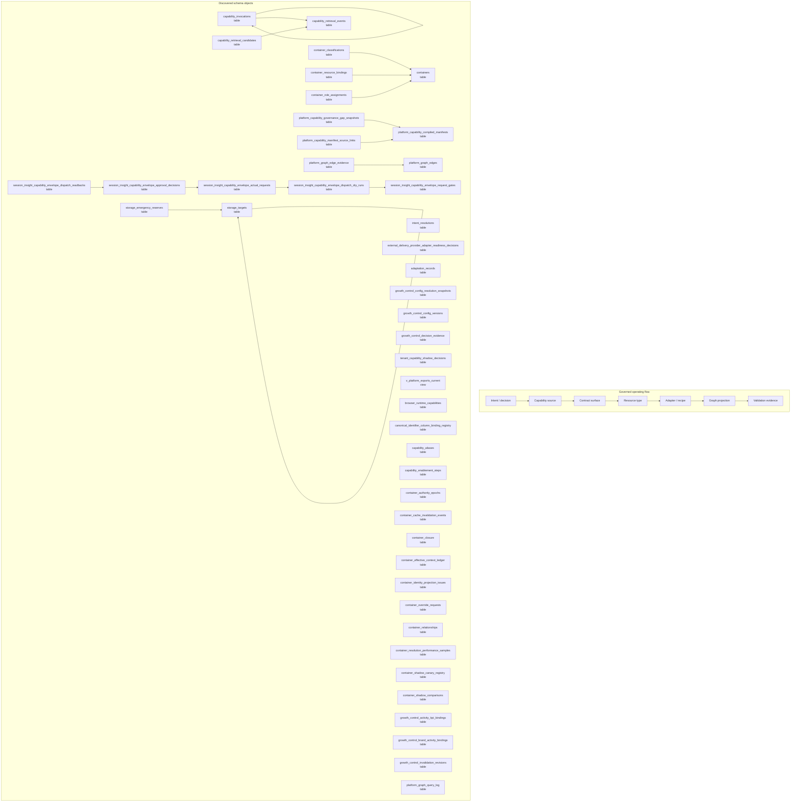

# Platform Resource, Capability, and Graph Map

> Generated text documentation. Do not edit this file manually.
> Source hash: `1121f14f08e34add18270e932d4fe65e775a5084c53c16f27cfa412075f035d6`
> Source count: **73**
> Sources: `http-generic-api/migrations/006_sprint08_planner.sql`, `http-generic-api/migrations/009_sprint05_logic_graph.sql`, `http-generic-api/migrations/016_sprint20_agent_registry.sql`, `http-generic-api/migrations/038_sprint42_platform_runtime_config.sql`, `http-generic-api/migrations/039_sprint43_data_integrity_and_missing_tables.sql`, `http-generic-api/migrations/040_sprint44_expand_surfaces_and_repair_schema.sql`, `http-generic-api/migrations/041_sprint44b_knowledge_surface_enforcement.sql`, `http-generic-api/migrations/062_sprint56b_connector_registry_diagnostic_views.sql`, `http-generic-api/migrations/066_sprint57_app_tool_bindings.sql`, `http-generic-api/migrations/1006_sprint69_agent_capability_evidence_coverage.sql`, _... +63 more_
> Rendering: Mermaid plus Markdown tables; no image assets or raw database rows are generated.

## Discovered object inventory

| Object | Type | Domain | Classification | Existing map refs | Source migrations | Columns | References |
|---|---|---|---|---|---:|---:|---|
| `adaptation_records` | table | Platform resources & graph | generated_domain_rule | - | 2 | 12 | `tenants` |
| `ads_provider_capability_profile_registry` | table | Platform resources & graph | generated_domain_rule | - | 1 | - | - |
| `browser_runtime_capabilities` | table | Platform resources & graph | generated_domain_rule | - | 1 | 9 | `browser_runtime_registry` |
| `canonical_capabilities` | table | Platform resources & graph | generated_domain_rule | - | 1 | - | - |
| `canonical_identifier_column_binding_registry` | table | Platform resources & graph | registry:canonical_identifier_registries | `data-model-domain-map`, `platform-resource-graph-map`, `policy-authority-map` | 1 | - | `canonical_identifier_contract_registry` |
| `canonical_identifier_contract_registry` | table | Platform resources & graph | registry:canonical_identifier_registries | `data-model-domain-map`, `platform-resource-graph-map`, `policy-authority-map` | 1 | - | - |
| `capability_aliases` | table | Platform resources & graph | generated_domain_rule | - | 1 | - | `canonical_capabilities` |
| `capability_apply_authorization_policy_registry` | table | Platform resources & graph | generated_domain_rule | - | 1 | 21 | - |
| `capability_enablement_requests` | table | Platform resources & graph | generated_domain_rule | - | 1 | - | - |
| `capability_enablement_steps` | table | Platform resources & graph | generated_domain_rule | - | 1 | - | `capability_enablement_requests` |
| `capability_envelope_template_resolutions` | table | Platform resources & graph | generated_domain_rule | - | 1 | - | - |
| `capability_envelope_templates` | table | Platform resources & graph | generated_domain_rule | - | 1 | - | - |
| `capability_invocations` | table | Platform resources & graph | generated_domain_rule | - | 1 | 22 | `agents`, `capability_invocations`, `capability_retrieval_events`, `step_runs`, `workflow_runs` |
| `capability_resolution_envelope_ledger` | table | Platform resources & graph | generated_domain_rule | - | 1 | - | - |
| `capability_retrieval_candidates` | table | Platform resources & graph | generated_domain_rule | - | 1 | 17 | `capability_retrieval_events` |
| `capability_retrieval_events` | table | Platform resources & graph | generated_domain_rule | - | 1 | 16 | `agents`, `tenants`, `users` |
| `container_authority_epochs` | table | Platform resources & graph | registry:dynamic_container_authority | `data-model-domain-map`, `observability-release-map`, `platform-resource-graph-map`, `policy-authority-map` | 1 | 5 | `tenants` |
| `container_authority_idempotency` | table | Platform resources & graph | registry:dynamic_container_authority | `data-model-domain-map`, `observability-release-map`, `platform-resource-graph-map`, `policy-authority-map` | 1 | 8 | - |
| `container_cache_invalidation_events` | table | Platform resources & graph | registry:dynamic_container_authority | `data-model-domain-map`, `observability-release-map`, `platform-resource-graph-map`, `policy-authority-map` | 1 | 8 | `tenants` |
| `container_canary_observations` | table | Platform resources & graph | registry:dynamic_container_authority | `data-model-domain-map`, `observability-release-map`, `platform-resource-graph-map`, `policy-authority-map` | 1 | 16 | - |
| `container_classification_type_registry` | table | Platform resources & graph | registry:dynamic_container_authority | `data-model-domain-map`, `observability-release-map`, `platform-resource-graph-map`, `policy-authority-map` | 1 | 15 | - |
| `container_classifications` | table | Platform resources & graph | registry:dynamic_container_authority | `data-model-domain-map`, `observability-release-map`, `platform-resource-graph-map`, `policy-authority-map` | 1 | 17 | `containers`, `tenants` |
| `container_closure` | table | Platform resources & graph | registry:dynamic_container_authority | `data-model-domain-map`, `observability-release-map`, `platform-resource-graph-map`, `policy-authority-map` | 1 | 9 | `tenants` |
| `container_effective_context_ledger` | table | Platform resources & graph | registry:dynamic_container_authority | `data-model-domain-map`, `observability-release-map`, `platform-resource-graph-map`, `policy-authority-map` | 1 | 29 | `tenants` |
| `container_identity_projection_issues` | table | Platform resources & graph | registry:dynamic_container_authority | `data-model-domain-map`, `observability-release-map`, `platform-resource-graph-map`, `policy-authority-map` | 1 | 13 | `tenants` |
| `container_override_approvals` | table | Platform resources & graph | registry:dynamic_container_authority | `data-model-domain-map`, `observability-release-map`, `platform-resource-graph-map`, `policy-authority-map` | 1 | 8 | - |
| `container_override_consumptions` | table | Platform resources & graph | registry:dynamic_container_authority | `data-model-domain-map`, `observability-release-map`, `platform-resource-graph-map`, `policy-authority-map` | 1 | 13 | - |
| `container_override_policy_registry` | table | Platform resources & graph | registry:dynamic_container_authority | `data-model-domain-map`, `observability-release-map`, `platform-resource-graph-map`, `policy-authority-map` | 1 | 9 | - |
| `container_override_requests` | table | Platform resources & graph | registry:dynamic_container_authority | `data-model-domain-map`, `observability-release-map`, `platform-resource-graph-map`, `policy-authority-map` | 1 | 27 | `tenants` |
| `container_projection_runs` | table | Platform resources & graph | registry:dynamic_container_authority | `data-model-domain-map`, `observability-release-map`, `platform-resource-graph-map`, `policy-authority-map` | 1 | 12 | - |
| `container_relationship_type_registry` | table | Platform resources & graph | registry:dynamic_container_authority | `data-model-domain-map`, `observability-release-map`, `platform-resource-graph-map`, `policy-authority-map` | 1 | 14 | - |
| `container_relationships` | table | Platform resources & graph | registry:dynamic_container_authority | `data-model-domain-map`, `observability-release-map`, `platform-resource-graph-map`, `policy-authority-map` | 1 | 16 | `tenants` |
| `container_resolution_performance_samples` | table | Platform resources & graph | registry:dynamic_container_authority | `data-model-domain-map`, `observability-release-map`, `platform-resource-graph-map`, `policy-authority-map` | 1 | 12 | `tenants` |
| `container_resource_bindings` | table | Platform resources & graph | registry:dynamic_container_authority | `data-model-domain-map`, `observability-release-map`, `platform-resource-graph-map`, `policy-authority-map` | 1 | 28 | `containers`, `tenants` |
| `container_resource_dimension_registry` | table | Platform resources & graph | registry:dynamic_container_authority | `data-model-domain-map`, `observability-release-map`, `platform-resource-graph-map`, `policy-authority-map` | 1 | 17 | - |
| `container_role_assignments` | table | Platform resources & graph | registry:dynamic_container_authority | `data-model-domain-map`, `observability-release-map`, `platform-resource-graph-map`, `policy-authority-map` | 1 | 17 | `containers`, `tenants` |
| `container_role_template_permissions` | table | Platform resources & graph | registry:dynamic_container_authority | `data-model-domain-map`, `observability-release-map`, `platform-resource-graph-map`, `policy-authority-map` | 1 | 10 | - |
| `container_role_template_registry` | table | Platform resources & graph | registry:dynamic_container_authority | `data-model-domain-map`, `observability-release-map`, `platform-resource-graph-map`, `policy-authority-map` | 1 | 12 | - |
| `container_rollout_policy_registry` | table | Platform resources & graph | registry:dynamic_container_authority | `data-model-domain-map`, `observability-release-map`, `platform-resource-graph-map`, `policy-authority-map` | 1 | 13 | - |
| `container_shadow_canary_registry` | table | Platform resources & graph | registry:dynamic_container_authority | `data-model-domain-map`, `observability-release-map`, `platform-resource-graph-map`, `policy-authority-map` | 1 | 10 | `tenants` |
| `container_shadow_comparisons` | table | Platform resources & graph | registry:dynamic_container_authority | `data-model-domain-map`, `observability-release-map`, `platform-resource-graph-map`, `policy-authority-map` | 1 | 13 | `tenants` |
| `container_type_registry` | table | Platform resources & graph | registry:dynamic_container_authority | `data-model-domain-map`, `observability-release-map`, `platform-resource-graph-map`, `policy-authority-map` | 1 | 14 | - |
| `containers` | table | Platform resources & graph | registry:dynamic_container_authority | `data-model-domain-map`, `observability-release-map`, `platform-resource-graph-map`, `policy-authority-map` | 1 | 14 | `tenants` |
| `decision_runs` | table | Platform resources & graph | generated_domain_rule | - | 1 | - | - |
| `execution_intent_contract_bindings` | table | Platform resources & graph | generated_domain_rule | - | 1 | - | - |
| `external_delivery_provider_adapter_readiness_decisions` | table | Platform resources & graph | generated_domain_rule | - | 1 | 18 | `external_delivery_provider_adapter_contract_registry`, `external_delivery_provider_adapter_enablement_proposals`, `external_delivery_provider_adapter_readiness_checklists` |
| `growth_control_activity_kpi_bindings` | table | Governance & authority | registry:growth_control_kpi_authority_objects | `data-model-domain-map`, `platform-resource-graph-map`, `policy-authority-map`, `workflow-task-orchestration-map` | 1 | 21 | `tenants` |
| `growth_control_activity_pack_definitions` | table | Workflow & tasks | registry:growth_control_activity_objects | `data-model-domain-map`, `platform-resource-graph-map`, `policy-authority-map`, `workflow-task-orchestration-map` | 1 | 10 | - |
| `growth_control_activity_pack_versions` | table | Workflow & tasks | registry:growth_control_activity_objects | `data-model-domain-map`, `platform-resource-graph-map`, `policy-authority-map`, `workflow-task-orchestration-map` | 1 | 13 | - |
| `growth_control_brand_activity_bindings` | table | Workflow & tasks | registry:growth_control_activity_objects | `data-model-domain-map`, `platform-resource-graph-map`, `policy-authority-map`, `workflow-task-orchestration-map` | 1 | 22 | `tenants` |
| `growth_control_config_definitions` | table | Governance & authority | registry:growth_control_configuration_objects | `data-model-domain-map`, `observability-release-map`, `platform-resource-graph-map`, `policy-authority-map` | 1 | 14 | - |
| `growth_control_config_resolution_snapshots` | table | Governance & authority | registry:growth_control_configuration_objects | `data-model-domain-map`, `observability-release-map`, `platform-resource-graph-map`, `policy-authority-map` | 1 | 19 | `plans`, `tenants` |
| `growth_control_config_versions` | table | Governance & authority | registry:growth_control_configuration_objects | `data-model-domain-map`, `observability-release-map`, `platform-resource-graph-map`, `policy-authority-map` | 1 | 29 | `plans`, `tenants` |
| `growth_control_decision_evidence` | table | Observability & release | registry:growth_control_decision_reconciliation_objects | `data-model-domain-map`, `execution-log-evidence-map`, `observability-release-map`, `policy-authority-map`, `workflow-task-orchestration-map` | 1 | 23 | `plans`, `tenants` |
| `growth_control_invalidation_revisions` | table | Governance & authority | registry:growth_control_configuration_objects | `data-model-domain-map`, `observability-release-map`, `platform-resource-graph-map`, `policy-authority-map` | 1 | 16 | `tenants` |
| `growth_control_kpi_definitions` | table | Governance & authority | registry:growth_control_kpi_authority_objects | `data-model-domain-map`, `platform-resource-graph-map`, `policy-authority-map`, `workflow-task-orchestration-map` | 1 | 17 | - |
| `growth_dashboard_instruction_registry` | table | Agents & intelligence | registry:growth_dashboard_intelligence | `agent-skill-plugin-map`, `data-model-domain-map`, `platform-resource-graph-map` | 1 | - | - |
| `growth_dashboard_metric_registry` | table | Agents & intelligence | registry:growth_dashboard_intelligence | `agent-skill-plugin-map`, `data-model-domain-map`, `platform-resource-graph-map` | 1 | - | - |
| `growth_dashboard_tab_profile_registry` | table | Agents & intelligence | registry:growth_dashboard_intelligence | `agent-skill-plugin-map`, `data-model-domain-map`, `platform-resource-graph-map` | 1 | - | - |
| `intent_resolutions` | table | Platform resources & graph | generated_domain_rule | - | 3 | 13 | `tenants`, `users` |
| `local_connector_capability_grants` | table | Platform resources & graph | generated_domain_rule | - | 1 | 10 | - |
| `platform_capability_certifications` | table | Platform resources & graph | generated_domain_rule | - | 1 | 17 | - |
| `platform_capability_compilation_runs` | table | Platform resources & graph | generated_domain_rule | - | 1 | 24 | - |
| `platform_capability_compiled_manifests` | table | Platform resources & graph | generated_domain_rule | - | 1 | 17 | `platform_capability_compilation_runs` |
| `platform_capability_debt` | table | Platform resources & graph | generated_domain_rule | - | 1 | 14 | - |
| `platform_capability_envelope_binding_links` | table | Platform resources & graph | generated_domain_rule | - | 1 | 5 | - |
| `platform_capability_envelope_evidence_links` | table | Platform resources & graph | generated_domain_rule | - | 1 | 5 | - |
| `platform_capability_governance_gap_snapshots` | table | Platform resources & graph | generated_domain_rule | - | 1 | 13 | `platform_capability_compilation_runs`, `platform_capability_compiled_manifests` |
| `platform_capability_manifest_source_links` | table | Platform resources & graph | generated_domain_rule | - | 1 | 8 | `platform_capability_compiled_manifests` |
| `platform_capability_provider_bindings` | table | Platform resources & graph | generated_domain_rule | - | 1 | 16 | - |
| `platform_capability_readback_contracts` | table | Platform resources & graph | generated_domain_rule | - | 1 | - | - |
| `platform_capability_source_links` | table | Platform resources & graph | generated_domain_rule | - | 1 | 11 | - |
| `platform_capability_source_resolutions` | table | Platform resources & graph | generated_domain_rule | - | 1 | - | - |
| `platform_contract_surfaces` | table | Platform resources & graph | generated_domain_rule | - | 1 | - | - |
| `platform_data_table_registry` | table | Platform resources & graph | registry:platform_data_and_governed_projections | `data-model-domain-map`, `platform-resource-graph-map`, `policy-authority-map` | 1 | 27 | - |
| `platform_graph_edge_evidence` | table | Platform resources & graph | generated_domain_rule | - | 1 | 9 | `platform_graph_edges` |
| `platform_graph_edges` | table | Platform resources & graph | generated_domain_rule | - | 1 | 17 | `platform_graph_nodes` |
| `platform_graph_memory_rank_rules` | table | Platform resources & graph | generated_domain_rule | - | 1 | 7 | - |
| `platform_graph_nodes` | table | Platform resources & graph | generated_domain_rule | - | 1 | 17 | - |
| `platform_graph_projection_runs` | table | Platform resources & graph | generated_domain_rule | - | 1 | 11 | - |
| `platform_graph_query_log` | table | Platform resources & graph | generated_domain_rule | - | 2 | 7 | - |
| `platform_graph_taxonomy` | table | Platform resources & graph | generated_domain_rule | - | 1 | 9 | - |
| `platform_graph_validation_runs` | table | Platform resources & graph | generated_domain_rule | - | 1 | 11 | - |
| `platform_plugin_capabilities` | table | Platform resources & graph | generated_domain_rule | - | 1 | 21 | - |
| `platform_plugin_capability_exports` | table | Platform resources & graph | generated_domain_rule | - | 1 | 12 | - |
| `platform_resource_adapters` | table | Platform resources & graph | generated_domain_rule | - | 1 | 16 | - |
| `platform_resource_authority_bindings` | table | Platform resources & graph | generated_domain_rule | - | 1 | - | - |
| `platform_resource_authority_requirements` | table | Platform resources & graph | generated_domain_rule | - | 1 | - | - |
| `platform_resource_coverage_findings` | table | Platform resources & graph | generated_domain_rule | - | 1 | - | - |
| `platform_resource_coverage_runs` | table | Platform resources & graph | generated_domain_rule | - | 1 | - | - |
| `platform_resource_operation_registry` | table | Platform resources & graph | generated_domain_rule | - | 1 | - | - |
| `platform_resource_recipe_steps` | table | Platform resources & graph | generated_domain_rule | - | 1 | 18 | - |
| `platform_resource_recipes` | table | Platform resources & graph | generated_domain_rule | - | 1 | 21 | - |
| `platform_resource_surface_policy_registry` | table | Platform resources & graph | generated_domain_rule | - | 1 | - | - |
| `platform_resource_type_registry` | table | Platform resources & graph | generated_domain_rule | - | 1 | - | - |
| `platform_resource_types` | table | Platform resources & graph | generated_domain_rule | - | 1 | 18 | - |
| `platform_runtime_config` | table | Platform resources & graph | generated_domain_rule | - | 1 | 6 | - |
| `platform_semantic_capabilities` | table | Platform resources & graph | generated_domain_rule | - | 1 | 20 | - |
| `registry_surfaces_catalog` | table | Platform resources & graph | generated_domain_rule | - | 2 | 20 | - |
| `repo_capability_candidates` | table | Repository & development | generated_domain_rule | - | 1 | - | - |
| `repository_capability_bindings` | table | Repository & development | registry:repository_automation_control_plane | `data-model-domain-map`, `observability-release-map`, `repository-automation-map`, `repository-development-map` | 1 | - | - |
| `repository_capability_policy_layers` | table | Repository & development | registry:repository_automation_control_plane | `data-model-domain-map`, `observability-release-map`, `repository-automation-map`, `repository-development-map` | 1 | - | - |
| `session_insight_capability_envelope_actual_request_preflights` | table | Platform resources & graph | generated_domain_rule | - | 1 | 29 | `session_insight_capability_envelope_dispatch_dry_runs` |
| `session_insight_capability_envelope_actual_requests` | table | Platform resources & graph | generated_domain_rule | - | 1 | 34 | `session_insight_capability_envelope_actual_request_preflights`, `session_insight_capability_envelope_dispatch_dry_runs` |
| `session_insight_capability_envelope_adapter_execution_gates` | table | Platform resources & graph | generated_domain_rule | - | 1 | 29 | `session_insight_capability_envelope_dispatch_readbacks` |
| `session_insight_capability_envelope_approval_decisions` | table | Platform resources & graph | generated_domain_rule | - | 1 | 30 | `approval_holds`, `session_insight_capability_envelope_actual_requests` |
| `session_insight_capability_envelope_dispatch_dry_runs` | table | Platform resources & graph | generated_domain_rule | - | 2 | 26 | `session_insight_capability_envelope_request_gates` |
| `session_insight_capability_envelope_dispatch_readbacks` | table | Platform resources & graph | generated_domain_rule | - | 1 | 33 | `approval_holds`, `session_insight_capability_envelope_approval_decisions` |
| `session_insight_capability_envelope_plans` | table | Platform resources & graph | generated_domain_rule | - | 1 | 24 | `session_insight_promotion_payload_previews` |
| `session_insight_capability_envelope_remaining_scope_completions` | table | Platform resources & graph | generated_domain_rule | - | 1 | 35 | `session_insight_capability_envelope_adapter_execution_gates` |
| `session_insight_capability_envelope_request_gate_review_events` | table | Platform resources & graph | generated_domain_rule | - | 1 | 18 | `session_insight_capability_envelope_request_gates` |
| `session_insight_capability_envelope_request_gates` | table | Platform resources & graph | generated_domain_rule | - | 2 | 25 | `session_insight_capability_envelope_plans` |
| `storage_cleanup_plan_impacts` | table | Governance & authority | registry:spec014_hostinger_storage_cleanup_plan_impacts | `data-model-domain-map`, `platform-resource-graph-map`, `policy-authority-map`, `workflow-task-orchestration-map` | 1 | - | `storage_cleanup_plans` |
| `storage_emergency_reserves` | table | Delivery & support | registry:spec014_hostinger_storage_emergency_reserves | `data-model-domain-map`, `delivery-support-map`, `observability-release-map`, `platform-resource-graph-map` | 1 | - | `storage_provider_accounts`, `storage_targets` |
| `storage_provider_accounts` | table | Connectors & providers | registry:spec014_hostinger_storage_provider_accounts | `connector-provider-map`, `data-model-domain-map`, `platform-resource-graph-map` | 1 | - | - |
| `storage_target_bindings` | table | Platform resources & graph | registry:spec014_hostinger_storage_target_bindings | `data-model-domain-map`, `platform-resource-graph-map`, `policy-authority-map` | 1 | - | `storage_targets` |
| `storage_targets` | table | Platform resources & graph | registry:spec014_hostinger_storage_targets | `connector-provider-map`, `data-model-domain-map`, `platform-resource-graph-map`, `policy-authority-map` | 1 | - | `storage_provider_accounts`, `storage_targets` |
| `tenant_capability_shadow_decisions` | table | Platform resources & graph | generated_domain_rule | - | 1 | 13 | `tenants`, `users` |
| `v_app_integration_capability_map` | view | Platform resources & graph | generated_domain_rule | - | 2 | - | - |
| `v_capability_alias_integrity` | view | Platform resources & graph | generated_domain_rule | - | 1 | - | - |
| `v_capability_enablement_decision_rollup` | view | Platform resources & graph | generated_domain_rule | - | 1 | - | - |
| `v_capability_enablement_operational_attention` | view | Platform resources & graph | generated_domain_rule | - | 1 | - | - |
| `v_capability_enablement_operational_dashboard` | view | Platform resources & graph | generated_domain_rule | - | 1 | - | - |
| `v_container_active_hierarchy` | view | Platform resources & graph | registry:dynamic_container_authority | `data-model-domain-map`, `observability-release-map`, `platform-resource-graph-map`, `policy-authority-map` | 1 | - | - |
| `v_container_audit_coverage` | view | Platform resources & graph | registry:dynamic_container_authority | `data-model-domain-map`, `observability-release-map`, `platform-resource-graph-map`, `policy-authority-map` | 1 | - | - |
| `v_container_authority_foundation_summary` | view | Platform resources & graph | registry:dynamic_container_authority | `data-model-domain-map`, `observability-release-map`, `platform-resource-graph-map`, `policy-authority-map` | 1 | - | - |
| `v_container_canary_monitoring_summary` | view | Platform resources & graph | registry:dynamic_container_authority | `data-model-domain-map`, `observability-release-map`, `platform-resource-graph-map`, `policy-authority-map` | 1 | - | - |
| `v_container_latest_shadow_audit_coverage` | view | Platform resources & graph | registry:dynamic_container_authority | `data-model-domain-map`, `observability-release-map`, `platform-resource-graph-map`, `policy-authority-map` | 1 | - | - |
| `v_container_latest_shadow_performance_summary` | view | Platform resources & graph | registry:dynamic_container_authority | `data-model-domain-map`, `observability-release-map`, `platform-resource-graph-map`, `policy-authority-map` | 1 | - | - |
| `v_container_latest_shadow_run_summary` | view | Platform resources & graph | registry:dynamic_container_authority | `data-model-domain-map`, `observability-release-map`, `platform-resource-graph-map`, `policy-authority-map` | 1 | - | - |
| `v_container_override_readiness` | view | Platform resources & graph | registry:dynamic_container_authority | `data-model-domain-map`, `observability-release-map`, `platform-resource-graph-map`, `policy-authority-map` | 1 | - | - |
| `v_container_relationship_issues` | view | Platform resources & graph | registry:dynamic_container_authority | `data-model-domain-map`, `observability-release-map`, `platform-resource-graph-map`, `policy-authority-map` | 1 | - | - |
| `v_container_resolution_performance_summary` | view | Platform resources & graph | registry:dynamic_container_authority | `data-model-domain-map`, `observability-release-map`, `platform-resource-graph-map`, `policy-authority-map` | 1 | - | - |
| `v_container_rollout_readiness` | view | Platform resources & graph | registry:dynamic_container_authority | `data-model-domain-map`, `observability-release-map`, `platform-resource-graph-map`, `policy-authority-map` | 2 | - | - |
| `v_container_rollout_readiness_v2` | view | Platform resources & graph | registry:dynamic_container_authority | `data-model-domain-map`, `observability-release-map`, `platform-resource-graph-map`, `policy-authority-map` | 1 | - | - |
| `v_container_shadow_mismatch_summary` | view | Platform resources & graph | registry:dynamic_container_authority | `data-model-domain-map`, `observability-release-map`, `platform-resource-graph-map`, `policy-authority-map` | 1 | - | - |
| `v_effective_platform_resource_authority_bindings` | view | Platform resources & graph | generated_domain_rule | - | 1 | - | - |
| `v_external_delivery_provider_adapter_readiness_decision_summary` | view | Platform resources & graph | generated_domain_rule | - | 1 | - | - |
| `v_platform_bindings_current` | view | Platform resources & graph | generated_domain_rule | - | 1 | - | - |
| `v_platform_capabilities_current` | view | Platform resources & graph | generated_domain_rule | - | 1 | - | - |
| `v_platform_capabilities_effective_evidence` | view | Platform resources & graph | generated_domain_rule | - | 1 | - | - |
| `v_platform_capability_assurance_gaps` | view | Platform resources & graph | generated_domain_rule | - | 1 | - | - |
| `v_platform_capability_assurance_summary` | view | Platform resources & graph | generated_domain_rule | - | 1 | - | - |
| `v_platform_capability_authority_evidence` | view | Platform resources & graph | generated_domain_rule | - | 1 | - | - |
| `v_platform_capability_export_projection` | view | Platform resources & graph | generated_domain_rule | - | 1 | - | - |
| `v_platform_capability_export_reconciliation` | view | Platform resources & graph | generated_domain_rule | - | 1 | - | - |
| `v_platform_capability_gaps` | view | Platform resources & graph | generated_domain_rule | - | 2 | - | - |
| `v_platform_capability_governance_persistence_summary` | view | Platform resources & graph | generated_domain_rule | - | 1 | - | - |
| `v_platform_capability_maturity` | view | Platform resources & graph | generated_domain_rule | - | 2 | - | - |
| `v_platform_capability_readback_readiness` | view | Platform resources & graph | generated_domain_rule | - | 1 | - | - |
| `v_platform_capability_readiness_vector` | view | Platform resources & graph | generated_domain_rule | - | 2 | - | - |
| `v_platform_exports_current` | view | Platform resources & graph | generated_domain_rule | - | 3 | - | - |
| `v_platform_exports_current_v2` | view | Platform resources & graph | generated_domain_rule | - | 1 | - | - |
| `v_platform_governed_bindings_current` | view | Platform resources & graph | registry:platform_data_and_governed_projections | `data-model-domain-map`, `platform-resource-graph-map`, `policy-authority-map` | 1 | - | - |
| `v_platform_governed_capabilities_current` | view | Platform resources & graph | generated_domain_rule | - | 1 | - | - |
| `v_platform_governed_exports_current` | view | Platform resources & graph | registry:platform_data_and_governed_projections | `data-model-domain-map`, `platform-resource-graph-map`, `policy-authority-map` | 1 | - | - |
| `v_platform_relationship_integrity_issues` | view | Platform resources & graph | generated_domain_rule | - | 2 | - | - |
| `v_platform_relationship_integrity_score` | view | Platform resources & graph | generated_domain_rule | - | 2 | - | - |
| `v_platform_relationship_integrity_summary` | view | Platform resources & graph | generated_domain_rule | - | 2 | - | - |
| `v_platform_resource_api_coverage` | view | Platform resources & graph | generated_domain_rule | - | 1 | - | - |
| `v_platform_resource_capability_baseline` | view | Platform resources & graph | generated_domain_rule | - | 1 | - | - |
| `v_platform_virtual_tool_capabilities_current` | view | Platform resources & graph | generated_domain_rule | - | 1 | - | - |
| `v_platform_virtual_tool_capability_gaps` | view | Platform resources & graph | generated_domain_rule | - | 1 | - | - |
| `v_remaining_resource_capability_completion_readiness` | view | Platform resources & graph | generated_domain_rule | - | 1 | - | - |
| `v_repository_capability_binding_readiness` | view | Repository & development | generated_domain_rule | - | 1 | - | - |
| `v_resource_recipe_certification_compact` | view | Platform resources & graph | generated_domain_rule | - | 1 | - | - |
| `v_resource_recipe_registry_compact` | view | Platform resources & graph | generated_domain_rule | - | 1 | - | - |
| `v_session_insight_capability_envelope_actual_request_issues` | view | Platform resources & graph | generated_domain_rule | - | 1 | - | - |
| `v_session_insight_capability_envelope_approval_decision_issues` | view | Platform resources & graph | generated_domain_rule | - | 1 | - | - |
| `v_session_insight_capability_envelope_approval_readiness` | view | Platform resources & graph | generated_domain_rule | - | 1 | - | - |
| `v_session_insight_capability_envelope_dispatch_dry_run_issues` | view | Platform resources & graph | generated_domain_rule | - | 1 | - | - |
| `v_session_insight_capability_envelope_dispatch_dry_run_readiness` | view | Platform resources & graph | generated_domain_rule | - | 1 | - | - |
| `v_session_insight_capability_envelope_dispatch_readback_issues` | view | Platform resources & graph | generated_domain_rule | - | 1 | - | - |
| `v_session_insight_capability_envelope_plan_issues` | view | Platform resources & graph | generated_domain_rule | - | 1 | - | - |
| `v_session_insight_capability_envelope_plan_readiness` | view | Platform resources & graph | generated_domain_rule | - | 1 | - | - |
| `v_session_insight_capability_envelope_request_dispatch_readiness` | view | Platform resources & graph | generated_domain_rule | - | 1 | - | - |
| `v_session_insight_capability_envelope_request_gate_issues` | view | Platform resources & graph | generated_domain_rule | - | 1 | - | - |
| `v_session_insight_capability_envelope_request_gate_readiness` | view | Platform resources & graph | generated_domain_rule | - | 1 | - | - |
| `v_session_insight_capability_envelope_request_review_issues` | view | Platform resources & graph | generated_domain_rule | - | 1 | - | - |
| `v_session_insight_capability_envelope_request_review_queue` | view | Platform resources & graph | generated_domain_rule | - | 1 | - | - |
| `v_tenant_effective_capability_candidates` | view | Platform resources & graph | generated_domain_rule | - | 1 | - | - |

## Coverage counters

- Matching schema objects: **181**
- Diagram objects shown: **45**
- Source migrations: **73**
