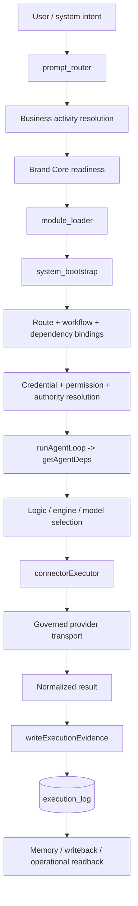

# Platform Runtime Work Map

> Generated text documentation. Do not edit this file manually.
> Source hash: `9a070f905f809499f29e9914b463926ee7fda960c7e96120133790ead883d259`
> Source count: **6**
> Sources: `http-generic-api/agentRuntime.js`, `http-generic-api/connectorExecutor.js`, `http-generic-api/executionEvidenceLogger.js`, `module_loader.md`, `prompt_router.md`, `system_bootstrap.md`
> Rendering: Mermaid code blocks plus Markdown tables; no image assets are generated.

## Runtime invariants

- Provider calls are routed through governed connector transport.
- Brand writing requires resolved Brand Core evidence.
- Business activity type is resolved before knowledge and engine compatibility.
- Agent workflows use `runAgentLoop -> getAgentDeps()`.
- Execution evidence records identity, authorization, business context, runtime surfaces, and intelligence attribution.
- Secret values and sensitive payload fields are excluded from generated documentation and execution evidence.
