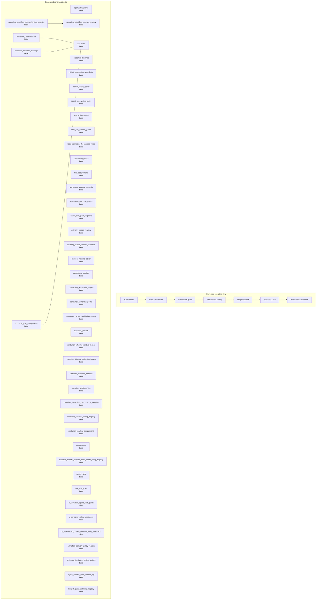

# Policy, Permission, and Authority Map

> Generated text documentation. Do not edit this file manually.
> Source hash: `00507b37c4336ba68ca88d00cb66273736e984a719ae9e01649cba8c47ce3301`
> Source count: **70**
> Sources: `http-generic-api/migrations/002_sprint03_identity.sql`, `http-generic-api/migrations/005_sprint07_connected_systems.sql`, `http-generic-api/migrations/011_sprint15_observability.sql`, `http-generic-api/migrations/012_sprint16_security.sql`, `http-generic-api/migrations/013_sprint17_developer_api.sql`, `http-generic-api/migrations/016_sprint20_agent_registry.sql`, `http-generic-api/migrations/017_sprint21_output_sink_router.sql`, `http-generic-api/migrations/019_sprint24_workflow_seeds_and_skills.sql`, `http-generic-api/migrations/020_sprint25_user_app_integrations.sql`, `http-generic-api/migrations/030_sprint33_local_connector_tables.sql`, _... +60 more_
> Rendering: Mermaid plus Markdown tables; no image assets or raw database rows are generated.

## Discovered object inventory

| Object | Type | Domain | Classification | Existing map refs | Source migrations | Columns | References |
|---|---|---|---|---|---:|---:|---|
| `activation_delivery_policy_registry` | table | Activation & onboarding | generated_domain_rule | - | 1 | - | - |
| `activation_freshness_policy_registry` | table | Activation & onboarding | generated_domain_rule | - | 1 | - | - |
| `admin_scope_grants` | table | Governance & authority | generated_domain_rule | - | 1 | 17 | `tenants`, `users` |
| `agent_handoff_state_access_log` | table | Agents & intelligence | generated_domain_rule | - | 1 | - | - |
| `agent_skill_grant_requests` | table | Agents & intelligence | generated_domain_rule | - | 2 | - | - |
| `agent_skill_grants` | table | Agents & intelligence | generated_domain_rule | - | 3 | 10 | `agents`, `tenants` |
| `agent_supervision_policy` | table | Agents & intelligence | generated_domain_rule | - | 1 | 6 | `agents`, `tenants` |
| `app_action_grants` | table | Workflow & tasks | generated_domain_rule | - | 2 | 12 | `agents` |
| `authority_scope_registry` | table | Governance & authority | generated_domain_rule | - | 1 | 10 | `tenants` |
| `authority_scope_shadow_evidence` | table | Governance & authority | generated_domain_rule | - | 1 | 23 | `tenants` |
| `browser_runtime_policy` | table | Connectors & providers | generated_domain_rule | - | 1 | 10 | `tenants` |
| `budget_quota_authority_registry` | table | Governance & authority | generated_domain_rule | - | 1 | - | - |
| `canonical_identifier_column_binding_registry` | table | Platform resources & graph | registry:canonical_identifier_registries | `data-model-domain-map`, `platform-resource-graph-map`, `policy-authority-map` | 1 | - | `canonical_identifier_contract_registry` |
| `canonical_identifier_contract_registry` | table | Platform resources & graph | registry:canonical_identifier_registries | `data-model-domain-map`, `platform-resource-graph-map`, `policy-authority-map` | 1 | - | - |
| `capability_apply_authorization_policy_registry` | table | Platform resources & graph | generated_domain_rule | - | 1 | 21 | - |
| `cms_site_access_grants` | table | Connectors & providers | generated_domain_rule | - | 3 | - | - |
| `compliance_profiles` | table | Governance & authority | generated_domain_rule | - | 1 | 8 | `tenants` |
| `connection_ownership_scopes` | table | Connectors & providers | registry:connection_ownership_context | `connector-provider-map`, `data-model-domain-map`, `policy-authority-map` | 1 | 19 | `tenants` |
| `container_authority_epochs` | table | Platform resources & graph | registry:dynamic_container_authority | `data-model-domain-map`, `observability-release-map`, `platform-resource-graph-map`, `policy-authority-map` | 1 | 5 | `tenants` |
| `container_authority_idempotency` | table | Platform resources & graph | registry:dynamic_container_authority | `data-model-domain-map`, `observability-release-map`, `platform-resource-graph-map`, `policy-authority-map` | 1 | 8 | - |
| `container_cache_invalidation_events` | table | Platform resources & graph | registry:dynamic_container_authority | `data-model-domain-map`, `observability-release-map`, `platform-resource-graph-map`, `policy-authority-map` | 1 | 8 | `tenants` |
| `container_canary_observations` | table | Platform resources & graph | registry:dynamic_container_authority | `data-model-domain-map`, `observability-release-map`, `platform-resource-graph-map`, `policy-authority-map` | 1 | 16 | - |
| `container_classification_type_registry` | table | Platform resources & graph | registry:dynamic_container_authority | `data-model-domain-map`, `observability-release-map`, `platform-resource-graph-map`, `policy-authority-map` | 1 | 15 | - |
| `container_classifications` | table | Platform resources & graph | registry:dynamic_container_authority | `data-model-domain-map`, `observability-release-map`, `platform-resource-graph-map`, `policy-authority-map` | 1 | 17 | `containers`, `tenants` |
| `container_closure` | table | Platform resources & graph | registry:dynamic_container_authority | `data-model-domain-map`, `observability-release-map`, `platform-resource-graph-map`, `policy-authority-map` | 1 | 9 | `tenants` |
| `container_effective_context_ledger` | table | Platform resources & graph | registry:dynamic_container_authority | `data-model-domain-map`, `observability-release-map`, `platform-resource-graph-map`, `policy-authority-map` | 1 | 29 | `tenants` |
| `container_identity_projection_issues` | table | Platform resources & graph | registry:dynamic_container_authority | `data-model-domain-map`, `observability-release-map`, `platform-resource-graph-map`, `policy-authority-map` | 1 | 13 | `tenants` |
| `container_override_approvals` | table | Platform resources & graph | registry:dynamic_container_authority | `data-model-domain-map`, `observability-release-map`, `platform-resource-graph-map`, `policy-authority-map` | 1 | 8 | - |
| `container_override_consumptions` | table | Platform resources & graph | registry:dynamic_container_authority | `data-model-domain-map`, `observability-release-map`, `platform-resource-graph-map`, `policy-authority-map` | 1 | 13 | - |
| `container_override_policy_registry` | table | Platform resources & graph | registry:dynamic_container_authority | `data-model-domain-map`, `observability-release-map`, `platform-resource-graph-map`, `policy-authority-map` | 1 | 9 | - |
| `container_override_requests` | table | Platform resources & graph | registry:dynamic_container_authority | `data-model-domain-map`, `observability-release-map`, `platform-resource-graph-map`, `policy-authority-map` | 1 | 27 | `tenants` |
| `container_projection_runs` | table | Platform resources & graph | registry:dynamic_container_authority | `data-model-domain-map`, `observability-release-map`, `platform-resource-graph-map`, `policy-authority-map` | 1 | 12 | - |
| `container_relationship_type_registry` | table | Platform resources & graph | registry:dynamic_container_authority | `data-model-domain-map`, `observability-release-map`, `platform-resource-graph-map`, `policy-authority-map` | 1 | 14 | - |
| `container_relationships` | table | Platform resources & graph | registry:dynamic_container_authority | `data-model-domain-map`, `observability-release-map`, `platform-resource-graph-map`, `policy-authority-map` | 1 | 16 | `tenants` |
| `container_resolution_performance_samples` | table | Platform resources & graph | registry:dynamic_container_authority | `data-model-domain-map`, `observability-release-map`, `platform-resource-graph-map`, `policy-authority-map` | 1 | 12 | `tenants` |
| `container_resource_bindings` | table | Platform resources & graph | registry:dynamic_container_authority | `data-model-domain-map`, `observability-release-map`, `platform-resource-graph-map`, `policy-authority-map` | 1 | 28 | `containers`, `tenants` |
| `container_resource_dimension_registry` | table | Platform resources & graph | registry:dynamic_container_authority | `data-model-domain-map`, `observability-release-map`, `platform-resource-graph-map`, `policy-authority-map` | 1 | 17 | - |
| `container_role_assignments` | table | Platform resources & graph | registry:dynamic_container_authority | `data-model-domain-map`, `observability-release-map`, `platform-resource-graph-map`, `policy-authority-map` | 1 | 17 | `containers`, `tenants` |
| `container_role_template_permissions` | table | Platform resources & graph | registry:dynamic_container_authority | `data-model-domain-map`, `observability-release-map`, `platform-resource-graph-map`, `policy-authority-map` | 1 | 10 | - |
| `container_role_template_registry` | table | Platform resources & graph | registry:dynamic_container_authority | `data-model-domain-map`, `observability-release-map`, `platform-resource-graph-map`, `policy-authority-map` | 1 | 12 | - |
| `container_rollout_policy_registry` | table | Platform resources & graph | registry:dynamic_container_authority | `data-model-domain-map`, `observability-release-map`, `platform-resource-graph-map`, `policy-authority-map` | 1 | 13 | - |
| `container_shadow_canary_registry` | table | Platform resources & graph | registry:dynamic_container_authority | `data-model-domain-map`, `observability-release-map`, `platform-resource-graph-map`, `policy-authority-map` | 1 | 10 | `tenants` |
| `container_shadow_comparisons` | table | Platform resources & graph | registry:dynamic_container_authority | `data-model-domain-map`, `observability-release-map`, `platform-resource-graph-map`, `policy-authority-map` | 1 | 13 | `tenants` |
| `container_type_registry` | table | Platform resources & graph | registry:dynamic_container_authority | `data-model-domain-map`, `observability-release-map`, `platform-resource-graph-map`, `policy-authority-map` | 1 | 14 | - |
| `containers` | table | Platform resources & graph | registry:dynamic_container_authority | `data-model-domain-map`, `observability-release-map`, `platform-resource-graph-map`, `policy-authority-map` | 1 | 14 | `tenants` |
| `credential_bindings` | table | Connectors & providers | generated_domain_rule | - | 2 | 20 | `installations`, `tenants`, `users` |
| `database_collation_policy_exception_registry` | table | Governance & authority | generated_domain_rule | - | 1 | - | - |
| `database_collation_policy_registry` | table | Governance & authority | generated_domain_rule | - | 1 | - | - |
| `entitlements` | table | Commercial & usage | generated_domain_rule | - | 1 | 8 | `tenants` |
| `external_delivery_provider_send_mode_policy_registry` | table | Delivery & support | generated_domain_rule | - | 1 | 14 | `external_delivery_provider_adapter_contract_registry` |
| `google_ads_budget_execution_gate_audit` | table | Governance & authority | generated_domain_rule | - | 1 | - | - |
| `google_ads_budget_preflight_ledger` | table | Governance & authority | generated_domain_rule | - | 1 | - | - |
| `intelligence_policy_rules` | table | Agents & intelligence | generated_domain_rule | - | 1 | - | - |
| `local_connector_capability_grants` | table | Platform resources & graph | generated_domain_rule | - | 1 | 10 | - |
| `local_connector_file_access_rules` | table | Connectors & providers | generated_domain_rule | - | 2 | 8 | `local_connector_user_configs` |
| `permission_grants` | table | Governance & authority | generated_domain_rule | - | 1 | 8 | `installations`, `tenants` |
| `platform_data_table_registry` | table | Platform resources & graph | registry:platform_data_and_governed_projections | `data-model-domain-map`, `platform-resource-graph-map`, `policy-authority-map` | 1 | 27 | - |
| `platform_engine_policy_registry` | table | Agents & intelligence | generated_domain_rule | - | 1 | - | - |
| `platform_engine_policy_rules` | table | Agents & intelligence | generated_domain_rule | - | 1 | - | - |
| `platform_resource_authority_bindings` | table | Platform resources & graph | generated_domain_rule | - | 1 | - | - |
| `platform_resource_authority_requirements` | table | Platform resources & graph | generated_domain_rule | - | 1 | - | - |
| `platform_resource_surface_policy_registry` | table | Platform resources & graph | generated_domain_rule | - | 1 | - | - |
| `platform_secret_movement_ledger` | table | Governance & authority | registry:platform_secret_movement | `data-model-domain-map`, `observability-release-map`, `policy-authority-map` | 1 | 15 | - |
| `policy_logic_bindings` | table | Agents & intelligence | generated_domain_rule | - | 1 | 12 | - |
| `policy_logic_mirror_classification` | table | Agents & intelligence | generated_domain_rule | - | 1 | - | - |
| `quota_rules` | table | Governance & authority | generated_domain_rule | - | 1 | 10 | `tenants` |
| `rate_limit_rules` | table | Governance & authority | generated_domain_rule | - | 1 | 11 | `tenants` |
| `repository_authority_aliases` | table | Repository & development | registry:repository_automation_control_plane | `data-model-domain-map`, `observability-release-map`, `repository-automation-map`, `repository-development-map` | 1 | - | - |
| `repository_authority_bindings` | table | Repository & development | registry:repository_automation_control_plane | `data-model-domain-map`, `observability-release-map`, `repository-automation-map`, `repository-development-map` | 1 | - | - |
| `repository_capability_policy_layers` | table | Repository & development | registry:repository_automation_control_plane | `data-model-domain-map`, `observability-release-map`, `repository-automation-map`, `repository-development-map` | 1 | - | - |
| `research_source_policy_registry` | table | Governance & authority | generated_domain_rule | - | 1 | - | - |
| `resource_authority_route_family_registry` | table | Workflow & tasks | generated_domain_rule | - | 1 | 16 | - |
| `role_assignments` | table | Tenancy & identity | generated_domain_rule | - | 1 | 9 | `tenants`, `users` |
| `sql_cache_runtime_policies` | table | Governance & authority | registry:sql_cache_runtime_policy | `data-model-domain-map`, `observability-release-map`, `policy-authority-map` | 1 | 7 | - |
| `ticket_permission_snapshots` | table | Delivery & support | generated_domain_rule | - | 1 | 14 | `tenants`, `tickets`, `users` |
| `user_brand_skill_grants` | table | Tenancy & identity | generated_domain_rule | - | 1 | - | - |
| `workspace_access_requests` | table | Tenancy & identity | generated_domain_rule | - | 3 | - | - |
| `workspace_resource_grants` | table | Tenancy & identity | generated_domain_rule | - | 3 | - | - |
| `effective_agent_delegation_grants_v` | view | Agents & intelligence | generated_domain_rule | - | 1 | - | - |
| `v_activation_agent_skill_grant_requests` | view | Activation & onboarding | generated_domain_rule | - | 1 | - | - |
| `v_activation_agent_skill_grants` | view | Activation & onboarding | generated_domain_rule | - | 2 | - | - |
| `v_activation_app_action_grants` | view | Activation & onboarding | generated_domain_rule | - | 1 | - | - |
| `v_active_memberships_missing_workspace_grants` | view | Tenancy & identity | generated_domain_rule | - | 1 | - | - |
| `v_authority_scope_shadow_summary` | view | Governance & authority | generated_domain_rule | - | 1 | - | - |
| `v_cloudflare_mutation_policy_readiness` | view | Connectors & providers | generated_domain_rule | - | 1 | - | - |
| `v_cms_active_grant_duplicate_groups` | view | Connectors & providers | generated_domain_rule | - | 1 | - | - |
| `v_cms_grants_without_workspace_membership` | view | Tenancy & identity | generated_domain_rule | - | 1 | - | - |
| `v_cms_publish_grants_missing_resource_grants` | view | Connectors & providers | generated_domain_rule | - | 1 | - | - |
| `v_container_active_hierarchy` | view | Platform resources & graph | registry:dynamic_container_authority | `data-model-domain-map`, `observability-release-map`, `platform-resource-graph-map`, `policy-authority-map` | 1 | - | - |
| `v_container_audit_coverage` | view | Platform resources & graph | registry:dynamic_container_authority | `data-model-domain-map`, `observability-release-map`, `platform-resource-graph-map`, `policy-authority-map` | 1 | - | - |
| `v_container_authority_foundation_summary` | view | Platform resources & graph | registry:dynamic_container_authority | `data-model-domain-map`, `observability-release-map`, `platform-resource-graph-map`, `policy-authority-map` | 1 | - | - |
| `v_container_canary_monitoring_summary` | view | Platform resources & graph | registry:dynamic_container_authority | `data-model-domain-map`, `observability-release-map`, `platform-resource-graph-map`, `policy-authority-map` | 1 | - | - |
| `v_container_latest_shadow_audit_coverage` | view | Platform resources & graph | registry:dynamic_container_authority | `data-model-domain-map`, `observability-release-map`, `platform-resource-graph-map`, `policy-authority-map` | 1 | - | - |
| `v_container_latest_shadow_performance_summary` | view | Platform resources & graph | registry:dynamic_container_authority | `data-model-domain-map`, `observability-release-map`, `platform-resource-graph-map`, `policy-authority-map` | 1 | - | - |
| `v_container_latest_shadow_run_summary` | view | Platform resources & graph | registry:dynamic_container_authority | `data-model-domain-map`, `observability-release-map`, `platform-resource-graph-map`, `policy-authority-map` | 1 | - | - |
| `v_container_override_readiness` | view | Platform resources & graph | registry:dynamic_container_authority | `data-model-domain-map`, `observability-release-map`, `platform-resource-graph-map`, `policy-authority-map` | 1 | - | - |
| `v_container_relationship_issues` | view | Platform resources & graph | registry:dynamic_container_authority | `data-model-domain-map`, `observability-release-map`, `platform-resource-graph-map`, `policy-authority-map` | 1 | - | - |
| `v_container_resolution_performance_summary` | view | Platform resources & graph | registry:dynamic_container_authority | `data-model-domain-map`, `observability-release-map`, `platform-resource-graph-map`, `policy-authority-map` | 1 | - | - |
| `v_container_rollout_readiness` | view | Platform resources & graph | registry:dynamic_container_authority | `data-model-domain-map`, `observability-release-map`, `platform-resource-graph-map`, `policy-authority-map` | 2 | - | - |
| `v_container_rollout_readiness_v2` | view | Platform resources & graph | registry:dynamic_container_authority | `data-model-domain-map`, `observability-release-map`, `platform-resource-graph-map`, `policy-authority-map` | 1 | - | - |
| `v_container_shadow_mismatch_summary` | view | Platform resources & graph | registry:dynamic_container_authority | `data-model-domain-map`, `observability-release-map`, `platform-resource-graph-map`, `policy-authority-map` | 1 | - | - |
| `v_context_kernel_connection_ownership_compatibility` | view | Connectors & providers | registry:connection_ownership_context | `connector-provider-map`, `data-model-domain-map`, `policy-authority-map` | 1 | - | - |
| `v_database_collation_policy_status` | view | Governance & authority | generated_domain_rule | - | 1 | - | - |
| `v_database_collation_policy_violations` | view | Governance & authority | generated_domain_rule | - | 1 | - | - |
| `v_effective_agent_skill_grants` | view | Agents & intelligence | generated_domain_rule | - | 1 | - | - |
| `v_effective_platform_resource_authority_bindings` | view | Platform resources & graph | generated_domain_rule | - | 1 | - | - |
| `v_effective_user_brand_skill_grants` | view | Tenancy & identity | generated_domain_rule | - | 1 | - | - |
| `v_hostinger_apply_policy_readiness` | view | Connectors & providers | generated_domain_rule | - | 1 | - | - |
| `v_hostinger_apply_policy_safe_field_readiness` | view | Connectors & providers | generated_domain_rule | - | 1 | - | - |
| `v_n8n_instance_mode_ownership_policy_readiness` | view | Connectors & providers | generated_domain_rule | - | 1 | - | - |
| `v_platform_capability_authority_evidence` | view | Platform resources & graph | generated_domain_rule | - | 1 | - | - |
| `v_platform_governed_bindings_current` | view | Platform resources & graph | registry:platform_data_and_governed_projections | `data-model-domain-map`, `platform-resource-graph-map`, `policy-authority-map` | 1 | - | - |
| `v_platform_governed_exports_current` | view | Platform resources & graph | registry:platform_data_and_governed_projections | `data-model-domain-map`, `platform-resource-graph-map`, `policy-authority-map` | 1 | - | - |
| `v_policy_logic_mirror_classification_detail` | view | Agents & intelligence | generated_domain_rule | - | 1 | - | - |
| `v_policy_logic_mirror_classification_summary` | view | Agents & intelligence | generated_domain_rule | - | 1 | - | - |
| `v_repository_authority_binding_readiness` | view | Repository & development | generated_domain_rule | - | 1 | - | - |
| `v_repository_mutation_descriptor_policy_readiness` | view | Repository & development | generated_domain_rule | - | 1 | - | - |
| `v_runtime_policy_resolver_rule_coverage` | view | Governance & authority | generated_domain_rule | - | 1 | - | - |
| `v_superseded_branch_cleanup_policy_readback` | view | Repository & development | generated_domain_rule | - | 2 | - | - |
| `v_workspace_authority_reconciliation_summary` | view | Tenancy & identity | generated_domain_rule | - | 1 | - | - |
| `v_workspace_resource_grant_effective` | view | Tenancy & identity | generated_domain_rule | - | 1 | - | - |

## Coverage counters

- Matching schema objects: **121**
- Diagram objects shown: **45**
- Source migrations: **70**

## Discovered policy keys

| Policy key | Source migrations |
|---|---:|
| `activation_gateway_dark_deploy_apply_policy_v1` | 1 |
| `ads_provider_capability_profile_registry_policy_v1` | 2 |
| `ads_provider_governance_snapshot_proposal_policy_v1` | 1 |
| `ads_provider_governance_snapshot_record_gate_policy_v1` | 1 |
| `ads_provider_preflight_contract_policy_v1` | 2 |
| `ads_provider_preflight_surface_blueprint_policy_v1` | 2 |
| `ads_provider_profile_onboarding_flow_policy_v1` | 1 |
| `agent_governance_runtime_policy_v1` | 1 |
| `auth_mad4b_proxy_deploy_apply_policy_v1` | 1 |
| `brand_reference_interpretation_policy_v1` | 1 |
| `brand_workspace_context_minimal_policy_v1` | 1 |
| `budget_quota_authority_registry_policy_v1` | 2 |
| `canonical_agent_runtime_policy_v1` | 1 |
| `capability_envelope_template_resolver_policy_v1` | 1 |
| `capability_resolution_dry_run_descriptor_policy_v1` | 1 |
| `capability_resolution_envelope_approval_tool_policy_v1` | 1 |
| `capability_resolution_envelope_ledger_policy_v1` | 1 |
| `cloudflare_zone_record_mutation_policy_v1` | 1 |
| `database_lifecycle_report_snapshot_schedule_policy_v1` | 3 |
| `database_table_lifecycle_policy_v1` | 1 |
| `development_drift_detection_policy_v1` | 1 |
| `domain_generalization_before_provider_specific_policy_v1` | 1 |
| `dr_isolated_restore_certification_policy_v1` | 1 |
| `dynamic_capability_resolution_policy_v1` | 2 |
| `dynamic_container_canary_closeout_policy_v1` | 1 |
| `dynamic_container_canary_promotion_policy_v1` | 1 |
| `dynamic_container_canary_rollback_policy_v1` | 1 |
| `dynamic_container_override_governance_smoke_policy_v1` | 1 |
| `dynamic_container_projection_apply_policy_v1` | 1 |
| `dynamic_release_gate_manager_policy_v1` | 1 |
| `execution_enablement_approval_flow_policy_v1` | 2 |
| `execution_enablement_registry_policy_v1` | 2 |
| `execution_log_full_context_evidence_policy_v1` | 1 |
| `execution_log_runtime_evidence_policy_v1` | 1 |
| `external_adapter_future_pr_scope_policy_v1` | 1 |
| `external_adapter_readiness_checklist_policy_v1` | 1 |
| `external_adapter_readiness_decision_policy_v1` | 1 |
| `external_provider_adapter_contract_policy_v1` | 2 |
| `external_provider_adapter_enablement_proposal_policy_v1` | 1 |
| `external_provider_gate_registry_resolver_policy_v1` | 3 |
| `final_pattern_enforcement_policy_v1` | 1 |
| `github_file_content_read_gate_policy_v1` | 1 |
| `github_file_patch_shadow_certification_issue_policy_v1` | 2 |
| `google_ads_budget_change_preflight_policy_v1` | 2 |
| `google_ads_budget_execution_adapter_skeleton_policy_v1` | 5 |
| `google_ads_budget_preflight_binding_policy_v1` | 1 |
| `google_ads_budget_preflight_ledger_policy_v1` | 2 |
| `google_ads_credential_readiness_gate_policy_v1` | 3 |
| `google_ads_credential_readiness_ledger_policy_v1` | 2 |
| `governed_repository_engine_v6_policy_v1` | 1 |
| `governed_repository_intelligence_engine_policy_v1` | 1 |
| `governed_repository_mutation_plan_v6_policy_v1` | 1 |
| `gpt_session_pre_final_capture_gate_policy_v1` | 1 |
| `gpt_tool_default_declared_mutation_policy_v1` | 1 |
| `growth_audit_evidence_admin_tenant_policy_v1` | 1 |
| `hostinger_deploy_release_apply_policy_v1` | 5 |
| `hostinger_restart_app_apply_policy_v1` | 3 |
| `intelligence_policy_rules_required_policy_v1` | 1 |
| `intentional_safety_block_classification_policy_v1` | 1 |
| `legacy_surface_bridge_policy_v1` | 1 |
| `missing_endpoint_registry_first_policy_v1` | 1 |
| `model_never_executes_tools_policy_v1` | 1 |
| `n8n_instance_mode_ownership_policy_v1` | 1 |
| `no_hidden_execution_policy_v1` | 3 |
| `openrouter_model_selection_policy_v1` | 5 |
| `openrouter_provider_smoke_app_map_binding_policy_v1` | 1 |
| `openrouter_provider_smoke_capability_binding_policy_v1` | 1 |
| `orchestration_first_development_policy_v1` | 1 |
| `orchestration_intelligence_foundation_policy_v1` | 1 |
| `orchestration_intelligence_policy_v1` | 2 |
| `orchestration_intelligence_readback_policy_v1` | 1 |
| `orchestration_stage_graph_completeness_policy_v1` | 1 |
| `orchestration_state_snapshot_required_policy_v1` | 1 |
| `platform_capability_governance_compile_persist_policy_v1` | 1 |
| `platform_capability_shadow_certification_issue_policy_v1` | 1 |
| `platform_development_constitution_policy_v1` | 1 |
| `platform_private_capability_vault_policy_v1` | 1 |
| `platform_resource_api_coverage_policy_v1` | 2 |
| `platform_resource_api_secret_field_policy_v1` | 1 |
| `platform_resource_authority_binding_policy_v1` | 1 |
| `platform_resource_context_dynamic_policy_v1` | 1 |
| `platform_schema_blocker_classification_policy_v1` | 1 |
| `platform_secret_promotion_policy_v1` | 1 |
| `platform_task_quality_gate_policy_v1` | 1 |
| `plugin_manifest_completeness_policy_v1` | 1 |
| `preflight_execution_gate_helper_policy_v1` | 1 |
| `preflight_ledger_validator_policy_v1` | 3 |
| `provider_smoke_policy_v1` | 1 |
| `recommendation_before_execution_policy_v1` | 3 |
| `recovery_capability_taxonomy_policy_v1` | 2 |
| `release_operation_internal_persistence_policy_v1` | 1 |
| `release_readiness_orchestration_gate_policy_v1` | 1 |
| `repo_conflict_policy_v1` | 1 |
| `repository_close_superseded_positive_smoke_policy_v1` | 1 |
| `repository_main_moved_trigger_policy_v1` | 2 |
| `resource_authority_policy_v1` | 2 |
| `resource_reference_interpretation_policy_v1` | 1 |
| `runtime_agent_loop_policy_v1` | 1 |
| `runtime_app_action_policy_v1` | 1 |
| `runtime_brand_core_policy_v1` | 1 |
| `runtime_connector_dispatch_policy_v1` | 1 |
| `runtime_n8n_workflow_execution_policy_v1` | 1 |
| `runtime_repo_mutation_policy_v1` | 1 |
| `runtime_wordpress_apply_reason_policy_v1` | 1 |
| `schema_cleanup_policy_v1` | 1 |
| `self_healing_release_advisor_policy_v1` | 1 |
| `session_insight_adapter_apply_readiness_gate_policy_v1` | 1 |
| `session_insight_adapter_dry_run_contract_policy_v1` | 1 |
| `session_insight_backlog_target_write_executor_policy_v1` | 1 |
| `session_insight_capability_binding_hardening_policy_v1` | 1 |
| `session_insight_capability_envelope_actual_request_dispatch_policy_v1` | 1 |
| `session_insight_capability_envelope_actual_request_preflight_policy_v1` | 1 |
| `session_insight_capability_envelope_adapter_execution_gate_policy_v1` | 1 |
| `session_insight_capability_envelope_approval_gate_policy_v1` | 1 |
| `session_insight_capability_envelope_dispatch_dry_run_policy_v1` | 1 |
| `session_insight_capability_envelope_dispatch_dry_run_review_policy_v1` | 1 |
| `session_insight_capability_envelope_dispatch_readback_policy_v1` | 1 |
| `session_insight_capability_envelope_planner_policy_v1` | 1 |
| `session_insight_capability_envelope_remaining_scope_completion_policy_v1` | 1 |
| `session_insight_capability_envelope_request_gate_policy_v1` | 1 |
| `session_insight_capability_envelope_request_review_policy_v1` | 1 |
| `session_insight_contract_payload_preview_policy_v1` | 1 |
| `session_insight_payload_preview_review_policy_v1` | 1 |
| `session_insight_promotion_apply_request_skeleton_policy_v1` | 1 |
| `session_insight_promotion_dry_run_executor_policy_v1` | 1 |
| `session_insight_promotion_review_policy_v1` | 1 |
| `session_insight_target_adapter_registry_policy_v1` | 1 |
| `session_insight_target_write_readback_policy_v1` | 1 |
| `session_memory_reliability_policy_v1` | 1 |
| `sql_cache_policy_v2` | 1 |
| `support_ticket_external_delivery_admin_control_surface_policy_v1` | 1 |
| `support_ticket_external_delivery_completion_certification_policy_v1` | 1 |
| `support_ticket_external_delivery_dual_provider_policy_v1` | 1 |
| `support_ticket_external_delivery_dynamic_recipient_allowlist_policy_v1` | 1 |
| `support_ticket_external_delivery_live_smtp_runtime_policy_v1` | 1 |
| `support_ticket_external_delivery_orchestration_readback_policy_v1` | 2 |
| `support_ticket_lifecycle_orchestration_readback_policy_v1` | 1 |
| `support_ticket_lifecycle_snapshot_apply_binding_policy_v1` | 1 |
| `support_ticket_lifecycle_snapshot_apply_readback_alignment_policy_v1` | 1 |
| `support_ticket_lifecycle_snapshot_proposal_policy_v1` | 1 |
| `support_ticket_lifecycle_snapshot_record_gate_policy_v1` | 1 |
| `system_layer_descriptor_auto_wiring_policy_v1` | 1 |
| `tenant_codex_dual_mode_policy_v1` | 1 |
| `tenant_connection_shadow_contract_bootstrap_policy_v1` | 1 |
| `tenant_proactive_guidance_policy_v1` | 1 |
| `tenant_repository_advisory_comment_v5_tool_wiring_policy_v1` | 2 |
| `tenant_repository_intelligence_v3_v4_tool_wiring_policy_v1` | 1 |
| `tenant_task_source_repair_apply_policy_v1` | 1 |
| `tool_bus_gated_read_only_dispatch_policy_v1` | 1 |
| `validation_semantics_policy_v1` | 1 |
