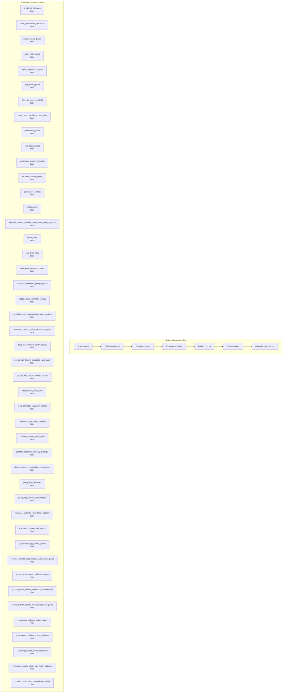

# Policy, Permission, and Authority Map

> Generated text documentation. Do not edit this file manually.
> Source hash: `2eb188183ed2498ee4fafbf256cdacb8a0d07a01fd23120625aa8ece494567aa`
> Source count: **42**
> Sources: `http-generic-api/migrations/002_sprint03_identity.sql`, `http-generic-api/migrations/005_sprint07_connected_systems.sql`, `http-generic-api/migrations/011_sprint15_observability.sql`, `http-generic-api/migrations/012_sprint16_security.sql`, `http-generic-api/migrations/013_sprint17_developer_api.sql`, `http-generic-api/migrations/016_sprint20_agent_registry.sql`, `http-generic-api/migrations/017_sprint21_output_sink_router.sql`, `http-generic-api/migrations/019_sprint24_workflow_seeds_and_skills.sql`, `http-generic-api/migrations/020_sprint25_user_app_integrations.sql`, `http-generic-api/migrations/030_sprint33_local_connector_tables.sql`, _... +32 more_
> Rendering: Mermaid code blocks plus Markdown tables; no image assets or raw database rows are generated.

## Runtime invariants

- Access is deny-by-default until tenant, role, grant, and authority evidence resolves.
- Resource and budget authority remain distinct evidence dimensions.
- Credentials are referenced, never embedded in generated documentation.
- Blocking decisions must be visible in runtime evidence and readiness surfaces.

## Discovered object inventory

| Object | Type | Domain | Source migrations | Columns discovered | References |
|---|---|---|---:|---:|---|
| `activation_freshness_policy_registry` | table | Activation & onboarding | 1 | - | - |
| `admin_scope_grants` | table | Governance & authority | 1 | 17 | `tenants`, `users` |
| `agent_skill_grants` | table | Agents & intelligence | 1 | 10 | `agents`, `tenants` |
| `agent_supervision_policy` | table | Agents & intelligence | 1 | 6 | `agents`, `tenants` |
| `app_action_grants` | table | Workflow & tasks | 2 | 12 | `agents` |
| `browser_runtime_policy` | table | Connectors & providers | 1 | 10 | `tenants` |
| `budget_quota_authority_registry` | table | Governance & authority | 1 | - | - |
| `capability_apply_authorization_policy_registry` | table | Platform resources & graph | 1 | 21 | - |
| `cms_site_access_grants` | table | Connectors & providers | 3 | - | - |
| `compliance_profiles` | table | Governance & authority | 1 | 8 | `tenants` |
| `credential_bindings` | table | Connectors & providers | 2 | 20 | `installations`, `tenants`, `users` |
| `database_collation_policy_exception_registry` | table | Governance & authority | 1 | - | - |
| `database_collation_policy_registry` | table | Governance & authority | 1 | - | - |
| `entitlements` | table | Commercial & usage | 1 | 8 | `tenants` |
| `external_delivery_provider_send_mode_policy_registry` | table | Delivery & support | 1 | 14 | `external_delivery_provider_adapter_contract_registry` |
| `google_ads_budget_execution_gate_audit` | table | Governance & authority | 1 | - | - |
| `google_ads_budget_preflight_ledger` | table | Governance & authority | 1 | - | - |
| `intelligence_policy_rules` | table | Agents & intelligence | 1 | - | - |
| `local_connector_capability_grants` | table | Platform resources & graph | 1 | 10 | - |
| `local_connector_file_access_rules` | table | Connectors & providers | 2 | 8 | `local_connector_user_configs` |
| `permission_grants` | table | Governance & authority | 1 | 8 | `installations`, `tenants` |
| `platform_engine_policy_registry` | table | Agents & intelligence | 1 | - | - |
| `platform_engine_policy_rules` | table | Agents & intelligence | 1 | - | - |
| `platform_resource_authority_bindings` | table | Platform resources & graph | 1 | - | - |
| `platform_resource_authority_requirements` | table | Platform resources & graph | 1 | - | - |
| `policy_logic_bindings` | table | Agents & intelligence | 1 | 12 | - |
| `policy_logic_mirror_classification` | table | Agents & intelligence | 1 | - | - |
| `quota_rules` | table | Governance & authority | 1 | 10 | `tenants` |
| `rate_limit_rules` | table | Governance & authority | 1 | 11 | `tenants` |
| `resource_authority_route_family_registry` | table | Workflow & tasks | 1 | 16 | - |
| `role_assignments` | table | Tenancy & identity | 1 | 9 | `tenants`, `users` |
| `ticket_permission_snapshots` | table | Delivery & support | 1 | 14 | `tenants`, `tickets`, `users` |
| `workspace_access_requests` | table | Tenancy & identity | 3 | - | - |
| `workspace_resource_grants` | table | Tenancy & identity | 2 | - | - |
| `v_activation_agent_skill_grants` | view | Activation & onboarding | 1 | - | - |
| `v_activation_app_action_grants` | view | Activation & onboarding | 1 | - | - |
| `v_active_memberships_missing_workspace_grants` | view | Tenancy & identity | 1 | - | - |
| `v_cms_active_grant_duplicate_groups` | view | Connectors & providers | 1 | - | - |
| `v_cms_grants_without_workspace_membership` | view | Tenancy & identity | 1 | - | - |
| `v_cms_publish_grants_missing_resource_grants` | view | Connectors & providers | 1 | - | - |
| `v_database_collation_policy_status` | view | Governance & authority | 1 | - | - |
| `v_database_collation_policy_violations` | view | Governance & authority | 1 | - | - |
| `v_hostinger_apply_policy_readiness` | view | Connectors & providers | 1 | - | - |
| `v_hostinger_apply_policy_safe_field_readiness` | view | Connectors & providers | 1 | - | - |
| `v_policy_logic_mirror_classification_detail` | view | Agents & intelligence | 1 | - | - |
| `v_policy_logic_mirror_classification_summary` | view | Agents & intelligence | 1 | - | - |
| `v_runtime_policy_resolver_rule_coverage` | view | Governance & authority | 1 | - | - |
| `v_workspace_authority_reconciliation_summary` | view | Tenancy & identity | 1 | - | - |
| `v_workspace_resource_grant_effective` | view | Tenancy & identity | 1 | - | - |

## Coverage counters

- Matching schema objects: **49**
- Diagram objects shown: **45**
- Diagram truncation applied: **yes**
- Source migrations: **42**

## Discovered policy key inventory

| Policy key | Source migrations | Sample sources |
|---|---:|---|
| `ads_provider_capability_profile_registry_policy_v1` | 2 | `http-generic-api/migrations/251_sprint67_ads_provider_capability_profile_registry.sql`, `http-generic-api/migrations/261_sprint68_orchestration_intelligence_foundation.sql` |
| `ads_provider_governance_snapshot_proposal_policy_v1` | 1 | `http-generic-api/migrations/263_sprint68_ads_governance_snapshot_proposal.sql` |
| `ads_provider_governance_snapshot_record_gate_policy_v1` | 1 | `http-generic-api/migrations/264_sprint68_ads_governance_snapshot_record_gate.sql` |
| `ads_provider_preflight_contract_policy_v1` | 2 | `http-generic-api/migrations/253_sprint67_ads_provider_preflight_contract.sql`, `http-generic-api/migrations/261_sprint68_orchestration_intelligence_foundation.sql` |
| `ads_provider_preflight_surface_blueprint_policy_v1` | 2 | `http-generic-api/migrations/254_sprint67_ads_provider_preflight_surface_blueprint.sql`, `http-generic-api/migrations/261_sprint68_orchestration_intelligence_foundation.sql` |
| `ads_provider_profile_onboarding_flow_policy_v1` | 1 | `http-generic-api/migrations/252_sprint67_ads_provider_profile_onboarding_flow.sql` |
| `Agent Loop Governance` | 3 | `http-generic-api/migrations/127_sprint64_agent_loop_preflight.sql`, `http-generic-api/migrations/128_sprint64_brand_core_agent_loop_guard.sql`, `http-generic-api/migrations/194_sprint66_runtime_policy_reconciliation.sql` |
| `Agent Loop Preflight Visibility` | 2 | `http-generic-api/migrations/127_sprint64_agent_loop_preflight.sql`, `http-generic-api/migrations/194_sprint66_runtime_policy_reconciliation.sql` |
| `Agent Runtime Governance` | 3 | `http-generic-api/migrations/260_sprint68_platform_development_constitution_policies.sql`, `http-generic-api/migrations/997_sprint68_openrouter_provider_smoke_capability_binding.sql`, `http-generic-api/migrations/998_sprint68_openrouter_provider_smoke_app_map_binding.sql` |
| `budget_quota_authority_registry_policy_v1` | 2 | `http-generic-api/migrations/236_sprint67_budget_quota_authority_registry.sql`, `http-generic-api/migrations/261_sprint68_orchestration_intelligence_foundation.sql` |
| `canonical_agent_runtime_policy_v1` | 1 | `http-generic-api/migrations/166_sprint65_ai_intelligence_runtime_governance.sql` |
| `capability_resolution_envelope_approval_tool_policy_v1` | 1 | `http-generic-api/migrations/235_sprint67_capability_envelope_approval_tool.sql` |
| `capability_resolution_envelope_ledger_policy_v1` | 1 | `http-generic-api/migrations/225_sprint67_capability_resolution_envelope_ledger.sql` |
| `Connector Capability Governance` | 1 | `http-generic-api/migrations/216_sprint68_connection_capability_repair_before_fallback_policy.sql` |
| `Connector Continuation Governance` | 1 | `http-generic-api/migrations/233_sprint68_local_connector_tunnel_provisioning_continuation_policy.sql` |
| `Connector Dispatch Governance` | 3 | `http-generic-api/migrations/126_sprint64_connector_dispatch_preflight.sql`, `http-generic-api/migrations/194_sprint66_runtime_policy_reconciliation.sql`, `http-generic-api/migrations/200_sprint67_runtime_policy_target_rule_backfill.sql` |
| `Connector Dispatch Preflight Visibility` | 2 | `http-generic-api/migrations/126_sprint64_connector_dispatch_preflight.sql`, `http-generic-api/migrations/194_sprint66_runtime_policy_reconciliation.sql` |
| `Credential Intake Governance` | 1 | `http-generic-api/migrations/209_sprint67_missing_credential_intake_handoff.sql` |
| `database_lifecycle_report_snapshot_schedule_policy_v1` | 2 | `http-generic-api/migrations/183_sprint66_database_lifecycle_snapshot_schedule_readiness.sql`, `http-generic-api/migrations/184_sprint66_database_lifecycle_scheduler_binding_readiness.sql` |
| `database_table_lifecycle_policy_v1` | 1 | `http-generic-api/migrations/168_sprint65_database_table_lifecycle_governance.sql` |
| `Development Drift Governance` | 1 | `http-generic-api/migrations/260_sprint68_platform_development_constitution_policies.sql` |
| `development_drift_detection_policy_v1` | 1 | `http-generic-api/migrations/260_sprint68_platform_development_constitution_policies.sql` |
| `Device Policy` | 3 | `http-generic-api/migrations/047_sprint47b_gpt_tool_registry.sql`, `http-generic-api/migrations/049_sprint47d_tool_registry_recovery.sql`, `http-generic-api/migrations/050_sprint47e_fix_schema_drift.sql` |
| `Domain Architecture Governance` | 1 | `http-generic-api/migrations/260_sprint68_platform_development_constitution_policies.sql` |
| `domain_generalization_before_provider_specific_policy_v1` | 1 | `http-generic-api/migrations/260_sprint68_platform_development_constitution_policies.sql` |
| `DR Certification Governance` | 1 | `http-generic-api/migrations/1000_sprint68_dr_certification_and_tool_bus_gated_read_only.sql` |
| `dr_isolated_restore_certification_policy_v1` | 1 | `http-generic-api/migrations/1000_sprint68_dr_certification_and_tool_bus_gated_read_only.sql` |
| `dynamic_capability_resolution_policy_v1` | 2 | `http-generic-api/migrations/221_sprint67_dynamic_capability_resolution_graph.sql`, `http-generic-api/migrations/222_sprint67_dynamic_capability_resolution_risk_refinement.sql` |
| `Execution Evidence Governance` | 2 | `http-generic-api/migrations/277_sprint68_execution_log_runtime_evidence.sql`, `http-generic-api/migrations/284_sprint68_execution_log_full_context_evidence.sql` |
| `Execution Safety Governance` | 1 | `http-generic-api/migrations/260_sprint68_platform_development_constitution_policies.sql` |
| `execution_enablement_approval_flow_policy_v1` | 2 | `http-generic-api/migrations/249_sprint67_execution_enablement_approval_flow.sql`, `http-generic-api/migrations/261_sprint68_orchestration_intelligence_foundation.sql` |
| `execution_enablement_registry_policy_v1` | 2 | `http-generic-api/migrations/248_sprint67_execution_enablement_registry.sql`, `http-generic-api/migrations/261_sprint68_orchestration_intelligence_foundation.sql` |
| `execution_log_full_context_evidence_policy_v1` | 1 | `http-generic-api/migrations/284_sprint68_execution_log_full_context_evidence.sql` |
| `execution_log_runtime_evidence_policy_v1` | 1 | `http-generic-api/migrations/277_sprint68_execution_log_runtime_evidence.sql` |
| `External App Action Governance` | 3 | `http-generic-api/migrations/124_sprint64_app_action_policy_preflight.sql`, `http-generic-api/migrations/125_sprint64_n8n_workflow_execution_guard.sql`, `http-generic-api/migrations/194_sprint66_runtime_policy_reconciliation.sql` |
| `External App Action Preflight Visibility` | 2 | `http-generic-api/migrations/124_sprint64_app_action_policy_preflight.sql`, `http-generic-api/migrations/194_sprint66_runtime_policy_reconciliation.sql` |
| `External Delivery Approval Policy` | 1 | `http-generic-api/migrations/287_sprint68_external_delivery_orchestration_graph_plugin.sql` |
| `external_adapter_future_pr_scope_policy_v1` | 1 | `http-generic-api/migrations/269_sprint68_ticket_external_adapter_future_pr_scope.sql` |
| `external_adapter_readiness_checklist_policy_v1` | 1 | `http-generic-api/migrations/267_sprint68_ticket_external_adapter_readiness_checklist.sql` |
| `external_adapter_readiness_decision_policy_v1` | 1 | `http-generic-api/migrations/268_sprint68_ticket_external_adapter_readiness_decision.sql` |
| `external_provider_adapter_contract_policy_v1` | 2 | `http-generic-api/migrations/265_sprint68_ticket_external_provider_adapter_contracts.sql`, `http-generic-api/migrations/906_sprint68_ticket_external_delivery_completion_certification.sql` |
| `external_provider_adapter_enablement_proposal_policy_v1` | 1 | `http-generic-api/migrations/266_sprint68_ticket_external_provider_enablement_proposal.sql` |
| `external_provider_gate_registry_resolver_policy_v1` | 3 | `http-generic-api/migrations/272_sprint68_ticket_external_provider_gate_registry_resolver.sql`, `http-generic-api/migrations/274_sprint68_execution_policy_enforcement_closure.sql`, `http-generic-api/migrations/906_sprint68_ticket_external_delivery_completion_certification.sql` |
| `final_pattern_enforcement_policy_v1` | 1 | `http-generic-api/migrations/260_sprint68_platform_development_constitution_policies.sql` |
| `GitHub File Resource Governance` | 1 | `http-generic-api/migrations/958_sprint68_github_file_content_gate_and_patch_plan_registry.sql` |
| `github_file_content_read_gate_policy_v1` | 1 | `http-generic-api/migrations/958_sprint68_github_file_content_gate_and_patch_plan_registry.sql` |
| `google_ads_budget_change_preflight_policy_v1` | 2 | `http-generic-api/migrations/238_sprint67_google_ads_budget_change_preflight.sql`, `http-generic-api/migrations/241_sprint67_google_ads_budget_preflight_ledger.sql` |
| `google_ads_budget_execution_adapter_skeleton_policy_v1` | 5 | `http-generic-api/migrations/245_sprint67_google_ads_execution_adapter_skeleton.sql`, `http-generic-api/migrations/246_sprint67_google_ads_credential_readiness_gate.sql`, `http-generic-api/migrations/247_sprint67_google_ads_credential_readiness_policy_fix.sql`, _... +2 more_ |
| `google_ads_budget_preflight_binding_policy_v1` | 1 | `http-generic-api/migrations/239_sprint67_google_ads_budget_preflight_binding.sql` |
| `google_ads_budget_preflight_ledger_policy_v1` | 2 | `http-generic-api/migrations/241_sprint67_google_ads_budget_preflight_ledger.sql`, `http-generic-api/migrations/261_sprint68_orchestration_intelligence_foundation.sql` |
| `google_ads_credential_readiness_gate_policy_v1` | 3 | `http-generic-api/migrations/246_sprint67_google_ads_credential_readiness_gate.sql`, `http-generic-api/migrations/250_sprint67_google_ads_credential_readiness_ledger.sql`, `http-generic-api/migrations/261_sprint68_orchestration_intelligence_foundation.sql` |
| `google_ads_credential_readiness_ledger_policy_v1` | 2 | `http-generic-api/migrations/250_sprint67_google_ads_credential_readiness_ledger.sql`, `http-generic-api/migrations/261_sprint68_orchestration_intelligence_foundation.sql` |
| `Governance Policy` | 3 | `http-generic-api/migrations/047_sprint47b_gpt_tool_registry.sql`, `http-generic-api/migrations/049_sprint47d_tool_registry_recovery.sql`, `http-generic-api/migrations/050_sprint47e_fix_schema_drift.sql` |
| `governed_repository_intelligence_engine_policy_v1` | 1 | `http-generic-api/migrations/900_sprint68_governed_repository_intelligence_engine.sql` |
| `hostinger_deploy_release_apply_policy_v1` | 3 | `http-generic-api/migrations/307_sprint69_hostinger_deploy_restart_option_support.sql`, `http-generic-api/migrations/964_sprint68_hostinger_stored_credential_apply_policy.sql`, `http-generic-api/migrations/965_sprint68_hostinger_apply_policy_safe_field_names.sql` |
| `hostinger_restart_app_apply_policy_v1` | 3 | `http-generic-api/migrations/307_sprint69_hostinger_deploy_restart_option_support.sql`, `http-generic-api/migrations/964_sprint68_hostinger_stored_credential_apply_policy.sql`, `http-generic-api/migrations/965_sprint68_hostinger_apply_policy_safe_field_names.sql` |
| `Intelligence Governance` | 1 | `http-generic-api/migrations/260_sprint68_platform_development_constitution_policies.sql` |
| `intelligence_policy_rules_required_policy_v1` | 1 | `http-generic-api/migrations/260_sprint68_platform_development_constitution_policies.sql` |
| `intentional_safety_block_classification_policy_v1` | 1 | `http-generic-api/migrations/260_sprint68_platform_development_constitution_policies.sql` |
| `Legacy Migration Governance` | 1 | `http-generic-api/migrations/260_sprint68_platform_development_constitution_policies.sql` |
| `legacy_surface_bridge_policy_v1` | 1 | `http-generic-api/migrations/260_sprint68_platform_development_constitution_policies.sql` |
| `Mode Choice Governance` | 1 | `http-generic-api/migrations/233_sprint68_general_mode_choice_governance.sql` |
| `model_never_executes_tools_policy_v1` | 1 | `http-generic-api/migrations/260_sprint68_platform_development_constitution_policies.sql` |
| `no_hidden_execution_policy_v1` | 3 | `http-generic-api/migrations/260_sprint68_platform_development_constitution_policies.sql`, `http-generic-api/migrations/261_sprint68_orchestration_intelligence_foundation.sql`, `http-generic-api/migrations/270_sprint68_support_ticket_lifecycle_orchestration_readback.sql` |
| `openrouter_model_selection_policy_v1` | 5 | `http-generic-api/migrations/217_sprint67_openrouter_model_policy_control.sql`, `http-generic-api/migrations/218_sprint67_activate_openclaude_openrouter_provider.sql`, `http-generic-api/migrations/219_sprint67_openclaude_live_dispatch_certification.sql`, _... +2 more_ |
| `openrouter_provider_smoke_app_map_binding_policy_v1` | 1 | `http-generic-api/migrations/998_sprint68_openrouter_provider_smoke_app_map_binding.sql` |
| `openrouter_provider_smoke_capability_binding_policy_v1` | 1 | `http-generic-api/migrations/997_sprint68_openrouter_provider_smoke_capability_binding.sql` |
| `Orchestration Intelligence Governance` | 11 | `http-generic-api/migrations/260_sprint68_platform_development_constitution_policies.sql`, `http-generic-api/migrations/261_sprint68_orchestration_intelligence_foundation.sql`, `http-generic-api/migrations/262_sprint68_orchestration_readback_surface.sql`, _... +8 more_ |
| `orchestration_first_development_policy_v1` | 1 | `http-generic-api/migrations/260_sprint68_platform_development_constitution_policies.sql` |
| `orchestration_intelligence_foundation_policy_v1` | 1 | `http-generic-api/migrations/261_sprint68_orchestration_intelligence_foundation.sql` |
| `orchestration_intelligence_policy_v1` | 2 | `http-generic-api/migrations/261_sprint68_orchestration_intelligence_foundation.sql`, `http-generic-api/migrations/270_sprint68_support_ticket_lifecycle_orchestration_readback.sql` |
| `orchestration_intelligence_readback_policy_v1` | 1 | `http-generic-api/migrations/262_sprint68_orchestration_readback_surface.sql` |
| `orchestration_stage_graph_completeness_policy_v1` | 1 | `http-generic-api/migrations/260_sprint68_platform_development_constitution_policies.sql` |
| `orchestration_state_snapshot_required_policy_v1` | 1 | `http-generic-api/migrations/260_sprint68_platform_development_constitution_policies.sql` |
| `platform_development_constitution_policy_v1` | 1 | `http-generic-api/migrations/260_sprint68_platform_development_constitution_policies.sql` |
| `platform_private_capability_vault_policy_v1` | 1 | `http-generic-api/migrations/189_sprint66_platform_private_capability_vault.sql` |
| `platform_resource_authority_binding_policy_v1` | 1 | `http-generic-api/migrations/950_sprint68_platform_resource_authority_bindings.sql` |
| `platform_schema_blocker_classification_policy_v1` | 1 | `http-generic-api/migrations/260_sprint68_platform_development_constitution_policies.sql` |
| `platform_task_quality_gate_policy_v1` | 1 | `http-generic-api/migrations/260_sprint68_platform_development_constitution_policies.sql` |
| `Plugin Governance` | 1 | `http-generic-api/migrations/260_sprint68_platform_development_constitution_policies.sql` |
| `plugin_manifest_completeness_policy_v1` | 1 | `http-generic-api/migrations/260_sprint68_platform_development_constitution_policies.sql` |
| `preflight_execution_gate_helper_policy_v1` | 1 | `http-generic-api/migrations/243_sprint67_preflight_execution_gate_helper.sql` |
| `preflight_ledger_validator_policy_v1` | 3 | `http-generic-api/migrations/242_sprint67_preflight_ledger_validator.sql`, `http-generic-api/migrations/243_sprint67_preflight_execution_gate_helper.sql`, `http-generic-api/migrations/244_sprint67_preflight_execution_gate_policy_readback_fix.sql` |
| `provider_smoke_policy_v1` | 1 | `http-generic-api/migrations/166_sprint65_ai_intelligence_runtime_governance.sql` |
| `recommendation_before_execution_policy_v1` | 3 | `http-generic-api/migrations/260_sprint68_platform_development_constitution_policies.sql`, `http-generic-api/migrations/261_sprint68_orchestration_intelligence_foundation.sql`, `http-generic-api/migrations/270_sprint68_support_ticket_lifecycle_orchestration_readback.sql` |
| `recovery_capability_taxonomy_policy_v1` | 2 | `http-generic-api/migrations/174_sprint65_recovery_capability_taxonomy_foundation.sql`, `http-generic-api/migrations/176_sprint65_recovery_resource_runtime_alignment.sql` |
| `Release Governance` | 1 | `http-generic-api/migrations/260_sprint68_platform_development_constitution_policies.sql` |
| `release_readiness_orchestration_gate_policy_v1` | 1 | `http-generic-api/migrations/260_sprint68_platform_development_constitution_policies.sql` |
| `repo_conflict_policy_v1` | 1 | `http-generic-api/migrations/166_sprint65_ai_intelligence_runtime_governance.sql` |
| `Repository Intelligence Governance` | 5 | `http-generic-api/migrations/1001_sprint68_repository_advisory_comment_v5_tenant_tool_wiring.sql`, `http-generic-api/migrations/293_sprint68_system_layer_descriptor_auto_wiring.sql`, `http-generic-api/migrations/900_sprint68_governed_repository_intelligence_engine.sql`, _... +2 more_ |
| `Repository Mutation Governance` | 9 | `http-generic-api/migrations/122_sprint64_runtime_policy_preflight.sql`, `http-generic-api/migrations/123_sprint64_gpt_tools_policy_preflight.sql`, `http-generic-api/migrations/194_sprint66_runtime_policy_reconciliation.sql`, _... +6 more_ |
| `Repository Publish Governance` | 1 | `http-generic-api/migrations/274_sprint68_execution_policy_enforcement_closure.sql` |
| `Resolve Platform Plugin Smoke Recertification Policy` | 1 | `http-generic-api/migrations/157_sprint65_smoke_recertification_policy_tools.sql` |
| `Resource Capability Completion Governance` | 1 | `http-generic-api/migrations/960_sprint68_remaining_resource_capability_completion_gates.sql` |
| `Resource Recipe Governance` | 1 | `http-generic-api/migrations/246_sprint68_platform_resource_recipe_capability.sql` |
| `resource_authority_policy_v1` | 2 | `http-generic-api/migrations/175_sprint65_resource_authority_registry_foundation.sql`, `http-generic-api/migrations/176_sprint65_recovery_resource_runtime_alignment.sql` |
| `Runtime Validation Governance` | 1 | `http-generic-api/migrations/260_sprint68_platform_development_constitution_policies.sql` |
| `runtime_agent_loop_policy_v1` | 1 | `http-generic-api/migrations/194_sprint66_runtime_policy_reconciliation.sql` |
| `runtime_app_action_policy_v1` | 1 | `http-generic-api/migrations/194_sprint66_runtime_policy_reconciliation.sql` |
| `runtime_brand_core_policy_v1` | 1 | `http-generic-api/migrations/194_sprint66_runtime_policy_reconciliation.sql` |
| `runtime_connector_dispatch_policy_v1` | 1 | `http-generic-api/migrations/194_sprint66_runtime_policy_reconciliation.sql` |
| `runtime_n8n_workflow_execution_policy_v1` | 1 | `http-generic-api/migrations/194_sprint66_runtime_policy_reconciliation.sql` |
| `runtime_repo_mutation_policy_v1` | 1 | `http-generic-api/migrations/194_sprint66_runtime_policy_reconciliation.sql` |
| `runtime_wordpress_apply_reason_policy_v1` | 1 | `http-generic-api/migrations/200_sprint67_runtime_policy_target_rule_backfill.sql` |
| `Schema Governance` | 1 | `http-generic-api/migrations/260_sprint68_platform_development_constitution_policies.sql` |
| `schema_cleanup_policy_v1` | 1 | `http-generic-api/migrations/166_sprint65_ai_intelligence_runtime_governance.sql` |
| `Session Memory Governance` | 23 | `http-generic-api/migrations/260_sprint68_platform_development_constitution_policies.sql`, `http-generic-api/migrations/263_sprint68_session_insight_promotion_review_tools.sql`, `http-generic-api/migrations/265_sprint68_session_insight_promotion_dry_run_executor.sql`, _... +20 more_ |
| `session_insight_adapter_apply_readiness_gate_policy_v1` | 1 | `http-generic-api/migrations/271_sprint68_session_insight_adapter_apply_readiness_gate.sql` |
| `session_insight_adapter_dry_run_contract_policy_v1` | 1 | `http-generic-api/migrations/268_sprint68_session_insight_adapter_dry_run_contracts.sql` |
| `session_insight_backlog_target_write_executor_policy_v1` | 1 | `http-generic-api/migrations/284_sprint68_session_insight_backlog_target_write_executor.sql` |
| `session_insight_capability_binding_hardening_policy_v1` | 1 | `http-generic-api/migrations/910_sprint68_session_insight_capability_binding_hardening.sql` |
| `session_insight_capability_envelope_actual_request_dispatch_policy_v1` | 1 | `http-generic-api/migrations/279_sprint68_session_insight_capability_envelope_actual_request_dispatch.sql` |
| `session_insight_capability_envelope_actual_request_preflight_policy_v1` | 1 | `http-generic-api/migrations/278_sprint68_session_insight_capability_envelope_actual_request_preflight.sql` |
| `session_insight_capability_envelope_adapter_execution_gate_policy_v1` | 1 | `http-generic-api/migrations/282_sprint68_session_insight_capability_envelope_adapter_execution_gate.sql` |
| `session_insight_capability_envelope_approval_gate_policy_v1` | 1 | `http-generic-api/migrations/280_sprint68_session_insight_capability_envelope_approval_gate.sql` |
| `session_insight_capability_envelope_dispatch_dry_run_policy_v1` | 1 | `http-generic-api/migrations/275_sprint68_session_insight_capability_envelope_dispatch_dry_run.sql` |
| `session_insight_capability_envelope_dispatch_dry_run_review_policy_v1` | 1 | `http-generic-api/migrations/277_sprint68_session_insight_capability_envelope_dispatch_dry_run_review.sql` |
| `session_insight_capability_envelope_dispatch_readback_policy_v1` | 1 | `http-generic-api/migrations/281_sprint68_session_insight_capability_envelope_dispatch_readback.sql` |
| `session_insight_capability_envelope_planner_policy_v1` | 1 | `http-generic-api/migrations/272_sprint68_session_insight_capability_envelope_planner.sql` |
| `session_insight_capability_envelope_remaining_scope_completion_policy_v1` | 1 | `http-generic-api/migrations/283_sprint68_session_insight_capability_envelope_remaining_scope_completion.sql` |
| `session_insight_capability_envelope_request_gate_policy_v1` | 1 | `http-generic-api/migrations/273_sprint68_session_insight_capability_envelope_request_gate.sql` |
| `session_insight_capability_envelope_request_review_policy_v1` | 1 | `http-generic-api/migrations/274_sprint68_session_insight_capability_envelope_request_review.sql` |
| `session_insight_contract_payload_preview_policy_v1` | 1 | `http-generic-api/migrations/269_sprint68_session_insight_contract_payload_preview.sql` |
| `session_insight_payload_preview_review_policy_v1` | 1 | `http-generic-api/migrations/270_sprint68_session_insight_payload_preview_review.sql` |
| `session_insight_promotion_apply_request_skeleton_policy_v1` | 1 | `http-generic-api/migrations/266_sprint68_session_insight_promotion_apply_request_skeleton.sql` |
| `session_insight_promotion_dry_run_executor_policy_v1` | 1 | `http-generic-api/migrations/265_sprint68_session_insight_promotion_dry_run_executor.sql` |
| `session_insight_promotion_review_policy_v1` | 1 | `http-generic-api/migrations/263_sprint68_session_insight_promotion_review_tools.sql` |
| `session_insight_target_adapter_registry_policy_v1` | 1 | `http-generic-api/migrations/267_sprint68_session_insight_target_adapter_registry.sql` |
| `session_insight_target_write_readback_policy_v1` | 1 | `http-generic-api/migrations/306_sprint69_session_insight_target_write_readback.sql` |
| `session_memory_reliability_policy_v1` | 1 | `http-generic-api/migrations/260_sprint68_platform_development_constitution_policies.sql` |
| `Shared Reconciliation Governance` | 1 | `http-generic-api/migrations/231_sprint68_shared_reconciliation_continuation_policy.sql` |
| `Stale Duplicate Branch Merge Guard` | 5 | `http-generic-api/migrations/122_sprint64_runtime_policy_preflight.sql`, `http-generic-api/migrations/123_sprint64_gpt_tools_policy_preflight.sql`, `http-generic-api/migrations/194_sprint66_runtime_policy_reconciliation.sql`, _... +2 more_ |
| `Support Ticket External Delivery Governance` | 12 | `http-generic-api/migrations/265_sprint68_ticket_external_provider_adapter_contracts.sql`, `http-generic-api/migrations/266_sprint68_ticket_external_provider_enablement_proposal.sql`, `http-generic-api/migrations/267_sprint68_ticket_external_adapter_readiness_checklist.sql`, _... +9 more_ |
| `support_ticket_external_delivery_admin_control_surface_policy_v1` | 1 | `http-generic-api/migrations/955_sprint68_external_delivery_admin_control_surface.sql` |
| `support_ticket_external_delivery_completion_certification_policy_v1` | 1 | `http-generic-api/migrations/906_sprint68_ticket_external_delivery_completion_certification.sql` |
| `support_ticket_external_delivery_dual_provider_policy_v1` | 1 | `http-generic-api/migrations/908_sprint68_ticket_external_hostinger_gmail_provider_options.sql` |
| `support_ticket_external_delivery_dynamic_recipient_allowlist_policy_v1` | 1 | `http-generic-api/migrations/909_sprint68_ticket_external_dynamic_recipient_allowlist.sql` |
| `support_ticket_external_delivery_live_smtp_runtime_policy_v1` | 1 | `http-generic-api/migrations/907_sprint68_ticket_external_live_smtp_registry_alignment.sql` |
| `support_ticket_external_delivery_orchestration_readback_policy_v1` | 2 | `http-generic-api/migrations/287_sprint68_external_delivery_orchestration_graph_plugin.sql`, `http-generic-api/migrations/289_sprint68_external_delivery_policy_scope_alignment.sql` |
| `support_ticket_lifecycle_orchestration_readback_policy_v1` | 1 | `http-generic-api/migrations/270_sprint68_support_ticket_lifecycle_orchestration_readback.sql` |
| `support_ticket_lifecycle_snapshot_apply_binding_policy_v1` | 1 | `http-generic-api/migrations/904_sprint68_support_ticket_lifecycle_snapshot_apply_binding.sql` |
| `support_ticket_lifecycle_snapshot_apply_readback_alignment_policy_v1` | 1 | `http-generic-api/migrations/905_sprint68_support_ticket_lifecycle_snapshot_apply_policy_readback_alignment.sql` |
| `support_ticket_lifecycle_snapshot_proposal_policy_v1` | 1 | `http-generic-api/migrations/272_sprint68_support_ticket_lifecycle_snapshot_proposal.sql` |
| `support_ticket_lifecycle_snapshot_record_gate_policy_v1` | 1 | `http-generic-api/migrations/273_sprint68_support_ticket_lifecycle_snapshot_record_gate.sql` |
| `System Governance` | 2 | `http-generic-api/migrations/016_sprint20_agent_registry.sql`, `http-generic-api/migrations/019_sprint24_workflow_seeds_and_skills.sql` |
| `System Layer Tool Governance` | 1 | `http-generic-api/migrations/293_sprint68_system_layer_descriptor_auto_wiring.sql` |
| `system_layer_descriptor_auto_wiring_policy_v1` | 1 | `http-generic-api/migrations/293_sprint68_system_layer_descriptor_auto_wiring.sql` |
| `Task Governance` | 1 | `http-generic-api/migrations/260_sprint68_platform_development_constitution_policies.sql` |
| `Tenant Experience Governance` | 1 | `http-generic-api/migrations/260_sprint68_platform_development_constitution_policies.sql` |
| `tenant_codex_dual_mode_policy_v1` | 1 | `http-generic-api/migrations/220_sprint67_codex_dual_mode_policy.sql` |
| `tenant_proactive_guidance_policy_v1` | 1 | `http-generic-api/migrations/260_sprint68_platform_development_constitution_policies.sql` |
| `tenant_repository_advisory_comment_v5_tool_wiring_policy_v1` | 2 | `http-generic-api/migrations/1001_sprint68_repository_advisory_comment_v5_tenant_tool_wiring.sql`, `http-generic-api/migrations/293_sprint68_system_layer_descriptor_auto_wiring.sql` |
| `tenant_repository_intelligence_v3_v4_tool_wiring_policy_v1` | 1 | `http-generic-api/migrations/999_sprint68_repository_intelligence_v3_v4_tenant_tool_wiring.sql` |
| `Tool Bus Governance` | 1 | `http-generic-api/migrations/1000_sprint68_dr_certification_and_tool_bus_gated_read_only.sql` |
| `Tool Response Continuation Governance` | 1 | `http-generic-api/migrations/232_sprint68_chunked_tool_response_continuation_policy.sql` |
| `tool_bus_gated_read_only_dispatch_policy_v1` | 1 | `http-generic-api/migrations/1000_sprint68_dr_certification_and_tool_bus_gated_read_only.sql` |
| `Update Integration Source Policy` | 1 | `http-generic-api/migrations/106_sprint64_hybrid_integration_policy.sql` |
| `Upsert Platform Plugin Smoke Recertification Policy` | 1 | `http-generic-api/migrations/157_sprint65_smoke_recertification_policy_tools.sql` |
| `Upsert Platform Plugin Tenant Policy` | 1 | `http-generic-api/migrations/121_sprint64_platform_plugin_policy_upsert_tool.sql` |
| `validation_semantics_policy_v1` | 1 | `http-generic-api/migrations/260_sprint68_platform_development_constitution_policies.sql` |
