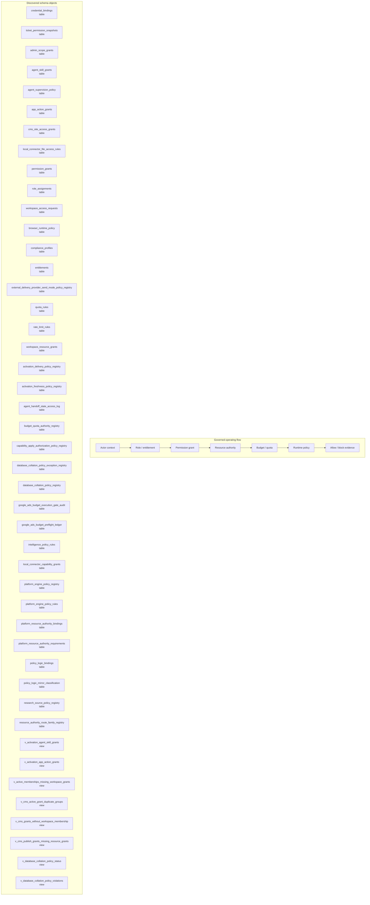

# Policy, Permission, and Authority Map

> Generated text documentation. Do not edit this file manually.
> Source hash: `9493cad3f89482396e86afde6ec1d50aee4e6cb585789eb6d8b20e62284875c1`
> Source count: **46**
> Sources: `http-generic-api/migrations/002_sprint03_identity.sql`, `http-generic-api/migrations/005_sprint07_connected_systems.sql`, `http-generic-api/migrations/011_sprint15_observability.sql`, `http-generic-api/migrations/012_sprint16_security.sql`, `http-generic-api/migrations/013_sprint17_developer_api.sql`, `http-generic-api/migrations/016_sprint20_agent_registry.sql`, `http-generic-api/migrations/017_sprint21_output_sink_router.sql`, `http-generic-api/migrations/019_sprint24_workflow_seeds_and_skills.sql`, `http-generic-api/migrations/020_sprint25_user_app_integrations.sql`, `http-generic-api/migrations/030_sprint33_local_connector_tables.sql`, _... +36 more_
> Rendering: Mermaid plus Markdown tables; no image assets or raw database rows are generated.

## Discovered object inventory

| Object | Type | Domain | Source migrations | Columns | References |
|---|---|---|---:|---:|---|
| `activation_delivery_policy_registry` | table | Activation & onboarding | 1 | - | - |
| `activation_freshness_policy_registry` | table | Activation & onboarding | 1 | - | - |
| `admin_scope_grants` | table | Governance & authority | 1 | 17 | `tenants`, `users` |
| `agent_handoff_state_access_log` | table | Agents & intelligence | 1 | - | - |
| `agent_skill_grants` | table | Agents & intelligence | 1 | 10 | `agents`, `tenants` |
| `agent_supervision_policy` | table | Agents & intelligence | 1 | 6 | `agents`, `tenants` |
| `app_action_grants` | table | Workflow & tasks | 2 | 12 | `agents` |
| `browser_runtime_policy` | table | Connectors & providers | 1 | 10 | `tenants` |
| `budget_quota_authority_registry` | table | Governance & authority | 1 | - | - |
| `capability_apply_authorization_policy_registry` | table | Platform resources & graph | 1 | 21 | - |
| `cms_site_access_grants` | table | Connectors & providers | 3 | - | - |
| `compliance_profiles` | table | Governance & authority | 1 | 8 | `tenants` |
| `credential_bindings` | table | Connectors & providers | 2 | 20 | `installations`, `tenants`, `users` |
| `database_collation_policy_exception_registry` | table | Governance & authority | 1 | - | - |
| `database_collation_policy_registry` | table | Governance & authority | 1 | - | - |
| `entitlements` | table | Commercial & usage | 1 | 8 | `tenants` |
| `external_delivery_provider_send_mode_policy_registry` | table | Delivery & support | 1 | 14 | `external_delivery_provider_adapter_contract_registry` |
| `google_ads_budget_execution_gate_audit` | table | Governance & authority | 1 | - | - |
| `google_ads_budget_preflight_ledger` | table | Governance & authority | 1 | - | - |
| `intelligence_policy_rules` | table | Agents & intelligence | 1 | - | - |
| `local_connector_capability_grants` | table | Platform resources & graph | 1 | 10 | - |
| `local_connector_file_access_rules` | table | Connectors & providers | 2 | 8 | `local_connector_user_configs` |
| `permission_grants` | table | Governance & authority | 1 | 8 | `installations`, `tenants` |
| `platform_engine_policy_registry` | table | Agents & intelligence | 1 | - | - |
| `platform_engine_policy_rules` | table | Agents & intelligence | 1 | - | - |
| `platform_resource_authority_bindings` | table | Platform resources & graph | 1 | - | - |
| `platform_resource_authority_requirements` | table | Platform resources & graph | 1 | - | - |
| `policy_logic_bindings` | table | Agents & intelligence | 1 | 12 | - |
| `policy_logic_mirror_classification` | table | Agents & intelligence | 1 | - | - |
| `quota_rules` | table | Governance & authority | 1 | 10 | `tenants` |
| `rate_limit_rules` | table | Governance & authority | 1 | 11 | `tenants` |
| `research_source_policy_registry` | table | Governance & authority | 1 | - | - |
| `resource_authority_route_family_registry` | table | Workflow & tasks | 1 | 16 | - |
| `role_assignments` | table | Tenancy & identity | 1 | 9 | `tenants`, `users` |
| `ticket_permission_snapshots` | table | Delivery & support | 1 | 14 | `tenants`, `tickets`, `users` |
| `workspace_access_requests` | table | Tenancy & identity | 3 | - | - |
| `workspace_resource_grants` | table | Tenancy & identity | 2 | - | - |
| `v_activation_agent_skill_grants` | view | Activation & onboarding | 1 | - | - |
| `v_activation_app_action_grants` | view | Activation & onboarding | 1 | - | - |
| `v_active_memberships_missing_workspace_grants` | view | Tenancy & identity | 1 | - | - |
| `v_cms_active_grant_duplicate_groups` | view | Connectors & providers | 1 | - | - |
| `v_cms_grants_without_workspace_membership` | view | Tenancy & identity | 1 | - | - |
| `v_cms_publish_grants_missing_resource_grants` | view | Connectors & providers | 1 | - | - |
| `v_database_collation_policy_status` | view | Governance & authority | 1 | - | - |
| `v_database_collation_policy_violations` | view | Governance & authority | 1 | - | - |
| `v_hostinger_apply_policy_readiness` | view | Connectors & providers | 1 | - | - |
| `v_hostinger_apply_policy_safe_field_readiness` | view | Connectors & providers | 1 | - | - |
| `v_platform_capability_authority_evidence` | view | Platform resources & graph | 1 | - | - |
| `v_policy_logic_mirror_classification_detail` | view | Agents & intelligence | 1 | - | - |
| `v_policy_logic_mirror_classification_summary` | view | Agents & intelligence | 1 | - | - |
| `v_runtime_policy_resolver_rule_coverage` | view | Governance & authority | 1 | - | - |
| `v_superseded_branch_cleanup_policy_readback` | view | Repository & development | 1 | - | - |
| `v_workspace_authority_reconciliation_summary` | view | Tenancy & identity | 1 | - | - |
| `v_workspace_resource_grant_effective` | view | Tenancy & identity | 1 | - | - |

## Coverage counters

- Matching schema objects: **54**
- Diagram objects shown: **45**
- Source migrations: **46**

## Discovered policy keys

| Policy key | Source migrations |
|---|---:|
| `ads_provider_capability_profile_registry_policy_v1` | 2 |
| `ads_provider_governance_snapshot_proposal_policy_v1` | 1 |
| `ads_provider_governance_snapshot_record_gate_policy_v1` | 1 |
| `ads_provider_preflight_contract_policy_v1` | 2 |
| `ads_provider_preflight_surface_blueprint_policy_v1` | 2 |
| `ads_provider_profile_onboarding_flow_policy_v1` | 1 |
| `agent_governance_runtime_policy_v1` | 1 |
| `budget_quota_authority_registry_policy_v1` | 2 |
| `canonical_agent_runtime_policy_v1` | 1 |
| `capability_resolution_envelope_approval_tool_policy_v1` | 1 |
| `capability_resolution_envelope_ledger_policy_v1` | 1 |
| `database_lifecycle_report_snapshot_schedule_policy_v1` | 2 |
| `database_table_lifecycle_policy_v1` | 1 |
| `development_drift_detection_policy_v1` | 1 |
| `domain_generalization_before_provider_specific_policy_v1` | 1 |
| `dr_isolated_restore_certification_policy_v1` | 1 |
| `dynamic_capability_resolution_policy_v1` | 2 |
| `execution_enablement_approval_flow_policy_v1` | 2 |
| `execution_enablement_registry_policy_v1` | 2 |
| `execution_log_full_context_evidence_policy_v1` | 1 |
| `execution_log_runtime_evidence_policy_v1` | 1 |
| `external_adapter_future_pr_scope_policy_v1` | 1 |
| `external_adapter_readiness_checklist_policy_v1` | 1 |
| `external_adapter_readiness_decision_policy_v1` | 1 |
| `external_provider_adapter_contract_policy_v1` | 2 |
| `external_provider_adapter_enablement_proposal_policy_v1` | 1 |
| `external_provider_gate_registry_resolver_policy_v1` | 3 |
| `final_pattern_enforcement_policy_v1` | 1 |
| `github_file_content_read_gate_policy_v1` | 1 |
| `google_ads_budget_change_preflight_policy_v1` | 2 |
| `google_ads_budget_execution_adapter_skeleton_policy_v1` | 5 |
| `google_ads_budget_preflight_binding_policy_v1` | 1 |
| `google_ads_budget_preflight_ledger_policy_v1` | 2 |
| `google_ads_credential_readiness_gate_policy_v1` | 3 |
| `google_ads_credential_readiness_ledger_policy_v1` | 2 |
| `governed_repository_engine_v6_policy_v1` | 1 |
| `governed_repository_intelligence_engine_policy_v1` | 1 |
| `governed_repository_mutation_plan_v6_policy_v1` | 1 |
| `hostinger_deploy_release_apply_policy_v1` | 4 |
| `hostinger_restart_app_apply_policy_v1` | 3 |
| `intelligence_policy_rules_required_policy_v1` | 1 |
| `intentional_safety_block_classification_policy_v1` | 1 |
| `legacy_surface_bridge_policy_v1` | 1 |
| `model_never_executes_tools_policy_v1` | 1 |
| `no_hidden_execution_policy_v1` | 3 |
| `openrouter_model_selection_policy_v1` | 5 |
| `openrouter_provider_smoke_app_map_binding_policy_v1` | 1 |
| `openrouter_provider_smoke_capability_binding_policy_v1` | 1 |
| `orchestration_first_development_policy_v1` | 1 |
| `orchestration_intelligence_foundation_policy_v1` | 1 |
| `orchestration_intelligence_policy_v1` | 2 |
| `orchestration_intelligence_readback_policy_v1` | 1 |
| `orchestration_stage_graph_completeness_policy_v1` | 1 |
| `orchestration_state_snapshot_required_policy_v1` | 1 |
| `platform_development_constitution_policy_v1` | 1 |
| `platform_private_capability_vault_policy_v1` | 1 |
| `platform_resource_authority_binding_policy_v1` | 1 |
| `platform_schema_blocker_classification_policy_v1` | 1 |
| `platform_task_quality_gate_policy_v1` | 1 |
| `plugin_manifest_completeness_policy_v1` | 1 |
| `preflight_execution_gate_helper_policy_v1` | 1 |
| `preflight_ledger_validator_policy_v1` | 3 |
| `provider_smoke_policy_v1` | 1 |
| `recommendation_before_execution_policy_v1` | 3 |
| `recovery_capability_taxonomy_policy_v1` | 2 |
| `release_readiness_orchestration_gate_policy_v1` | 1 |
| `repo_conflict_policy_v1` | 1 |
| `resource_authority_policy_v1` | 2 |
| `runtime_agent_loop_policy_v1` | 1 |
| `runtime_app_action_policy_v1` | 1 |
| `runtime_brand_core_policy_v1` | 1 |
| `runtime_connector_dispatch_policy_v1` | 1 |
| `runtime_n8n_workflow_execution_policy_v1` | 1 |
| `runtime_repo_mutation_policy_v1` | 1 |
| `runtime_wordpress_apply_reason_policy_v1` | 1 |
| `schema_cleanup_policy_v1` | 1 |
| `session_insight_adapter_apply_readiness_gate_policy_v1` | 1 |
| `session_insight_adapter_dry_run_contract_policy_v1` | 1 |
| `session_insight_backlog_target_write_executor_policy_v1` | 1 |
| `session_insight_capability_binding_hardening_policy_v1` | 1 |
| `session_insight_capability_envelope_actual_request_dispatch_policy_v1` | 1 |
| `session_insight_capability_envelope_actual_request_preflight_policy_v1` | 1 |
| `session_insight_capability_envelope_adapter_execution_gate_policy_v1` | 1 |
| `session_insight_capability_envelope_approval_gate_policy_v1` | 1 |
| `session_insight_capability_envelope_dispatch_dry_run_policy_v1` | 1 |
| `session_insight_capability_envelope_dispatch_dry_run_review_policy_v1` | 1 |
| `session_insight_capability_envelope_dispatch_readback_policy_v1` | 1 |
| `session_insight_capability_envelope_planner_policy_v1` | 1 |
| `session_insight_capability_envelope_remaining_scope_completion_policy_v1` | 1 |
| `session_insight_capability_envelope_request_gate_policy_v1` | 1 |
| `session_insight_capability_envelope_request_review_policy_v1` | 1 |
| `session_insight_contract_payload_preview_policy_v1` | 1 |
| `session_insight_payload_preview_review_policy_v1` | 1 |
| `session_insight_promotion_apply_request_skeleton_policy_v1` | 1 |
| `session_insight_promotion_dry_run_executor_policy_v1` | 1 |
| `session_insight_promotion_review_policy_v1` | 1 |
| `session_insight_target_adapter_registry_policy_v1` | 1 |
| `session_insight_target_write_readback_policy_v1` | 1 |
| `session_memory_reliability_policy_v1` | 1 |
| `support_ticket_external_delivery_admin_control_surface_policy_v1` | 1 |
| `support_ticket_external_delivery_completion_certification_policy_v1` | 1 |
| `support_ticket_external_delivery_dual_provider_policy_v1` | 1 |
| `support_ticket_external_delivery_dynamic_recipient_allowlist_policy_v1` | 1 |
| `support_ticket_external_delivery_live_smtp_runtime_policy_v1` | 1 |
| `support_ticket_external_delivery_orchestration_readback_policy_v1` | 2 |
| `support_ticket_lifecycle_orchestration_readback_policy_v1` | 1 |
| `support_ticket_lifecycle_snapshot_apply_binding_policy_v1` | 1 |
| `support_ticket_lifecycle_snapshot_apply_readback_alignment_policy_v1` | 1 |
| `support_ticket_lifecycle_snapshot_proposal_policy_v1` | 1 |
| `support_ticket_lifecycle_snapshot_record_gate_policy_v1` | 1 |
| `system_layer_descriptor_auto_wiring_policy_v1` | 1 |
| `tenant_codex_dual_mode_policy_v1` | 1 |
| `tenant_proactive_guidance_policy_v1` | 1 |
| `tenant_repository_advisory_comment_v5_tool_wiring_policy_v1` | 2 |
| `tenant_repository_intelligence_v3_v4_tool_wiring_policy_v1` | 1 |
| `tool_bus_gated_read_only_dispatch_policy_v1` | 1 |
| `validation_semantics_policy_v1` | 1 |
