# Repository Automation Map

> Generated text documentation. Do not edit this file manually.
> Source hash: `0d20bf04532bc564f9fe18f32bf502855c691e42c98b44806bb4a1df2e70663f`
> Source count: **42**
> Sources: `.github/workflows/authority-live-census-observation.yml`, `.github/workflows/automation-overlap-guard.yml`, `.github/workflows/branch-test-diagnostic-shards.yml`, `.github/workflows/brand-skill-mariadb-certification.yml`, `.github/workflows/brand-skill-staging-preflight-dispatch-bridge.yml`, `.github/workflows/brand-skill-staging-preflight-push-fallback.yml`, `.github/workflows/ci-autostart-recovery.yml`, `.github/workflows/ci.yml`, `.github/workflows/context-kernel-hardcoding-report.yml`, `.github/workflows/custom-gpt-contract-guard.yml`, `.github/workflows/docs-agent.yml`, `.github/workflows/dr-certification-readiness.yml`, _... +30 more_
> Rendering: Mermaid code blocks plus Markdown tables; no image assets are generated.

```mermaid
flowchart TD
  Change[Repository change] --> PR[Pull request]
  n_Authority_Live_Census_Observation["Authority Live Census Observation"]
  n_Automation_Overlap_Guard["Automation Overlap Guard"]
  n_Branch_Test_Diagnostic_Shards["Branch Test Diagnostic Shards"]
  n_Brand_Skill_MariaDB_Certification["Brand Skill MariaDB Certification"]
  n_Brand_Skill_Staging_Preflight_Dispatch_Bridge["Brand Skill Staging Preflight Dispatch Bridge"]
  n_Brand_Skill_Staging_Preflight_Push_Fallback["Brand Skill Staging Preflight Push Fallback"]
  n_CI_Autostart_Recovery["CI Autostart Recovery"]
  n_CI["CI"]
  n_Context_Kernel_Hardcoding_Report["Context Kernel Hardcoding Report"]
  n_Custom_GPT_Contract_Guard["Custom GPT Contract Guard"]
  n_Docs_Agent["Docs Agent"]
  n_DR_Certification_Readiness["DR Certification Readiness"]
  n_Frontend_surface_dispatch["Frontend surface dispatch"]
  n_Governed_Local_Connector_Production_Closure_PR_Target["Governed Local Connector Production Closure PR Target"]
  n_Governed_Local_Connector_Production_Closure_Push["Governed Local Connector Production Closure Push"]
  n_Governed_Local_Connector_Production_Closure["Governed Local Connector Production Closure"]
  n_Governed_Migration_Dependency_Gate["Governed Migration Dependency Gate"]
  n_Governed_Production_Candidate_Dispatch_Bridge["Governed Production Candidate Dispatch Bridge"]
  n_Governed_Production_Candidate_Dispatch_Push_Fallback["Governed Production Candidate Dispatch Push Fallback"]
  n_Governed_Production_Promotion_Post_Finalization_Guard["Governed Production Promotion Post-Finalization Guard"]
  n_Governed_Production_Promotion_Request_Launcher["Governed Production Promotion Request Launcher"]
  n_HTTP_Generic_API_Fanout_Relocation["HTTP Generic API Fanout Relocation"]
  n_Build_Local_Manager_Windows_EXE["Build Local Manager Windows EXE"]
  n_OpenAPI_Auto_Sync["OpenAPI Auto Sync"]
  n_Platform_Completion_Cleanup_Readback["Platform Completion Cleanup Readback"]
  n_Platform_Remaining_Scope_Scorecard["Platform Remaining Scope Scorecard"]
  n_PR_Generated_Artifact_Refresh["PR Generated Artifact Refresh"]
  n_PR_Risk_Labeler["PR Risk Labeler"]
  n_Certified_Production_Release_Cut_Validation["Certified Production Release Cut Validation"]
  n_Production_Promotion_Candidate_Contract["Production Promotion Candidate Contract"]
  n_Governed_Production_Promotion_Candidate["Governed Production Promotion Candidate"]
  n_Exact_Production_Candidate_Validation["Exact Production Candidate Validation"]
  n_Governed_Response_Chunk_Ownership_Rollout_Push_Bridge["Governed Response Chunk Ownership Rollout Push Bridge"]
  n_Governed_Response_Chunk_Ownership_Rollout["Governed Response Chunk Ownership Rollout"]
  n_Spec_011_Delegation_MariaDB_Certification["Spec 011 Delegation MariaDB Certification"]
  n_Sprint_69_Migration_1006_Governed_Rollout["Sprint 69 Migration 1006 Governed Rollout"]
  n_Staging_Post_Deploy_Verification["Staging Post-Deploy Verification"]
  n_Supervisor_Runtime_Assurance["Supervisor Runtime Assurance"]
  n_Surface_Auto_remediation_Closure["Surface Auto-remediation Closure"]
  n_Surface_Contract_Auto_Remediation["Surface Contract Auto Remediation"]
  n_Surface_Phase_A_Final_Rebuild["Surface Phase A Final Rebuild"]
  n_Verify_Runtime["Verify Runtime"]
  Change --> n_Authority_Live_Census_Observation
  Change --> n_Automation_Overlap_Guard
  Change --> n_Branch_Test_Diagnostic_Shards
  Change --> n_Brand_Skill_MariaDB_Certification
  Change --> n_Brand_Skill_Staging_Preflight_Dispatch_Bridge
  Change --> n_Brand_Skill_Staging_Preflight_Push_Fallback
  Change --> n_CI_Autostart_Recovery
  Change --> n_CI
  Change --> n_Context_Kernel_Hardcoding_Report
  Change --> n_Custom_GPT_Contract_Guard
  Change --> n_Docs_Agent
  Change --> n_DR_Certification_Readiness
  Change --> n_Frontend_surface_dispatch
  Change --> n_Governed_Local_Connector_Production_Closure_PR_Target
  Change --> n_Governed_Local_Connector_Production_Closure_Push
  Change --> n_Governed_Local_Connector_Production_Closure
  Change --> n_Governed_Migration_Dependency_Gate
  Change --> n_Governed_Production_Candidate_Dispatch_Bridge
  Change --> n_Governed_Production_Candidate_Dispatch_Push_Fallback
  Change --> n_Governed_Production_Promotion_Post_Finalization_Guard
  Change --> n_Governed_Production_Promotion_Request_Launcher
  Change --> n_HTTP_Generic_API_Fanout_Relocation
  Change --> n_Build_Local_Manager_Windows_EXE
  Change --> n_OpenAPI_Auto_Sync
  Change --> n_Platform_Completion_Cleanup_Readback
  Change --> n_Platform_Remaining_Scope_Scorecard
  Change --> n_PR_Generated_Artifact_Refresh
  Change --> n_PR_Risk_Labeler
  Change --> n_Certified_Production_Release_Cut_Validation
  Change --> n_Production_Promotion_Candidate_Contract
  Change --> n_Governed_Production_Promotion_Candidate
  Change --> n_Exact_Production_Candidate_Validation
  Change --> n_Governed_Response_Chunk_Ownership_Rollout_Push_Bridge
  Change --> n_Governed_Response_Chunk_Ownership_Rollout
  Change --> n_Spec_011_Delegation_MariaDB_Certification
  Change --> n_Sprint_69_Migration_1006_Governed_Rollout
  Change --> n_Staging_Post_Deploy_Verification
  Change --> n_Supervisor_Runtime_Assurance
  Change --> n_Surface_Auto_remediation_Closure
  Change --> n_Surface_Contract_Auto_Remediation
  Change --> n_Surface_Phase_A_Final_Rebuild
  Change --> n_Verify_Runtime
  PR --> CI[CI validation]
  PR --> Docs[Docs Agent]
  Docs --> Maps[Regenerate text work maps]
  Maps --> Review[Reviewable Markdown diff]
  CI --> Merge[Governed merge]
  Review --> Merge
```

## Workflow inventory

| Workflow | File | Detected triggers |
|---|---|---|
| Authority Live Census Observation | `.github/workflows/authority-live-census-observation.yml` | `workflow_dispatch`, `pull_request`, `push` |
| Automation Overlap Guard | `.github/workflows/automation-overlap-guard.yml` | `workflow_dispatch`, `pull_request`, `push` |
| Branch Test Diagnostic Shards | `.github/workflows/branch-test-diagnostic-shards.yml` | `workflow_dispatch`, `pull_request` |
| Brand Skill MariaDB Certification | `.github/workflows/brand-skill-mariadb-certification.yml` | `workflow_dispatch`, `pull_request` |
| Brand Skill Staging Preflight Dispatch Bridge | `.github/workflows/brand-skill-staging-preflight-dispatch-bridge.yml` | `pull_request` |
| Brand Skill Staging Preflight Push Fallback | `.github/workflows/brand-skill-staging-preflight-push-fallback.yml` | `pull_request`, `push` |
| CI Autostart Recovery | `.github/workflows/ci-autostart-recovery.yml` | manual/other |
| CI | `.github/workflows/ci.yml` | `workflow_dispatch`, `pull_request`, `push` |
| Context Kernel Hardcoding Report | `.github/workflows/context-kernel-hardcoding-report.yml` | `workflow_dispatch`, `pull_request` |
| Custom GPT Contract Guard | `.github/workflows/custom-gpt-contract-guard.yml` | `workflow_dispatch`, `pull_request`, `push`, `schedule` |
| Docs Agent | `.github/workflows/docs-agent.yml` | `workflow_dispatch`, `pull_request`, `push` |
| DR Certification Readiness | `.github/workflows/dr-certification-readiness.yml` | `workflow_dispatch`, `pull_request`, `push`, `schedule` |
| Frontend surface dispatch | `.github/workflows/frontend-surface-dispatch.yml` | `workflow_dispatch`, `pull_request` |
| Governed Local Connector Production Closure PR Target | `.github/workflows/governed-local-connector-production-closure-pr-target.yml` | manual/other |
| Governed Local Connector Production Closure Push | `.github/workflows/governed-local-connector-production-closure-push.yml` | `push` |
| Governed Local Connector Production Closure | `.github/workflows/governed-local-connector-production-closure.yml` | manual/other |
| Governed Migration Dependency Gate | `.github/workflows/governed-migration-dependency-gate.yml` | `workflow_dispatch` |
| Governed Production Candidate Dispatch Bridge | `.github/workflows/governed-production-candidate-dispatch-bridge.yml` | `pull_request` |
| Governed Production Candidate Dispatch Push Fallback | `.github/workflows/governed-production-candidate-dispatch-push-fallback.yml` | `push` |
| Governed Production Promotion Post-Finalization Guard | `.github/workflows/governed-production-promotion-post-finalization-guard.yml` | `workflow_run` |
| Governed Production Promotion Request Launcher | `.github/workflows/governed-production-promotion-request-launcher.yml` | manual/other |
| HTTP Generic API Fanout Relocation | `.github/workflows/http-generic-api-fanout-relocation.yml` | `workflow_dispatch`, `pull_request` |
| Build Local Manager Windows EXE | `.github/workflows/local-manager-windows.yml` | `workflow_dispatch`, `pull_request`, `push` |
| OpenAPI Auto Sync | `.github/workflows/openapi-auto-sync.yml` | `workflow_dispatch`, `push` |
| Platform Completion Cleanup Readback | `.github/workflows/platform-completion-cleanup-readback.yml` | `workflow_dispatch`, `pull_request`, `push`, `schedule` |
| Platform Remaining Scope Scorecard | `.github/workflows/platform-remaining-scope-scorecard.yml` | `workflow_dispatch`, `pull_request`, `push`, `schedule` |
| PR Generated Artifact Refresh | `.github/workflows/pr-generated-artifact-refresh.yml` | `pull_request` |
| PR Risk Labeler | `.github/workflows/pr-risk-labeler.yml` | manual/other |
| Certified Production Release Cut Validation | `.github/workflows/production-certified-release-cut-validation.yml` | manual/other |
| Production Promotion Candidate Contract | `.github/workflows/production-promotion-candidate-contract.yml` | `pull_request`, `push` |
| Governed Production Promotion Candidate | `.github/workflows/production-promotion-candidate.yml` | `workflow_dispatch` |
| Exact Production Candidate Validation | `.github/workflows/production-promotion-exact-candidate-validation.yml` | `pull_request` |
| Governed Response Chunk Ownership Rollout Push Bridge | `.github/workflows/response-chunk-ownership-governed-rollout-push.yml` | `push` |
| Governed Response Chunk Ownership Rollout | `.github/workflows/response-chunk-ownership-governed-rollout.yml` | manual/other |
| Spec 011 Delegation MariaDB Certification | `.github/workflows/spec-011-delegation-mariadb-certification.yml` | `workflow_dispatch`, `pull_request` |
| Sprint 69 Migration 1006 Governed Rollout | `.github/workflows/sprint69-1006-governed-rollout.yml` | `push` |
| Staging Post-Deploy Verification | `.github/workflows/staging-post-deploy-verification.yml` | `workflow_dispatch` |
| Supervisor Runtime Assurance | `.github/workflows/supervisor-runtime-assurance.yml` | `workflow_dispatch`, `pull_request`, `push`, `schedule` |
| Surface Auto-remediation Closure | `.github/workflows/surface-auto-remediation-closure.yml` | `pull_request` |
| Surface Contract Auto Remediation | `.github/workflows/surface-contract-auto-remediation.yml` | `workflow_dispatch`, `push`, `schedule` |
| Surface Phase A Final Rebuild | `.github/workflows/surface-phase-a-final-rebuild.yml` | `pull_request` |
| Verify Runtime | `.github/workflows/verify-runtime.yml` | `workflow_dispatch` |

Workflow files discovered: **42**.
