# Repository Automation Map

> Generated text documentation. Do not edit this file manually.
> Source hash: `52bbca6c3b5c8bcb9d90011b42ced46f45057ce47fbbe71d407325d77e6cce47`
> Source count: **20**
> Sources: `.github/workflows/automation-overlap-guard.yml`, `.github/workflows/ci-autostart-recovery.yml`, `.github/workflows/ci.yml`, `.github/workflows/context-kernel-hardcoding-report.yml`, `.github/workflows/custom-gpt-contract-guard.yml`, `.github/workflows/docs-agent.yml`, `.github/workflows/dr-certification-readiness.yml`, `.github/workflows/frontend-surface-dispatch.yml`, `.github/workflows/http-generic-api-fanout-relocation.yml`, `.github/workflows/local-manager-windows.yml`, `.github/workflows/openapi-auto-sync.yml`, `.github/workflows/platform-completion-cleanup-readback.yml`, _... +8 more_
> Rendering: Mermaid code blocks plus Markdown tables; no image assets are generated.

```mermaid
flowchart TD
  Change[Repository change] --> PR[Pull request]
  n_Automation_Overlap_Guard["Automation Overlap Guard"]
  n_CI_Autostart_Recovery["CI Autostart Recovery"]
  n_CI["CI"]
  n_Context_Kernel_Hardcoding_Report["Context Kernel Hardcoding Report"]
  n_Custom_GPT_Contract_Guard["Custom GPT Contract Guard"]
  n_Docs_Agent["Docs Agent"]
  n_DR_Certification_Readiness["DR Certification Readiness"]
  n_Frontend_surface_dispatch["Frontend surface dispatch"]
  n_HTTP_Generic_API_Fanout_Relocation["HTTP Generic API Fanout Relocation"]
  n_Build_Local_Manager_Windows_EXE["Build Local Manager Windows EXE"]
  n_OpenAPI_Auto_Sync["OpenAPI Auto Sync"]
  n_Platform_Completion_Cleanup_Readback["Platform Completion Cleanup Readback"]
  n_Platform_Remaining_Scope_Scorecard["Platform Remaining Scope Scorecard"]
  n_PR_Generated_Artifact_Refresh["PR Generated Artifact Refresh"]
  n_PR_Risk_Labeler["PR Risk Labeler"]
  n_PR3310_Current_Main_Reconcile["PR3310 Current Main Reconcile"]
  n_Staging_Post_Deploy_Verification["Staging Post-Deploy Verification"]
  n_Supervisor_Runtime_Assurance["Supervisor Runtime Assurance"]
  n_Surface_Contract_Auto_Remediation["Surface Contract Auto Remediation"]
  n_Verify_Runtime["Verify Runtime"]
  Change --> n_Automation_Overlap_Guard
  Change --> n_CI_Autostart_Recovery
  Change --> n_CI
  Change --> n_Context_Kernel_Hardcoding_Report
  Change --> n_Custom_GPT_Contract_Guard
  Change --> n_Docs_Agent
  Change --> n_DR_Certification_Readiness
  Change --> n_Frontend_surface_dispatch
  Change --> n_HTTP_Generic_API_Fanout_Relocation
  Change --> n_Build_Local_Manager_Windows_EXE
  Change --> n_OpenAPI_Auto_Sync
  Change --> n_Platform_Completion_Cleanup_Readback
  Change --> n_Platform_Remaining_Scope_Scorecard
  Change --> n_PR_Generated_Artifact_Refresh
  Change --> n_PR_Risk_Labeler
  Change --> n_PR3310_Current_Main_Reconcile
  Change --> n_Staging_Post_Deploy_Verification
  Change --> n_Supervisor_Runtime_Assurance
  Change --> n_Surface_Contract_Auto_Remediation
  Change --> n_Verify_Runtime
  PR --> CI[CI validation]
  PR --> Docs[Docs Agent]
  Docs --> Maps[Regenerate text work maps]
  Maps --> Review[Reviewable Markdown diff]
  CI --> Merge[Governed merge]
  Review --> Merge
```

## Workflow inventory

| Workflow | File | Detected triggers |
|---|---|---|
| Automation Overlap Guard | `.github/workflows/automation-overlap-guard.yml` | `workflow_dispatch`, `pull_request`, `push` |
| CI Autostart Recovery | `.github/workflows/ci-autostart-recovery.yml` | manual/other |
| CI | `.github/workflows/ci.yml` | `workflow_dispatch`, `pull_request`, `push` |
| Context Kernel Hardcoding Report | `.github/workflows/context-kernel-hardcoding-report.yml` | `workflow_dispatch`, `pull_request` |
| Custom GPT Contract Guard | `.github/workflows/custom-gpt-contract-guard.yml` | `workflow_dispatch`, `pull_request`, `push`, `schedule` |
| Docs Agent | `.github/workflows/docs-agent.yml` | `workflow_dispatch`, `pull_request`, `push` |
| DR Certification Readiness | `.github/workflows/dr-certification-readiness.yml` | `workflow_dispatch`, `pull_request`, `push`, `schedule` |
| Frontend surface dispatch | `.github/workflows/frontend-surface-dispatch.yml` | `workflow_dispatch`, `pull_request` |
| HTTP Generic API Fanout Relocation | `.github/workflows/http-generic-api-fanout-relocation.yml` | `workflow_dispatch`, `pull_request` |
| Build Local Manager Windows EXE | `.github/workflows/local-manager-windows.yml` | `workflow_dispatch`, `pull_request`, `push` |
| OpenAPI Auto Sync | `.github/workflows/openapi-auto-sync.yml` | `workflow_dispatch`, `push` |
| Platform Completion Cleanup Readback | `.github/workflows/platform-completion-cleanup-readback.yml` | `workflow_dispatch`, `pull_request`, `push`, `schedule` |
| Platform Remaining Scope Scorecard | `.github/workflows/platform-remaining-scope-scorecard.yml` | `workflow_dispatch`, `pull_request`, `push`, `schedule` |
| PR Generated Artifact Refresh | `.github/workflows/pr-generated-artifact-refresh.yml` | `pull_request` |
| PR Risk Labeler | `.github/workflows/pr-risk-labeler.yml` | manual/other |
| PR3310 Current Main Reconcile | `.github/workflows/pr3310-main-reconcile.yml` | `push` |
| Staging Post-Deploy Verification | `.github/workflows/staging-post-deploy-verification.yml` | `workflow_dispatch`, `push` |
| Supervisor Runtime Assurance | `.github/workflows/supervisor-runtime-assurance.yml` | `workflow_dispatch`, `pull_request`, `push`, `schedule` |
| Surface Contract Auto Remediation | `.github/workflows/surface-contract-auto-remediation.yml` | `workflow_dispatch`, `push`, `schedule` |
| Verify Runtime | `.github/workflows/verify-runtime.yml` | `workflow_dispatch` |

Workflow files discovered: **20**.
