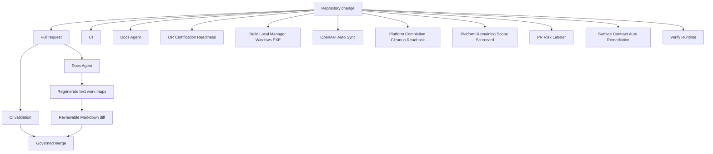

# Repository Automation Map

> Generated text documentation. Do not edit this file manually.
> Source hash: `8ddaadeb42433b1cca1207a52c21bda1e0c99231da0c7509a0856625520414e3`
> Source count: **10**
> Sources: `.github/workflows/ci.yml`, `.github/workflows/docs-agent.yml`, `.github/workflows/dr-certification-readiness.yml`, `.github/workflows/local-manager-windows.yml`, `.github/workflows/openapi-auto-sync.yml`, `.github/workflows/platform-completion-cleanup-readback.yml`, `.github/workflows/platform-remaining-scope-scorecard.yml`, `.github/workflows/pr-risk-labeler.yml`, `.github/workflows/surface-contract-auto-remediation.yml`, `.github/workflows/verify-runtime.yml`
> Rendering: Mermaid code blocks plus Markdown tables; no image assets are generated.

## Workflow inventory

| Workflow | File | Detected triggers |
|---|---|---|
| CI | `.github/workflows/ci.yml` | `workflow_dispatch`, `pull_request`, `push` |
| Docs Agent | `.github/workflows/docs-agent.yml` | `workflow_dispatch`, `pull_request`, `push` |
| DR Certification Readiness | `.github/workflows/dr-certification-readiness.yml` | `workflow_dispatch`, `pull_request`, `push`, `schedule` |
| Build Local Manager Windows EXE | `.github/workflows/local-manager-windows.yml` | `workflow_dispatch`, `pull_request`, `push` |
| OpenAPI Auto Sync | `.github/workflows/openapi-auto-sync.yml` | `workflow_dispatch`, `push` |
| Platform Completion Cleanup Readback | `.github/workflows/platform-completion-cleanup-readback.yml` | `workflow_dispatch`, `pull_request`, `push`, `schedule` |
| Platform Remaining Scope Scorecard | `.github/workflows/platform-remaining-scope-scorecard.yml` | `workflow_dispatch`, `pull_request`, `push`, `schedule` |
| PR Risk Labeler | `.github/workflows/pr-risk-labeler.yml` | manual/other |
| Surface Contract Auto Remediation | `.github/workflows/surface-contract-auto-remediation.yml` | `workflow_dispatch`, `push`, `schedule` |
| Verify Runtime | `.github/workflows/verify-runtime.yml` | `workflow_dispatch` |

Workflow files discovered: **10**.
