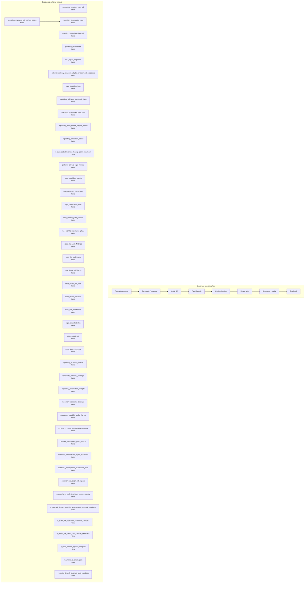

# Repository, Development, and Deployment Map

> Generated text documentation. Do not edit this file manually.
> Source hash: `3f9b0f98f2f0d43e226a0431c59ea29bb786036b421456a86837d2cfbaa23abd`
> Source count: **27**
> Sources: `http-generic-api/migrations/021_sprint26_dev_agent_growth_loop.sql`, `http-generic-api/migrations/1011_sprint69_governed_repository_engine_v6.sql`, `http-generic-api/migrations/1013_sprint69_approval_hold_identity_collation_alignment.sql`, `http-generic-api/migrations/1026_sprint69_repository_reconciliation_automation.sql`, `http-generic-api/migrations/1034_sprint69_repository_automation_control_plane.sql`, `http-generic-api/migrations/130_sprint64_summary_development_automation.sql`, `http-generic-api/migrations/134_sprint64_summary_development_agent_approvals.sql`, `http-generic-api/migrations/179_sprint66_dynamic_capability_audit_foundation.sql`, `http-generic-api/migrations/189_sprint66_platform_private_capability_vault.sql`, `http-generic-api/migrations/20260701_repository_operation_leases.sql`, _... +17 more_
> Rendering: Mermaid plus Markdown tables; no image assets or raw database rows are generated.

## Discovered object inventory

| Object | Type | Domain | Classification | Existing map refs | Source migrations | Columns | References |
|---|---|---|---|---|---:|---:|---|
| `dev_agent_proposals` | table | Repository & development | generated_domain_rule | - | 1 | 19 | `tenants` |
| `external_delivery_provider_adapter_enablement_proposals` | table | Repository & development | generated_domain_rule | - | 1 | 17 | `external_delivery_provider_adapter_contract_registry` |
| `operation_managed_git_worker_leases` | table | Workflow & tasks | registry:operation_artifacts_and_ownership | `data-model-domain-map`, `delivery-support-map`, `workflow-task-orchestration-map` | 2 | - | `repository_automation_runs` |
| `platform_private_repo_mirrors` | table | Repository & development | generated_domain_rule | - | 1 | - | - |
| `proposal_discussions` | table | Repository & development | generated_domain_rule | - | 1 | 9 | `tenants`, `users` |
| `repo_candidate_assets` | table | Assets & packages | generated_domain_rule | - | 1 | - | - |
| `repo_capability_candidates` | table | Repository & development | generated_domain_rule | - | 1 | - | - |
| `repo_certification_runs` | table | Repository & development | generated_domain_rule | - | 1 | - | - |
| `repo_conflict_path_policies` | table | Repository & development | generated_domain_rule | - | 1 | - | - |
| `repo_conflict_resolution_plans` | table | Repository & development | generated_domain_rule | - | 1 | - | - |
| `repo_file_audit_findings` | table | Repository & development | generated_domain_rule | - | 1 | 9 | - |
| `repo_file_audit_runs` | table | Repository & development | generated_domain_rule | - | 1 | 14 | - |
| `repo_ingestion_jobs` | table | Repository & development | generated_domain_rule | - | 2 | - | - |
| `repo_install_diff_items` | table | Repository & development | generated_domain_rule | - | 1 | - | - |
| `repo_install_diff_runs` | table | Repository & development | generated_domain_rule | - | 1 | - | - |
| `repo_install_requests` | table | Repository & development | generated_domain_rule | - | 1 | - | - |
| `repo_skill_candidates` | table | Repository & development | generated_domain_rule | - | 1 | - | - |
| `repo_snapshot_files` | table | Repository & development | generated_domain_rule | - | 1 | - | - |
| `repo_snapshots` | table | Repository & development | generated_domain_rule | - | 1 | - | - |
| `repo_source_registry` | table | Repository & development | generated_domain_rule | - | 1 | - | - |
| `repository_advisory_comment_plans` | table | Repository & development | registry:repository_automation_control_plane | `data-model-domain-map`, `observability-release-map`, `repository-automation-map`, `repository-development-map` | 2 | - | - |
| `repository_authority_aliases` | table | Repository & development | registry:repository_automation_control_plane | `data-model-domain-map`, `observability-release-map`, `repository-automation-map`, `repository-development-map` | 1 | - | - |
| `repository_authority_bindings` | table | Repository & development | registry:repository_automation_control_plane | `data-model-domain-map`, `observability-release-map`, `repository-automation-map`, `repository-development-map` | 1 | - | - |
| `repository_automation_receipts` | table | Repository & development | registry:repository_automation_control_plane | `data-model-domain-map`, `observability-release-map`, `repository-automation-map`, `repository-development-map` | 1 | 15 | - |
| `repository_automation_runs` | table | Repository & development | registry:repository_automation_control_plane | `data-model-domain-map`, `observability-release-map`, `repository-automation-map`, `repository-development-map` | 1 | 24 | - |
| `repository_automation_step_runs` | table | Repository & development | registry:repository_automation_control_plane | `data-model-domain-map`, `observability-release-map`, `repository-automation-map`, `repository-development-map` | 1 | 18 | `step_runs` |
| `repository_capability_bindings` | table | Repository & development | registry:repository_automation_control_plane | `data-model-domain-map`, `observability-release-map`, `repository-automation-map`, `repository-development-map` | 1 | - | - |
| `repository_capability_policy_layers` | table | Repository & development | registry:repository_automation_control_plane | `data-model-domain-map`, `observability-release-map`, `repository-automation-map`, `repository-development-map` | 1 | - | - |
| `repository_main_moved_trigger_events` | table | Repository & development | registry:repository_automation_control_plane | `data-model-domain-map`, `observability-release-map`, `repository-automation-map`, `repository-development-map` | 2 | - | - |
| `repository_mutation_plans_v6` | table | Repository & development | registry:repository_automation_control_plane | `data-model-domain-map`, `observability-release-map`, `repository-automation-map`, `repository-development-map` | 1 | 15 | `approval_holds`, `plans`, `tenants`, `users` |
| `repository_mutation_runs_v6` | table | Repository & development | registry:repository_automation_control_plane | `data-model-domain-map`, `observability-release-map`, `repository-automation-map`, `repository-development-map` | 2 | 26 | `approval_holds`, `plans`, `tenants`, `users` |
| `repository_operation_leases` | table | Repository & development | registry:repository_automation_control_plane | `data-model-domain-map`, `observability-release-map`, `repository-automation-map`, `repository-development-map` | 2 | 25 | - |
| `runtime_ci_check_classification_registry` | table | Repository & development | generated_domain_rule | - | 1 | - | - |
| `runtime_deployment_parity_status` | table | Repository & development | generated_domain_rule | - | 1 | - | - |
| `summary_development_agent_approvals` | table | Repository & development | generated_domain_rule | - | 1 | - | - |
| `summary_development_automation_runs` | table | Repository & development | generated_domain_rule | - | 1 | - | - |
| `summary_development_signals` | table | Repository & development | generated_domain_rule | - | 1 | - | - |
| `system_layer_tool_descriptor_source_registry` | table | Repository & development | generated_domain_rule | - | 1 | 10 | - |
| `v_external_delivery_provider_enablement_proposal_readiness` | view | Repository & development | generated_domain_rule | - | 1 | - | - |
| `v_github_file_operation_readiness_compact` | view | Repository & development | generated_domain_rule | - | 1 | - | - |
| `v_github_file_patch_plan_runtime_readiness` | view | Repository & development | generated_domain_rule | - | 1 | - | - |
| `v_repo_branch_hygiene_compact` | view | Repository & development | generated_domain_rule | - | 1 | - | - |
| `v_runtime_ci_check_gate` | view | Repository & development | generated_domain_rule | - | 1 | - | - |
| `v_smoke_branch_cleanup_gate_readback` | view | Repository & development | generated_domain_rule | - | 1 | - | - |
| `v_superseded_branch_cleanup_policy_readback` | view | Repository & development | generated_domain_rule | - | 2 | - | - |

## Coverage counters

- Matching schema objects: **45**
- Diagram objects shown: **45**
- Source migrations: **27**
