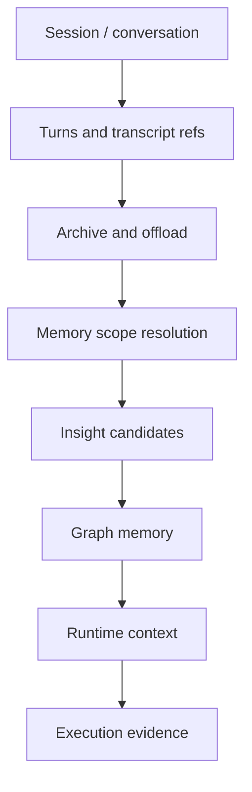

# Session, Memory, and Insight Map

> Generated text documentation. Do not edit this file manually.
> Source hash: `cc373a8c01a58d35e33ccbfd8d4ba77aace8ac5cc7b901f36500b28b2c36eb2d`
> Source count: **58**
> Sources: `http-generic-api/migrations/003_sprint06_access.sql`, `http-generic-api/migrations/018_sprint22_customer_session_registry.sql`, `http-generic-api/migrations/021_sprint26_dev_agent_growth_loop.sql`, `http-generic-api/migrations/026_sprint30_session_drive_export.sql`, `http-generic-api/migrations/027_sprint30b_session_payload_offload.sql`, `http-generic-api/migrations/050_sprint47e_fix_schema_drift.sql`, `http-generic-api/migrations/056_sprint52_session_drive_writeback.sql`, `http-generic-api/migrations/072_sprint59_secure_credential_intake.sql`, `http-generic-api/migrations/088_sprint61_offsite_drive_upload_registry.sql`, `http-generic-api/migrations/099_sprint62j_local_manager_device_link_sessions.sql`, _... +48 more_
> Rendering: Mermaid plus Markdown tables; no image assets or raw database rows are generated.

## Memory schema states

| State | Required | Authority | Canonical surface | Reference |
|---|---:|---|---|---|
| `version` | yes | - | - | - |
| `purpose` | yes | - | - | - |
| `data_source_state` | yes | - | - | - |
| `multi_business_activity_state` | yes | `business_activity_type_registry_first` | `business_activity_types` | - |
| `tenant_role_access_state` | yes | `deny_by_default_access_gate` | `tenants` | - |
| `service_mode_state` | yes | `service_mode_matrix` | - | - |
| `human_oversight_state` | yes | `assisted_operations_layer` | `assistance_roles` | - |
| `commercial_entitlement_state` | yes | `commercial_eligibility_gate` | - | - |
| `activation_state` | yes | - | - | `schemas/execution.schema.json#/$defs/activation_state` |
| `auto_bootstrap_state` | yes | - | - | `schemas/execution.schema.json#/$defs/auto_bootstrap_state` |
| `hard_activation_wrapper_state` | yes | - | - | `schemas/execution.schema.json#/$defs/hard_activation_wrapper_state` |
| `activation_awareness_state` | yes | - | - | - |
| `operational_alerting_state` | no | - | - | - |
| `execution_logging_state` | yes | - | - | `schemas/operations.schema.json#/$defs/execution_logging_state` |
| `governance_rules` | yes | - | - | `schemas/governance.schema.json#/$defs/governance_rules` |
| `governance_drift_state` | yes | - | - | `schemas/governance.schema.json#/$defs/governance_drift_state` |
| `variable_contract_state` | yes | - | - | `schemas/governance.schema.json#/$defs/variable_contract_state` |
| `http_transport_state` | yes | - | - | `schemas/routing_transport.schema.json#/$defs/http_transport_state` |
| `logic_pointer_state` | yes | - | - | `schemas/logic_knowledge.schema.json#/$defs/logic_pointer_state` |
| `logic_knowledge_state` | yes | - | - | `schemas/logic_knowledge.schema.json#/$defs/logic_knowledge_state` |
| `business_type_knowledge_state` | yes | - | - | `schemas/logic_knowledge.schema.json#/$defs/business_type_knowledge_state` |
| `logical_search_state` | yes | - | - | `schemas/logic_knowledge.schema.json#/$defs/logical_search_state` |
| `anomaly_cluster_state` | yes | - | - | `schemas/repair_audit.schema.json#/$defs/anomaly_cluster_state` |
| `cluster_auto_repair_state` | yes | - | - | `schemas/repair_audit.schema.json#/$defs/cluster_auto_repair_state` |
| `output_artifacts_state` | yes | `canonical_agent_output_store` | `output_artifacts` | - |
| `sink_dispatch_state` | yes | `output_sink_router_audit` | `sink_dispatch_log` | - |
| `agent_chain_state` | yes | `agent_event_bus` | `agent_chain_events` | - |
| `memory_scope_state` | yes | `explicit_scope_resolution` | - | - |
| `agent_governance_state` | yes | - | - | - |
| `tool_dispatch_binding_state` | no | `platform_tool_dispatch_binding_registry` | - | - |
| `capability_assurance_state` | yes | `capability_assurance_graph` | - | - |
| `local_connector_governance_state` | yes | `governed_dispatch_layer` | `task_routes` | - |

## Session and memory schema inventory

| Object | Type | Domain | Source migrations | Columns | References |
|---|---|---|---:|---:|---|
| `browser_runtime_sessions` | table | Connectors & providers | 1 | 11 | `tenants`, `users` |
| `connected_execution_sessions` | table | Sessions & memory | 1 | 24 | `tenants`, `users` |
| `credential_intake_sessions` | table | Connectors & providers | 3 | 21 | `tenants`, `users` |
| `customer_sessions` | table | Brand & business | 5 | 22 | `tenants`, `users` |
| `gpt_session_conversation_refs` | table | Sessions & memory | 2 | 19 | `tenants`, `users` |
| `gpt_session_turns` | table | Sessions & memory | 5 | 7 | - |
| `graph_memory_usage_events` | table | Commercial & usage | 1 | 18 | `tenants`, `users` |
| `growth_intelligence_insights` | table | Agents & intelligence | 1 | - | - |
| `local_manager_device_link_sessions` | table | Connectors & providers | 1 | 17 | `tenants`, `users` |
| `memory_scope_links` | table | Sessions & memory | 2 | 36 | `memory_scope_type_registry`, `tenants`, `users` |
| `memory_scope_type_registry` | table | Sessions & memory | 2 | 19 | - |
| `offsite_drive_upload_sessions` | table | Sessions & memory | 1 | - | - |
| `platform_graph_memory_rank_rules` | table | Platform resources & graph | 1 | 7 | - |
| `platform_variant_edit_sessions` | table | Assets & packages | 1 | - | - |
| `request_envelopes` | table | Sessions & memory | 1 | 15 | `tenants`, `users` |
| `session_assimilation_queue` | table | Sessions & memory | 1 | 10 | `tenants` |
| `session_drive_artifacts` | table | Sessions & memory | 1 | 14 | - |
| `session_events` | table | Sessions & memory | 3 | 10 | `tenants` |
| `session_insight_backlog_target_items` | table | Sessions & memory | 1 | 19 | - |
| `session_insight_backlog_target_writes` | table | Sessions & memory | 1 | 33 | `session_insight_backlog_target_items`, `session_insight_capability_envelope_remaining_scope_completions` |
| `session_insight_candidates` | table | Sessions & memory | 1 | 31 | `tenants`, `users` |
| `session_insight_capability_envelope_actual_request_preflights` | table | Platform resources & graph | 1 | 29 | `session_insight_capability_envelope_dispatch_dry_runs` |
| `session_insight_capability_envelope_actual_requests` | table | Platform resources & graph | 1 | 34 | `session_insight_capability_envelope_actual_request_preflights`, `session_insight_capability_envelope_dispatch_dry_runs` |
| `session_insight_capability_envelope_adapter_execution_gates` | table | Platform resources & graph | 1 | 29 | `session_insight_capability_envelope_dispatch_readbacks` |
| `session_insight_capability_envelope_approval_decisions` | table | Platform resources & graph | 1 | 30 | `approval_holds`, `session_insight_capability_envelope_actual_requests` |
| `session_insight_capability_envelope_dispatch_dry_runs` | table | Platform resources & graph | 2 | 26 | `session_insight_capability_envelope_request_gates` |
| `session_insight_capability_envelope_dispatch_readbacks` | table | Platform resources & graph | 1 | 33 | `approval_holds`, `session_insight_capability_envelope_approval_decisions` |
| `session_insight_capability_envelope_plans` | table | Platform resources & graph | 1 | 24 | `session_insight_promotion_payload_previews` |
| `session_insight_capability_envelope_remaining_scope_completions` | table | Platform resources & graph | 1 | 35 | `session_insight_capability_envelope_adapter_execution_gates` |
| `session_insight_capability_envelope_request_gate_review_events` | table | Platform resources & graph | 1 | 18 | `session_insight_capability_envelope_request_gates` |
| `session_insight_capability_envelope_request_gates` | table | Platform resources & graph | 2 | 25 | `session_insight_capability_envelope_plans` |
| `session_insight_dispatch_dry_run_review_events` | table | Sessions & memory | 1 | 21 | `session_insight_capability_envelope_dispatch_dry_runs` |
| `session_insight_payload_preview_review_events` | table | Sessions & memory | 1 | 16 | `session_insight_promotion_payload_previews` |
| `session_insight_promotion_adapter_contracts` | table | Sessions & memory | 1 | 21 | `session_insight_promotion_target_adapters` |
| `session_insight_promotion_apply_requests` | table | Sessions & memory | 1 | 23 | `session_insight_promotion_execution_previews` |
| `session_insight_promotion_execution_previews` | table | Sessions & memory | 1 | 16 | `session_insight_promotions` |
| `session_insight_promotion_payload_previews` | table | Sessions & memory | 2 | 20 | `session_insight_promotion_apply_requests` |
| `session_insight_promotion_review_events` | table | Sessions & memory | 1 | 16 | `session_insight_promotions` |
| `session_insight_promotion_target_adapters` | table | Sessions & memory | 1 | 22 | - |
| `session_insight_promotions` | table | Sessions & memory | 1 | 38 | `session_insight_candidates`, `tenants`, `users` |
| `session_insight_target_write_readbacks` | table | Sessions & memory | 1 | 29 | `session_insight_backlog_target_writes` |
| `session_summaries` | table | Sessions & memory | 2 | 18 | `dev_agent_runs`, `tenants`, `users` |
| `session_turns` | table | Sessions & memory | 1 | 11 | `tenants` |
| `v_gpt_session_archive_monitoring` | view | Sessions & memory | 1 | - | - |
| `v_gpt_session_archive_monitoring_issues` | view | Sessions & memory | 5 | - | - |
| `v_gpt_session_archive_monitoring_summary` | view | Sessions & memory | 1 | - | - |
| `v_memory_scope_link_registry_issues` | view | Sessions & memory | 1 | - | - |
| `v_session_insight_actual_preflight_issues` | view | Governance & authority | 1 | - | - |
| `v_session_insight_actual_preflight_readiness` | view | Governance & authority | 1 | - | - |
| `v_session_insight_actual_request_readiness` | view | Sessions & memory | 1 | - | - |
| `v_session_insight_adapter_apply_readiness` | view | Sessions & memory | 1 | - | - |
| `v_session_insight_adapter_apply_readiness_gate` | view | Sessions & memory | 1 | - | - |
| `v_session_insight_adapter_apply_readiness_gate_issues` | view | Sessions & memory | 1 | - | - |
| `v_session_insight_adapter_contract_issues` | view | Sessions & memory | 1 | - | - |
| `v_session_insight_adapter_execution_readiness` | view | Sessions & memory | 1 | - | - |
| `v_session_insight_adapter_gate_issues` | view | Sessions & memory | 1 | - | - |
| `v_session_insight_apply_request_adapter_readiness` | view | Sessions & memory | 1 | - | - |
| `v_session_insight_apply_request_contract_readiness` | view | Sessions & memory | 1 | - | - |
| `v_session_insight_backlog_target_write_issues` | view | Sessions & memory | 1 | - | - |
| `v_session_insight_backlog_target_write_readiness` | view | Sessions & memory | 1 | - | - |
| `v_session_insight_candidate_issues` | view | Sessions & memory | 1 | - | - |
| `v_session_insight_capability_envelope_actual_request_issues` | view | Platform resources & graph | 1 | - | - |
| `v_session_insight_capability_envelope_approval_decision_issues` | view | Platform resources & graph | 1 | - | - |
| `v_session_insight_capability_envelope_approval_readiness` | view | Platform resources & graph | 1 | - | - |
| `v_session_insight_capability_envelope_dispatch_dry_run_issues` | view | Platform resources & graph | 1 | - | - |
| `v_session_insight_capability_envelope_dispatch_dry_run_readiness` | view | Platform resources & graph | 1 | - | - |
| `v_session_insight_capability_envelope_dispatch_readback_issues` | view | Platform resources & graph | 1 | - | - |
| `v_session_insight_capability_envelope_plan_issues` | view | Platform resources & graph | 1 | - | - |
| `v_session_insight_capability_envelope_plan_readiness` | view | Platform resources & graph | 1 | - | - |
| `v_session_insight_capability_envelope_request_dispatch_readiness` | view | Platform resources & graph | 1 | - | - |
| `v_session_insight_capability_envelope_request_gate_issues` | view | Platform resources & graph | 1 | - | - |
| `v_session_insight_capability_envelope_request_gate_readiness` | view | Platform resources & graph | 1 | - | - |
| `v_session_insight_capability_envelope_request_review_issues` | view | Platform resources & graph | 1 | - | - |
| `v_session_insight_capability_envelope_request_review_queue` | view | Platform resources & graph | 1 | - | - |
| `v_session_insight_dispatch_dry_run_review_issues` | view | Sessions & memory | 1 | - | - |
| `v_session_insight_dispatch_dry_run_review_queue` | view | Sessions & memory | 1 | - | - |
| `v_session_insight_dispatch_readback_readiness` | view | Sessions & memory | 1 | - | - |
| `v_session_insight_payload_preview_issues` | view | Sessions & memory | 1 | - | - |
| `v_session_insight_payload_preview_readiness` | view | Sessions & memory | 1 | - | - |
| `v_session_insight_payload_preview_review_issues` | view | Sessions & memory | 1 | - | - |
| `v_session_insight_payload_preview_review_queue` | view | Sessions & memory | 1 | - | - |
| `v_session_insight_promotion_apply_request_issues` | view | Sessions & memory | 1 | - | - |
| `v_session_insight_promotion_execution_preview_issues` | view | Sessions & memory | 1 | - | - |
| `v_session_insight_promotion_issues` | view | Sessions & memory | 1 | - | - |
| `v_session_insight_promotion_review_queue` | view | Sessions & memory | 1 | - | - |
| `v_session_insight_remaining_scope_completion_issues` | view | Sessions & memory | 1 | - | - |
| `v_session_insight_remaining_scope_completion_readiness` | view | Sessions & memory | 1 | - | - |
| `v_session_insight_scope_link_issues` | view | Sessions & memory | 1 | - | - |
| `v_session_insight_target_adapter_issues` | view | Sessions & memory | 1 | - | - |
| `v_session_insight_target_write_readback_issues` | view | Sessions & memory | 1 | - | - |
| `v_session_insight_target_write_readback_readiness` | view | Sessions & memory | 1 | - | - |
| `v_session_summary_graph_attachments` | view | Sessions & memory | 1 | - | - |
