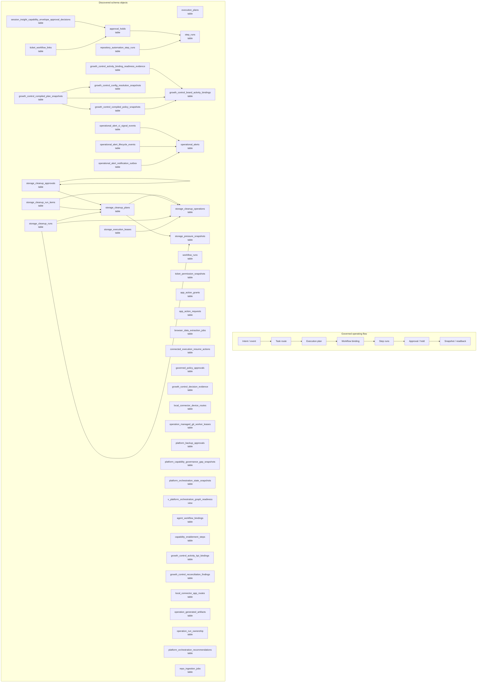

# Workflow, Task, and Orchestration Map

> Generated text documentation. Do not edit this file manually.
> Source hash: `7127f29782c8702802bd07b22d747557d7187fd4a314a57eb633e2a14b485aae`
> Source count: **72**
> Sources: `http-generic-api/migrations/006_sprint08_planner.sql`, `http-generic-api/migrations/010_sprint14_workflow_orchestration.sql`, `http-generic-api/migrations/016_sprint20_agent_registry.sql`, `http-generic-api/migrations/019_sprint24_workflow_seeds_and_skills.sql`, `http-generic-api/migrations/020_sprint25_user_app_integrations.sql`, `http-generic-api/migrations/023_sprint28_schema_import.sql`, `http-generic-api/migrations/037_sprint41_n8n_local_app_routes.sql`, `http-generic-api/migrations/083_sprint61_backup_approval_restore_gates.sql`, `http-generic-api/migrations/086_sprint61_backup_approval_workflow_contract.sql`, `http-generic-api/migrations/089_sprint61_platform_pending_tasks.sql`, _... +62 more_
> Rendering: Mermaid plus Markdown tables; no image assets or raw database rows are generated.

## Discovered object inventory

| Object | Type | Domain | Classification | Existing map refs | Source migrations | Columns | References |
|---|---|---|---|---|---:|---:|---|
| `actions` | table | Workflow & tasks | generated_domain_rule | - | 1 | - | - |
| `activation_auth_source_router` | table | Activation & onboarding | generated_domain_rule | - | 1 | - | - |
| `activation_snapshot_ledger` | table | Activation & onboarding | generated_domain_rule | - | 1 | - | - |
| `agent_workflow_bindings` | table | Agents & intelligence | generated_domain_rule | - | 1 | 5 | `agents` |
| `app_action_grants` | table | Workflow & tasks | generated_domain_rule | - | 2 | 12 | `agents` |
| `app_action_requests` | table | Workflow & tasks | generated_domain_rule | - | 2 | 15 | `agents` |
| `approval_holds` | table | Workflow & tasks | generated_domain_rule | - | 3 | 15 | `step_runs`, `tenants` |
| `browser_data_extraction_jobs` | table | Workflow & tasks | generated_domain_rule | - | 1 | 13 | `tenants`, `users` |
| `capability_enablement_steps` | table | Platform resources & graph | generated_domain_rule | - | 1 | - | `capability_enablement_requests` |
| `connected_execution_resume_actions` | table | Workflow & tasks | generated_domain_rule | - | 1 | 19 | `tenants`, `users` |
| `container_override_approvals` | table | Platform resources & graph | registry:dynamic_container_authority | `data-model-domain-map`, `observability-release-map`, `platform-resource-graph-map`, `policy-authority-map` | 1 | 8 | - |
| `database_lifecycle_report_snapshot_scheduler_bindings` | table | Migration & lifecycle | generated_domain_rule | - | 1 | - | - |
| `database_lifecycle_report_snapshot_schedules` | table | Migration & lifecycle | generated_domain_rule | - | 1 | - | - |
| `database_lifecycle_report_snapshots` | table | Migration & lifecycle | generated_domain_rule | - | 1 | - | - |
| `database_lifecycle_scheduler_approval_events` | table | Migration & lifecycle | generated_domain_rule | - | 1 | - | - |
| `execution_enablement_registry` | table | Workflow & tasks | generated_domain_rule | - | 1 | - | - |
| `execution_enablement_requests` | table | Workflow & tasks | generated_domain_rule | - | 1 | - | - |
| `execution_plan_events` | table | Tenancy & identity | generated_domain_rule | - | 1 | - | - |
| `execution_plan_mutation_receipts` | table | Tenancy & identity | generated_domain_rule | - | 1 | - | - |
| `execution_plan_steps` | table | Tenancy & identity | generated_domain_rule | - | 1 | - | - |
| `execution_plans` | table | Tenancy & identity | generated_domain_rule | - | 5 | 18 | `plans`, `tenants`, `users` |
| `governed_policy_approvals` | table | Workflow & tasks | generated_domain_rule | - | 1 | 14 | `governed_policy_proposals`, `tenants` |
| `growth_control_activity_binding_readiness_evidence` | table | Observability & release | registry:growth_control_evidence_objects | `data-model-domain-map`, `observability-release-map`, `policy-authority-map`, `workflow-task-orchestration-map` | 1 | - | `growth_control_brand_activity_bindings` |
| `growth_control_activity_kpi_bindings` | table | Governance & authority | registry:growth_control_kpi_authority_objects | `data-model-domain-map`, `platform-resource-graph-map`, `policy-authority-map`, `workflow-task-orchestration-map` | 1 | 21 | `tenants` |
| `growth_control_activity_pack_definitions` | table | Workflow & tasks | registry:growth_control_activity_objects | `data-model-domain-map`, `platform-resource-graph-map`, `policy-authority-map`, `workflow-task-orchestration-map` | 1 | 10 | - |
| `growth_control_activity_pack_versions` | table | Workflow & tasks | registry:growth_control_activity_objects | `data-model-domain-map`, `platform-resource-graph-map`, `policy-authority-map`, `workflow-task-orchestration-map` | 1 | 13 | - |
| `growth_control_brand_activity_bindings` | table | Workflow & tasks | registry:growth_control_activity_objects | `data-model-domain-map`, `platform-resource-graph-map`, `policy-authority-map`, `workflow-task-orchestration-map` | 1 | 22 | `tenants` |
| `growth_control_compiled_plan_snapshots` | table | Governance & authority | registry:growth_control_compiled_snapshot_objects | `data-model-domain-map`, `observability-release-map`, `policy-authority-map`, `workflow-task-orchestration-map` | 1 | 26 | `growth_control_brand_activity_bindings`, `growth_control_compiled_policy_snapshots`, `growth_control_config_resolution_snapshots`, `tenants` |
| `growth_control_compiled_policy_snapshots` | table | Governance & authority | registry:growth_control_compiled_snapshot_objects | `data-model-domain-map`, `observability-release-map`, `policy-authority-map`, `workflow-task-orchestration-map` | 1 | 19 | `growth_control_brand_activity_bindings`, `tenants` |
| `growth_control_config_resolution_snapshots` | table | Governance & authority | registry:growth_control_configuration_objects | `data-model-domain-map`, `observability-release-map`, `platform-resource-graph-map`, `policy-authority-map` | 1 | 19 | `plans`, `tenants` |
| `growth_control_decision_evidence` | table | Observability & release | registry:growth_control_decision_reconciliation_objects | `data-model-domain-map`, `execution-log-evidence-map`, `observability-release-map`, `policy-authority-map`, `workflow-task-orchestration-map` | 1 | 23 | `plans`, `tenants` |
| `growth_control_kpi_definitions` | table | Governance & authority | registry:growth_control_kpi_authority_objects | `data-model-domain-map`, `platform-resource-graph-map`, `policy-authority-map`, `workflow-task-orchestration-map` | 1 | 17 | - |
| `growth_control_reconciliation_findings` | table | Observability & release | registry:growth_control_decision_reconciliation_objects | `data-model-domain-map`, `execution-log-evidence-map`, `observability-release-map`, `policy-authority-map`, `workflow-task-orchestration-map` | 1 | 15 | `tenants` |
| `growth_control_shadow_parity_evidence` | table | Observability & release | registry:growth_control_evidence_objects | `data-model-domain-map`, `observability-release-map`, `policy-authority-map`, `workflow-task-orchestration-map` | 1 | - | - |
| `growth_control_shadow_parity_mappings` | table | Observability & release | registry:growth_control_evidence_objects | `data-model-domain-map`, `observability-release-map`, `policy-authority-map`, `workflow-task-orchestration-map` | 1 | - | - |
| `growth_intelligence_actions` | table | Agents & intelligence | generated_domain_rule | - | 1 | - | - |
| `local_connector_app_routes` | table | Workflow & tasks | generated_domain_rule | - | 1 | 12 | `local_connector_user_configs` |
| `local_connector_device_routes` | table | Workflow & tasks | generated_domain_rule | - | 1 | 25 | `tenants`, `users` |
| `local_connector_routes` | table | Workflow & tasks | generated_domain_rule | - | 1 | - | - |
| `managed_execution_step_requests` | table | Workflow & tasks | generated_domain_rule | - | 1 | - | - |
| `operation_generated_artifacts` | table | Workflow & tasks | registry:operation_artifacts_and_ownership | `data-model-domain-map`, `delivery-support-map`, `workflow-task-orchestration-map` | 1 | - | `repository_automation_runs` |
| `operation_managed_git_worker_leases` | table | Workflow & tasks | registry:operation_artifacts_and_ownership | `data-model-domain-map`, `delivery-support-map`, `workflow-task-orchestration-map` | 2 | - | `repository_automation_runs` |
| `operation_run_ownership` | table | Workflow & tasks | registry:operation_artifacts_and_ownership | `data-model-domain-map`, `delivery-support-map`, `workflow-task-orchestration-map` | 1 | - | `repository_automation_runs` |
| `operational_alert_ci_signal_events` | table | Observability & release | registry:operational_alert_lifecycle | `data-model-domain-map`, `delivery-support-map`, `observability-release-map`, `workflow-task-orchestration-map` | 1 | - | `operational_alerts` |
| `operational_alert_lifecycle_events` | table | Observability & release | registry:operational_alert_lifecycle | `data-model-domain-map`, `delivery-support-map`, `observability-release-map`, `workflow-task-orchestration-map` | 1 | - | `operational_alerts` |
| `operational_alert_notification_outbox` | table | Observability & release | registry:operational_alert_lifecycle | `data-model-domain-map`, `delivery-support-map`, `observability-release-map`, `workflow-task-orchestration-map` | 1 | - | `operational_alerts` |
| `operational_alert_rule_registry` | table | Observability & release | registry:operational_alert_lifecycle | `data-model-domain-map`, `delivery-support-map`, `observability-release-map`, `workflow-task-orchestration-map` | 1 | - | - |
| `operational_alert_sync_runs` | table | Observability & release | registry:operational_alert_lifecycle | `data-model-domain-map`, `delivery-support-map`, `observability-release-map`, `workflow-task-orchestration-map` | 1 | - | - |
| `operational_alerts` | table | Observability & release | registry:operational_alert_lifecycle | `data-model-domain-map`, `delivery-support-map`, `observability-release-map`, `workflow-task-orchestration-map` | 2 | - | - |
| `platform_backup_approvals` | table | Workflow & tasks | generated_domain_rule | - | 2 | 12 | `platform_backup_policies` |
| `platform_capability_governance_gap_snapshots` | table | Platform resources & graph | generated_domain_rule | - | 1 | 13 | `platform_capability_compilation_runs`, `platform_capability_compiled_manifests` |
| `platform_health_scorecard_snapshots` | table | Observability & release | generated_domain_rule | - | 1 | - | - |
| `platform_orchestration_edges` | table | Workflow & tasks | generated_domain_rule | - | 1 | 12 | - |
| `platform_orchestration_plugins` | table | Agents & intelligence | generated_domain_rule | - | 1 | 17 | - |
| `platform_orchestration_recommendations` | table | Workflow & tasks | generated_domain_rule | - | 1 | 21 | `decision_runs` |
| `platform_orchestration_stages` | table | Workflow & tasks | generated_domain_rule | - | 1 | 17 | - |
| `platform_orchestration_state_snapshots` | table | Workflow & tasks | generated_domain_rule | - | 1 | 22 | `decision_runs`, `tenants` |
| `platform_outbox_consumers` | table | Delivery & support | registry:platform_outbox_delivery | `data-model-domain-map`, `delivery-support-map`, `observability-release-map`, `workflow-task-orchestration-map` | 1 | - | - |
| `platform_outbox_deliveries` | table | Delivery & support | registry:platform_outbox_delivery | `data-model-domain-map`, `delivery-support-map`, `observability-release-map`, `workflow-task-orchestration-map` | 1 | - | - |
| `platform_outbox_event_types` | table | Delivery & support | registry:platform_outbox_delivery | `data-model-domain-map`, `delivery-support-map`, `observability-release-map`, `workflow-task-orchestration-map` | 1 | - | - |
| `platform_outbox_events` | table | Delivery & support | registry:platform_outbox_delivery | `data-model-domain-map`, `delivery-support-map`, `observability-release-map`, `workflow-task-orchestration-map` | 1 | - | - |
| `platform_outbox_mask_policies` | table | Delivery & support | registry:platform_outbox_delivery | `data-model-domain-map`, `delivery-support-map`, `observability-release-map`, `workflow-task-orchestration-map` | 1 | - | - |
| `platform_pending_tasks` | table | Workflow & tasks | generated_domain_rule | - | 1 | - | - |
| `platform_resource_recipe_steps` | table | Platform resources & graph | generated_domain_rule | - | 1 | 18 | - |
| `release_operation_steps` | table | Workflow & tasks | generated_domain_rule | - | 1 | - | - |
| `repo_ingestion_jobs` | table | Repository & development | generated_domain_rule | - | 2 | - | - |
| `repo_snapshot_files` | table | Repository & development | generated_domain_rule | - | 1 | - | - |
| `repo_snapshots` | table | Repository & development | generated_domain_rule | - | 1 | - | - |
| `repository_automation_step_runs` | table | Repository & development | registry:repository_automation_control_plane | `data-model-domain-map`, `observability-release-map`, `repository-automation-map`, `repository-development-map` | 1 | 18 | `step_runs` |
| `resource_authority_route_family_registry` | table | Workflow & tasks | generated_domain_rule | - | 1 | 16 | - |
| `runtime_verification_steps` | table | Workflow & tasks | generated_domain_rule | - | 1 | - | `runtime_verification_runs` |
| `runtime_verification_workflow_registry` | table | Workflow & tasks | generated_domain_rule | - | 1 | - | - |
| `schema_import_jobs` | table | Workflow & tasks | generated_domain_rule | - | 2 | 16 | - |
| `session_insight_capability_envelope_approval_decisions` | table | Platform resources & graph | generated_domain_rule | - | 1 | 30 | `approval_holds`, `session_insight_capability_envelope_actual_requests` |
| `step_runs` | table | Workflow & tasks | generated_domain_rule | - | 2 | 15 | `tenants` |
| `storage_cleanup_approvals` | table | Governance & authority | registry:spec014_hostinger_storage_cleanup_approvals | `data-model-domain-map`, `execution-log-evidence-map`, `policy-authority-map`, `workflow-task-orchestration-map` | 1 | - | `storage_cleanup_approvals`, `storage_cleanup_plans` |
| `storage_cleanup_operations` | table | Workflow & tasks | registry:spec014_hostinger_storage_cleanup_operations | `data-model-domain-map`, `execution-log-evidence-map`, `policy-authority-map`, `workflow-task-orchestration-map` | 1 | - | `storage_provider_accounts`, `storage_targets` |
| `storage_cleanup_plan_impacts` | table | Governance & authority | registry:spec014_hostinger_storage_cleanup_plan_impacts | `data-model-domain-map`, `platform-resource-graph-map`, `policy-authority-map`, `workflow-task-orchestration-map` | 1 | - | `storage_cleanup_plans` |
| `storage_cleanup_plan_items` | table | Workflow & tasks | registry:spec014_hostinger_storage_cleanup_plan_items | `data-model-domain-map`, `execution-log-evidence-map`, `workflow-task-orchestration-map` | 1 | - | `storage_cleanup_plans` |
| `storage_cleanup_plans` | table | Workflow & tasks | registry:spec014_hostinger_storage_cleanup_plans | `data-model-domain-map`, `execution-log-evidence-map`, `policy-authority-map`, `workflow-task-orchestration-map` | 1 | - | `storage_cleanup_operations`, `storage_pressure_snapshots`, `storage_provider_accounts`, `storage_targets` |
| `storage_cleanup_run_items` | table | Workflow & tasks | registry:spec014_hostinger_storage_cleanup_run_items | `data-model-domain-map`, `execution-log-evidence-map`, `workflow-task-orchestration-map` | 1 | - | `storage_cleanup_operations`, `storage_cleanup_plans` |
| `storage_cleanup_runs` | table | Workflow & tasks | registry:spec014_hostinger_storage_cleanup_runs | `connector-provider-map`, `data-model-domain-map`, `execution-log-evidence-map`, `workflow-task-orchestration-map` | 1 | - | `storage_cleanup_operations`, `storage_cleanup_plans`, `storage_pressure_snapshots` |
| `storage_execution_leases` | table | Governance & authority | registry:spec014_hostinger_storage_execution_leases | `data-model-domain-map`, `execution-log-evidence-map`, `policy-authority-map`, `workflow-task-orchestration-map` | 1 | - | `storage_cleanup_operations`, `storage_targets` |
| `storage_pressure_snapshots` | table | Observability & release | registry:spec014_hostinger_storage_pressure_snapshots | `data-model-domain-map`, `execution-log-evidence-map`, `observability-release-map` | 1 | - | `storage_provider_accounts`, `storage_targets` |
| `storage_reconciliation_results` | table | Workflow & tasks | registry:spec014_hostinger_storage_reconciliation_results | `data-model-domain-map`, `execution-log-evidence-map`, `observability-release-map`, `workflow-task-orchestration-map` | 1 | - | `storage_cleanup_operations` |
| `summary_development_agent_approvals` | table | Repository & development | generated_domain_rule | - | 1 | - | - |
| `tenant_ssh_cli_approval_requests` | table | Tenancy & identity | generated_domain_rule | - | 1 | - | - |
| `ticket_permission_snapshots` | table | Delivery & support | generated_domain_rule | - | 1 | 14 | `tenants`, `tickets`, `users` |
| `ticket_workflow_links` | table | Delivery & support | generated_domain_rule | - | 2 | 12 | `approval_holds`, `plans`, `tenants`, `tickets` |
| `workflow_runs` | table | Workflow & tasks | generated_domain_rule | - | 3 | 16 | `plans`, `tenants`, `users` |
| `workflow_runtime_bindings` | table | Workflow & tasks | generated_domain_rule | - | 1 | 20 | `tenants` |
| `workflows` | table | Workflow & tasks | generated_domain_rule | - | 1 | - | - |
| `v_activation_app_action_grants` | view | Activation & onboarding | generated_domain_rule | - | 1 | - | - |
| `v_activation_pending_tasks` | view | Activation & onboarding | generated_domain_rule | - | 1 | - | - |
| `v_activation_task_route_catalog` | view | Activation & onboarding | generated_domain_rule | - | 1 | - | - |
| `v_activation_workflow_catalog` | view | Activation & onboarding | generated_domain_rule | - | 1 | - | - |
| `v_activation_workflow_runtime_bindings` | view | Activation & onboarding | generated_domain_rule | - | 1 | - | - |
| `v_approval_hold_identity_collation_readiness` | view | Workflow & tasks | generated_domain_rule | - | 1 | - | - |
| `v_approval_hold_parent_resolution` | view | Workflow & tasks | generated_domain_rule | - | 1 | - | - |
| `v_database_lifecycle_backup_snapshot_review` | view | Migration & lifecycle | generated_domain_rule | - | 1 | - | - |
| `v_database_lifecycle_report_snapshot_schedule_readiness` | view | Migration & lifecycle | generated_domain_rule | - | 1 | - | - |
| `v_database_lifecycle_report_snapshot_summary` | view | Migration & lifecycle | generated_domain_rule | - | 1 | - | - |
| `v_growth_control_shadow_parity_summary` | view | Observability & release | registry:growth_control_evidence_objects | `data-model-domain-map`, `observability-release-map`, `policy-authority-map`, `workflow-task-orchestration-map` | 1 | - | - |
| `v_operational_alerts_open` | view | Observability & release | registry:operational_alert_lifecycle | `data-model-domain-map`, `delivery-support-map`, `observability-release-map`, `workflow-task-orchestration-map` | 1 | - | - |
| `v_platform_orchestration_ads_governance_readiness` | view | Workflow & tasks | generated_domain_rule | - | 1 | - | - |
| `v_platform_orchestration_external_delivery_readiness` | view | Delivery & support | generated_domain_rule | - | 1 | - | - |
| `v_platform_orchestration_graph_readiness` | view | Workflow & tasks | generated_domain_rule | - | 3 | - | - |
| `v_platform_orchestration_support_ticket_lifecycle_readiness` | view | Delivery & support | generated_domain_rule | - | 1 | - | - |
| `v_session_insight_capability_envelope_approval_decision_issues` | view | Platform resources & graph | generated_domain_rule | - | 1 | - | - |
| `v_session_insight_capability_envelope_approval_readiness` | view | Platform resources & graph | generated_domain_rule | - | 1 | - | - |

## Coverage counters

- Matching schema objects: **110**
- Diagram objects shown: **45**
- Source migrations: **72**
