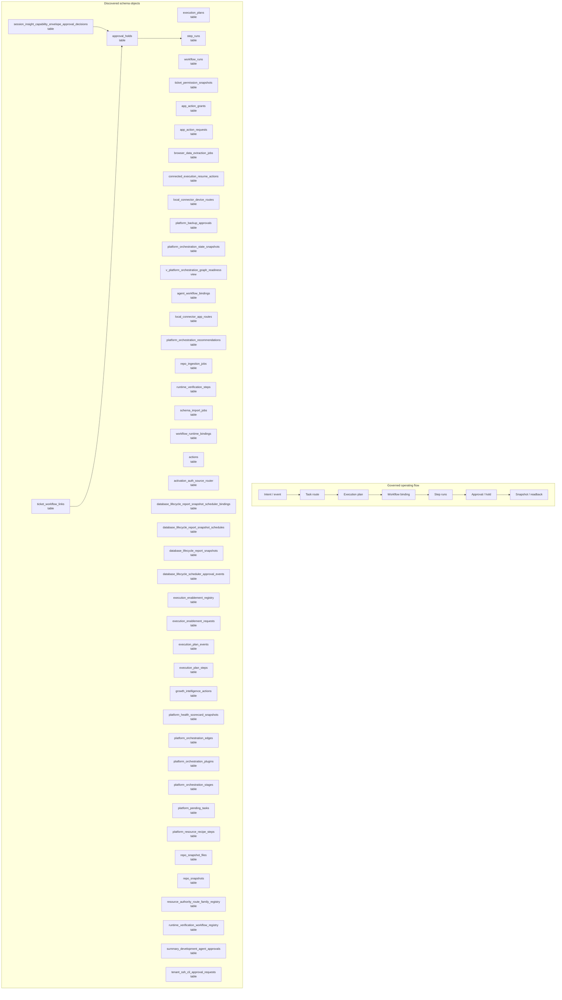

# Workflow, Task, and Orchestration Map

> Generated text documentation. Do not edit this file manually.
> Source hash: `7713f83d0624c0ec0d63cd648242d93fe0a5d1c5a93636ad1aa759fd1e634254`
> Source count: **45**
> Sources: `http-generic-api/migrations/006_sprint08_planner.sql`, `http-generic-api/migrations/010_sprint14_workflow_orchestration.sql`, `http-generic-api/migrations/016_sprint20_agent_registry.sql`, `http-generic-api/migrations/019_sprint24_workflow_seeds_and_skills.sql`, `http-generic-api/migrations/020_sprint25_user_app_integrations.sql`, `http-generic-api/migrations/023_sprint28_schema_import.sql`, `http-generic-api/migrations/037_sprint41_n8n_local_app_routes.sql`, `http-generic-api/migrations/083_sprint61_backup_approval_restore_gates.sql`, `http-generic-api/migrations/086_sprint61_backup_approval_workflow_contract.sql`, `http-generic-api/migrations/089_sprint61_platform_pending_tasks.sql`, _... +35 more_
> Rendering: Mermaid plus Markdown tables; no image assets or raw database rows are generated.

## Discovered object inventory

| Object | Type | Domain | Source migrations | Columns | References |
|---|---|---|---:|---:|---|
| `actions` | table | Workflow & tasks | 1 | - | - |
| `activation_auth_source_router` | table | Activation & onboarding | 1 | - | - |
| `agent_workflow_bindings` | table | Agents & intelligence | 1 | 5 | `agents` |
| `app_action_grants` | table | Workflow & tasks | 2 | 12 | `agents` |
| `app_action_requests` | table | Workflow & tasks | 2 | 15 | `agents` |
| `approval_holds` | table | Workflow & tasks | 2 | 15 | `step_runs`, `tenants` |
| `browser_data_extraction_jobs` | table | Workflow & tasks | 1 | 13 | `tenants`, `users` |
| `connected_execution_resume_actions` | table | Workflow & tasks | 1 | 19 | `tenants`, `users` |
| `database_lifecycle_report_snapshot_scheduler_bindings` | table | Migration & lifecycle | 1 | - | - |
| `database_lifecycle_report_snapshot_schedules` | table | Migration & lifecycle | 1 | - | - |
| `database_lifecycle_report_snapshots` | table | Migration & lifecycle | 1 | - | - |
| `database_lifecycle_scheduler_approval_events` | table | Migration & lifecycle | 1 | - | - |
| `execution_enablement_registry` | table | Workflow & tasks | 1 | - | - |
| `execution_enablement_requests` | table | Workflow & tasks | 1 | - | - |
| `execution_plan_events` | table | Tenancy & identity | 1 | - | - |
| `execution_plan_steps` | table | Tenancy & identity | 1 | - | - |
| `execution_plans` | table | Tenancy & identity | 5 | 18 | `plans`, `tenants`, `users` |
| `growth_intelligence_actions` | table | Agents & intelligence | 1 | - | - |
| `local_connector_app_routes` | table | Workflow & tasks | 1 | 12 | `local_connector_user_configs` |
| `local_connector_device_routes` | table | Workflow & tasks | 1 | 25 | `tenants`, `users` |
| `platform_backup_approvals` | table | Workflow & tasks | 2 | 12 | `platform_backup_policies` |
| `platform_health_scorecard_snapshots` | table | Observability & release | 1 | - | - |
| `platform_orchestration_edges` | table | Workflow & tasks | 1 | 12 | - |
| `platform_orchestration_plugins` | table | Agents & intelligence | 1 | 17 | - |
| `platform_orchestration_recommendations` | table | Workflow & tasks | 1 | 21 | `decision_runs` |
| `platform_orchestration_stages` | table | Workflow & tasks | 1 | 17 | - |
| `platform_orchestration_state_snapshots` | table | Workflow & tasks | 1 | 22 | `decision_runs`, `tenants` |
| `platform_pending_tasks` | table | Workflow & tasks | 1 | - | - |
| `platform_resource_recipe_steps` | table | Platform resources & graph | 1 | 18 | - |
| `repo_ingestion_jobs` | table | Repository & development | 2 | - | - |
| `repo_snapshot_files` | table | Repository & development | 1 | - | - |
| `repo_snapshots` | table | Repository & development | 1 | - | - |
| `resource_authority_route_family_registry` | table | Workflow & tasks | 1 | 16 | - |
| `runtime_verification_steps` | table | Workflow & tasks | 1 | - | `runtime_verification_runs` |
| `runtime_verification_workflow_registry` | table | Workflow & tasks | 1 | - | - |
| `schema_import_jobs` | table | Workflow & tasks | 2 | 16 | - |
| `session_insight_capability_envelope_approval_decisions` | table | Platform resources & graph | 1 | 30 | `approval_holds`, `session_insight_capability_envelope_actual_requests` |
| `step_runs` | table | Workflow & tasks | 2 | 15 | `tenants` |
| `summary_development_agent_approvals` | table | Repository & development | 1 | - | - |
| `tenant_ssh_cli_approval_requests` | table | Tenancy & identity | 1 | - | - |
| `ticket_permission_snapshots` | table | Delivery & support | 1 | 14 | `tenants`, `tickets`, `users` |
| `ticket_workflow_links` | table | Delivery & support | 1 | 12 | `approval_holds`, `plans`, `tenants`, `tickets` |
| `workflow_runs` | table | Workflow & tasks | 3 | 16 | `plans`, `tenants`, `users` |
| `workflow_runtime_bindings` | table | Workflow & tasks | 1 | 20 | `tenants` |
| `workflows` | table | Workflow & tasks | 1 | - | - |
| `v_activation_app_action_grants` | view | Activation & onboarding | 1 | - | - |
| `v_activation_pending_tasks` | view | Activation & onboarding | 1 | - | - |
| `v_activation_task_route_catalog` | view | Activation & onboarding | 1 | - | - |
| `v_activation_workflow_catalog` | view | Activation & onboarding | 1 | - | - |
| `v_activation_workflow_runtime_bindings` | view | Activation & onboarding | 1 | - | - |
| `v_approval_hold_parent_resolution` | view | Workflow & tasks | 1 | - | - |
| `v_database_lifecycle_backup_snapshot_review` | view | Migration & lifecycle | 1 | - | - |
| `v_database_lifecycle_report_snapshot_schedule_readiness` | view | Migration & lifecycle | 1 | - | - |
| `v_database_lifecycle_report_snapshot_summary` | view | Migration & lifecycle | 1 | - | - |
| `v_platform_orchestration_ads_governance_readiness` | view | Workflow & tasks | 1 | - | - |
| `v_platform_orchestration_external_delivery_readiness` | view | Delivery & support | 1 | - | - |
| `v_platform_orchestration_graph_readiness` | view | Workflow & tasks | 3 | - | - |
| `v_platform_orchestration_support_ticket_lifecycle_readiness` | view | Delivery & support | 1 | - | - |
| `v_session_insight_capability_envelope_approval_decision_issues` | view | Platform resources & graph | 1 | - | - |
| `v_session_insight_capability_envelope_approval_readiness` | view | Platform resources & graph | 1 | - | - |

## Coverage counters

- Matching schema objects: **60**
- Diagram objects shown: **45**
- Source migrations: **45**
