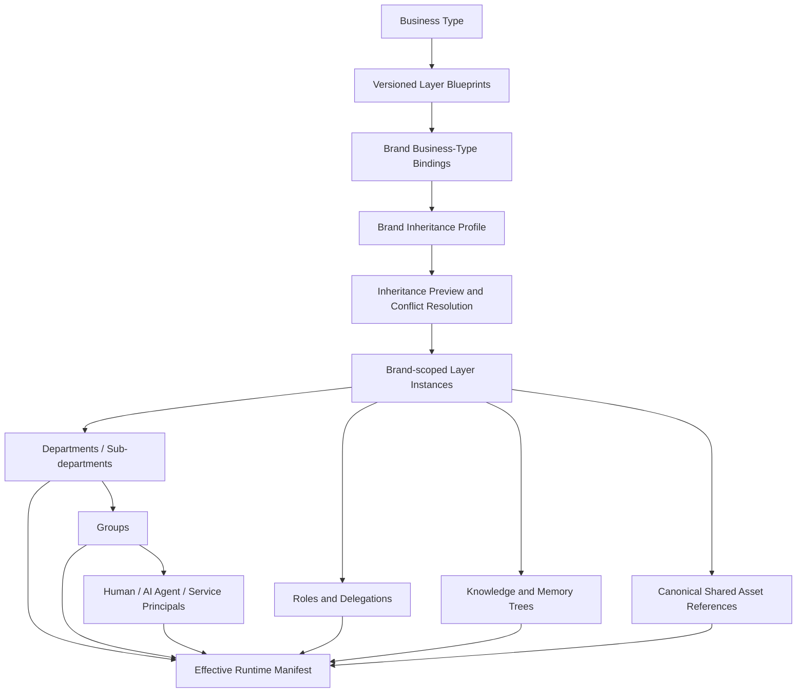
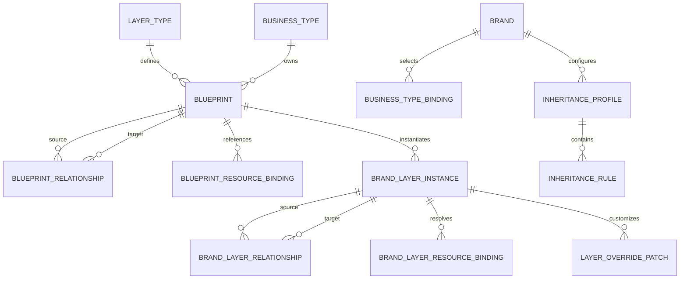
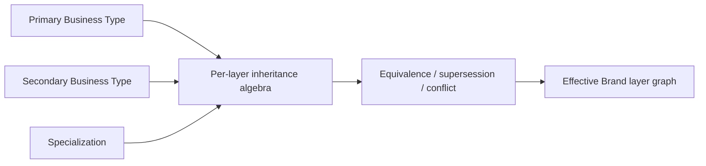
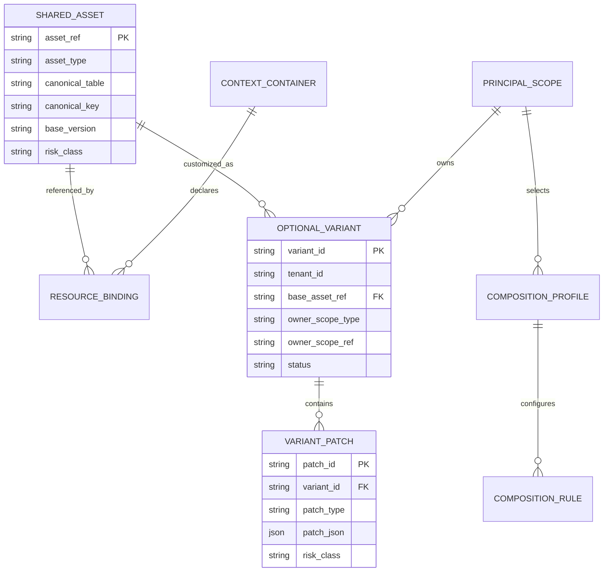
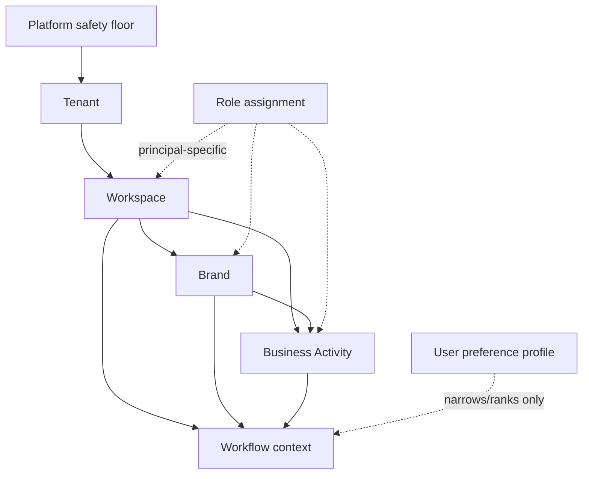
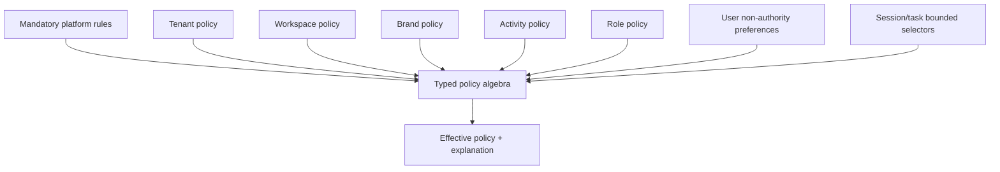
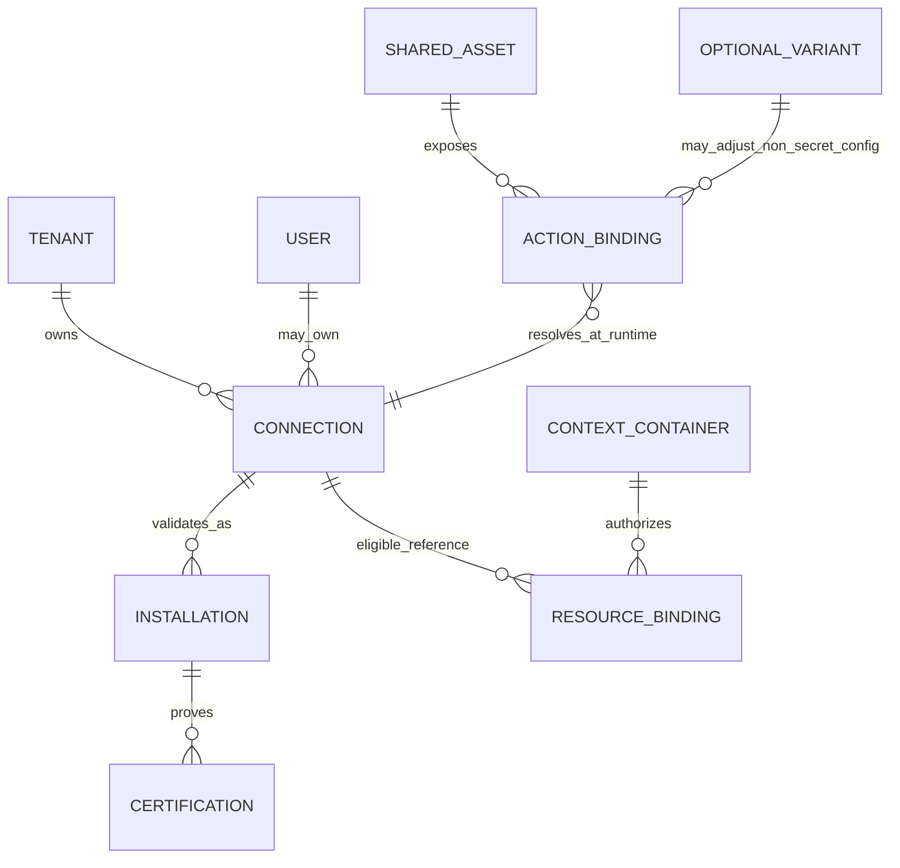
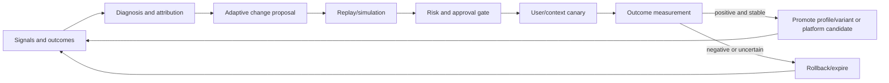
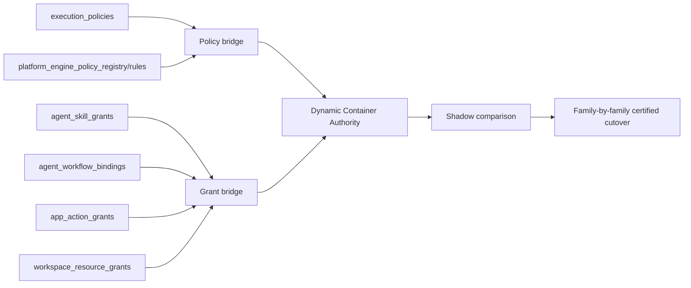

# Relationship Diagrams

## 0. Business-Type Blueprint inheritance



```text
Tenant
└─ Brand
   ├─ inherited/local Business Activities
   ├─ Departments
   │  ├─ Sub-departments
   │  └─ Groups
   │     ├─ Human members
   │     ├─ AI Agent assignments/profiles
   │     └─ Service principals
   ├─ Roles and delegations
   ├─ Knowledge and memory trees
   └─ bindings to shared Skills, Workflows, Policies, Apps, Tools, Graphs, Engines, Logic, and future registered assets
```

Business Types provide reusable templates. Brands own the live organizational instances. Shared resources are referenced rather than copied.

### Generic layer graph



### Multiple Business Types



Recommended behavior differs by layer family: organization/knowledge/workflows use guarded union with equivalence checks, execution authority uses intersection and deny-wins, quotas use minimum, and risk/approval use maximum.

## 1. Shared assets and optional variants



A shared asset is directly usable when authority and readiness permit. A variant is optional and never required for ordinary use.

## 2. Context graph



Brand, activity, and workflow may have multiple parents. All paths are evaluated within bounded limits.

## 3. Effective runtime resolution

```mermaid
flowchart LR
    I[Signed principal + intent] --> C[Resolve tenant/workspace/brand/activity/role]
    C --> G[Dynamic Container paths and authority]
    G --> K[Shared asset candidates]
    K --> M[Select composition profiles]
    M --> A[Typed policy algebra]
    A --> V[Apply eligible optional variants]
    V --> P[Apply user preferences]
    P --> R[Connection, credential, grant, quota, approval, certification]
    R --> E[Immutable effective runtime manifest]
    E --> X[Dispatch or typed block]
```



Authority is resolved before preference and before credentials are materialized.

## 4. Policy layers



Mandatory rules are not a user-selectable layer and cannot be removed.

## 5. Credential relationships



No credential value is stored in a shared asset, variant, profile, or policy composition row.

## 6. Adaptive growth loop



## 7. Existing-to-target bridge



No bridge becomes enforcement authority solely because the schema exists.
