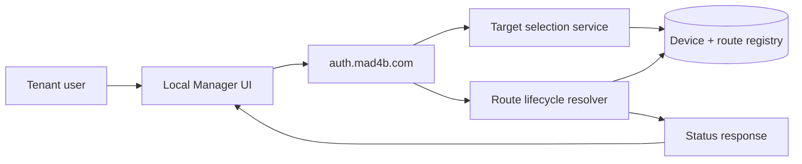
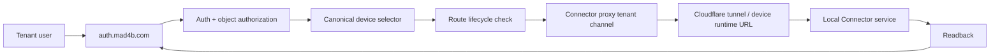
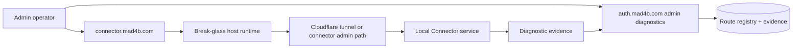
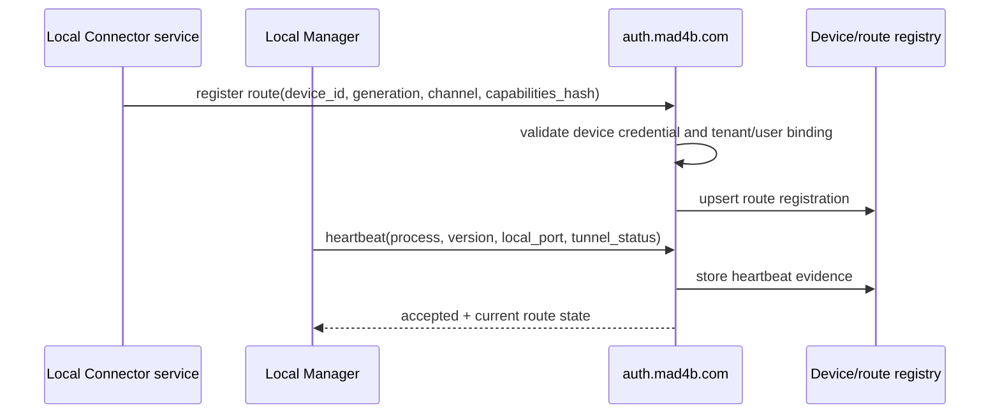
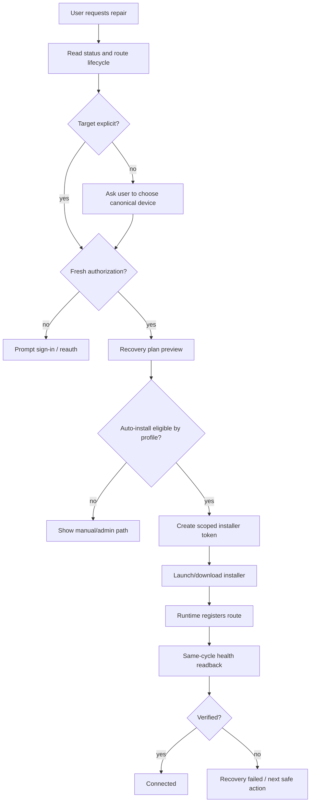
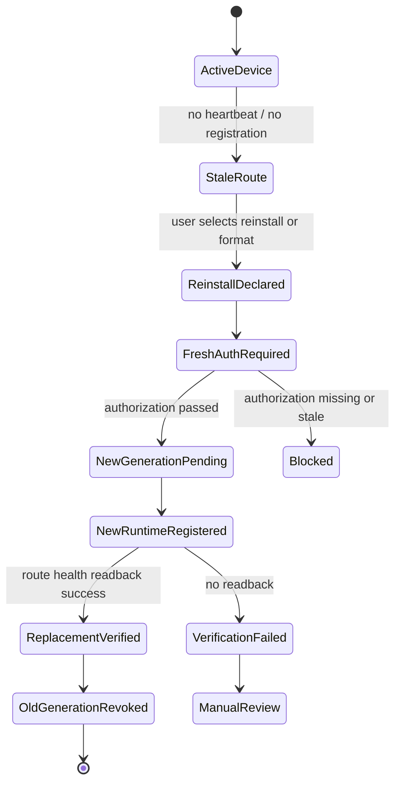
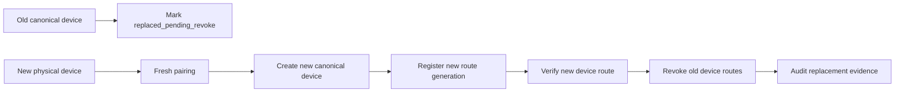
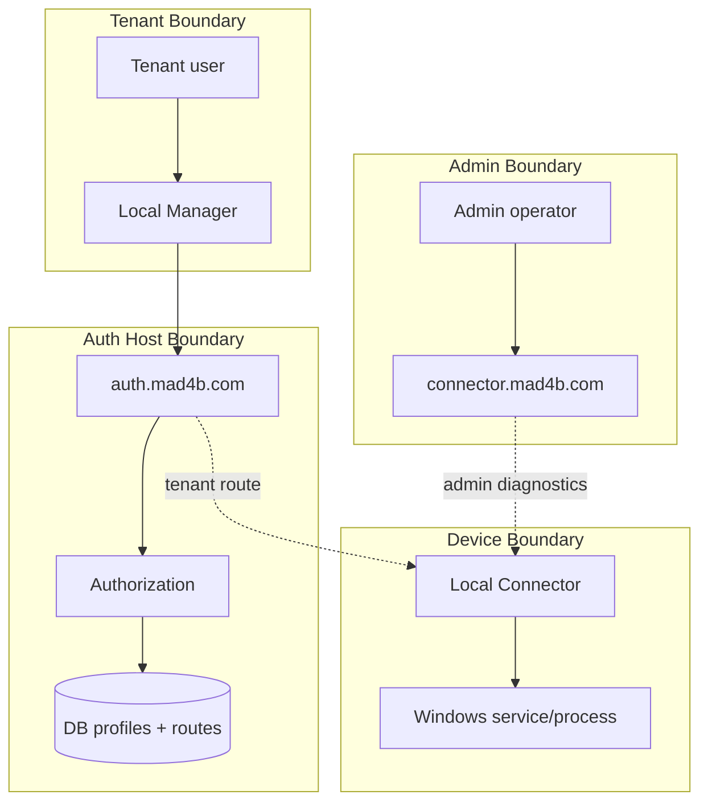
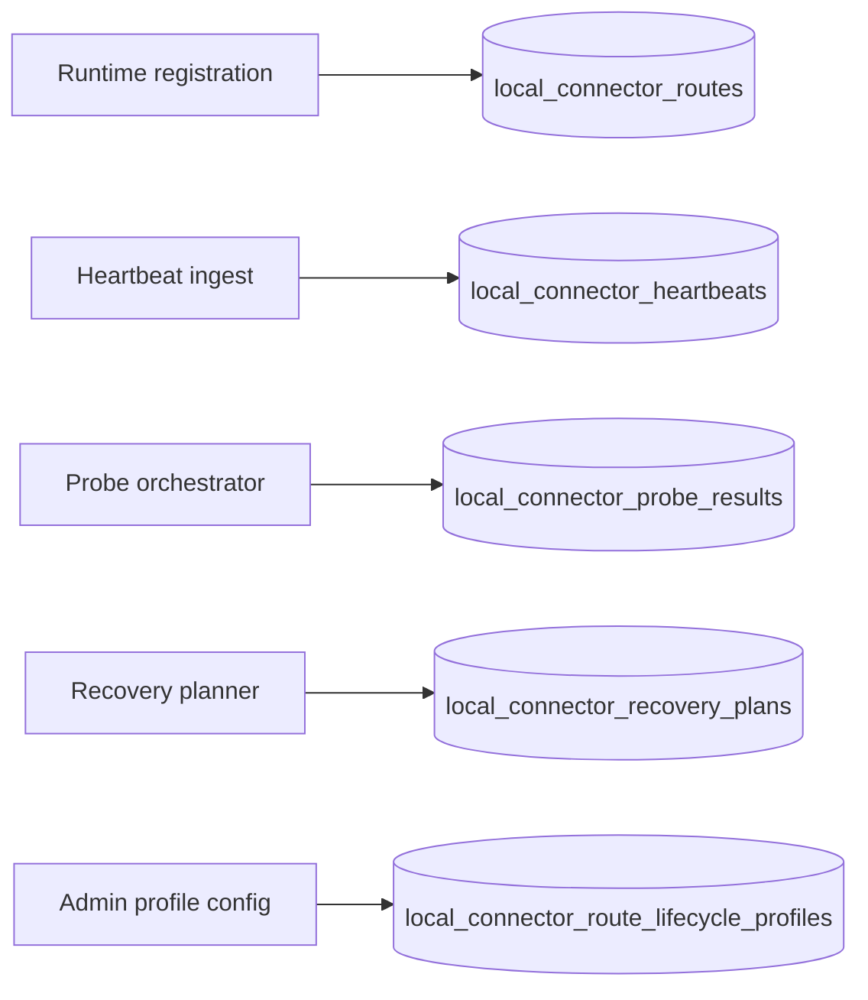

# Connection Maps

This document maps the intended connection paths, route channels, failure boundaries, and recovery paths for Local Connector reachability.

## Map 1: normal tenant status path



Purpose:

- Read-only status.
- Explicit target selection.
- No installer generation.
- No break-glass route.

Failure boundary:

- If auth-host cannot resolve target, stop with structured error.
- If no registered route exists, show relink/repair recommendation, not connected.

## Map 2: tenant action path through auth-host



Rules:

- Tenant action uses `tenant_auth_host` only.
- The selected route must match tenant/user/device.
- Break-glass is not a fallback.
- Success requires readback.

## Map 3: admin break-glass diagnostics path



Rules:

- Admin-only.
- Diagnostic by default.
- Mutations require typed approval, expected IDs, and readback.
- Tenant users never receive this channel as an action route.

## Map 4: runtime registration and heartbeat



Failure classification:

- Registration rejected: `route_registration_rejected`.
- Missing heartbeat: `heartbeat_stale`.
- Generation mismatch: `route_generation_mismatch`.
- Credential mismatch: `device_credential_scope_mismatch`.

## Map 5: auto-install / repair flow



Required token claims:

- tenant_id
- user_id
- canonical_device_id
- device_generation
- route_channel
- recovery_reason
- expiry
- nonce/idempotency key

## Map 6: format / Windows reinstall recovery



Rules:

- Old route is marked stale before replacement.
- Old route is revoked only after successful replacement readback or explicit admin decision.
- Reinstall does not silently inherit old device trust.

## Map 7: device replacement recovery



Decision rule:

- Same physical device + same install evidence: relink same canonical device.
- New physical device or uncertain identity: create new canonical device.
- Old hostname reuse is display metadata only.

## Map 8: failure-classification matrix

| Auth-host path | Break-glass path | Tunnel probe | Local heartbeat | Likely classification | Recommended next action |
|---|---|---|---|---|---|
| success | success | success | fresh | healthy | no repair |
| success | skipped | unknown | stale | heartbeat_stale | repair preview |
| failure 502 | success | success | fresh | auth_host_proxy_failure | auth-host/proxy repair |
| success | failure 502 | success | fresh | break_glass_host_failure | admin host repair, tenant path still usable |
| failure 502 | failure 502 | failure | stale | tunnel_or_host_dependency_unreachable | admin infrastructure diagnostics |
| success | success | success | missing | local_service_unregistered | relink/reinstall flow |
| timeout | timeout | unknown | missing | unknown_reachability | no mutation; collect diagnostics |

## Map 9: trust boundaries



Boundary rules:

- Tenant authority and admin authority are never merged.
- Device claims are untrusted until validated against DB binding.
- Local process evidence is diagnostic, not sufficient for route success.
- DB profile overlays cannot weaken global security floors.

## Map 10: data write paths



Write-path requirements:

- Every write has tenant/user/device/route context where applicable.
- State-changing writes are idempotent or version-checked.
- No plaintext secrets are persisted.
- High-volume heartbeat/probe tables require retention and indexes.

## Map 11: safe operational dashboard

```text
Device: <display label>
Canonical ID: <canonical_device_id>
Aliases: <hostname, legacy config id>
Identity source: interactive sign-in | saved device token | admin
Selected route: tenant_auth_host | admin_break_glass
Registration: registered | not registered
Heartbeat: fresh | stale | missing
Auth-host path: healthy | degraded | unreachable
Break-glass path: healthy | degraded | unreachable | admin-only
Tunnel: connected | disconnected | unknown
Local service: running | stopped | unknown
Recommended action: status only | repair | relink | reinstall | replace | admin diagnostics
Verification: pending | verified | failed
```

Dashboard rule:

- Public tenant dashboard hides admin-only controls and sensitive route internals.
- Admin dashboard may show route IDs and sanitized endpoint hosts but not secrets.
