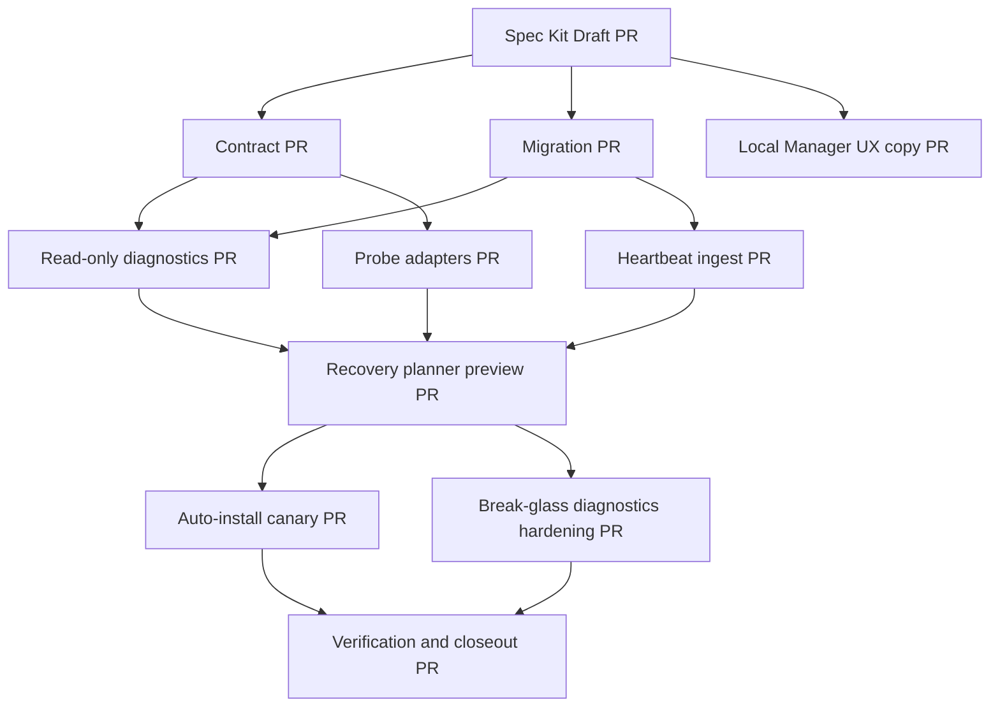

# Rollout PR Sequence and Parallel Execution Plan

## Delivery principle

Implement in parallel lanes where dependencies allow, but keep risky runtime behavior gated. Specification, contracts, migrations, diagnostics, UI readback, and probe adapters can progress independently after shared contracts are reviewed.

## Dependency graph

## Parallel lanes

### Lane A: Contracts and API surface

Owner: backend/API.

PRs:

- A1: Add OpenAPI draft and schema validation tests.
- A2: Add structured error code registry and examples.
- A3: Add compatibility examples for old clients.

Can run in parallel with Lane B and Lane D.

Blocking dependencies:

- Spec Kit approved enough for endpoint names and response shapes.

### Lane B: Additive persistence

Owner: backend/database.

PRs:

- B1: Add canonical device and alias tables.
- B2: Add route registry table.
- B3: Add heartbeat and probe evidence tables.
- B4: Add recovery plan table.
- B5: Add schema readback and migration ledger evidence.

Can run in parallel with Lane A and Lane D.

Blocking dependencies:

- Data model review.
- Index and retention review.

### Lane C: Read-only diagnostics

Owner: backend/application.

PRs:

- C1: Add RouteLifecycleService read model.
- C2: Add target candidate resolver.
- C3: Add additive diagnostics fields.
- C4: Add failure-classification decision table.

Can begin after A1 and B1/B2 are merged or available behind feature flags.

### Lane D: UI and usage guidance

Owner: Local Manager/UI.

PRs:

- D1: Add safe copy for identity source and selected target.
- D2: Add UI states: Connected, Needs attention, Relink required, Admin repair required.
- D3: Add explicit device selector UI behind feature flag.

Can run in parallel with A and B using mocked contracts.

### Lane E: Runtime registration and heartbeat

Owner: local connector/runtime.

PRs:

- E1: Add route registration client in shadow mode.
- E2: Add heartbeat sender in shadow mode.
- E3: Add local service status collection with redaction.
- E4: Add generation mismatch handling.

Depends on route registry and heartbeat tables but can be developed with test fixtures.

### Lane F: Probe orchestration

Owner: backend/infrastructure.

PRs:

- F1: Add auth-host proxy probe adapter.
- F2: Add break-glass host probe adapter.
- F3: Add tunnel endpoint probe adapter.
- F4: Add local runtime health probe adapter.
- F5: Add probe scheduler behind read-only flag.

Can run in parallel with heartbeat once contract and evidence table exist.

### Lane G: Recovery planner and auto-install

Owner: backend/application + Local Manager.

PRs:

- G1: Add recovery preview only.
- G2: Add fresh authorization and eligibility checks.
- G3: Add scoped installer-token claims.
- G4: Enable canary repair/relink flow.
- G5: Enable limited auto-install retry/cooldown.

Must wait for diagnostics, target selection, and fresh auth gates.

### Lane H: Admin break-glass hardening

Owner: admin/recovery.

PRs:

- H1: Add admin-only route diagnostics.
- H2: Add break-glass dry-run mutation contract.
- H3: Add typed approval and expected-ID readback for repair mutations.
- H4: Add admin audit and runbook readback.

Can run in parallel with recovery planner, but cannot be invoked by tenant surfaces.

### Lane I: Production verification and closeout

Owner: release/ops.

PRs:

- I1: Add synthetic diagnostics and operational alerts.
- I2: Run canary device recovery simulation.
- I3: Verify old/new diagnostics parity.
- I4: Complete closeout and deprecation plan.

Depends on all implementation lanes.

## Parallel execution matrix

| Lane | Can start after | Can run parallel with | Must not do |
|---|---|---|---|
| A Contracts | Spec Draft | B, D | Runtime mutation |
| B Persistence | Data model review | A, D | Destructive migration |
| C Diagnostics | A1 + B1/B2 | E, F | Repair actions |
| D UI | Contract mock | A, B | Hidden auto-repair |
| E Heartbeat | B3 or fixture | F | Mark recovered alone |
| F Probes | A1 + B3 | E | Long unbounded live calls |
| G Recovery | C + E/F evidence | H | Installer without fresh auth |
| H Break-glass | Admin contract review | G | Tenant fallback |
| I Closeout | All lanes | none | Close without production readback |

## Feature flags

- `local_connector_route_registry_readback_enabled`
- `local_connector_heartbeat_shadow_enabled`
- `local_connector_probe_shadow_enabled`
- `local_connector_target_selector_required`
- `local_connector_recovery_preview_enabled`
- `local_connector_auto_install_canary_enabled`
- `local_connector_break_glass_diagnostics_enabled`

## Merge gates per implementation PR

Every PR must include:

- Scope boundary.
- Tests or explicit no-runtime-effect note.
- Security review note.
- Backward compatibility note.
- Rollback plan.
- CI pass.
- Readback evidence when runtime behavior changes.

## Cutover strategy

1. Add data and contracts without behavior change.
2. Run read-only diagnostics in parallel with existing diagnostics.
3. Compare classifications for canary devices.
4. Enable target selector UI.
5. Enable recovery preview.
6. Enable canary installer generation.
7. Enable auto-install only after verification and cooldown controls pass.
8. Deprecate config-only health classification.

## Stop conditions

Stop rollout if any of these occur:

- Tenant action uses break-glass route.
- A recovery action targets an ambiguous device.
- A stale token creates privileged installer.
- Probe/heartbeat data leaks secrets.
- Recovered state is shown without same-cycle readback.
- Route registry conflicts with existing config and no safe decision exists.
